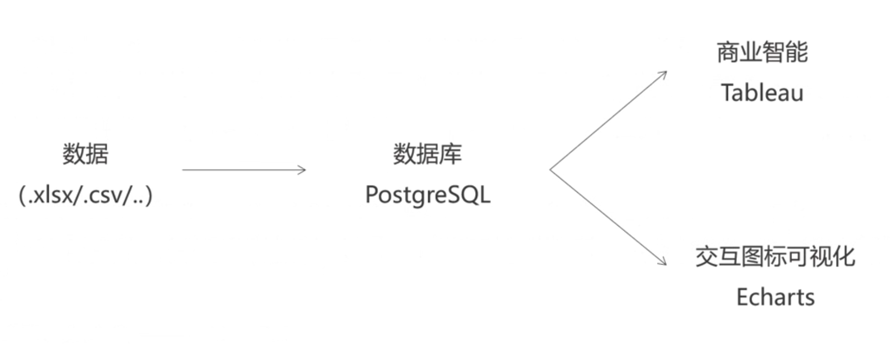
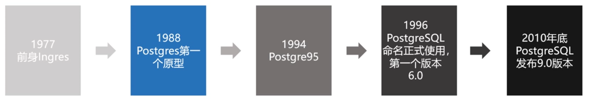
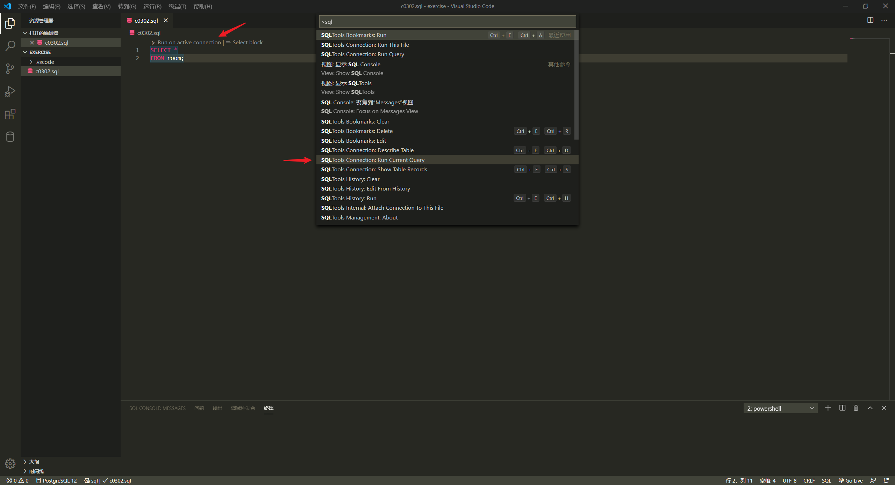
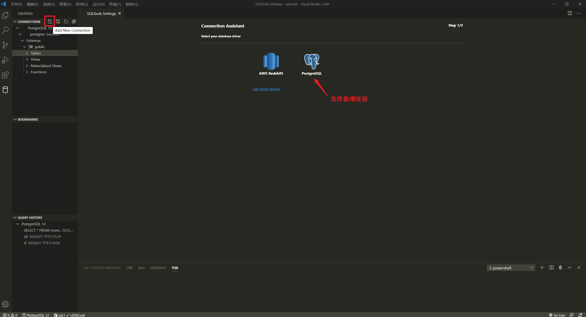
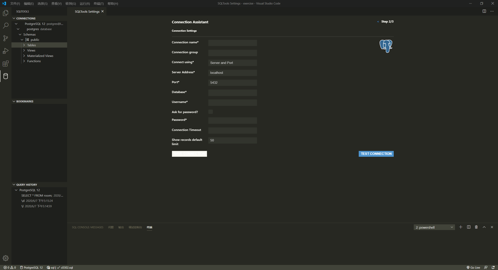
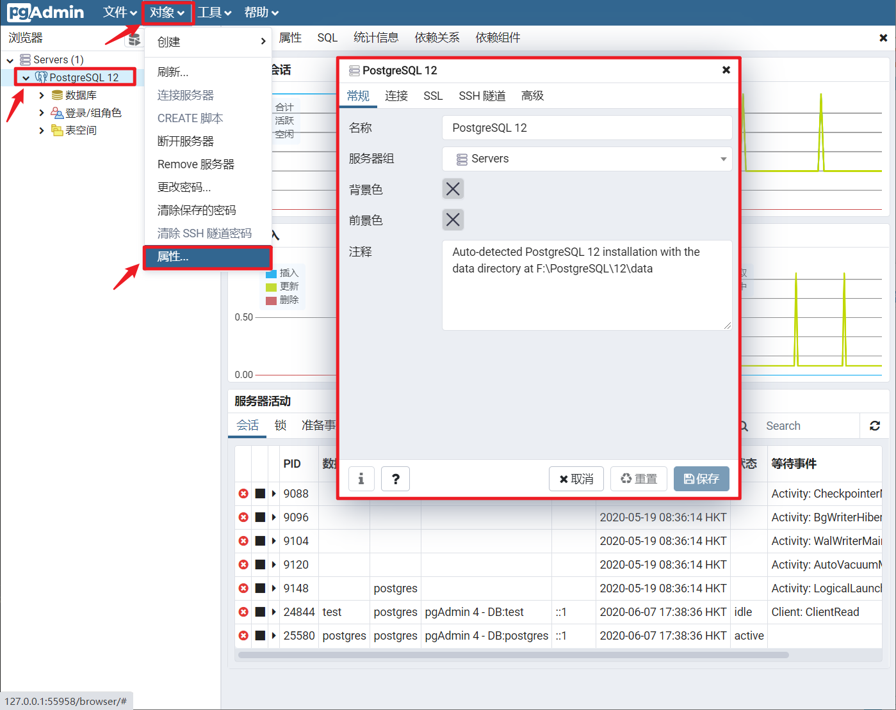

数据需要以特定的数据结构存储于数据库中才适合后期批量操作和分析。结构化查询语言 Structured Query Language，SQL 是指一种针对数据库查询和程序设计的语言，用于存取、查询数据，更新和管理关系数据库系统，由这种结构化查询语言编写的数据库**脚本文件**的拓展名是 `.sql`。

## 数据类型
数据有不同类型，可以进行不同的操作

* 字符型
* 文本型
* 数值型
* 逻辑性
* 日期型
* ……

## 工具
SQL 相关的工具有很多，语法类似

* [Oracle Database](https://www.oracle.com/database/)
* [SQL Server](https://www.microsoft.com/zh-cn/sql-server/sql-server-downloads)
* [MySQL](https://www.mysql.com/)
* [PostgreSQL](https://www.postgresql.org/) 开源的面向对象的关系型数据库管理系统

### PostgreSQL

PostgreSQL 特性

* 内置多种数据类型，如任意精度的数值、无限长度的文本、几何图元、IP地址、数组等；允许用户基于 SQL 内置数据类型创建复杂的新类型数据结构
* 可编程性，大量编程接口
* 可定制性，支持多种编程语言实现函数功能
* 索引手段，用户可自定义索引方法
* 多种身份认证方式

PostgreSQL 提供多种工具与数据库进行交互

* psql 是一个命令行交互式客户端 shell，立即执行输入的 sql 代码并提供反馈，一般用于测试使用。
* pgAdmin 是一个网页提供图形化交互界面，用于设计、维护和管理 Postgres 数据库

### 编辑器
安装一款文本编辑器，如 [Visual Studio Code](https://code.visualstudio.com/)，并安装相应的 [sql 插件](https://marketplace.visualstudio.com/items?itemName=mtxr.sqltools)可以提供代码高亮、代码提示、代码自动补全等功能，可以更方便地编写 sql 脚本。

:bulb: 除了使用 psql 或 pgAdmin 访问/操作数据库，还可以安装 VS Code 相应的插件 [SQLTools](https://marketplace.visualstudio.com/items?itemName=mtxr.sqltools) 和 [Driver](https://marketplace.visualstudio.com/items?itemName=mtxr.sqltools-driver-pg) 连接数据库，然后就可以使用 VS Code 编写 sql 脚本，同时在其中运行程序进行调试。

参考：
* [VS Code PostgreSQL Database Connection Queries Tutorial (2020)](https://www.youtube.com/watch?v=Vk_3qL9bkQY)
* [Database Connections in VS Code](https://www.youtube.com/watch?v=Cdgr2ja8PuA)

连接数据库需要填入参数

:bulb: 如果需要连接已创建的数据库，所需的参数可以在 pgAdmin 中查看

