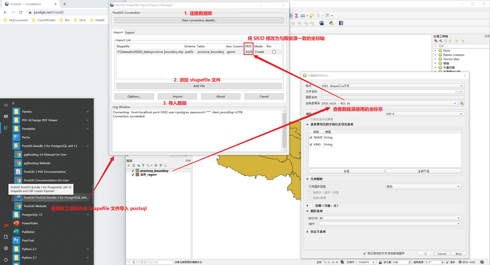

# PostGIS 空间数据库

使用 [PostGIS 插件](https://blog.csdn.net/antma/article/details/83580859)创建空间数据库

1. 在 psql 中启用 PostGIS 插件，并创建 postgis 空间数据库[模板](https://postgis.net/install/)

```sql
-- 创建一个数据库作为 postgis 模板
CREATE DATABASE gis_template;
\c gis_template;
-- 在该数据库中启用 PostGIS 创建
-- Enable PostGIS (as of 3.0 contains just geometry/geography)
CREATE EXTENSION postgis;
-- enable raster support (for 3+)
CREATE EXTENSION postgis_raster;
-- Enable Topology
CREATE EXTENSION postgis_topology;
-- Enable PostGIS Advanced 3D
-- and other geoprocessing algorithms
-- sfcgal not available with all distributions
CREATE EXTENSION postgis_sfcgal;
-- fuzzy matching needed for Tiger
CREATE EXTENSION fuzzystrmatch;
-- rule based standardizer
CREATE EXTENSION address_standardizer;
-- example rule data set
CREATE EXTENSION address_standardizer_data_us;
-- Enable US Tiger Geocoder
CREATE EXTENSION postgis_tiger_geocoder;
```

2. 创建空间数据库

```sql
-- 基于 postgis 模板创建数据库
CREATE DATABASE gis_database WITH TEMPLATE = gis_template;
```

3. 导入 Shapefile 数据



:warning: 坐标系 SRID 需要设置与数据源相应的数值

