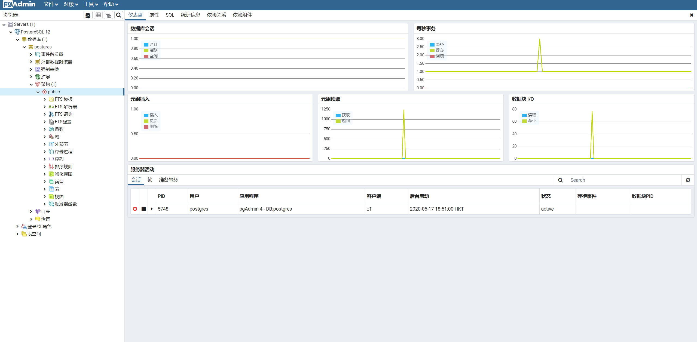
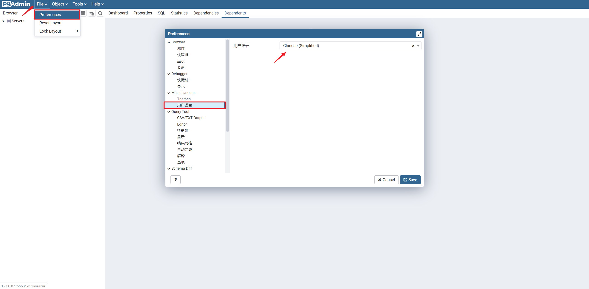
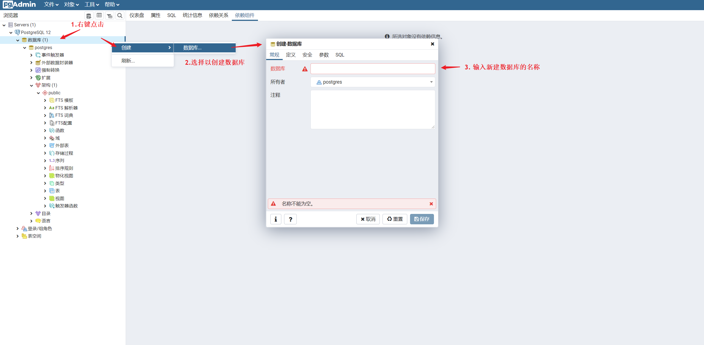
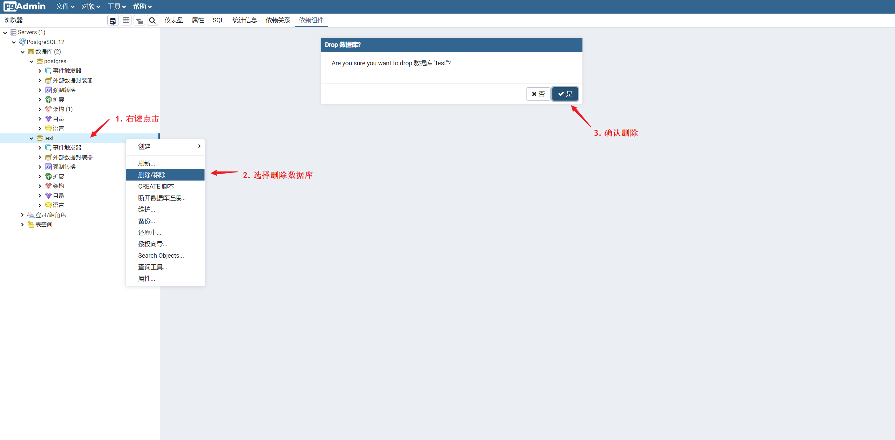
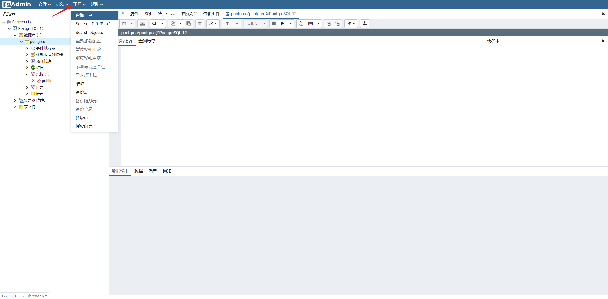

# pgAdmin
pgAdmin 是一个数据库管理网页，提供图形化交互界面，用于设计、维护和管理 Postgres 数据库。主要作为监控器，查看各数据库的运行状态

:bulb: 默认语言是英文，可以在页面的菜单栏中修改用户语言为简体中文，并重新加载页面。

## 常用操作

### 创建数据库

### 删除数据库

### 结构
各数据库的数据主要在架构中查看（database -> schema），主要操作 table 表，右击具体表格 -> View/Edit Data。

:bulb: 也可以在网页中调出查询工具，以命令行的形式查询数据。

