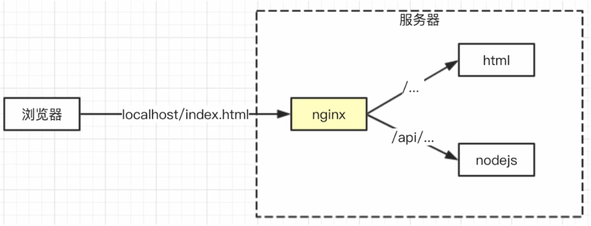

---
tags:
  - nginx
---

# Nginx
Nginx 是高性能的 web server，开源免费，一般用作静态服务（服务端不需要解析，直接返回请求文件）、负载均衡；**反向代理**（对客户端不可逆，客户端无法控制）实现前后端同域联调，解决 cookie 跨域不共享（一般在（本地）开发时前端开启的 server 和后端开启的 server 端口不一致）。



## 安装启动
1. 在 [Nginx 官网](https://nginx.org/)下载适合系统的软件包并解压 :bulb: Windows 系统安装方法参考[官方文档](http://nginx.org/en/docs/windows.html)
2. 打开软件安装目录下的 `.\conf\nginx.conf` 文件，修改其中的 Nginx 配置

```
#user  nobody;
worker_processes  2;   # 基于系统的 CPU 核心配置服务器的进程

# ...
server {
    listen       8080;   # 修改服务器监听的端口
    # ...
    # 注释以下部分
    #location / {
    #    root   html;
    #    index  index.html index.htm;
    #}
    # 添加代理设置
    location / {
        # 如果请求访问的是 nginx 服务器的根目录（静态文件）就代理到域名和端口为 http://localhost:8001; 服务器
        proxy_pass: http://localhost: 8001;
    }
    location /api/ {
        # 如果请求访问的是 nginx 服务器的 /api/ 就代理到域名和端口为 http://localhost:8000; 服务器，并设置 header 为原来的 host（同源传递 cookie）
        proxy_pass http://localhost:8000;
        proxy_set_header Host $host;
    }
}
```

:bulb: 如果出现错误 `nginx: [emerg] bind() to 0.0.0.0:8080 failed (10013: An attempt was made to access a socket in a way forbidden by its access permissions)` 表示已有相关的进程占用了相关的端口，可以更改配置中的 `listen` 监听的端口。

:bulb: 可以运行 `nginx -t` 来查看配置语法是否正确，配置测试是否成功。

```bash
nginx -t
# 测试成功输出
# nginx: the configuration file E:\nginx/conf/nginx.conf syntax is ok
# nginx: configuration file E:\nginx/conf/nginx.conf test is successful
```

3. 将终端路径切换到软件安装的目录（应用 `nginx.exe` 所在的目录），输入以下命令运行 Nginx 服务器

```bash
start nginx
```

## 常用命令
参考：[nginx for Windows](http://nginx.org/en/docs/windows.html)

* 测试配置文件格式是否正确 `nginx -t`
* 重启 Nginx 并重新载入配置文件 `nginx -s reload`
* 重启 Nginx 服务 `nginx -s reopen`
* 停止 Nginx 服务 `nginx -s stop`