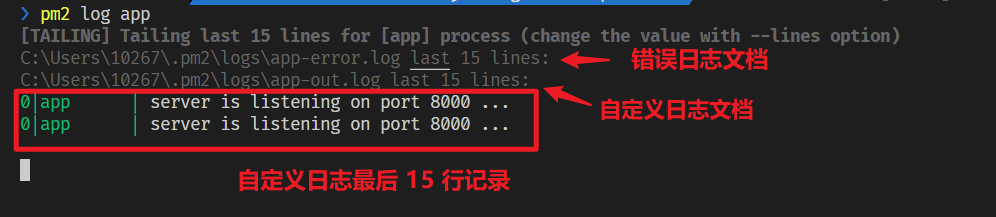

pm2 提供许多参数，以定制项目运行方式，可以在终端或 npm script 中进行配置。
## 启动
```bash
# 使用 pm2 启动当前目录的 Node.js 项目，可传递参数
pm2 start [params]

# 基于 name 或 id 重启项目
pm2 restart <name>/<id>
```

## 停止与删除
```bash
# 基于 name 或 id 停止指定的项目，但依然保留进程，可重启
pm2 stop <name>/<id>

# 基于 name 或 id 删除指定的项目的进程，无法再重启项目
pm2 delete <name>/<id>
```

## 查看
```bash
# 查看 pm2 运行的项目的基本信息
pm2 list

# 基于 name 或 id 查看项目详细信息
pm2 info <name>/<id>

# 基于 name 或 id 监听关于项目占用 CPU 和内存的信息
pm2 monit <name>/<id>
```

## 日志
```bash
# 基于 name 或 id 查看项目的日志格式
pm2 log [name]/[id]
```

输出日志内容（默认显示最后 15 行），而且日志已经记录再文档中，完整的记录可以查看相应的文档。



:bulb: 项目中通过 `console.log()` 和 `console.error()` 形式输出的内容会分别自动存储到自定义日志和错误日志中。