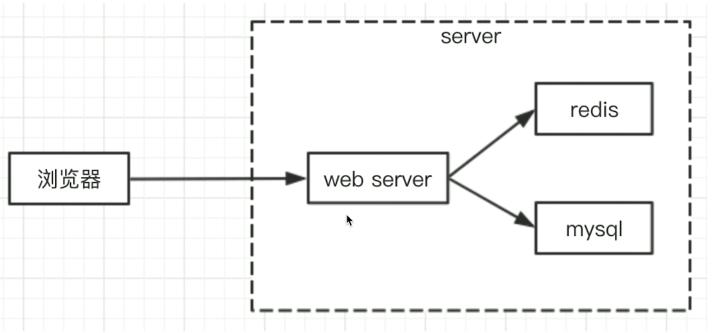
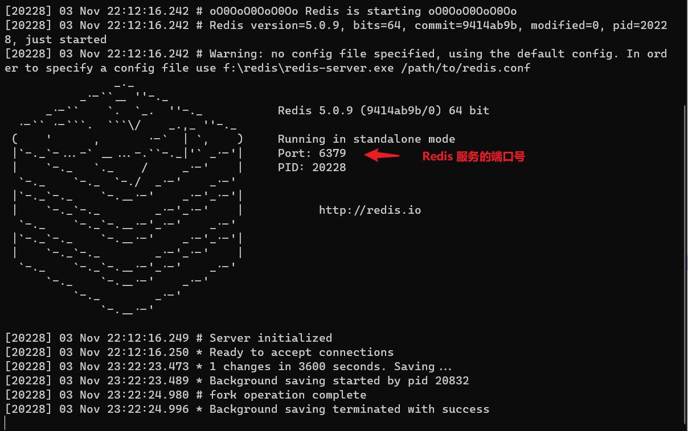
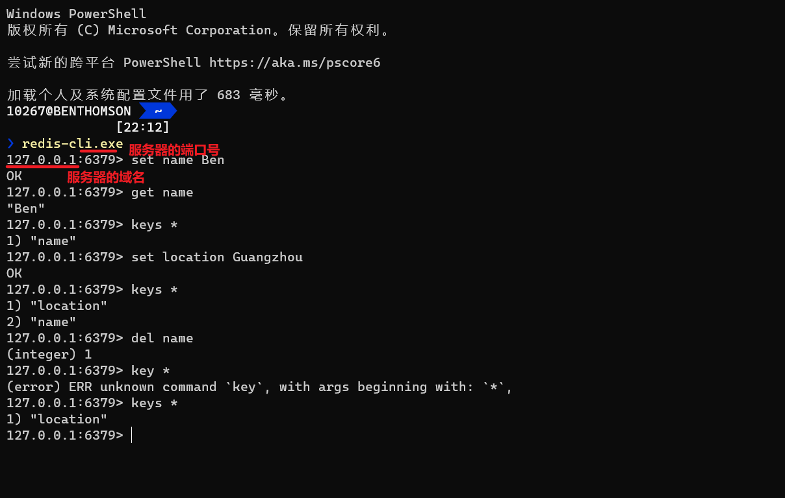

---
tags:
  - redis
---

# Redis
参考：
* [redis](https://redis.io/)
* [Redis for Windows](https://github.com/tporadowski/redis)

Redis 是 Web server 最常用的缓存数据库，它将数据存放在内存中，相比 MySQL 访问速度快（内存和硬盘的区别），但成本较高，可存储的数据量较小。



一般将服务端的 session 存放在 redis 中，由于 session 作为网站用户验证的标识数据，需要频繁访问，对性能要求极高但数据量不大，而且 session 可以不考虑断电丢失数据的问题（只需要用户主动再登陆就可以取得新的 session），因此需要将 session 存放在内存中。

## 安装启动
1. 下载安装 Redis（对于 Windows 系统可以参考[这篇](https://www.runoob.com/redis/redis-install.html)文章）

2. 在终端输入以下命令启动 redis 服务器

```bash
redis-server.exe
```



3. 在另一个终端输入以下命令开启 redis-cli 命令行工具，操作 redis 服务器/数据库

```bash
redis-cli.exe
```

## 基本操作
Redis 以键值对 key- value 形式来存储数据，支持五种数据类型 string 字符串、hash 哈希、list 列表、set 集合及 zset（sorted set 有序集合）。

* 设置键值对 `set keyName value`
* 取出键值对 `get keyName`
* 获取所有键 `keys *`
* 删除特定的键值对 `del keyName`

## Node.js 连接 Redis
1. 在项目中安装[模块 redis](https://www.npmjs.com/package/redis)

```bash
npm install redis --save
```

2. 在项目中配置连接 redis 的客户端参数，即可进行相应的数据库操作

```js
// 引入模块
const redis = require('redis');

// 创建 redis 客户端
const redisClient = redis.createClient(6379, '127.0.0.1'); // 配置连接的服务器的端口和域名

redisClient.on('error', err => {
  console.error(err);
});

// 设置键值对，然后打印执行的结果
redisClient.set('name', 'Tom', redis.print);
// 获取键值对，异步操作在回调函数中对响应作出处理
redisClient.get('name', (err, val) => {
  if(err) {
    console.error(err);
    return
  }
  console.log('val', val);
  // 退出，结束进程
  redisClient.quit()
})
```

:bulb: 需要启动 redis 服务器以待 Node.js 连接

## 使用 Express 和 connect-redis
1. 在项目中安装[模块 redis](https://www.npmjs.com/package/redis) 和[插件 connect-redis](https://www.npmjs.com/package/connect-redis)

```bash
npm install redis connect-redis --save
```

2. 在项目中配置连接 redis 的客户端参数，结合使用 `express-session` 进行 session 设置，将 redis 作为 session 的存储位置

```js
// 引入相关模块
const redis = require('redis');
const session = require('express-session')
let RedisStore = require('connect-redis')(session) // 使用 session 模块创建 connect-redis 构造函数

// 创建 redis 客户端
const redisClient = redis.createClient(6379, '127.0.0.1'); // 配置连接的服务器的端口和域名
redisClient.on('error', err => {
  console.error(err);
});

// 传入 redis 客户端配置，实例化一个 connect-redis 对象
const sessionStore = new RedisStore({
  client: redisClient
})

// 配置 session
app.use(session({
  secret: 'abcd_abbAL',
  cookie: {
    // path: '/',   // 默认配置
    // httpOnly: true, // 默认配置
    maxAge: 24 * 60 * 60 *1000
  },
  store: sessionStore   // 将 session 存储在 redis 中
}))
```