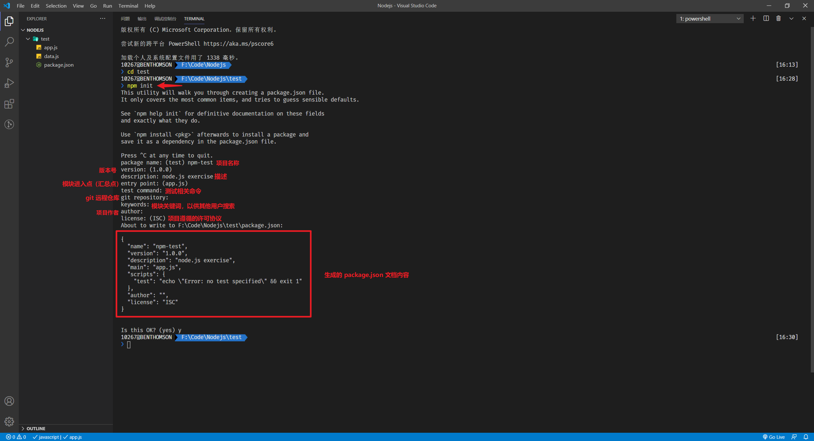
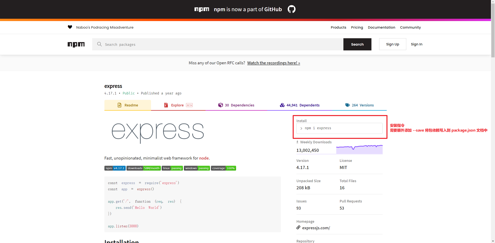

---
tags:
  - nodejs
  - npm
---

# npm
Node.js 提供了核心模块，而其他开发者可以将其开发的拓展模块发布出来，其他开发者就可以使用[npm，node package manager](https://www.npmjs.com/) 这个软件来安装管理这些拓展包。

:bulb: 一般安装 node 就会同时安装 npm 软件。

## package.json
对于一个 Node.js 项目一般会有一个 `package.json` 文档来描述模块/项目的相关信息，可以使用命令 `npm init` 初始化项目并创建这个文件。



## 安装模块
在 [npm 官网](https://www.npmjs.com/)上搜索需要安装的模块，并将其文档所提供的安装指令输入到终端中（终端路径已切换到项目目录下），:bulb: 需要写上 `--save` 指令将模块写入到 `package.json` 中以指明项目依赖 `dependecies` 的包。



```bash
# 安装 express 模块
npm i express --save
```

:bulb: 安装指令中一般需要添加额外的指令：
* `--save` 命令：将模块写入到 `package.json` 文档的依赖包 `dependencies` 记录中，表示项目上线需要的模块。
* `--save-dev` 命令：将模块写入到 `package.json` 文档的依赖包 `devDependencies` 记录中，表示测试、除错等开发环境才需要的模块
* `-g` 命令：将模块安装到全局环境中（对于 Windows 用户一般安装在 `C:\Users[用户名]\AppData\Roming\npm\node_modules` 目录中；对于 Mac 用户一般安装在 `/usr/local/lib/node_modules` 目录中），任何项目都可以调用该模块，**但并不会写入到 `package.json` 文档的依赖中**（并不推荐这种方式安装模块）。

安装以后就可以在 JavaScript 文档中导入模块使用相关功能。

```js
// 📁 app.js
// 只需要直接写模块的名称即可，node 就会在解析文档时到 node_modules 目录下寻找相关模块
var express = require('express');
```

:bulb: 如果接手一个项目时已经有 `package.json` 文档（但没有 `node_modules` 目录），可以直接运行 `npm install` 命令，npm 就会根据文档中 `dependencies` 记录的依赖包安装相应版本的模块。

:bulb: 如果安装模块较慢可以使用[淘宝镜像](https://developer.aliyun.com/mirror/NPM?from=tnpm)，如安装 lodash 可以添加淘宝源 `npm install lodash --save --registry=https://registry.npm.taobao.org`
## 推荐模块
* [nodemon](https://www.npmjs.com/package/nodemon) 监控模块文件的变化，自动启动项目
* [cross-env](https://www.npmjs.com/package/cross-env) 设置环境变量（切换开发环境和生产环境），兼容 Linux、Mac、Windows。可以在设置 npm script 时使用 `cross-env NODE_ENV=production` 指定运行环境为生产环境。