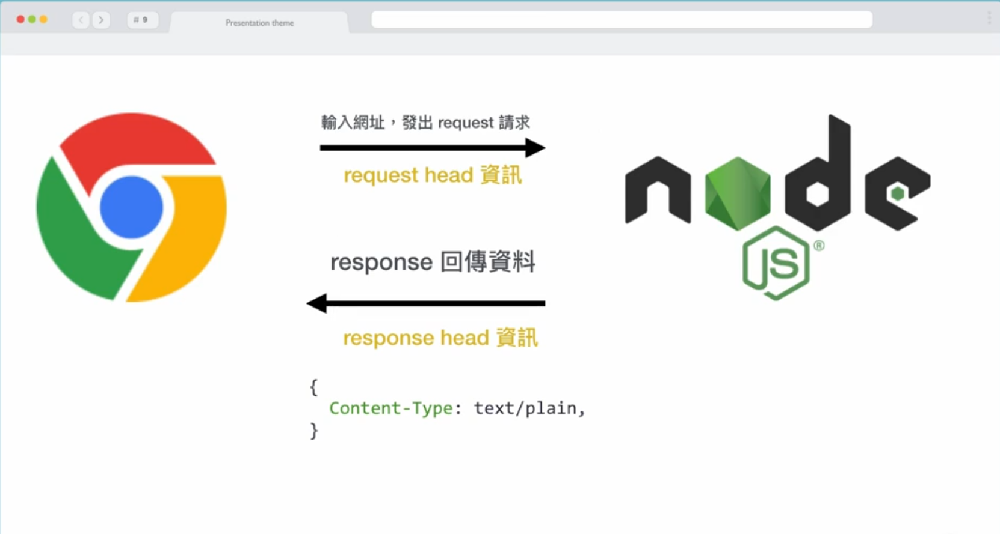

# 核心模块
Node.js 提供了丰富的[内建模块](https://nodejs.org/api/)，可以调用内建功能实现相关需求。:bulb: 在使用内建功能（函数）之前需要导入 `require(modulename)` 对于的模块。

## http
[模块 `http`](https://nodejs.org/api/http.html) 封装了 HTTP 协议相关的操作，最常见的功能是创建一个服务器。

```js
// 使用内建模块 http 开启一个服务器

// 导入 http 模块
var http = require('http');

// 开启一个服务器
http.createServer(function(request, response) {
    // 设置响应表头，状态码 200 表示响应成功，Content-Type 设置响应内容的类型为纯文本
    response.writeHead(200, {"Content-Type": "text/plain"});
    // 设置响应内容
    response.write("Hello World!");
    // 响应结束
    response.end();
}).listen(8080);   // 设置服务器监听端口为 8080
```

:bulb: 其中创建的服务器方法 `.createServer()` 回调函数的参数 `request` 和 `response` 依次表示 HTTP 请求和响应。



```js
const http = require('http');
const querystring = require('querystring');   // 该内置模块用于解析 URL 中的 query

const server = http.createServer((req, res) => {
  // 获取请求相关信息
  const method = req.method;   // 请求的方法
  const url = req.url;   // 请求的 URL
  const path = url.split('?')[0];   // 请求的 URL 路径
  const query = querystring.parse(url.split('?')[1]);   // 请求的 URL 中的 query

  // 设置响应头，主要设置返回响应的格式为 JSON，便于浏览器解析
  res.setHeader('Content-type', 'application/json');

  // 设置返回数据
  const resData = {
    method,
    url,
    path,
    query
  };

  // GET 请求的返回
  if (method === 'GET') {
    res.end(JSON.stringify(resData));
  }
  // POST 请求的返回
  if(method === 'POST') {
    let postData = '';
    // 接收数据，监听数据流 data 事件
    req.on('data', chunk => {
      postData += chunk.toString();   // 接收的数据是二进制格式，需要转换为字符串格式
    });
    // 监听数据流结束 end 事件，然后再回调函数中输出数据，并返回响应
    req.on('end', () => {
      resData.postData = postData;
      res.end(JSON.stringify(resData));   // 返回响应
    })
  }
})

// 监听 3000 端口
server.listen(3000);
```

:bulb: 常用服务器功能监听的端口：
* `21` FTP
* `80` http
* `3389` 远端桌面

## path
[模块 `path`](https://nodejs.org/api/path.html) 提供处理 URL 和文件路径相关的功能。

主要功能包括：
* 获取目录名称 `dirname`
* 获取基本文件名称 `basename`
* 获取扩展名 `extname`
* 连接路径 `path.join()`
* 路径规范化 `path.normalize()`
* 路径相关信息 `path.parse()`

```js
const path = require('path');

// 返回 URL 中的目录路径
console.log(path.dirname('/dir/sub-dir/filename'));

// 合并路径，可以根据不同的系统使用相应的分隔符进行合并
// __dirname 是 node 的全局变量，表示当前目录的绝对路径
console.log(path.join(__dirname, 'app.js'));

// 返回 URL 中的文件（包括拓展）
console.log(path.basename('/dir/sub-dir/filename.js'));

// 返回 URL 中文件的拓展
console.log(path.extname('/dir/sub-dir/filename.js'));

// 解析 URL 路径，返回一个包含相应信息的对象
console.log(path.parse('/dir/sub-dir/filename.js'));

// 输出
// /dir/sub-dir
// __dirname\app.js   // Node.js 在 Windows 系统中运行该脚本，因此使用 \ 合并路径
// filename.js
// .js
// {
//   root: '/',
//   dir: '/dir/sub-dir',
//   base: 'filename.js',
//   ext: '.js',
//   name: 'filename'
// }
```

## fs
[模块 `fs`](https://nodejs.org/api/fs.html) file system 简称，是 Node 的文件系统模块，用于操作服务器中的文件，其中带有关键字 `Sync` 是同步操作。

```js
const fs = require('fs');

// 读取文件内容，入参是文件的绝对路径（包括文件拓展名）
// 同步读取
let content = fs.readFileSync( doc_path );

// 判断文件是否存在
fs.existsSync( doc_path );
// 这里有一个小问题，如果路径对应的正好是目录，那么它也返回 true，但却没有对应的文件；可以通过扩展名判断的方式，去掉了目录的情况。
if( path.extname(req.url) != '' && fs.existsSync( doc_path ) ) {
  res.writeHead(200, {'Content-Type': 'text/html'} );
  let content = fs.readFileSync ( doc_path );
  res.write( content );
} else {
  res.writeHead(404, {'Content-Type': 'text/html'} );
  let content = "文件不存在";
  res.write( content );
}
```

## os
[模块 `os`](https://nodejs.org/dist/latest-v12.x/docs/api/os.html) 提供操作系统相关的信息。

* `os.freemem()` 空闲内存
* `os.platform()` 操作系统平台
* `os.totalmem()` 总内存

## events
[模块 `events`](https://nodejs.org/dist/latest-v12.x/docs/api/events.html) 提供一种消息通信机制。

```js
const EventEmitter = require("events");   // 导入 events 类
cosnt emitter = new EventEmitter();   // 创建一个触发器实例

// 在触发器上添加一个监听 listener，监听 finish 事件
emitter.addListener('finish', (msg) => { console.log(msg)});
// 触发 finish 事件，触发在监听器上预设的回调函数
emitter.emit('finish', '完成了');
```