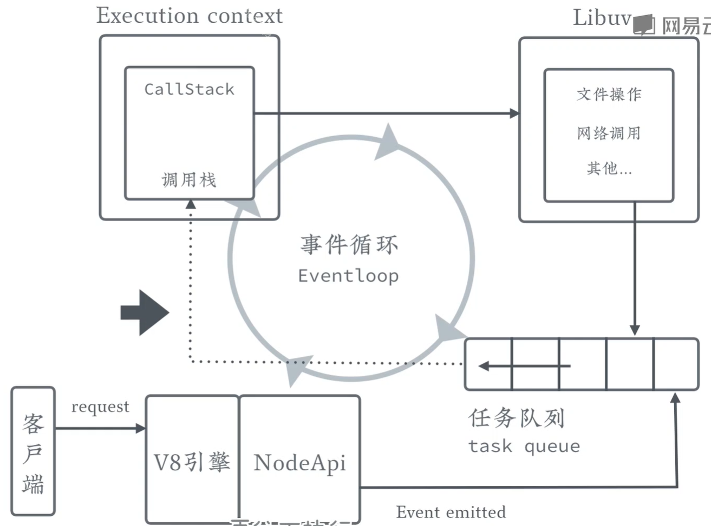
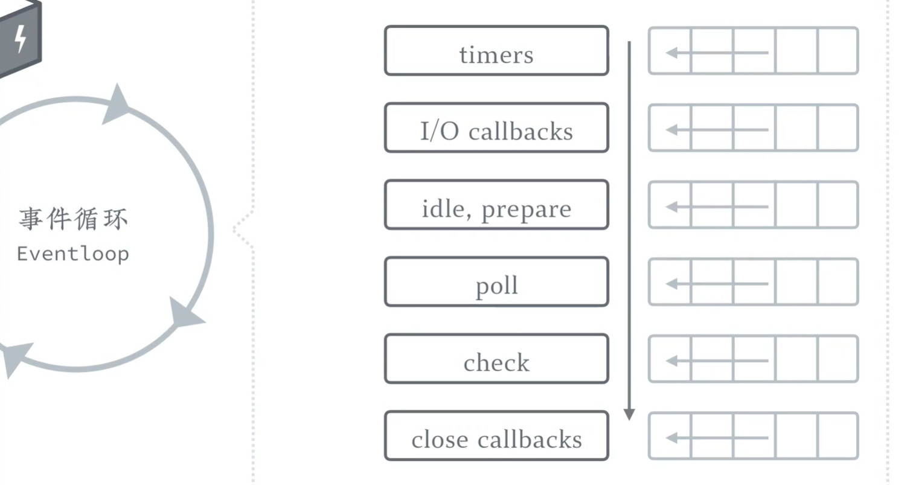

---
tags:
  - nodejs
---

# 简介

## 构成

* V8 引擎：将 JS 代码编译为字节码
* [Libuv](http://libuv.org/)：事件驱动的 I/O 库，Node 基于它获得跨平台的异步任务处理能力
* Node 主程序和其他部分

## 兼容性
在 [node.green](https://node.green/) 查看不同版本的 Node 对于 JS 语法支持的情况。

## 执行流程

* 事件循环 Event loop
    
* 调用栈 Callstack
* 任务队列 task queue
* 异步执行操作，如 Libuv

## 安装
* 方法一：直接在[官网](https://nodejs.org/zh-cn/)下载相应的[版本](https://nodejs.org/zh-cn/download/)安装。
* 方法二：使用 [nvm](https://github.com/nvm-sh/nvm)管理工具安装，Windows 系统安装相应的 [nvm-windows](https://github.com/coreybutler/nvm-windows)，MacOS 推荐使用   `brew install nvm` 安装。
    nvm 是 nodejs 版本管理工具，可以在系统安装多个版本的 nodejs 并按需切换。
    常用命令：
    * `nvm list` 当前系统所有的 node 版本
    * ` nvm install <version>` 安装特定版本的 node，`nvm uninstall <version>` 卸载特定版本的 node
    * `nvm use <version>` 切换使用特定版本的 node