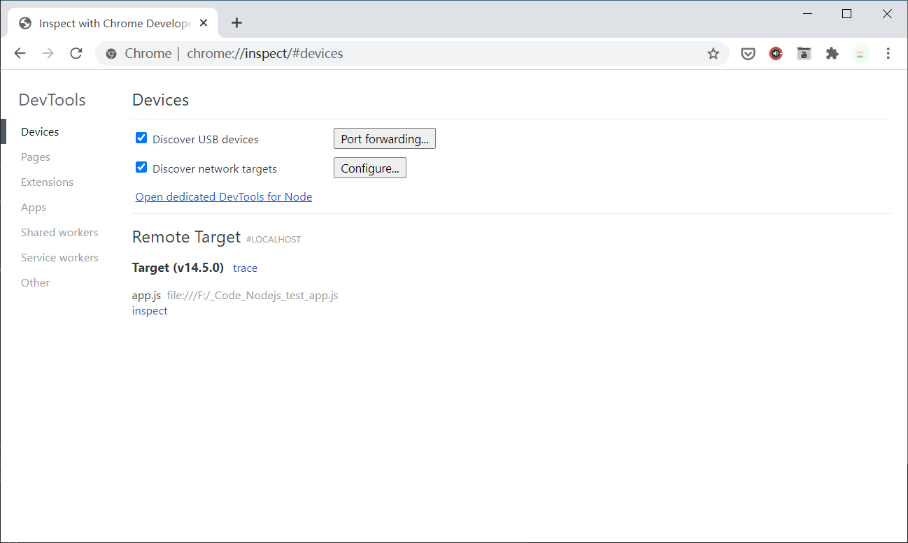
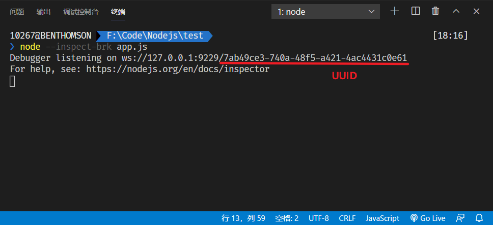

# 除错
Node.js 可以调用 chrome dev tools [调试工具](https://nodejs.org/en/docs/guides/debugging-getting-started/)对项目进行除错

```bash
# 在终端输入以下命令
node --inspect app.js

# 如果希望在第一行就停下来等待调试，可以使用以下命令
node --inspect-brk app.js
```

然后就可以使用 Chrome 浏览器访问地址 `chrome://inspect/#devices` 打开调试页面



或者在 Chrome 浏览器输入 `devtools://devtools/bundled/inspector.html?experiments=true&v8only=true&ws=127.0.0.1:9229/UUID` :bulb: 将其中 UUID 替换为终端生成的值



:bulb: Chrome 调试工具的使用方法可以参考：[开发调试.md](../Development-Environment/开发调试.md)

:bulb: 如果使用 VS Code 也可以使用编辑器中的调试工具，使用方法参考[这里](https://www.jianguoyun.com/p/DRtD7CEQjNDGBxiGvuID)