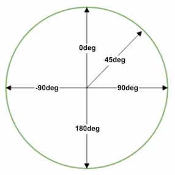

---
tags:
  - css
date: 2021-02-05
author: BenThomson
---
# CSS3

## 选择器
### 基础选择器
CSS3 新增了多种[基本选择器](D:/Front_end/CSS/选择器.md)：

* 子元素选择器 `>`：选择直接后代中的匹配元素（即子元素）
* 相邻兄弟元素选择器 `+`：选择最近一个匹配的同级元素
* 通用兄弟选择器 `~`：选择该元素后的所有匹配的同级元素
* 群组选择器：设置多个选择器，并用逗号 `,` 分隔，以为匹配的元素设置同样的样式

### 结构选择器
参考：详细讲解参考[群里讨论的一个选择器问题（一定要看）](https://mp.weixin.qq.com/s/nS_kcIqBwO03mvF97BZCBQ)

基于 HTML 层级关系结构匹配元素的选择器

* `element:fist-of-type` 匹配当 `element` 在**相同类型**的兄弟元素中，作为父元素的首个子元素
* `element:last-of-type` 匹配当 `element` 在**相同类型**的兄弟元素中，作为父元素的最后一个子元素
* `element:first-child` 匹配当 `element` 在所有兄弟元素中作为其父容器的第一个子元素
* `element:last-child` 匹配当 `element` 在所有兄弟元素中作为其父容器的最后一个子元素
* `element:nth-child(i)` 匹配当 `element` 在所有兄弟元素中作为其父容器的第 `i` 个子元素；类似地，`element:nth-last-child(i)` 从最后一个子元素开始计算。
* `element:nth-of-type(i)` 匹配当 `element` 元素在**相同类型**的兄弟元素中，作为父容器的第 `i` 个子元素；类似地，`element:nth-last-of-type(i)` 则是从最后一个子元素开始计算。

:bulb: 此外 `:nth-child()` 和 `:nth-of-type()` 选择器的参数可以是带有 `n` 的表达式（`n` 取值从 0 开始计算，:warning: 表达式不支持乘除运算），以选择匹配元素中序号（从 1 开始）满足表达式的对象，如表达式 `n+3` 可选择从第 3 个匹配元素开始的元素；可以设置为 `odd` 选择匹配元素中序号（从 1 开始）为奇数的元素；可以设置为 `even` 选择匹配元素中序号（从 1 开始）为偶数的元素。

* `element:only-of-type` 匹配当 `element` 在父元素中作为唯一该类型的子元素
* `element:only-child` 匹配当 `element` 在父元素中作为唯一子元素

:bulb: 带有 `child` 关键字的结构选择器，需要考虑所有兄弟元素，而带有 `type` 关键字的结构选择器只需要考虑相同类型的兄弟元素。
:bulb: 结构选择器前的 `element` 是限制匹配的元素，该元素是子元素；而相对的父元素默认不限制，如果需要限制可以根据子元素选择器或后代元素选择器的语法，在前方添加。

* `element:empty` 匹配没有内容（没有子元素和文本节点）的元素

### 否定选择器
`parent:not(element/selector)` 匹配在父元素 `parent` 中除了指定条件 `element/selector` 以外的所有子元素

### 属性选择器
CSS3 新增了属性选择器，可以匹配带有特定属性/属性值的元素

* `element[attribute]` 匹配元素 `element` 它们有属性 `attribute`
*  `element[attribute="value"]` 匹配元素 `element` 它们的属性 `attribute`，且属性值为 `value`
* `element[attribute~="value"]`匹配元素 `element`，它们的属性 `attribute` 的属性值（该属性可能有多个属性值）包含 `value`
* `element[attribute^="key"]`匹配元素 `element`，它们的属性 `attribute` 的属性值以 `key` 开头
* `element[attribute$="key"]`匹配元素 `element`，它们的属性 `attribute` 的属性值以 `key` 结尾
* `element[attribute*="key"]`匹配元素 `element`，它们的属性 `attribute` 的属性值包含字符串 `key`
* `element[attribute|="str"]`匹配元素 `element`，它们的属性 `attribute` 的属性值为 `str` 或以 `str-`（注意短横 `-` 符号，这是类属性命名的常用符号，以连接多个单词） 开头

### 伪类选择器
CSS 3 提供动态选择器以匹配元素的特定状态进行样式设置

* 动态伪类选择器：匹配当用户和网站交互时才体现出来的元素状态
    * 锚点伪类：`:link`、`:visited`
    * 用户行为伪类：`:hover`、`:active`、`:focus`
* UI 元素状态伪类选择器：`:enabled` 可编辑、`:disabled` 不可编辑、`:checked` 已选中，表示 UI 元素（一般用于表单，如按钮或复选框等）状态

### 伪元素
伪元素用于向元素添加特殊的内容或设置样式。

* `::after (:after)` 在匹配的元素之后添加内容（一般结合属性 `content` 使用），作为已选中元素的最后一个子元素（默认为行内元素），多用于**清除浮动**（需要将其转换为块元素 `display: block`）
* `::before (:before)` 在匹配的元素之前添加内容（一般结合属性 `content` 使用），作为已选中元素的第一个子元素（默认为行内元素）
* `::first-letter (:first-letter)` 匹配**块元素**的第一个字符
* `::first-line (:first-line)` 匹配**块元素**第一行
* `::selection` 匹配鼠标在页面选中的内容，一般用于为选中文本添加高亮的背景，修改字体颜色，以高亮标注选择中的文本

:bulb: 一般用两个冒号 `::` 将伪元素与元素分隔

## 背景

### 背景图
背景图新增多个属性，以提供更多样式的元素背景图

* 属性 `background-clip` 指定背景的绘制区域（超出的部分进行裁剪），多种属性值可选：
    * `border-box` 将背景图限制在边框以内，即背景被裁剪到边框盒
    * `padding-box` 将背景图限制在内边距以内
    * `content-box` 将背景图限制在内容区域

* 属性 `background-origin` 设置背景图偏移（在属性 `backgroun-position` 进行设置）的参照系，类似的也有三种属性值可选：
    * `border-box` 将偏移的起始点设于边框的左上角
    * `padding-box` 将偏移的起始点设于内边距的左上角
    * `content-box` 将偏移的起始点设于内容区域的左上角

* 属性 `background-size` 指定背景图像的大小，可以具体数值或百分比（基于容器的宽度进行缩放），或者使用关键字：
    * `cover` 拉伸背景图片以完全**覆盖**背景区，可能部分背景图片被裁剪而看不见。
    * `contain` 缩放背景图片以完全装入背景区，以保证完整地**包含**图片，可能背景区部分空白。

* 属性 `bacground-image: url(img1_path), url(img2_path)` 允许为元素使用多个背景图片进行叠加（前面路径的图片会覆盖后面设置的图片），可以为图片添加水印。

### 背景颜色渐变
渐变 gradients 是指颜色可以在两种或多种之间「平稳」地过渡。有多种渐变方式：

* 线性渐变 `background: linear-gradient(direction, color1, color2, color3)` 支持设置不同方向（以目标方向为基准)，默认从上到下 `to bottom`，支持对角线如从左上角到右下角 `to right bottom`，支持设置多种颜色
    :bulb: 方向可以使用角度来进行更精准的设置，单位是 `deg`，如 `0deg` 创建一个从下到上的渐变，`90deg` 创建一个从左往右的渐变
    
    :bulb: 颜色值后可以附上百分比，以控制颜色（纯色）渐变的起始/结束的节点
    :bulb: 颜色采用 `rgba(x,x,x,x)` 可设置透明值

* 线性重复渐变 `background: repeating-linear-gradient(direction, color1, color2)` 最后颜色设置结束位置不是 `100%`（默认值）即可实现重复渐变

* 径向渐变 `background: radial-gradient(center, shape, color1, color2, color3)` 从起点到终点颜色从内到位进行圆形渐变，可以设置渐变中心点，如默认 `50% 50%` 以元素中心为渐变中心，渐变的形状 `ellipse` 椭圆形（默认值）或 `circle` 圆形

    :bulb: 还可以使用关键字设置渐变大小（与形状参数结合使用）
    * `closest-side` 最近边
    * `cosest-corner` 最近角
    * `farthest-side` 最远边
    * `farthest-corner` 最远角

* 径向重复渐变 `background: repeating-radial-gradient()`

:warning: IE 浏览器的渐变使用滤镜 `filter` 实现

## 文本
### 换行
属性 `word-break` 设置自动换行方式

* `normal` 半角空格处换行（默认）
* `break-all` 任何位置都换行（可能造成单词「断开」）
* `keep-all` 半角空格或连字符处换行

:bulb: 中文没有半角符号，因此作为标点符号作为连字符

属性 `word-wrap` 允许长单词（只针对拉丁文本）或 UTL 地址换行到下一行

* `nromal` 默认长单词不换行
* `word-wrap: break-word` 开启强制自动换行

### 对齐
属性 `text-align-last` 设置（块级元素）最后一行文本对齐方式

* `auto` 默认左侧对齐
* `left` 强制向左对齐
* `right` 强制向右对齐
* `center` 强制居中
* `justify` 强制两端对齐（只有在 `text-align: justify` 才生效）
* `start`、`end`、`initial` 基于语言对齐方式而言

### 字体
使用 `@font-face` 添加定制化字体文件（链接），以在 `font-family` 中使用定制化的字体。

```css
@font-face {
    font-family: 'Roboto';
    src: url('Roboto-Light-webfont.woff') format('woff');
}
```

在 `@font-face` 规则集设置定制化字体

* 属性 `font-family` 设定该字体的名称（即在样式表内部该字体的别名，可以是任意的名称，但是为了直观易用应选取与字体相关的词语），以便后续在样式表的其他规则集中引用
* 属性 `src` 指中 `url()` 中填写的是该字体文件的路径（可以是绝对路径、相对路径、根目录相对路径），`format()` 填写的是该字体文件的格式。字体文件可以使用下载到本地的文件，也可以使用托管在服务器上的文字。

:warning: 网页字体的引入必须在样式表的顶部添加（由于样式表内规则集的层叠关系），以便在后面样式设置中可以使用。

## 获取网页字体

|                             官网                             | 价格 |        质量        | Selection |
| :----------------------------------------------------------: | :--: | :----------------: | :-------: |
|        [Font Squirrel](https://www.fontsquirrel.com/)        | 免费 |       :star:       |    多     |
| [Google Fonts](https://fonts.google.com/)/中文镜像 [1](http://www.googlefonts.net/)，[2](http://www.googlefonts.cn/) | 免费 |    :star::star:    |    少     |
|          [Fontspring](https://www.fontspring.com/)           | 付费 | :star::star::star: |    多     |

:warning: 注意使用/购买用于网页版本的字体。