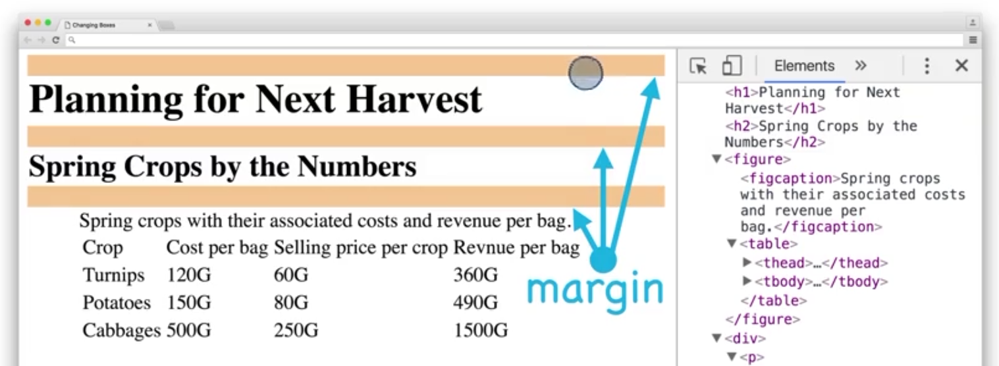
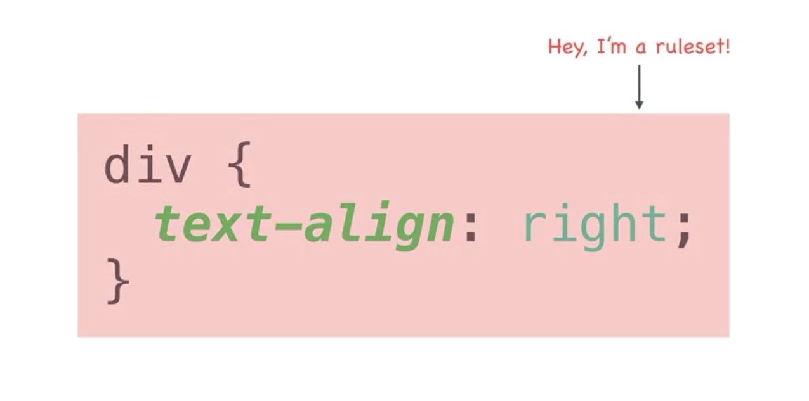
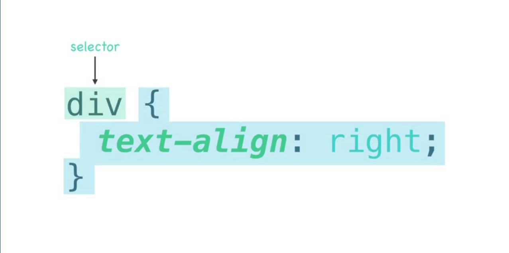

---
tags:
  - css
---

# CSS概述
参考：
- W3C [CSS 教程](https://www.w3schools.com/css/)
- Mozilla 开发者社区 [CSS 参考](https://developer.mozilla.org/zh-CN/docs/Web/CSS/Reference)
- [CSS Almanac](https://css-tricks.com/almanac/)
- [入门概念：CSS 选择器是如何工作的](https://css-tricks.com/how-css-selectors-work/)（[中译版](https://zhuanlan.zhihu.com/p/25739988)）

HTML 不同元素有其不同**默认样式 `User-Agent Styles`**，通常包含默认（盒模型）大小、背景颜色等，如 `header` 元素的字体默认为粗体大号，以及上下外边距而没有内边距。浏览器采用默认样式表来确定如何显示 HTML 元素，不同浏览器的默认式样规则可能不同，可查看以下资料：
- [WebKit (Chrome 及 Safari)](http://trac.webkit.org/browser/trunk/Source/WebCore/css/html.css)
- [Firefox](https://developer.mozilla.org/zh-CN/docs/Web/CSS/Reference)
- [Internet Explorer](http://www.iecss.com/)



CSS（Cascading Style Sheets）**层叠样式表**是用来描述网站上各种元素的外观，定制各种元素的样式。CSS 是一种标记语言，用来表现 HTML 文件样式的计算机语言，可以将样式设置放在单独的**样式表**中，仅仅编辑一个简单的 CSS 文档，创建一些规则定制元素中的内容，就可同时改变站点中所有页面的布局和外观。

* **层叠 cascading**：表示规则不仅适用于其直接匹配的元素，也适用于这些元素的**所有子元素**， 若一个子元素有多个重叠的规则，则最后设置的具体规则才会生效（即按照就近原则）
* **样式表 style sheet**：可以将 CSS 理解为是一种查找替换工具（或用 CSS 术语所说的**匹配**），通过该表匹配元素的一个类或一个标签，设置属性值。

:warning: 样式定义规则时其**位置**和应用的**顺序**很重要。可以在不同地方定义样式（下列顺序中的下一条定义会覆盖其上一条定义）

- **浏览器的默认样式**：不同浏览器样式稍有不同
- **单独文件中的样式表](D:/Front_end/CSS/样式表.md)**：通过样式表将内容与样式设置分开，内容使用 HTML 语言编写，样式使用 CSS 编写
- **HTML 中的样式表**：在 HTML 文件中的 `<head>` 标签内的 `<style>` 标签中设置，在小型实战项目中可以这么做，但是不理想
- **一个元素中的内联样式表**：虽然也可以做，但应该避免

## 注释
CSS 注释的包含在 `/* annotation */` 之中，编译器会自动忽略注释内容，一般作说明方便其他开发者使用代码；或在调试时进行临时注释测试，以分别进行代码块功能的测试。

### 单行注释
```css
/* 这是单行注释 */
```

### 多行注释
```css
/*
这是多行注释
这是多行注释
这是多行注释
*/
```

## 规则集


CSS 的基本组成是规则集 `rule set`，规则集由两部分组成：
* **选择器 Selector**：筛选出需要添加样式的 HTML 元素
    
* **声明块 Declaration Block**：描述想要添加的样式，在花括号 `{}` 内，格式是 `属性:属性值`，以分号 `;` 结束
    

示例设置的属性是**文本对齐方式** `text-align`，属性值设置为**右对齐** `right`

## CSS 重置
为了保持不同浏览器之间的样式的一致性，一种流行的解决方案是采用 **CSS 重置**的方式，如 [normalize.css](https://necolas.github.io/normalize.css/)，通过加载一份样式表 `normalize.css` 确保网页的样式在**所有的浏览器**中得到相同的诠释

* 方法一：运行以下命令行安装

    ```css
    npm install normalize.css
    ```
* 方法二：在 HTML 文件中链接样式表 `normalize.css`

    ```html
    <head>
        <link rel="stylesheet" src="https://necolas.github.io/normalize.css/latest/normalize.css">
    </head>
    ```
    目前 `normalize.css` 文件的线上链接为 `https://necolas.github.io/normalize.css/latest/normalize.css` 可以直接链接该文件，也可以下载到本地再引用。当前 `normalize.css` 最新版本为 `8.0.1` 也可设置链接为 `http://necolas.github.io/normalize.css/8.0.1/normalize.css`


把 `normalize.css` 里面的所有内容**放在自己的 `style.css` 的最上面**，那样如果有冲突的话，写在后面的定制化样式会覆盖掉前面的

参考：
* [normalize.css](https://github.com/necolas/normalize.css/)
* [**Normalize.css** A modern, HTML5-ready alternative to CSS resets](http://necolas.github.io/normalize.css/)
* [来，让我们谈一谈 Normalize.css](https://jerryzou.com/posts/aboutNormalizeCss/)

