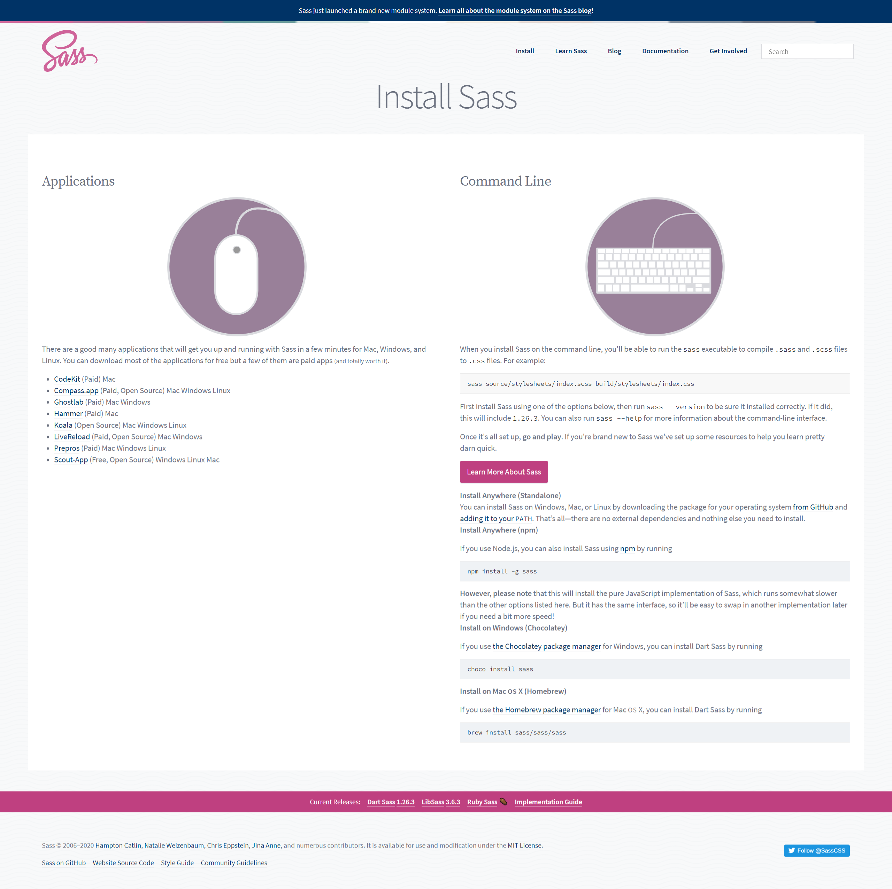
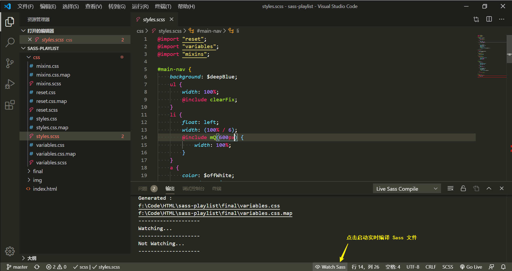

# 简介
参考：
* [Sass教程 Sass中文文档](https://www.sass.hk/docs/) | Sass中文网
* [Sass: Documentation](https://sass-lang.com/documentation)
* [SASS Tutorial](https://www.youtube.com/playlist?list=PL4cUxeGkcC9iEwigam3gTjU_7IA3W2WZA)

Sass 是一款强化 CSS 的辅助工具，它在 CSS 语法的基础上增加了变量  variables、嵌套 nested rules、混合 mixins、导入 inline imports 等高级功能，这些拓展令编写 CSS 高效和优雅，更好地组织管理样式文件。

Sass 全称为 Syntactically Awesome Style Sheets 即只是在句法上重构了样式表，类似于添加了一层语法糖，浏览器并不能直接识别该文件，因此需要使用编译器将 `.scss` 或 `.sass` 文件编译为 `.css` 文件。

## 配置环境
用多种方法配置编译环境，可以在 [官网](https://sass-lang.com/install) 下载安装编译器（推荐使用跨平台的[编译器 Prepros](https://prepros.io/) 免费版），或手动配置编译环境使用命令行编译。

:warning: 由于 Sass 基于 Ruby 开发，因此在 Windows 系统中使用命令行编译时需要安装 [Ruby](https://www.ruby-lang.org/zh_cn/downloads/)。

:bulb: 如果开发使用的编辑器是 VS Code 可以安装插件 [Live Sass Compiler](https://marketplace.visualstudio.com/items?itemName=ritwickdey.live-sass) 和 [Live Server](https://marketplace.visualstudio.com/items?itemName=ritwickdey.LiveServer) 实现实时编译。

## 编译
如果使用编译器，需要将项目添加到编译器中，并启动 `Auto Compile`；如果使用 VS Code 的插件 Live Sass Compiler 则点击状态栏的 `Watch Sass`，即可实现实时编译。当 `.scss` 文档修改后保存，即可自动同步生成同名的 `.css` 文档。在 HTML 文档中链接相应的 `.css` 文档即可应用样式。