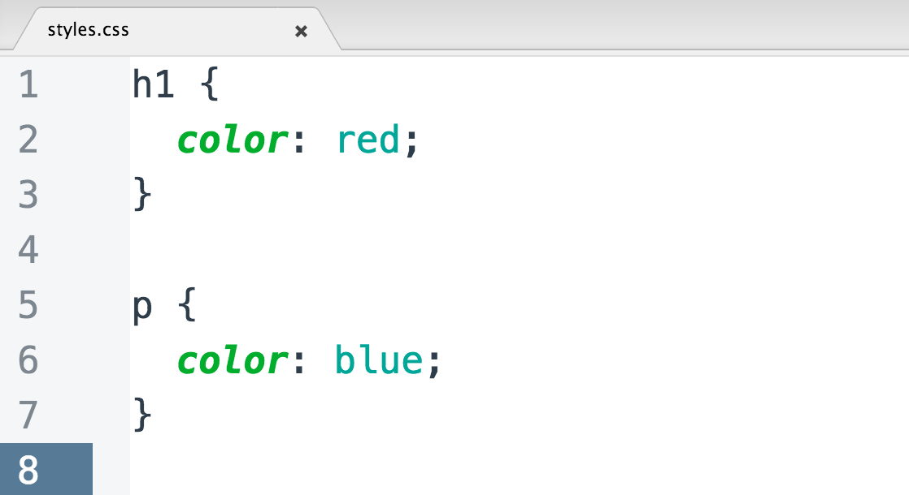

---
tags:
  - css
---

# 引用 CSS
CSS 用来设置元素的外观样式，其内容可以设置在不同位置，且具有不同的优先级别。

常见的 CSS 样式引用方式
* 行内样式（内联样式）
* 内部样式表（嵌入样式）
* 外部样式表（外联样式）
* 导入式

|    类型    |                               引入方法                               |               代码位置               |                加载顺序                 |
| :----------: | :----------------------------------------------------------------------: | :--------------------------------------: | :-----------------------------------------: |
| 行内样式 |              在元素开始标签的属性 `style` 中              |            HTML 文档内            |                   同时                    |
| 内部样式 |         在 `<head>` 元素内的 `<style>` 元素中          |            HTML 文档内            |                   同时                    |
| 外部样式 |       通过 `<head>` 元素内的 `<link>` 元素导入       | 样式表（与 HTML 文档分离） | 页面加载时，同时加载 CSS 样式 |
|  导入式   | 在代码开始处通过  `@import url(file-path)` 导入 | 样式表（与 HTML 文档分离） |  在读取完 HTML 文档之后加载   |

:warning: 外部样式表在页面加载时，会同时加载以保证页面的内容和样式同时展现；而导入式样式表在 HTML 文档读取完后才加载，如果加载较慢时就会出现无样式的页面布局。

## 行内样式
内联样式/行内样式是指在 HTML 元素的属性 `style` 中设置的样式.样式的键值对（以冒号 `:` 分隔）作为属性值需要在引号中，而多个 CSS 样式以分号 `;` 分隔。

```html
<!-- 将链接文字设置为红色，并添加了删除线以提示用户链接无效 -->
<p>this <a href='' style='color: #990000; text-decoration: line-through;'> link </a> can't work!</p>
```

:warning: 由于是内联样式是元素属性，因此设置的样式需要压缩到一行中。

:bulb: 由于内联样式优先级最高，且嵌入到单个 HTML 页面的单个元素中，对于后续的样式修改十分不方便，应该尽可能避免使用；若需要针对特定单个 HTML 元素进行样式设置，可以使用 CSS 类选择器。

## 内部样式表
HTML 元素 `<style>` 用于添加网页内部 CSS 样式。这一类的样式是当前网页所特有的，不可复用。

元素 `<style>` 有设置网页外观的 metadata 元数据，因此一般在元素 `<head>` 内添加。

:bulb: 可能会见到某些开发者为元素 `<style>` 设置了属性 `type="text/css"` 以表示该元素中的内容是 CSS 元素；还有对于低版本浏览器由于不识别元素 `<style>` 会造成样式代码作为文本显式在页面上，一个解决办法是将元素 `<style>` 内的样式设置代码包括在注释 `<!--code-->` 中

```html
<html>
    <head>
        <style>
        <!--
            style_setting
        -->
        </style>
    </head>
    <body></body>
</html>
```

:warning: HTML 元素 `<style>` 内 CSS 语法与外部 `styles.css` 样式表语法相同，但由于内嵌在 HTML 文件中因此更改和后续维护都不方便。

:bulb: 当需要设置**单页面专属的样式**时可以在相应的 HTML 文件中的 `<head>` 元素内设置；而当多个页面都有相同的 CSS 规则就应该将冗余的设置提取汇总到一个 `.css` 文件中，进行统一设置方便维护。

## 外部样式表
外部样式表是一个独立的文件，文件后缀为 `.css`，它包含描述元素如何在网页上呈现的代码，除了 CSS 存在于不同文件中，**不必再使用 `<style>` 标签**外，和之前在 HTML 文件的标签 `<style>` 里设置元素样式的操作没有区别，也是使用规则集设置样式。



将样式设置都写入到样式表中，并存为一个文件，如 `stylesheet.css`，在 HTML 文档的 `<head>` 元素中创建一个 `<link>` 元素以引入样式表，其中属性 `href` 指定所链接资源的**路径** （可以链接除了样式表以外的其他资源），属性 `rel` 指定资源和文档之间的**关系**，当属性值为 `stylesheet` 表示引入的文件是样式表。

```html
<head>
    <link href="path-to-stylesheet/stylesheet.css" rel="stylesheet">
</head>
```

:bulb: 多个 HTML 文件可以链接到同一张样式表，可以通过修改一次样式表文件而同时设置多个网页，便于网站后期迭代更新。而且连续浏览的网页复用的样式表只需要下载一次即可，可以节省带宽。

:bulb: 而对于一个 HTML 文件可以引用多个外部样式表，在 HTML 文档中添加多个链接 `<link/>` 将不同的样式表都应用于同一个页面。:warning: 此时元素 `<link/>` 的添加顺序很重要，后添加的样式表会覆盖其上的样式表中设置的相同属性。一般先添加链接到设置全局样式的 CSS 文件，如 `styles.css`；再添加链接到设置特定部分样式的 CSS 文件，如 `product.css` 或 `blog.css`。通过添加链接多个样式表，可对网页进行更详细的样式设置，应避免使用网页内部样式或内联样式。

## 导入其他样式表
通过属性 `@import url("file-path")` 可以导入其他样式表文件，一般导入语句写在文件顶部，以复用其他样式设置。

:bulb: 也可使用 `@import "file-path"` 导入其他样式表文件，路径需要用引号 `""` 包括

## 优先级别
层叠样式表 Cascading Style Sheets 其中「层叠」是指样式设置有多个来源时，在文档下面新设置的属性规则会 ***覆盖*** 上面相同的属性规则，如果样式冲突时，则按照有些级别引用样式（层层叠加或覆盖）。

CSS 层叠优先结构如下（越往下所设置的样式优先级别越高）：

* 浏览器的默认样式表
* 用户定义的样式表
* 网页外部样式表（开发者制作的样式表，推荐使用）
* 网页内部的样式表（开发者制作的样式表）
* 内联样式（即在 HTML 元素中设置的 CSS 样式，开发者可以制作，但不推荐使用）

:bulb: 父元素的（部分）样式设置不仅适用于其自身，也适用于这些元素的**所有子元素**（即子元素从父元素那里 ***继承*** 了部分适用的样式属性）:warning: 继承的是**计算值**而非相对值，这对于以相对单位设置的样式有影响。

:bulb: 其实引入样式的优先级别与顺序相关，由于内联样式是最「靠近」元素的，所有一般优先级别最高，这就是 **「就近原则」**。此外同一个样式表内部的[不同选择器也有不同的优先级别](./选择器.md#优先级)（权重从上到下依次减弱）：

*  ID 选择器：`#button-2`
*  类别选择器的伪类选择器：`.button:link`
*  元素选择器的伪类选择器 与 子元素选择器：`a:link` 与 `.synopsis em`（权重相同）
*  类别选择器：`.button`
*  元素选择器：`a`

:bulb: CSS 优先级可能引起不可预期的结果，因此一种**只使用类别选择器**设置整个页面样式的方法学 [BEM](http://getbem.com/introduction/) 应运而生，此时只需要考虑样式设置的次序即可。

:bulb: 可以在样式规则之后（以空格分隔）添加关键字 `!important` 调整样式规则的优先级至最高