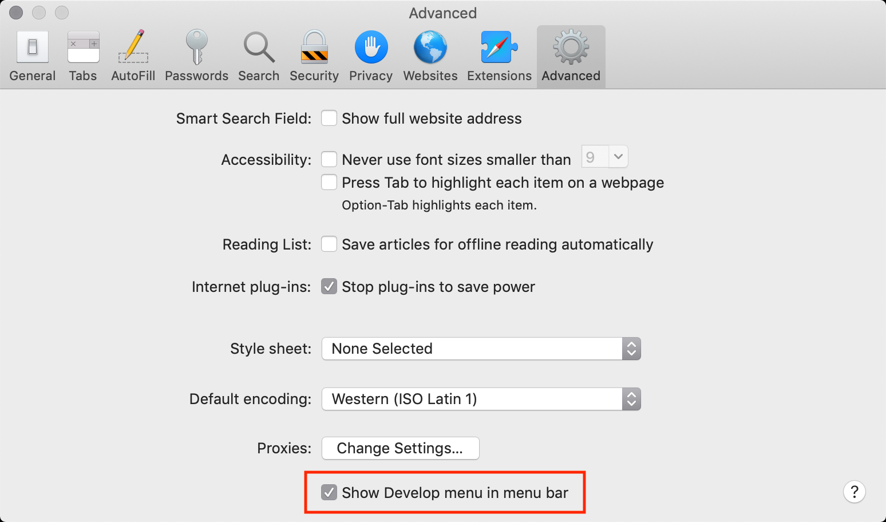

# JavaScript 控制台
Chrome 快捷键 `Ctrl + Shift + J` 打开控制台。

## Chrome
参考：[使用控制台](https://developers.google.com/web/tools/chrome-devtools/console/?utm_campaign=2016q3&utm_medium=redirect&utm_source=dcc)

转到查看 `View` -> 开发者 `Developer` -> JavaScript 控制台 `Console`

## FireFox
参考：[浏览器控制台](https://developer.mozilla.org/zh-CN/docs/Tools/Browser_Console)

转到工具 `Tools` -> Web 开发者 `Web Developer` -> Web 控制台 `Web Console`

## Safari
参考：[Safari Web Inspector Guide](https://developer.apple.com/library/archive/documentation/AppleApplications/Conceptual/Safari_Developer_Guide/GettingStarted/GettingStarted.html)

**注意**：使用 Safari 的开发者工具，先要在高级首选项中启用「开发」Develop 选项

转到开发 `Develop` -> 显示 Web Inspector `Show Web Inspector`