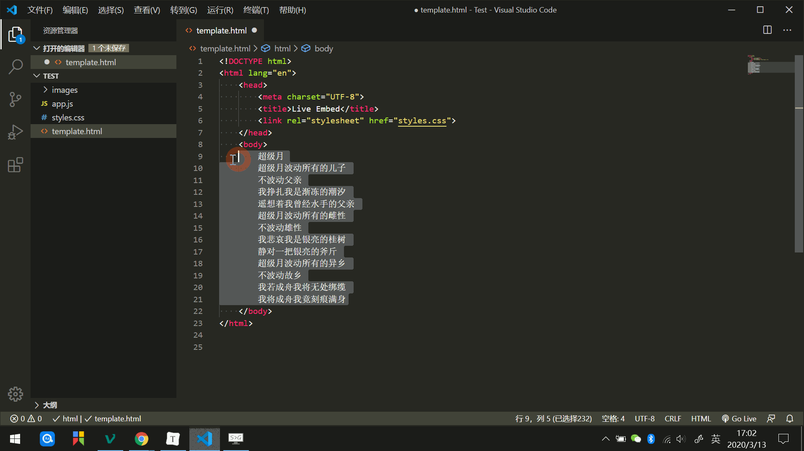

# emmet
参考：
* [VsCode 中使用 Emmet 神器快速编写HTML代码](https://www.cnblogs.com/summit7ca/p/6944215.html) - 浮云也是种寂寞
* [Emmet in Visual Studio Code](https://code.visualstudio.com/docs/editor/emmet)
* [Emmet Cheat Sheet](https://docs.emmet.io/cheat-sheet/)

Emmet（前身为 Zen Coding）提供了一种非常简练的语法规则，相当于内置了一套可复用的 *snippets* 代码片段，生成对应的 HTML 结构或者 CSS 代码，提高前端开发效率。

VS Code内置了 Emmet 语法，在后缀为 `.html` 或 `.css` 文件中输入 emmet 缩写语句，然后**按 `Tab` 键**即会自动生成相应代码。


:warning: 新版本 VS Code 中按 `Tab` 不再默认启用 Emmet 展开缩写，需要在首选项配置中将`emmet.triggerExpansionOnTab` 设置为 `true`

## 缩写语法
一些列的缩写语法片段组成了 emmet 的工具包，如编写 HTML 时使用类似于 CSS 选择器的语法，以描述元素在生成的树中的位置和元素的属性；也支持编写 CSS 文档，如使用 `m` 表示 `margin` 等。

:warning: 使用时请注意空格表示缩写语法停止/终结，因此在缩写代码内不要有空格，否则会引起解析错误无法生成对应的代码片段。

:warning: 如果编辑器中已经有了一些 html 智能提示代码段，如 HTML Snippets 插件与 Emmet 语法有部分冲突，使用 `Tab` 键时会优先使用插件的代码提示，建议禁用

### 元素
使用元素的名称，如输入 `div` 并按 `Tab` 键来生成HTML标签。

:bulb: Emmet 没有一组可用的标签名称列表来限制生成的 HTML 标签，可以写任何单词并按 `Tab` 键将其转换为标签，因此在使用 Vue 等框架的组件模板也适用。

### 文本操作符
使用符号 `{text}` 为创建的元素同时添加文本内容，如输入 `a{Click me}` 按 `Tab` 键即可生成 `<a href="">Click me</a>`

### 嵌套操作符
* 符号 `>` 创建子元素，如输入  `div>ul>li` 按 `Tab` 键即可生成如下代码块
    ```html
    <div>
        <ul>
            <li></li>
        </ul>
    </div>
    ```

* 符号 `+` 创建兄弟元素，如输入 `div+p+bq` 按 `Tab` 键即可生成如下代码块
    ```html
    <div></div>
    <p></p>
    <blockquote></blockquote>
    ```

* 符号 `^` 创建父级的同级元素，如输入 `div+div>p>span^bq` 按 `Tab` 键即可生成如下代码块
    ```html
    <div></div>
    <div>
        <p><span></span></p>
        <blockquote></blockquote>
    </div>
    ```

* 符号 `()` 实现缩写的分离，可平行创建多个元素，如输入 `div>(ul>li+span)>a` 按 `Tab` 键即可生成如下代码块
    ```html
    <div>
        <ul>
            <li></li>
            <span></span>
        </ul>
        <a href=""></a>
    </div>
    ```

### 乘法
使用符号 `*` 自动生成重复项，如输入 `ul>li*3` 按 `Tab` 键即可生成如下代码块

```html
<ul>
    <li></li>
    <li></li>
    <li></li>
</ul>
```

:warning: 请注意符号所在位置，位置不同生成的结果不同

### 属性操作符
属性操作符用于设置生成元素的属性。

* 使用符号 `#` 为元素添加 `id` 属性，如输入 `div#pageId` 按 `Tab` 键即可生成 `<div id="pageId"></div>`
* 使用符号 `.` 为元素添加 `class` 属性，且支持添加多个类属性，如输入 `div.test1.test2` 按 `Tab` 键即可生成 `<div class="test1 test2"></div>`
* 使用符号 `[attr="value"]` 添加特定的属性，如输入 `a[href target="_blank"]` 按 `Tab` 键即可生成 `<a href="" target="_blank"></a>`

:bulb: 只输入属性操作符（隐式标签）会自动联想生成具有该属性的标签，如输入 `Table>.row>.col` 按 `Tab` 键即可生成如下代码

```html
<Table>
    <tr class="row">
        <td class="col"></td>
    </tr>
</Table>
```

### 项目计数
使用乘法 `*` 生成重复元素时，可以结合自动计数符号 `$` 为元素添加相应的序号。如输入 `ul>li.item${item number:$}*3` 按 `Tab` 键即可生成如下代码

```html
<ul>
    <li class="item1">item number:1</li>
    <li class="item2">item number:2</li>
    <li class="item3">item number:3</li>
</ul>
```

:bulb: 如果生成两位数则使用两个连续的 `$$` 更多位数以此类推
:bulb: 使用 `@` 修饰符，可以更改编号方向（升序或降序），`@-` 表示降序， `@+`表示升序（默认）；还可以改变基数，`@N` 可以改变起始值（`N` 为正整数）

输入 `ul>li.item$@-3*4` 按 `Tab` 键即可生成如下代码

```html
<ul>
    <li class="item6"></li>
    <li class="item5"></li>
    <li class="item4"></li>
    <li class="item3"></li>
</ul>
```

## 随机文本
Emmet 内置了 Lorem Ipsum 功能，输入 `loremN`或者 `lipsumN`（`N` 表示生成的单词数，选填）按 `Tab` 键即可生成随机文本

## 包装文本
把一段指定的文本包装成我们想要的结构

1. 选中文本，按下 `Ctrl + Shift + P` 打开命令窗口
2. 输入 `ewrap`
3. 选择 `Emmet: 使用缩写进行包装` 选项
4. 输入缩写字符，如  `ul>li*` 按下回车键，将文本包装为一个无序列表

