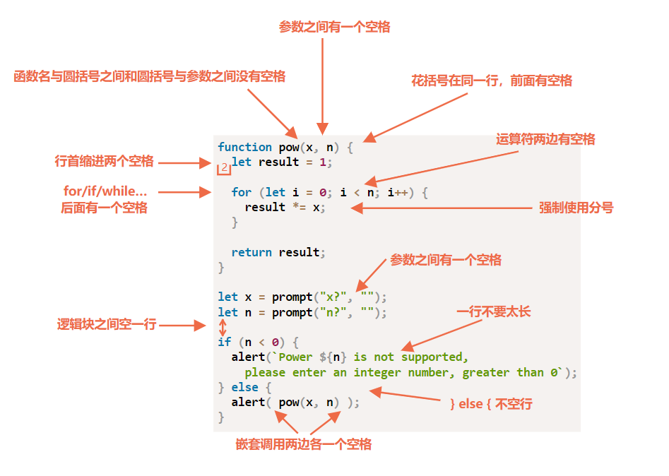

# 前端编程样式指南

参考：
* [优达学城（Udacity）前端样式指南（中文版）](https://github.com/udacity/frontend-nanodegree-styleguide-zh)
    - [HTML 样式指南](https://udacity.github.io/frontend-nanodegree-styleguide-zh/html/%E5%89%8D%E7%AB%AF%E5%B7%A5%E7%A8%8B%E5%B8%88%E7%BA%B3%E7%B1%B3%E5%AD%A6%E4%BD%8D%E6%A0%B7%E5%BC%8F%E6%8C%87%E5%8D%97%20-%20HTML.html)
    - [CSS 样式指南](https://udacity.github.io/frontend-nanodegree-styleguide-zh/html/%E5%89%8D%E7%AB%AF%E5%B7%A5%E7%A8%8B%E5%B8%88%E7%BA%B3%E7%B1%B3%E5%AD%A6%E4%BD%8D%E6%A0%B7%E5%BC%8F%E6%8C%87%E5%8D%97%20-%20CSS.html)
    - [JavaScript 样式指南](https://udacity.github.io/frontend-nanodegree-styleguide-zh/html/%E5%89%8D%E7%AB%AF%E5%B7%A5%E7%A8%8B%E5%B8%88%E7%BA%B3%E7%B1%B3%E5%AD%A6%E4%BD%8D%E6%A0%B7%E5%BC%8F%E6%8C%87%E5%8D%97%20-%20JavaScript.html)
    - [Git 样式指南](https://udacity.github.io/frontend-nanodegree-styleguide-zh/html/%E5%89%8D%E7%AB%AF%E5%B7%A5%E7%A8%8B%E5%B8%88%E7%BA%B3%E7%B1%B3%E5%AD%A6%E4%BD%8D%E6%A0%B7%E5%BC%8F%E6%8C%87%E5%8D%97%20-%20Git.html)
* [优达学城HTML样式指南.pdf](./_v_attachments/20191005161706361_14556/udacity-html-style-guide.pdf) | [Github](http://udacity.github.io/frontend-nanodegree-styleguide/index.html)
* [优达学城CSS样式指南.pdf](./_v_attachments/20191005161706361_14556/udacity-css-style-guide.pdf) | [Github](http://udacity.github.io/frontend-nanodegree-styleguide/css.html)
* [优达学城JavaScript样式指南.pdf](./_v_attachments/20191005161706361_14556/udacity-javascript-style-guide.pdf.pdf) | [Github](http://udacity.github.io/frontend-nanodegree-styleguide/javascript.html)

代码风格必须尽可能的清晰和易读。

## 一般格式规则

### 字母大小写
仅使用小写。所有代码均使用小写，字符串除外。

### 末尾空格
删除行尾空格。行尾空格属于多余的符号，会使 diff 更加难以阅读。

* 对于 Atom 编辑器可以进行下图设置，保存文件自动去除行尾多余空格。


* 对于 Sublime Text 编辑器，可在用户设置 User Settings 的 JSON 文件（可在文本编辑器的菜单中找到）中添加以下代码，每当你以此方法储存文件时，去除行尾空格操作便会自动完成：
`"trim_trailing_white_space_on_save": true`

* 对于 VS Code，可进入（菜单）`首选项` -> `设置` 中搜索 `files.trimTrailingWhitespace` ，然后将选项勾选即可，这样每当你保存文件时，去除行尾空格操作便会自动完成：`"files.trimTrailingWhitespace": true`

## 缩进
整个文件中的缩进应保持前后一致，使用 Tab、2 个空格或 4 个空格都可以，但需**保持前后一致**。

## CSS 规则
### 选择符和声明分隔
所有选择符和声明均需**另起一行**。

**不推荐**：
```css
h1, h2, h3 {
    font-weight: normal; line-height: 1.2;
}
```

**推荐**：

```css
h1,
h2,
h3 {
    font-weight: normal;
    line-height: 1.2;
}
```

### 规则分隔
所有规则间均需加一个空行（两个换行符）。

**推荐**：
```css
html {
    background: #fff;
}

body {
    margin: auto;
    width: 50%;
}
```

### 区块注释
在可行时，**用注释将样式表区块组合在一起**，用新行分隔各区块。

**推荐**：

```css
/* Header */
.header {
    ...
}

.header-nav {
    ...
}

/* Content */
.gallery {
    ...
}

.gallery-img {
    ...
}

/* Footer */
.footer {
    ...
}

.footer-nav {
    ...
}

```

## JavaScript 规则
参考：[代码风格](https://zh.javascript.info/coding-style)



:bulb: 可以使用检查器 Linters 如 [ESLint](http://eslint.org/)，自动检查代码样式，并提出改进建议，还可以发现一些代码错误。在 VS Code  中有 [ESLint 插件](https://marketplace.visualstudio.com/items?itemName=dbaeumer.vscode-eslint)可供下载使用。

### 命名
* 函数名称为 `functionNames`
* 变量名称为 `variableNames`
* 类名称为 `ClassNames`
* 方法名称为 `methodNames`
* 常量值名称为 `CONSTANT_VALUES`
* 文件名称为 `filenames`

### 注释
好的注释可以使我们更好地维护代码，一段时间之后依然可以更高效地回到代码高效开发。一般用注释来解释描述框架（对组件进行高层次的整体概括）、记录函数的参数和用法（推荐使用 JSDoc 语法）。

此外解决方案的注释非常的重要，为何使用当前的方法（而非另一种方案），它们可以帮助你以正确的方式继续开发。如果代码存在任何巧妙和不显而易见的方法，那绝对需要注释。

:warning: 应避免「解释型」注释，如解释代码解决的问题或解决的详细步骤等。因为即使没有注释也可以查看代码细节得知这些信息。

:bulb: 当函数过于复杂，以至于内部需要很多代码注释，可以考虑将其分解为函数，这样代码就可以称为**自描述型**代码，函数自己变成了一个注释。虽然不能完全避免「解释型」注释，如在一些复杂的算法中会有一些出于优化的目的而做的一些巧妙的「调整」。但是通常情况下应该尽可能地保持代码的简单和「自我描述」性。

选择基于 [JSDoc](http://usejsdoc.org/) 格式编写代码注释，可以利用 JSDoc 3 生成器将源代码中的注释识别提取出来，并生成一个HTML文档，用以对 JavaScript 功能进行记录和解释，方便其他开发者使用脚本。

:bulb: 这种注释帮助我们理解函数的目的，并且不需要研究其内部的实现代码，而是直接快速上手正确地使用它。

JSDoc 会为你提供记录代码的多种注释，但只推荐使用以下种类：

- [@constructor](http://usejsdoc.org/tags-class.html)：用于记录一个 Class 类，也就是用 `new` 关键字调用的函数。
- [@description](http://usejsdoc.org/tags-description.html)：用于描述你的函数
- [@param](http://usejsdoc.org/tags-param.html)：用于描述函数参数
- [@returns](http://usejsdoc.org/tags-returns.html)：用于描述函数返回值

```js
/**
* @description 简要描述这本书
* @constructor
* @param {string} title - 书的标题
* @param {string} author - 书的作者
* @returns {string} book - 书的信息
*/

function Book(title, author) {
    let book = title + ' - ' + author;
    return book;
}
```
:bulb: 注意注释开始是 `/**`
:bulb: 一些像 JSDoc 3 这样的工具，或在命令行调用 `jsdoc` 可以生成一个 HTML 页面汇总注释内容（该页面非在当前目录的新建目录 `out/` 之中生成）

文件 `book.js` 为目标文件
```shell
jsdoc book.js
```

### 变量
在 JavaScript 里一共有三种定义变量的方式：

- [const](https://developer.mozilla.org/zh-CN/docs/Web/JavaScript/Reference/Statements/const)
- [let](https://developer.mozilla.org/zh-CN/docs/Web/JavaScript/Reference/Statements/let)
- [var](https://developer.mozilla.org/zh-CN/docs/Web/JavaScript/Reference/Statements/var)

优先考虑使用 `const` 定义你的变量；如果觉得以后需要对变量重新赋值的，则使用 `let`。

:warning: 现已不推荐使用 `var` 定义变量了。

### 分号
始终在语句末尾使用分号 `;` 依靠隐式插入会造成难以排除的细微问题。

:bulb: 分号应放在**函数表达式**的末尾，而不是**函数声明**的末尾。

```javascript
const foo = function() {
   return true;
};

function foo() {
   return true;
}
```

### 对象
`for-in` 循环用于循环对象中的键，且对于数组和对象行为不一致（`for-in` 不是从 `0` 循环到 `length-1` ，而是循环对象及其**原型链**中的所有现有键），很容易出错，

如果可以的话，对数据进行整理，这样就不必在对象上迭代；如果不可行，就将 `for-in` 循环的内容包裹在条件语句中，以防止它在原型链上迭代。

```javascript
const myObj = {'firstName':'Ada','lastName':'Lovelace'};
for (const key in myObj) {
   if (myObj.hasOwnProperty(key)) {
      console.log(myObj[key]);
   }
}
```

### 数组
在迭代数组时，相比 `for-in` 循环， `forEach` 或 `for` 循环更具优势。

### 数组和对象字面量

使用数组和对象字面量，而不是数组和对象构造函数。

**不推荐：**

```javascript
const myArray = new Array(x1, x2, x3);
const myObject = new Object();
myObject.a = 0;
```

**推荐：**

```javascript
const myArray = [x1, x2, x3];
const myObject = {
   a: 0
};
```

### 字符串引号
为了保持连贯性，应使用单引号 `'` 而不是双引号 `"`。这在创建含有 HTML 的字符串时尤其有帮助。

```javascript
const element = 'Click Me';
```

:warning: 而在 JSON 对象中要求使用双引号

### 短路求值 `&&` 和 `||`
短路求值可以提高性能。

**不推荐：**

```javascript
function foo(name) {
   let theName;
   if (name) {
      theName = name;
   } else {
      theName = 'John';
   }
   return theName;
}
```

**推荐：**

```javascript
function foo(name) {
   return theName = name || 'John';
}
```

## 函数位置
对于一般的函数，先写调用代码，再写函数声明，这是因为阅读代码时，我们首先想要知道的是“它做了什么”。如果代码先行，那么在整个程序的最开始就展示出了这些信息。之后，可能我们就不需要阅读这些函数了，尤其是他们的名字清晰地展示出了他们的功能的时候。