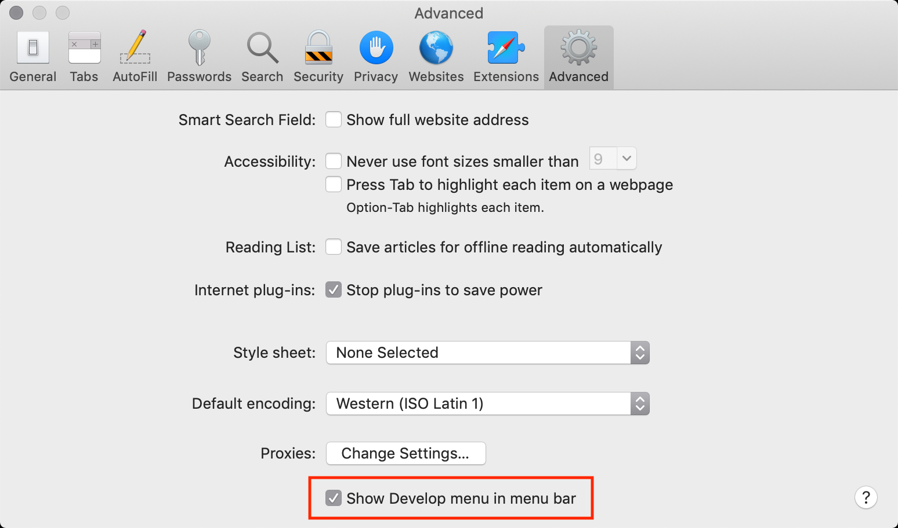

# 开发者工具
参考：
* [HTML and CSS Syntax](https://cn.udacity.com/course/html-and-css-syntax--ud001) - 课程  CSS 语法 - 12.不同浏览器上的开发者工具 | Udacity
* [开发者控制台](https://zh.javascript.info/devtools) | 现代 JavaScript 教程

浏览器的开发者工具是前端开发中一个强大的调试工具，可以查看网页代码、执行命令、查看错误、检查变量等，如 HTML 结构、CSS 样式设置、脚本运行的错误信息等。

多种主流浏览器都有开发者工具，Chrome 浏览器在 Windows 系统中通过 `F12` 开启开发者工具。Mac 系统下使用 `Cmd+Opt+J`，Safari 使用 `Cmd+Opt+C`（需要提前开启开发者工具）。

## Google Chrome
[Chrome 开发者工具](https://developers.google.cn/web/tools/chrome-devtools/)是 Chrome 中内置的**网页编辑和调试工具**。

打开开发者工具方法
* 方法一：右键单击任意页面元素 -> 选择「检查」`Inspect`
* 方法二：点击浏览器窗口右上角汉堡菜单 -> 选择「更多工具」`More Tools` -> 「开发者工具」 `Developer Tools`
* 方法三：使用快捷方式 `Ctrl + Shift + I` (Windows/Linux)。

快捷键可参考：[Tools for Web Developers 键盘快捷键参考](https://developer.chrome.com/devtools/docs/shortcuts#opening-devtools) 或 [键盘快捷键和 UI 快捷键参考](http://www.css88.com/doc/chrome-devtools/shortcuts/)

## Mozilla Firefox
参考：[Firefox 开发者工具](https://developer.mozilla.org/zh-CN/docs/Tools)

打开 Firefox 开发者工具方法：
* 方法一：在任意页面元素上右键单击 -> 选择「检查元素」`Inspect Element`
* 方法二：点击浏览器窗口右上角的汉堡菜单 -> 选择「开发者」`Developer` -> 依据所需选择开发者工具中的标签栏
* 方法三：按  `Ctrl + Shift + I` (Windows/Linux) 快捷键

:bulb: 可以下载 [Firefox Developer Edition](https://www.mozilla.org/en-US/firefox/developer/) 它是专为开发者定制的 Firefox 版本，具有最新的功能和开发者试验工具。

## Internet Explorer
通过按 `F12` 来访问开发者工具。版本之间的功能各不相同，但从 Internet Explorer 8 开始各功能变化不大，具体请查阅：

- [Internet Explorer 8](https://msdn.microsoft.com/zh-cn/library/dd565628.aspx)
- [Internet Explorer 9](https://msdn.microsoft.com/zh-cn/library/gg589512.aspx)
- [Internet Explorer 10](https://msdn.microsoft.com/zh-cn/library/hh673549.aspx)
- [Internet Explorer 11](https://msdn.microsoft.com/zh-cn/library/bg182636.aspx)

## Microsoft Edge
参考：
* [Microsoft Edge documentation](https://github.com/MicrosoftEdge/MicrosoftEdge-Documentation) | Github
* [Microsoft 开发人员](https://dev.windows.com/zh-cn/microsoft-edge/platform/documentation/f12-devtools-guide/) | Microsoft Docs

通过按 `F12` 来访问开发者工具。

Microsoft Edge 为 Internet Explorer 中的 `F12` 开发者工具引入了新的巨大改进，内置于 TypeScript 之中且始终处于运行状态，所以不需要重新加载。

## Safari
参考：[Safari - Apple Developer](https://developer.apple.com/safari/tools/)

对于 Mac 用户 Safari 自带有 Web Inspector 是一个强大的工具，能够轻松地修改、调试和优化网站，以便在各平台上同时获得最佳的性能和兼容性。

**注意**：使用 Safari 的开发者工具，先要在高级首选项中**启用**「开发」`Develop` 选项

访问 Safari 的开发工具方法
* 方法一：右键单击任意页面元素 -> 选择「检查元素」`Inspect Element`
* 方法二：快捷方式 `Cmd+Opt+C`

## Opera
参考：[Opera Dragonfly](https://github.com/operasoftware/dragonfly) | Github

Opera 快速、小巧且功能强大，预先包装了一套功能齐全的开发者工具 名为 Opera Dragonfly。

打开 Opera 开发者工具方法
* 方法一：按 `Ctrl + Shift + I` (Windows/Linux)
* 方法二：在页面中右键单击 -> 选择「检查元素」 `Inspect Element`