# 开发调试
参考：[Chrome 开发者工具](https://developers.google.com/web/tools/chrome-devtools)

调试是指在一个脚本中找出并修复错误的过程，现代浏览器的开发者工具中为调试提供了一个特殊的用户界面，它也可以让我们一步步地跟踪代码以查看当前实际运行情况。

:bulb: 打开 Chrome 开发者工具快捷键 `F12`（Mac 快捷键是 `Cmd+Opt+I`）

## 创建本地 Web 服务器
创建本地 Web 服务器可用于更方便地对网站进行测试和模拟。

## 控制台
页面的脚本运行的错误会在开发者工具的控制台中输出。

Chrome 浏览器控制台打开方式
* 方法一：`F12` 打开开发者工具再点击选择 `Console` 标签打开控制台，快捷键 `Ctrl + Shift + J`打开控制台标签
* 方法二：在其他标签页面按 `Esc` 下方会出现一个控制台

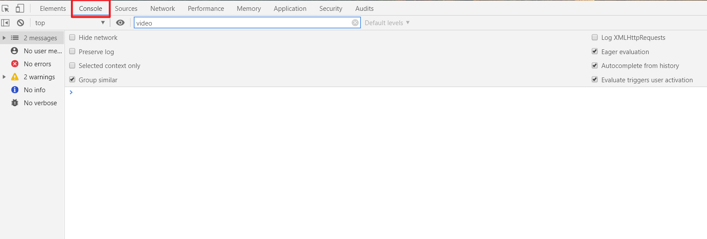

控制台 Console 可以当作**沙盒**用于测试 JavaScript 代码，类似于 IDLE 提供即时交互式的模式。

输入 JavaScript 代码并按 `Enter` 即时执行 ，浏览器控制台中调试代码[常用功能](https://wiki.jikexueyuan.com/project/chrome-devtools/using-the-console.html)

* 函数 `console.log()` 输出日志，用于向 JavaScript 控制台显示内容
    * 主要用于输出值到控制台，以提供有用的反馈（与函数的 `return` 返回语句不同分）
    * 默认返回值是 `undefined`
    * 需要同时输入多个参数以便依次执行，使用逗号 `,` 分隔

* 插入多行代码时按 `Shift+Enter` 进行换行

* 清空控制台多种方法
    * 输入函数 `clear()`
    * 点击左上角「禁止按钮」:no_entry_sign:
    * 快捷键 `Ctrl + L`
* 输入 `monitorEvents(elementToWatch)` 可以监控选中元素发生的事件
* 输入 `$0` 在控制台输出所有事件的日志

## 资源面板
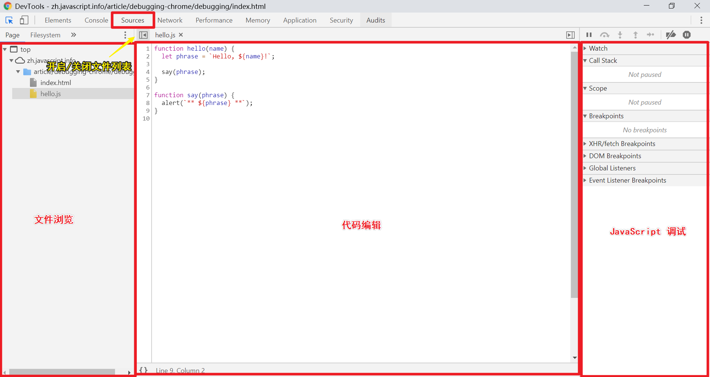

选择 `Sources` 资源面板，可以参看依附于该页面的文件，包括 HTML、JavaScript、CSS 和 图片等资源。

选中文件后，其源码会在中间显式。

右侧的 JavaScript 调试区域就是用来进行一步步地跟踪测试代码。

### 断点
断点 breakpoints 是调试器会**自动暂停** JavaScript 执行的地方。当代码被暂停时可以进行检查当前的变量，在控制台执行命令等操作，通过设置断点可以对代码进行调试。

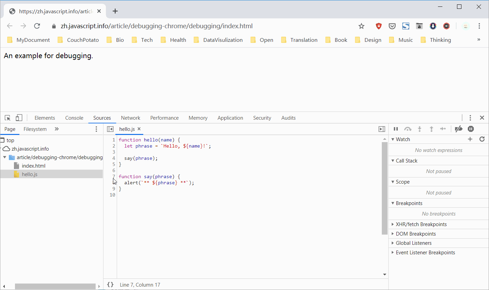

在代码编辑器页面打开脚本，点击脚本语句左侧相应的**行号**即可创建断点（蓝色箭头标注）。在右侧的 JavaScript 调试面板中有相断点列表，可以取消选中断点来临时禁用对应的断点，点击断点可以快速跳转至相应的源代码，也可以右键选择移除来删除断点。

:bulb: 当我们需要在特定的变量值或参数的情况下暂停程序执行时，可以设置条件断点 conditional breakpoint 当给定的表达式为真（即满足条件）时才会被触发。在行号上右键选择弹出菜单的 `add conditional breakpoint...` 创建一个条件断点。

:bulb: 可以通过 JavaScript 调用面板顶部的按钮 启用/禁用所有的断点 Deactivate breakpoints 批量操作，快捷键 `Ctrl + F8`。
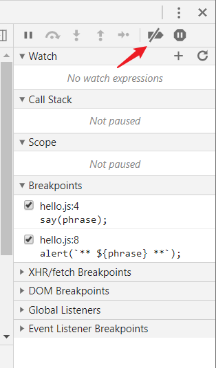

:bulb: 除了在开发者工具中手动给脚本设置断点外，还可以将「断点」预先编写进入源文件，在代码编辑器中为脚本源码添加语句 `debugger;` 浏览器的调试器会在该位置停止脚本的运行。

```js
function hello(name) {
  let phrase = `Hello, ${name}!`;

  debugger;  // <-- 调试器会在这停止

  say(phrase);
}
```

:bulb: **启动/禁用出现错误时自动暂停脚本 `Pause on exceptions`** 是另一种暂停脚本运行的方式，任何一个脚本的错误都会导致该脚本执行自动暂停，然后可以分析当前的变量来看一下什么出错了。
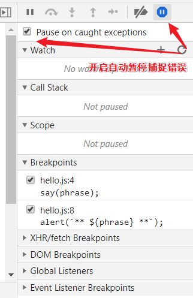

### 跟踪执行
设置好断点后就可以执行脚本以跟踪调试代码，根据相应的触发条件运行脚本，如重新加载页面。

在 JavaScript 调用面板会显式脚本运行过程中详细信息：

* **察看 watch** 显示任意表达式的当前值。可以点击加号 `+` 然后输入一个表达式。调试器将随时显示它的值，并在执行过程中自动重新计算该表达式。

* **调用栈 call stack** 显示嵌套的调用链，即不断进行的函数调用顺序。堆栈底部的函数是第一个运行的函数，它会调用堆栈上的第二个函数，以此类推。函数一直保留在堆栈上，直到前面的函数返回了。


* **作用域 Scope** 显示当前的变量。`Local` 显示当前函数中的局部变量，它们的代码会在代码编辑面板中高亮显示出来。`Global` 表示全局变量（不在任何函数中）。

当脚本遇到断点时会暂停，在 JavaScript 调试面板顶部会有不同操作按钮以不同的方式继续执行脚本：

* **恢复 Resume** 继续执行，快捷键为 `F8`。如果没有其他的断点，那么程序就会继续执行，并且调试器不会再控制程序。
* **下一步 Step** 运行下一条指令快捷键 `F9`。一次接一次地点击此按钮，整个脚本的所有语句会被逐个执行（如果下一步是调用函数，就会进入函数内部并在第一行暂停执行，且忽略异步方法）。
* **跨步 Step over** 运行下一条指令，快捷键 `F10`。运行下一条指令，但如果下一步是调用函数则直接执行完该函数后立即暂停，如果我们对该函数的内部执行不感兴趣，这命令会很有用。
* **步入 Step into** 和**下一步 Step** 类似，快捷键 `F11`。但在异步函数调用情况下表现不同，会进入到代码中并等待（如果需要）。
* **步出 Step out** 继续执行到当前函数的末尾，快捷键 `Shift+F11`。当偶然地进入到一个嵌套调用，但对这个函数不感兴趣时想尽可能的继续执行到最后。

## 模拟器
参考：
* [使用 Chrome DevTools 中的 Device Mode 模拟移动设备](https://developers.google.com/web/tools/chrome-devtools/device-mode/?utm_source=dcc&utm_medium=redirect&utm_campaign=2016q3)
* [使用**设备模式**模拟移动设备](http://www.css88.com/doc/chrome-devtools/device-mode/)

通过使用云模拟器如 [BrowserStack](http://www.browserstack.com/) 或 Chrome 的开发者工具中的 Device Mode 针对不同设备进行网页测试

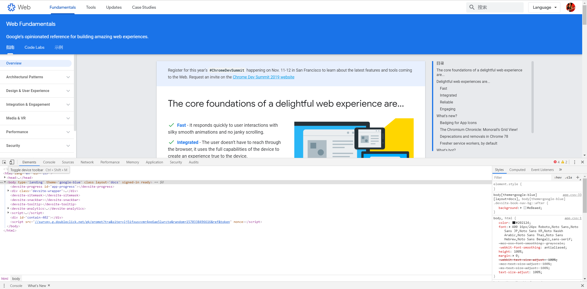

可选择多种预设的设备（尺寸）
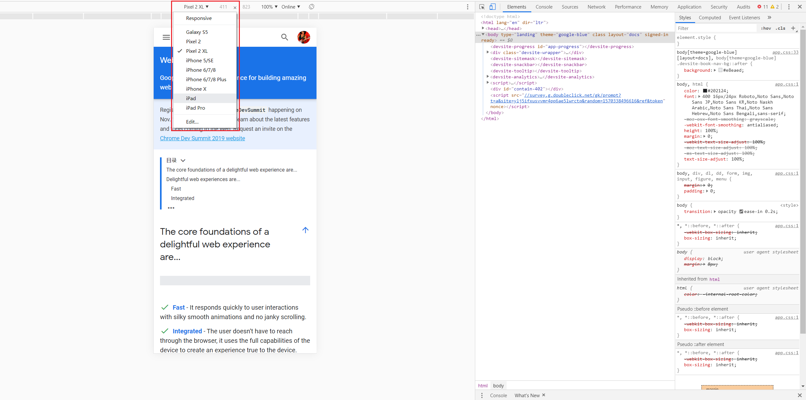

也可以定制化设备
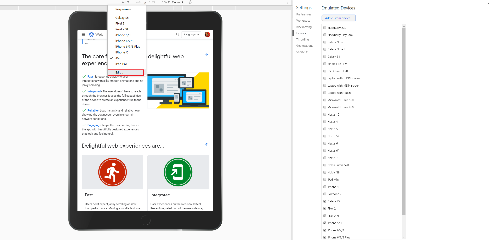


## Chrome 远程调试
在真实设备上测试十分重要，可利用 Chrome 对移动设备进行远程调试

### Android 设备远程调试
参考：[在装有 Chrome 的 Android 上远程调试](https://developers.google.cn/web/tools/chrome-devtools/remote-debugging/?hl=zh)

使用 Chrome 对 Android 进行远程调试，桌面端 [下载 Chrome Canary](https://www.google.com/chrome/browser/canary.html) （这是 Chrome 开发者版本，使用 Chrome 也同样可以）和移动端都需要安装有Chrome 浏览器。

1. 在 Android 设备上打开 USB 调试（以下步骤适用于 坚果 pro 系统为 `v6.7.1`）
    * `设置` -> `关于本机` -> 下拉到最后，不断点击 `软件版本`（约7次）至提示开启了 `开发者选项` Developer Option
    * `全局高级设置` -> `开发者选项` -> 打开 `USB 调试` Enable USB Debugging
2. 在桌面端 Chrome 开启 `Remote devices` 标签栏，并确保开启 `Discover USB devices`
    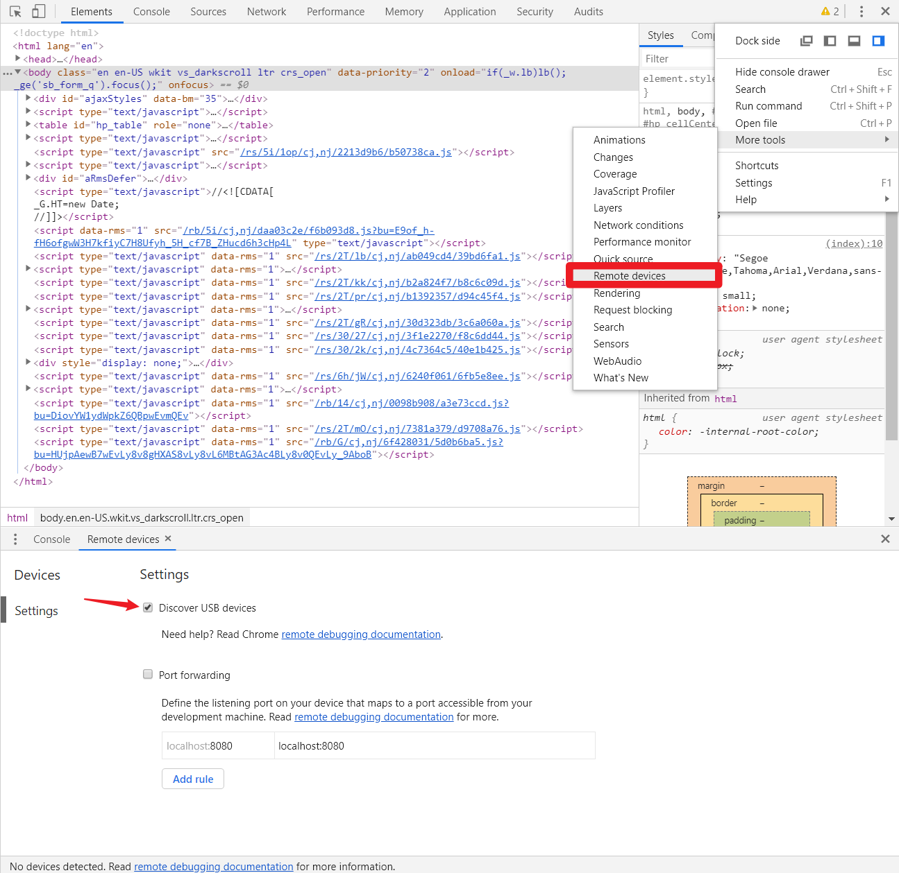
3. 使用 USB 电缆将 Android 设备直接连接到开发的计算机，并打开移动端 Chrome
    * 移动端可能会弹出提示，请信任计算机对其访问
    * 首次连接时，通常会看到 DevTools 检测到未知设备。 如果您 Android 设备的型号名称下显示**绿色圆点**和 Connected 文本，则表示 DevTools 已与您的设备成功建立连接。
4. 调试
    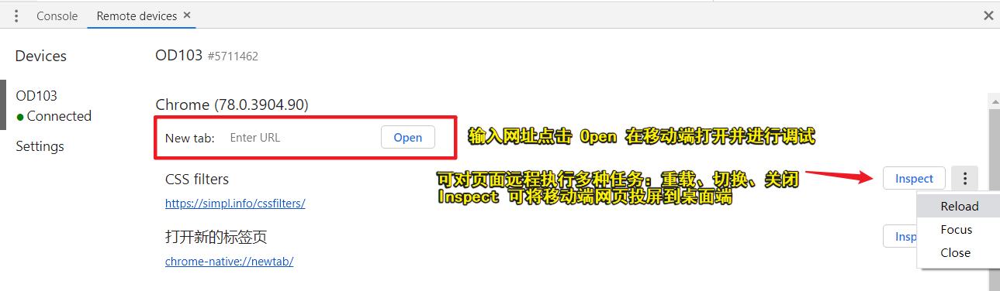

    也可以访问 `chrome://inspect/`进行远端调试，点击 `inspect fallback` 打开实时同步预览调试窗口
    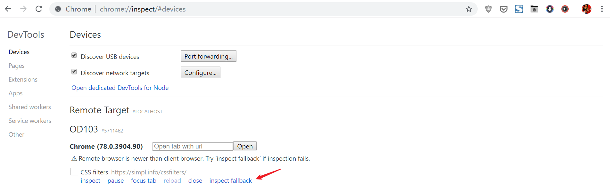
    在该页面上修改代码，可同时在移动端和桌面端预览窗口查看
    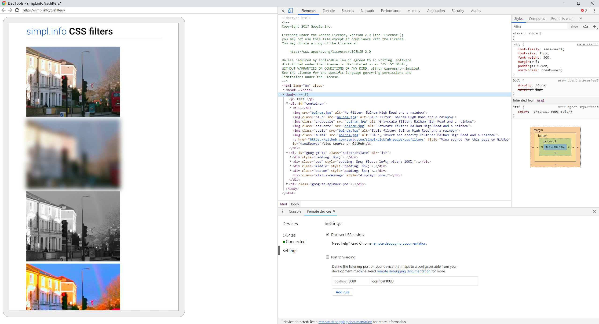
### iOS 设备远程调试
- [iOS WebKit 调试代理](https://github.com/google/ios-webkit-debug-proxy)(英)
- [Testing Mobile: Emulators, Simulators And Remote Debugging](https://www.smashingmagazine.com/2014/09/testing-mobile-emulators-simulators-remote-debugging/)(英)
- [如何用 Chrome DevTools 调试 iOS Safari](https://sebastianblade.com/debug-ios-safari-with-chrome-devtools/)
- [基于 iOS 设备的移动端前端开发调试 - 论坛](https://discussions.youdaxue.com/t/ios/37374)