# 文本编辑器
使用文本编辑器编写代码，可以借助文本编辑器内置/安装插件所提供的功能以提高开发效率。

## Visual Studio Code
内置 JavaScript、TypeScript和 Node.js 支持，而且拥有丰富的插件生态系统，可通过安装插件来支持C++、C#、Python、PHP等其他语言。

### 安装
访问 [VS code 官方网站](https://code.visualstudio.com/) 下载符合系统的安装包。Mac 下直接将文件拖到 应用程序 Applications 里就可以安装了，Windows 下双击 `.exe` 文件进行安装即可。

**Windows用户注意：**

> Windows 系统在安装 VS code 过程中会默认勾选 `添加到PATH （重启后生效）`，**请不要去除这个勾选**，该选项将 VS code 添加到 `PATH` 以便可以在命令行中启动 VS code 或者直接使用命令打开项目文件

安装完成之后我们双击图标打开 VS code。

**注意**：VS code 要求 .NET Framework 4.5 已经安装，如果你使用的是 Windows7 系统，请确保 .NET Framework 4.5 已经安装。如果没有安装的，可以点击 [此处下载](https://www.microsoft.com/zh-cn/download/details.aspx?id=30653)

### 启动
双击图标打开 VS code 或 在（Windows）终端使用 `code` 命令启动 VS code 界面

如果在之前的安装过程中没有去掉勾选的 `添加到PATH （重启后生效）`这个条件，这表示你在安装的时候已经将 VS code 添加到了 `%PATH%` 环境变量里面，此时你就可以在控制到任意路径下输入 `code` 来打开 VS code 或者编辑该文件夹下面的文件。

### 界面


- 编辑器 Editor：编辑代码文件的地方
- 侧边框 Side Bar：显示视图
- 视图栏 Activity Bar：位于最左边，可以让在不同视图之间切换
- 状态栏 Status Bar：显示打开的项目和编辑的文件的相关信息。
- 面板 Panel：用于调试，显示错误和警告或开启一个集成终端。

### 基本设置
Windows 用户可以点击 `文件` -> `首选项` -> `设置` 打开设置页面进行编辑器个性化的设置。有两种设置方式，一种是在 `用户`标签中进行全局配置；另一种是在 `工作区` 标签中进行局部配置（只适用于当前工作区）

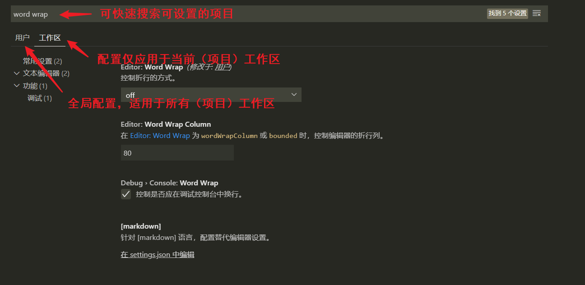

:bulb: 推荐安装[简体中文汉化插件](https://marketplace.visualstudio.com/items?itemName=MS-CEINTL.vscode-language-pack-zh-hans)，重启编辑器生效

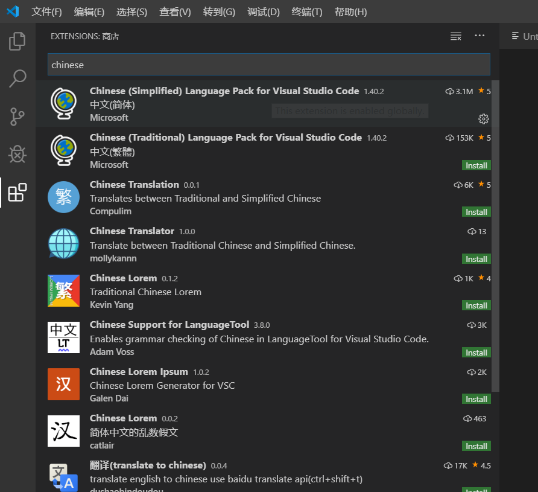

推荐设置

* 取消「软开启」 Soft Open
    「软开启」一般是指单击侧边框 Side Bar 资源管理器的文件只是临时打开文件，如果文件未编辑，再点击侧边框 Side Bar 资源管理器其他文件时，当前文件标签栏就会进行切换，如果希望文件依然保留在文件标签栏中，可以双击下方式打开侧边框 Side Bar 资源管理器的文件）
* 取消编辑器中的缩略图 minimap，让界面可以显示更多内容
* 使用字体 [FiraCode](https://github.com/tonsky/FiraCode)
    * 下载[安装](https://github.com/tonsky/FiraCode/wiki/Installing)
    * 配置 [VS Code](https://github.com/tonsky/FiraCode/wiki/VS-Code-Instructions)
* 开启自动重命名 `renameOnType` 功能，这样我们在修改 HTML 元素的开始标签时，编辑器自动帮我们同步修改结束标签
* 在 `keybindings.json` 文件中添加以下代码以在终端用相同的快捷键实现类似于编辑器中的操作，为了区分需要添加 `"when": "terminalFocus"` 限制这些操作只有在终端 pannel 激活时才触发。

```
// 📁 keybindings.json
// ...
    {
        "key": "ctrl+tab",
        "command": "workbench.action.terminal.focusNext",
        "when": "terminalFocus"
    },{
        "key": "ctrl+shift+tab",
        "command": "workbench.action.terminal.focusPrevious",
        "when": "terminalFocus"
    },{
        "key": "ctrl+n",
        "command": "workbench.action.terminal.new",
        "when": "terminalFocus"
    },{
        "key": "ctrl+w",
        "command": "workbench.action.terminal.kill",
        "when": "terminalFocus"
    }
```

:warning: 完成配置后应该使用 [Settings Sync 插件](https://marketplace.visualstudio.com/items?itemName=Shan.code-settings-sync) 将设置文件备份到 Github Gist 以备以后恢复使用。

### 推荐主题
在 [VS Code 插件市场](https://marketplace.visualstudio.com/VSCode) 查看各种主题

在 VS Code 中安装扩展：点击（工具栏）扩展按钮 -> 进入扩展页面，在左侧扩展面板中搜索需要的扩展点击安装

打开扩展栏快捷键：`Ctrl + Shift + X`

- [Panda Theme](https://marketplace.visualstudio.com/items?itemName=tinkertrain.theme-panda)
- [Enki Theme](https://marketplace.visualstudio.com/items?itemName=dorelljames.enki-theme-vscode)
- [Material Icon Theme](https://marketplace.visualstudio.com/items?itemName=PKief.material-icon-theme) 提供很漂亮的文件图标
- [Material Theme](https://marketplace.visualstudio.com/items?itemName=Equinusocio.vsc-material-theme)

### 推荐插件

- [Settings Sync](https://marketplace.visualstudio.com/items?itemName=Shan.code-settings-sync) 使用GitHub Gist 的备份 VS Code 的 Snippets、Theme、Icons、启动，快捷键设置、安装的插件（记录）等（支持多次不同版本的备份），这样在更换电脑或开发环境后，就可以通过该插件和 Github 账号快速恢复 VS Code 之前的定制化。
    - 上传备份快捷键：`Shift + Alt + U`
    - 下载/恢复备份快捷键：`Shift + Alt + D`

- [Chinese (Simplified) Language Pack for Visual Studio Code](https://marketplace.visualstudio.com/items?itemName=MS-CEINTL.vscode-language-pack-zh-hans) 软件汉化包
- [Bracket Pair Colorizer](https://marketplace.visualstudio.com/items?itemName=CoenraadS.bracket-pair-colorizer) 括号着色匹配
- [Code Spell Checker](https://marketplace.visualstudio.com/items?itemName=streetsidesoftware.code-spell-checker) 拼写检查
- [HTML Boilerplate](https://marketplace.visualstudio.com/items?itemName=sidthesloth.html5-boilerplate) 基本的 HTML5 模板代码片段生成器
- [JavaScript (ES6) code snippets](https://marketplace.visualstudio.com/items?itemName=xabikos.JavaScriptSnippets) 符合 ES6 标准的 JavaScript 代码片段生成器
- [ESLint](https://marketplace.visualstudio.com/items?itemName=dbaeumer.vscode-eslint) 检查 Javascript 代码规范性，并会提供实时反馈。
- [Beautify](https://marketplace.visualstudio.com/items?itemName=HookyQR.beautify) 优化多种语言的代码格式
- [EditorConfig for VS Code](https://marketplace.visualstudio.com/items?itemName=EditorConfig.EditorConfig) 配置和管理 VS Code 的设置，用于实现代码自动格式化。:bulb: 也可以使用 VS Code 内置格式化功能，格式化文档快捷键 `Shift + Alt + F`
- [Prettier - Code formatter](https://marketplace.visualstudio.com/items?itemName=esbenp.prettier-vscode) 一个功能更强大、更全面的代码自动格式化插件。
- [markdownlint](https://marketplace.visualstudio.com/items?itemName=DavidAnson.vscode-markdownlint) Markdown 文件格式整理与规范检查
- [Markdown All in One](https://marketplace.visualstudio.com/items?itemName=yzhang.markdown-all-in-one) 提供编写 Markdown 所需的全部功能，如键盘快捷键、更新 TOC、实时预览等

|              快捷键               |                  功能                   |
| ------------------------------------ | ----------------------------------------- |
| `Ctrl/Cmd + B`              | Toggle bold                         |
| `Ctrl/Cmd + I`              | Toggle italic                         |
| `Ctrl/Cmd + Shift + ]` | Toggle heading (uplevel)       |
| `Ctrl/Cmd + Shift + [` | Toggle heading (downlevel)  |
| `Ctrl/Cmd + M`              | Toggle math environment     |
| `Alt + C`                      | Check/Uncheck task list item |
| `Ctrl/Cmd + Shift + V` | Toggle preview                    |
| `Ctrl/Cmd + K V`           | Toggle preview to side          |

- [Auto Markdown TOC](https://marketplace.visualstudio.com/items?itemName=huntertran.auto-markdown-toc) 根据 Markdown 文档的标题结构自动生成目录 Table of contents，TOC
- [Image preview](https://marketplace.visualstudio.com/items?itemName=kisstkondoros.vscode-gutter-preview) 图像预览
- [open in browser](https://marketplace.visualstudio.com/items?itemName=techer.open-in-browser) 可以在 VS Code 中右键 HTML 文件选择在浏览器打开（浏览静态网页）。
- [Live Server](https://marketplace.visualstudio.com/items?itemName=ritwickdey.LiveServer) 启动本地服务器，使用快捷键 `Alt + L + Alt + O` 打开服务器；快捷键 `Alt + L + Alt + C` 关闭浏览器
- [Quokka.js](https://marketplace.visualstudio.com/items?itemName=WallabyJs.quokka-vscode) 通过该插件创建的 `.js` 在编辑器中可以实时预览运行结果，类似于将 Chrome 的 JavaScript 控制台整合到 VS Code 中，可以快速便捷地创建和测试原型代码

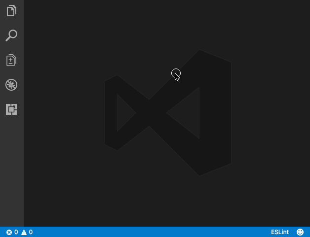

- [vscode-icons](https://marketplace.visualstudio.com/items?itemName=vscode-icons-team.vscode-icons) 修改文件和目录的默认图标，让侧边栏图标视觉更统一。
- [Better Comments](https://marketplace.visualstudio.com/items?itemName=aaron-bond.better-comments) 匹配注释关键字，为不同的注释内容添加颜色样式

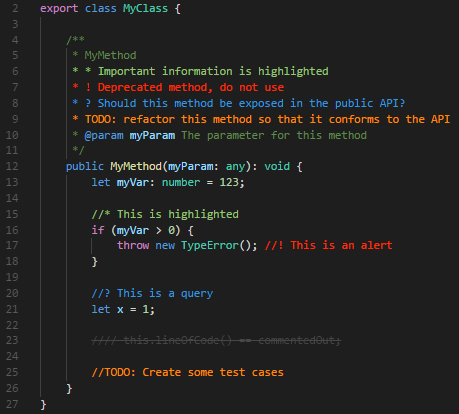

- [TODO Highlight](https://marketplace.visualstudio.com/items?itemName=wayou.vscode-todo-highlight) 为注释中的特定关键字，如 `TODO`、`FIXME` 等，提供高亮显示。
- [Polacode](https://marketplace.visualstudio.com/items?itemName=jeff-hykin.polacode-2019) 代码片段图片生成器
- [VS Color Picker](https://marketplace.visualstudio.com/items?itemName=lihui.vs-color-picker) 可以拾取屏幕色或在内置面板选择颜色的拾色器
- [Advanced New File](https://marketplace.visualstudio.com/items?itemName=dkundel.vscode-new-file) 更便捷地创建新文件，可以在创建时指定文件的路径和格式。:bulb: 可以将组合键 `Ctrl + N` 设置为启用该插件的快捷键
- [Auto Close Tag](https://marketplace.visualstudio.com/items?itemName=formulahendry.auto-close-tag) 可以自动补全结束标签，在使用 Vue 等框架时实例化组件会十分方便。
- [Search node_modules](https://marketplace.visualstudio.com/items?itemName=jasonnutter.search-node-modules) 快速查找 node modules 文件


- [Import Cost](https://marketplace.visualstudio.com/items?itemName=wix.vscode-import-cost) 即时反馈加载的外部文件大小，可以直观地了解加载内容对项目的性能的影响。
- [DotENV](https://marketplace.visualstudio.com/items?itemName=mikestead.dotenv) 为 `.env` 文件代码添加语法高亮。
- [IntelliSense for CSS class names in HTML](https://marketplace.visualstudio.com/items?itemName=Zignd.html-css-class-completion) 可以为 HTML 提供 CSS 框架定义的类属性的代码补全提示功能，如 Bootstrap 等框架一般在 HTML 标签中使用类属性来添加预设样式。
- [Bookmarks](https://marketplace.visualstudio.com/items?itemName=alefragnani.Bookmarks) 可以在文件中为代码（行）打标记，方便进行搜索跳转
- [Project Manager](https://marketplace.visualstudio.com/items?itemName=alefragnani.project-manager) 定制化侧边栏，支持远程开发，更高效地管理项目。
- [GitLens — Git supercharged](https://marketplace.visualstudio.com/items?itemName=eamodio.gitlens) 增强 VS Code内置的 Git 功能，一目了然地可视化 Git 存储库。
- [Live Share](https://marketplace.visualstudio.com/items?itemName=MS-vsliveshare.vsliveshare) 生成 URL 分享 VS Code 工作区，可以进行多人实时开发。

如果使用框架进行开发可以尝试以下插件

* [ES7 React/Redux/GraphQL/React-Native snippets](https://marketplace.visualstudio.com/items?itemName=dsznajder.es7-react-js-snippets) 提供 React 代码片段生成和语法高亮
* [Vetur](https://marketplace.visualstudio.com/items?itemName=octref.vetur) 提供 Vue 代码片段生成和语法高亮
* [Angular Snippets (Version 9)](https://marketplace.visualstudio.com/items?itemName=johnpapa.Angular2) 提供 Angular 代码片段生成和语法高亮

:bulb: 文本编辑器一个十分实用的功能是提供代码提示，可以提高编程效率和正确率，VSCode 内置支持 JavaScript、TypeScript、JSON、HTML、CSS、SCSS、Less 前端开发主流语言的代码提示，如果使用其他语言开发时可以安装相应语言的 [IntelliSense  扩展包](https://code.visualstudio.com/docs/editor/intellisense)。

### 文件操作

#### 新建文件
新建文件快捷键：`Ctrl + N`

:bulb: 可以点击侧边框 Side Bar 资源管理器中的图标来新建文件/文件夹，而且可以在输入文件名时使用 `path/subPath/fileName` 将新建文件放置在嵌套路径下

:bulb: 侧边框 Side Bar 资源管理器可以直接拖拽文件到文件夹中进行项目文件结构管理，也可以删除文件/文件夹

#### 打开文件
通过（菜单栏） `文件` -> `打开文件` 在弹出的资源管理中选择需要打开的文件，也可以使用打开文件快捷键：`Ctrl + O`

:bulb: 可以将文件拖拽到 VS Code 页面中打开

:bulb: 可以在系统的终端使用命令 `code [paths/files]` 打开（多个）给定路径下的指定文件

#### 编辑文件
VS code 没有特殊的命令或快捷键来进入「编辑模式」，将文件打开即可在编辑器中进行编辑。

#### 保存文件
通过（菜单栏）`文件` -> `保存` 或 `文件` -> `另存为` 保存当前文件，也可以使用保存文件快捷键：`Ctrl + S` 或  `Ctrl + Shift + S` 将文件另存为到另一个路径。

#### 保存工作区
通过（菜单栏）`文件` -> `将工作区另存为` 生成一个 `.code-workspace` 后缀的文件。

一个项目可能包含多个不同来源的文件夹，只需要保存当前工作区就可以用以保存当前项目中的信息，在下次打开时就会自动加载这些文件夹而不必再手动导入。

### 常用快捷键
:bulb: 推荐使用 VSCode 原生支持的 [Emmet 语法](./emmet.md)快速生成代码（一般用于编写 HTML 和 CSS 代码），可以极大地提高编程效率。

:bulb: 如果希望定制化快捷键可以在（菜单栏）`文件` -> `首选项` -> `键盘快捷方式` 中进行修改快捷键设置，也可以点击该页面右上角的按钮打开配置文件 `keybindings.json` 进行更详细的设置（如添加快捷键适用条件范围）。

在 `keybindings.json` 文件中添加以下代码以在终端用相同的快捷键实现类似于编辑器中的操作，为了区分需要添加 `"when": "terminalFocus"` 限制这些操作只有在终端 pannel 激活时才触发。

```
// 📁 keybindings.json
// ...
    {
        "key": "ctrl+tab",
        "command": "workbench.action.terminal.focusNext",
        "when": "terminalFocus"
    },{
        "key": "ctrl+shift+tab",
        "command": "workbench.action.terminal.focusPrevious",
        "when": "terminalFocus"
    },{
        "key": "ctrl+n",
        "command": "workbench.action.terminal.new",
        "when": "terminalFocus"
    },{
        "key": "ctrl+w",
        "command": "workbench.action.terminal.kill",
        "when": "terminalFocus"
    }
```

#### 命令面板
通过命令面板可以访问 VS code 所有的功能，如输入一个项目中的文件名，它将导航并且打开这个文件。命令面板还可以定位到具体的符号、显示并且运行命令和管理拓展等等，还包含快捷键的一些常见操作。

（Windows）调出命令面板快捷键：`Ctrl + P` 或 `F1`

* 输入文本搜索文件夹中的匹配文件，按 `Enter` 打开选中的文件
* 输入 `?` 查看可以用的命令列表
* 输入 `@` 可以导航到某个标志
* 输入 `:` 可以导航到某行

#### 窗口操作

* 编辑器窗口创建：`Ctrl` + 左键文件拖拽
* 文件切换：切换到下一个文件标签栏 `Ctrl + Tab`；切换到前一个文件标签栏 `Ctrl + Shift + Tab`
* 关闭当前文件标签栏 `Ctrl + W`
* 切换显示/隐藏侧栏：`Ctrl + B`
* 打开侧栏资源管理器：`Ctrl + Shift + E`
* 打开侧栏搜索器：`Ctrl + Shift + F`
* 打开侧栏源代码管理器：`Ctrl + Shift + G`
* 打开侧栏调试器：`Ctrl + Shift + D`
* 打开侧栏插件拓展器：`Ctrl + Shift + X`

#### 编辑文本

* 转到行首/行尾：`Home` / `End`
* 转到文件头/文件尾：`Ctrl + Home` / `Ctrl + End`

* 代码行缩进：`Ctrl + [` / `Ctrl + ]` 或 `Tab` / `Shift + Tab`
* 将当前该行上/下移动一行：`Alt + Up` / `Alt + Down`
* 向上复制当前该行：`Shift + Alt + Up`
* 向下复制当前该行：`Shift + Alt + Down`

* 基于单词跳转光标：`Ctrl + Left` / `Ctrl + Right`
* 跳转到匹配括号：`Ctrl + Shift + \`
* 多个光标：`Ctrl + Alt + Up` / `Ctrl + Alt + Down` 在上下行相应位置添加光标；按住 `Alt` 键用鼠标左键单击代码任意地方添加光标

* 选中当前光标所在单词： `Ctrl + D` :bulb: 可以连续点按该快捷键，依次选择页面中相同的单词。对于变量标识符可以使用快捷键 `F2` 重命名符号，这样当前页面中所有地方使用了该变量的都会同步更新重命名。
* 选中当前光标所在该行的前半部分：`Shift + Fn + Left`
* 选中当前光标所在该行的后半部分：`Shift + Fn + Right`
* 查找选中的单词：`Ctrl + F`
* 查找并替换选中的单词：`Ctrl + H`

* 复制当前该行：（未选中单词的情况下）`Ctrl + C`
* 剪切当前该行：（未选中单词的情况下）`Ctrl + X`
* 删除当前该行：`Ctrl + Shift + K`

* 撤销编辑：`Ctrl + Z`
* 重做编辑：`Ctrl + Y`

### 代码片段
参考：
* [Snippets in Visual Studio Code](https://code.visualstudio.com/docs/editor/userdefinedsnippets)
* [Code Faster With Custom VS Code Snippets](https://www.youtube.com/watch?v=JIqk9UxgKEc)


在开发过程中我们经常会重复适用一些结构，如循环结构、条件判断结构等，如果将这些结构的「通用」代码预先编写好，就可以通过输入简单的「别名」（一般是几个字符组成的关键字）即可取用这些框架代码，再在其基础上修改、添加具体参数，可以极大地提高编程效率。

VS Code 支持自定义代码片段，而且可以定义适用于全局的或局部（仅针对特定项目）的 Snippet。

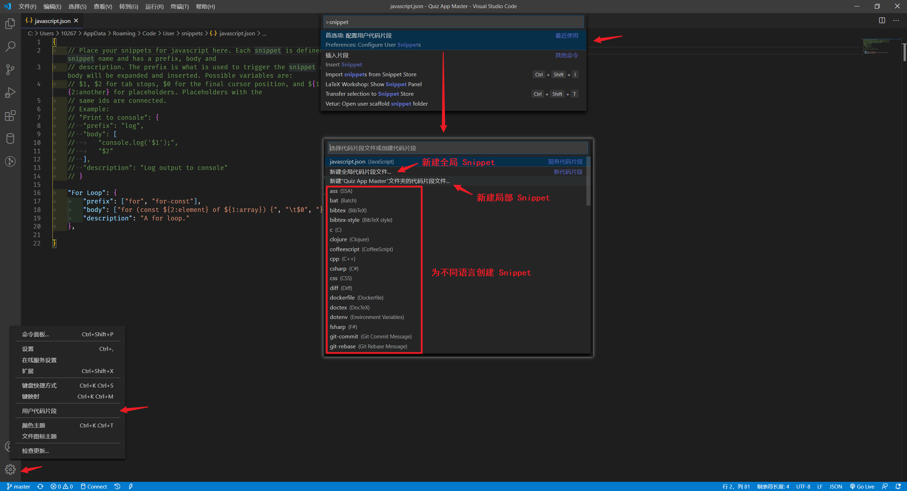

代码片段以 `.json` 文件格式存储，一般按照特定的编程语言创建不同的 JSON 文件

VS Code 代码片段基于特定的结构

* 每个代码片段都有一个名称
* `prefix` 字段是代码片段的别名，可以设置多个（以数组形式包括，每个别名用逗号 `,` 分隔），在编写代码时输入别名 VS Code 即可匹配相应的代码片段
* `body` 就是代码片段，可以设置多条语句，用数组包含多个元素，每一个元素对应一行。:bulb: 由于 JSON 都是由字符串构成，如果希望实现缩进等效果需要适用 HTML 实体字符 `\t`。
* `description` 代码片段的描述，在使用代码片段时 IntelliSense 显示的提示内容。

在 VS Code 代码片段中支持设置多个 Tabstops 标记，即按下 `Tab` 键后光标就会跳转到标记的位置，一般会在参数或变量处添加这些标记，这样开发者就可以直接按下 `Tab` 键跳转到指定位置对参数进行修改。使用符号 `$` 表示光标跳转的位置，其后的数字对应于是按下 `Tab` 键时光标的跳转顺序，即 `$2` 表示按下两次 `Tab` 键时跳转到该位置；`$0` 表示通过按下 `Tab` 键光标跳转最后的定位。

:bulb: 可以为 Tabstops 设置占位符 placeholders 作为参数的默认值 `${1: foo}`（如果希望设置多个默认值以供开发者选则，可以将多个值以逗号分隔放在管道符号中 `${1|one,two,three|}`，同一等级的多个 Tabstops 在按下 `Tab` 时会同时选中（多个光标），方便对同一参数进行统一编辑。

```json
// 📁 Code/User/snippets/javascript.json
// 为 JavaScript 语言创建代码片段
{
  "For Loop": {
    "prefix": ["for", "for-const"],
    "body": [
        "for (const ${2:element} of ${1:array}) {",
        "\t$0",
        "}"
    ],
    "description": "A for loop."
  }
}
```

:bulb: 推荐使用 [snippet generator](https://snippet-generator.app/) 创建 Snippet，代码片段时可以用直观的方式编写， 在线工具会在 `body` 生成相应的缩进格式。

### 版本控制
VS Code 原生支持版本控制（本地需要安装 Git 套件），而且支持连接远程仓库。

VS Code 源代码管理器提供图形交互界面极大地方便了版本控制。

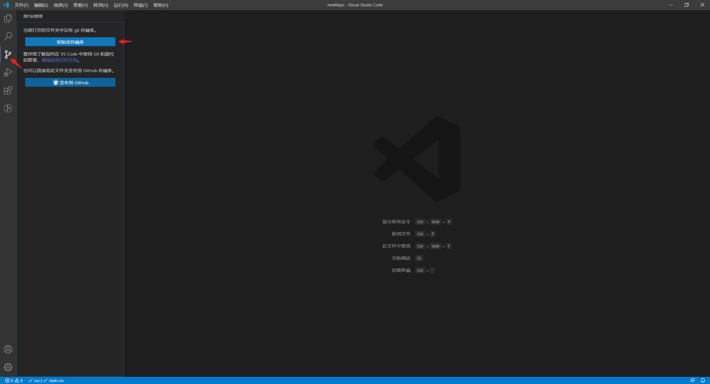

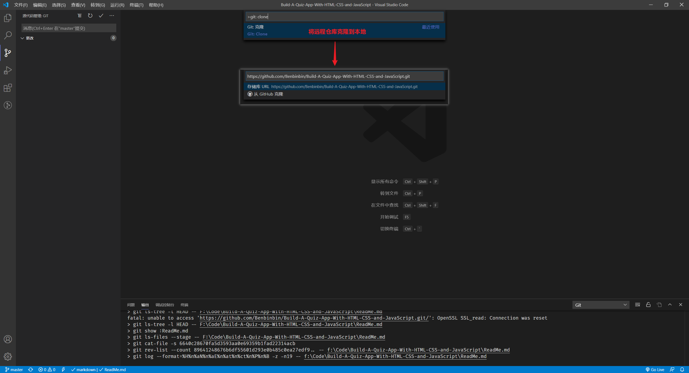

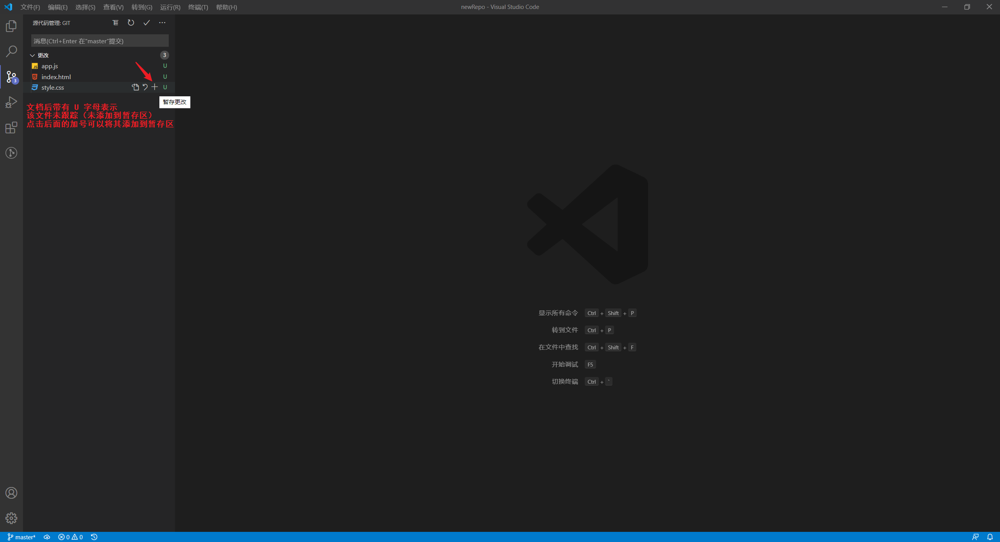

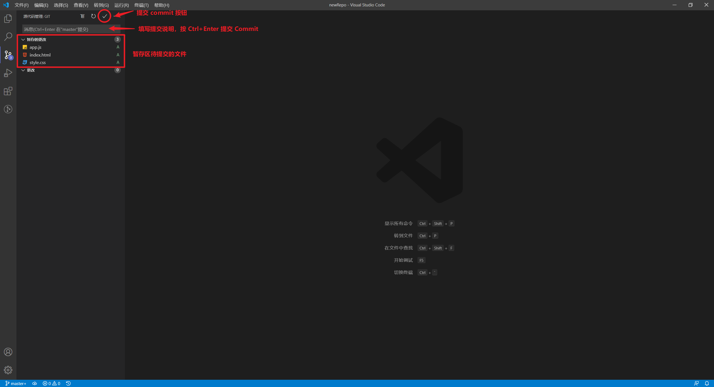
:bulb: 输入提交说明消息后可以按快捷键 `Ctrl + Enter` 提交

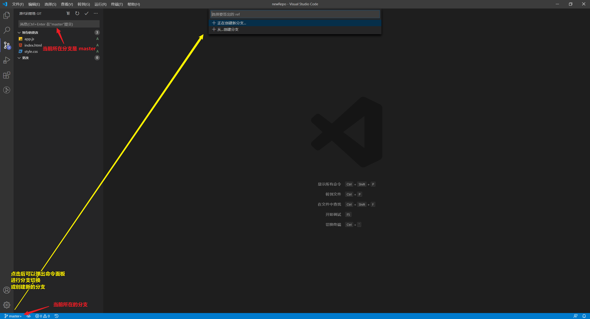

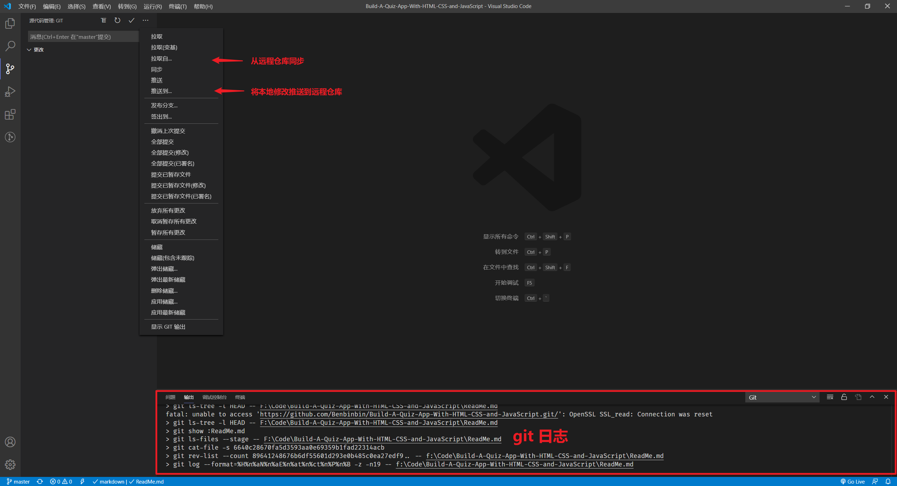

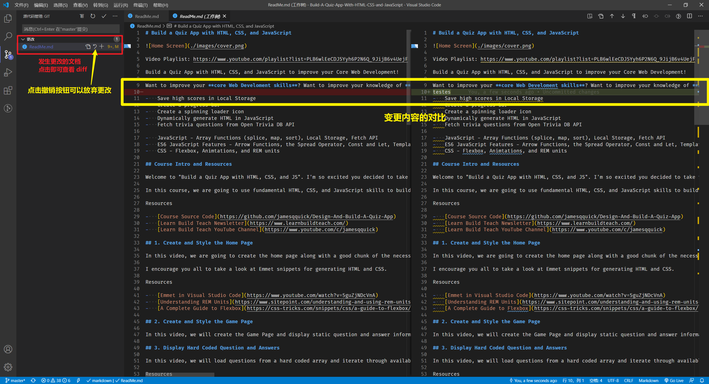

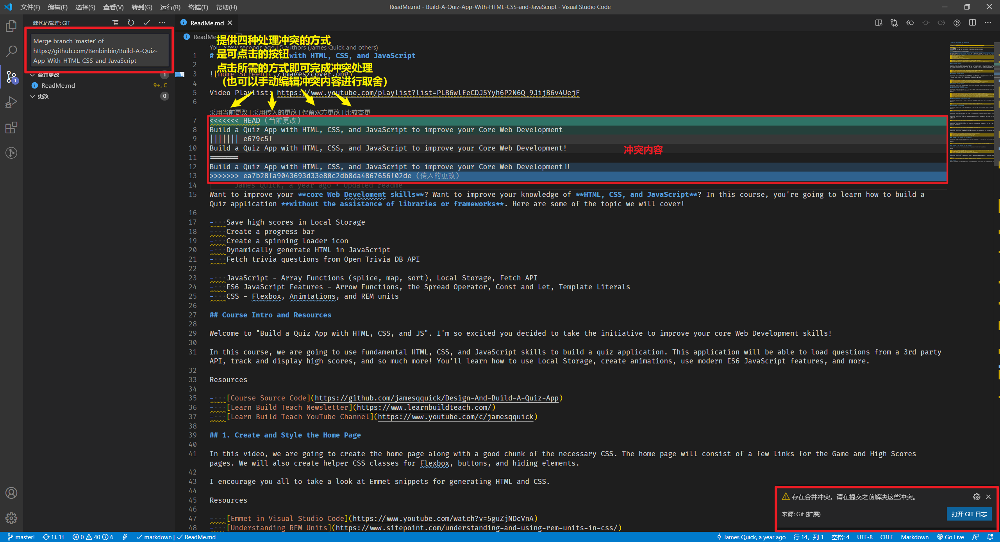


:bulb: 推荐使用插件 GitLens 以增强 VS Code 内置的 Git 功能。
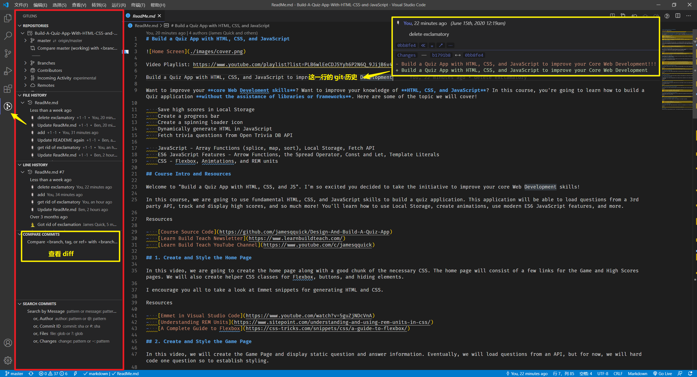

### 调试
VS Code 提供了调试工具，安装相应的浏览器调试插件，如 [Debugger for Chrome](https://marketplace.visualstudio.com/items?itemName=msjsdiag.debugger-for-chrome) 和本地服务器插件，如 [Live Server](https://marketplace.visualstudio.com/items?itemName=ritwickdey.LiveServer) 即可使用，相当于将 Chrome 的调试控制台集成到编辑器中。

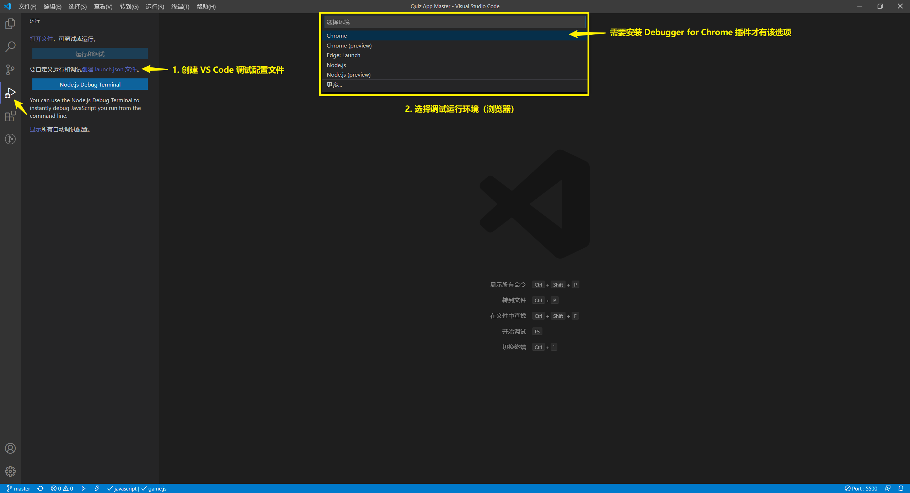

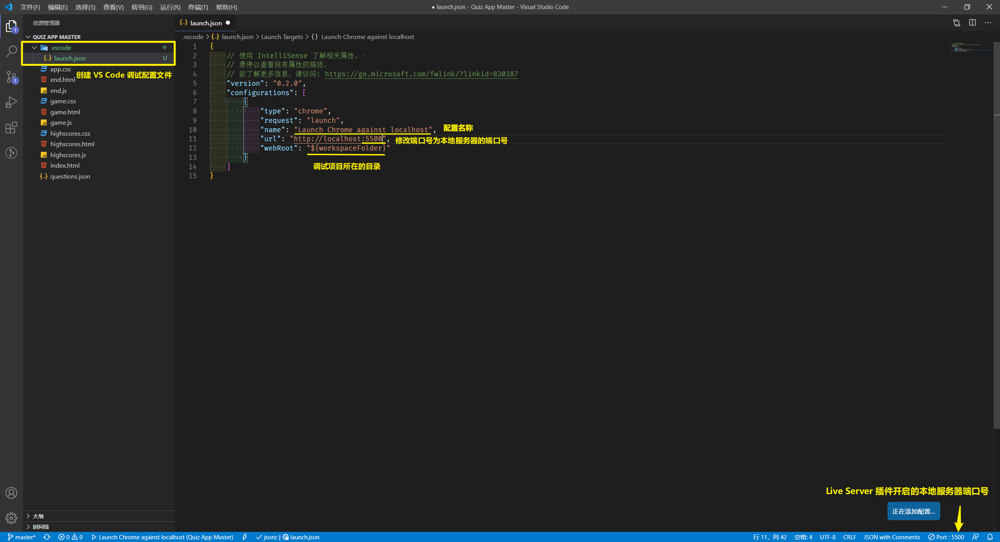

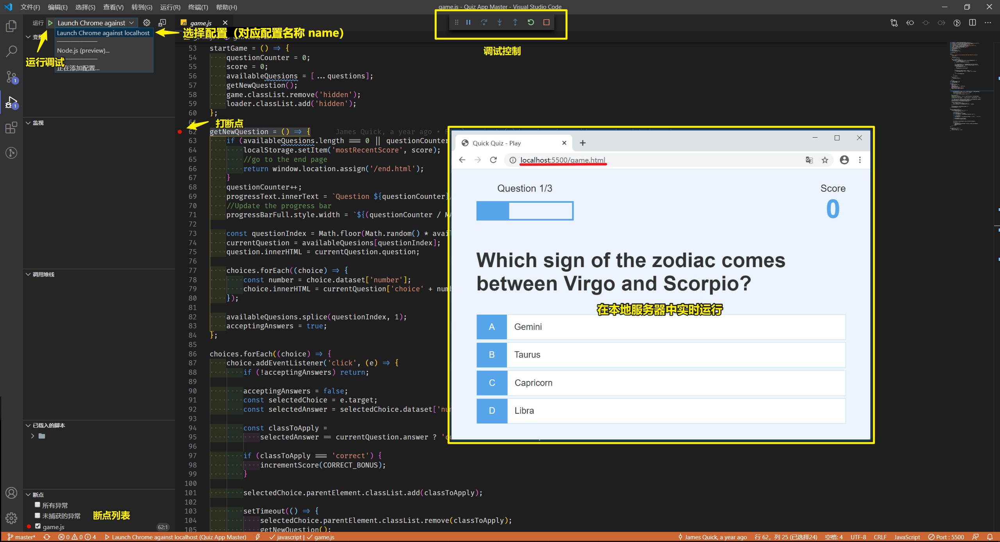

:bulb: 具体调试方法参考 [开发调试](./开发调试.md)

:bulb: 如果项目使用了框架可以查看相应的开发文档，如 Vue Cookbook 提供了[相关的说明](https://cn.vuejs.org/v2/cookbook/debugging-in-vscode.html)，并安装额外的套件。
