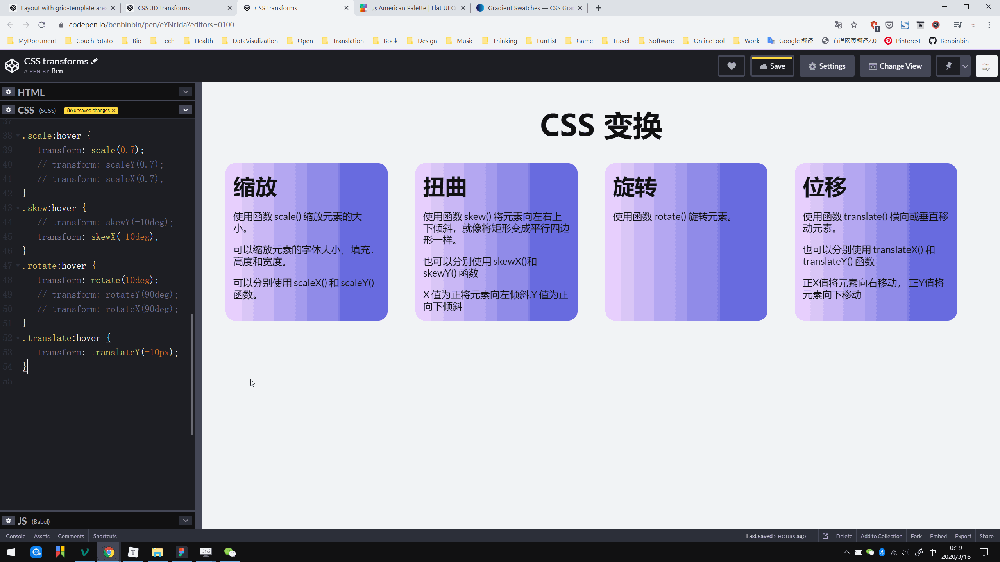
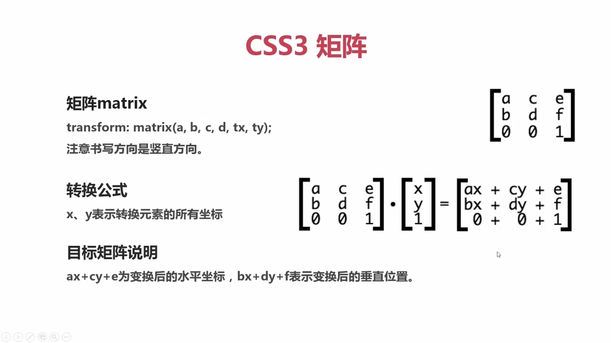
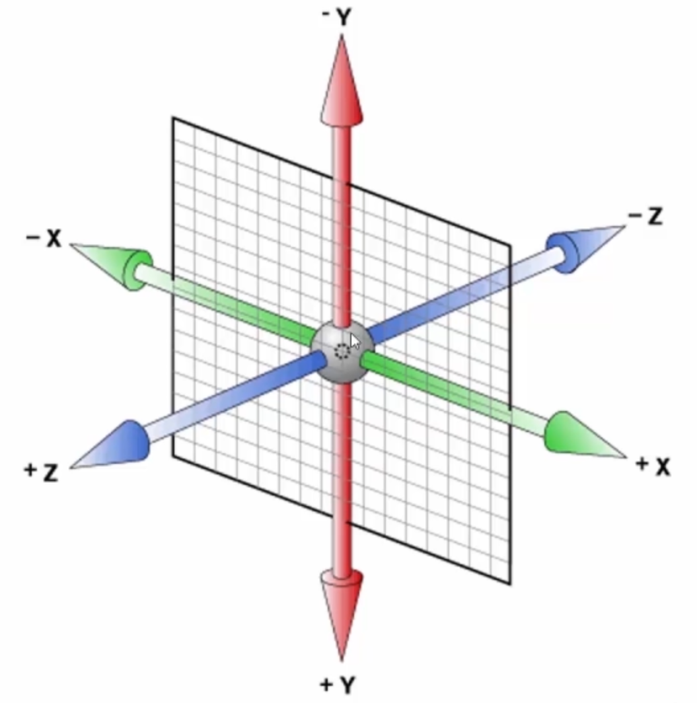
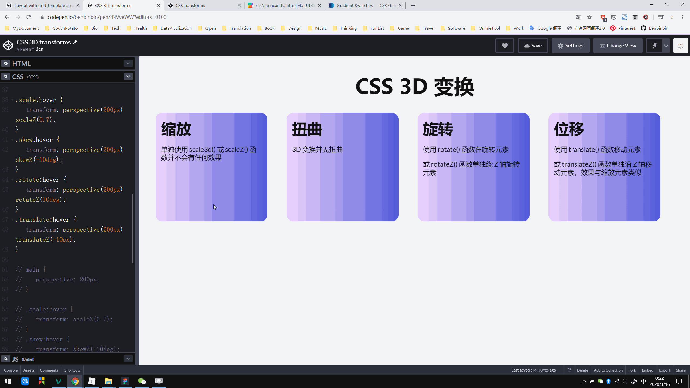
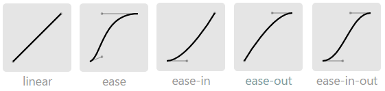
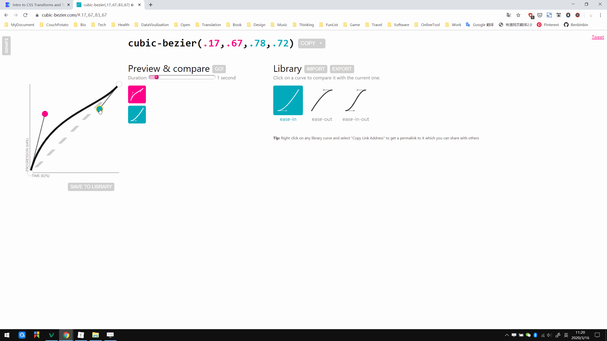
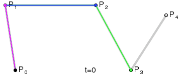
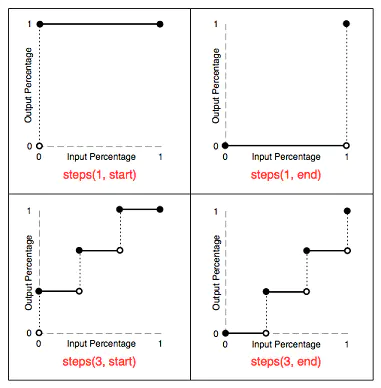

# CSS 动画
人的大脑对对于动态的物体本能地更关注，因此为网页添加合适的动画可以更引人入胜，如 Google 制作的节约能源主题网站 [Your Plan, Your Planet](https://yourplanyourplanet.sustainability.google/) 使用了大量有趣的动画引导用户进行交互探索。

CSS 动画主要使用三个属性：

* **变换  `transform`**：对元素进行变换，包括倾斜 `skew`，旋转 `rotate`，平移 `translate` 和缩放 `scale`
* **过渡 `trasition`**：设置属性变化的过渡方式，让变换形成流畅的动画
* **关键帧 `keyframe`**：设置一系列关键帧并连成动画

## 变换 transform
参考：
* [CSS3 transform介绍](https://www.jianshu.com/p/17e289fcf467)
* [CSS3属性transform详解之（旋转:rotate,缩放:scale,倾斜:skew,移动:translate） - 前端 - 掘金](https://juejin.im/entry/5cf47d2ef265da1b855c3f6e)
* [transform](https://css-tricks.com/almanac/properties/t/transform/) | CSS-Tricks

通过设置的 CSS 属性 `transform` 可对元素进行变换，本质上是一系列变换函数对元素的坐标轴进行改变，即其属性值可以使用一些列函数：

* 位移 `translate()`
* 缩放 `scale()`
* 旋转 `rotate()`
* 扭曲 `skew()`
* 矩阵 `matrix()`



:point_right: [在线演示](https://codepen.io/benbinbin/pen/eYNrJda)

:bulb: 属性 `transform` 可以同时接受多个属性值，因此可以将多种变换（函数）同时添加到元素中。

### 移动 translate
函数 `translate(n)` （默认）横向移动元素，效果类似于 `position:relative` 属性，基于其原来在文档流定位进行偏移。也可以传递两个值分别在水平和垂直方向上移动元素。只传递一个参数时元素只在水平方向上进行移动。

正 X 值将元素向右移动，而负 X 向左移动元素。正 Y 值向下移动元素，负 Y 值向上移动。

:bulb: 可以使用百分比作为参数，基于元素自身的尺寸进行相应比例的偏移。

:bulb: 可以使用函数 `translateX()` 和 `translateY()` 分别设置在元素在水平轴和垂直轴的移动。

### 缩放 scale
函数 `scale(n)` 可以让元素按比例缩放元素大小，也可以传递两个值以分别设置 X 轴和 Y 轴的缩放比例。适用于调整缩放元素的 `font-size`，`padding`，`height`，和 `width` 等。传递一个值默认在两个方向上进行相同比例的缩放（可以元素原来的比例）。

缩放比例 `n` 默认值为 1，要缩小元素将 `n` 设置为 0.01～0.99 之间的值，要放大元素 `n` 取值超过 1 即可。

:bulb: 可以使用函数 `scaleX()` 和 `scaleY()` 分别设置在水平轴和垂直轴的缩放比例

### 旋转 rotate
函数 `rotate(n)` 可以让元素绕（默认）中心旋转。

当角度 `n` 为正数元素则顺时针旋转，为负数则逆时针旋转。其中单位可以是 `deg`、

### 扭曲 skew
函数 `skew(n)` 将元素（默认）沿水平轴倾斜指定角度，单位为 `deg`，如将矩形倾斜扭曲为平行四边形，可以传递两个值分别设置元素沿水平轴或垂直轴倾斜的角度。只传递一个参数时元素只在水平方向上进行倾斜。

正 X 值元素向左倾斜 ，而负 X 值向右倾斜。正的 Y 值向下倾斜元素，负 Y 值倾斜向上。可以使用函数 `skewX(n)` 和 `skewY(n)` 分别设置水平和垂直方向上的倾斜。

### 矩阵 matrix
函数 `matrix()` 但能将所有转换合并为一个，通过矩阵计算求出坐标以实现元素的变换，但比较难理解所以不常用。

* 2D 变换矩阵为 3*3
* 3D 变换矩阵为 4*4



* `matrix(sx, 0, 0, sy, 0, 0)` 等价于 `scale(sx, sy)`
* `matrix(cosθ， sinθ, -sinθ, cosθ, 0, 0)` 等价于 `rotate(θdeg)`
* `matrix(1, tanθy, tanθx, 1, 0, 0)` 等价于 `skew(θdeg, θdeg)`

:bulb: 矩阵可以方便地实现镜像对象效果。

### 变换中心点
变换的基准点默认为元素的中心，可以设置元素 [CSS 属性 `transform-origin`](https://developer.mozilla.org/zh-CN/docs/Web/CSS/transform-origin)  修改基准点，如 `transform-origin: 10px 10px` 表示相对左上角原点向右向下分别移动 `10px` 作为基准点。

:bulb: 属性 `transform-origin` 可以传递一个，两个或三个值来分别制定变换中心点在 XYZ 三个轴上的偏移量（Z 轴的设置只有在 3D 变换才起作用）。

:bulb: 属性值可以使用绝对单位的数值；或相对单位的数值（如百分比）；也可以使用更直观的关键字，第一个参数可以指定为 `left`、`center`、`right`，第二个参数可以指定为 `top`、`center`、`bottom`

### 三维变换
在 CSS3 中还加上了 3D 效果，即变换还可以在 Z 轴上进行（正方向是朝向浏览者）。



:warning: 先需要设置元素的 CSS **属性 `transform: perspective(n)`** 以定义透视图的景深，**单位为 `px`**，相当于创建一个 在 Z 轴上与屏幕相距  `n` 的 3D 舞台，然后变换就会基于这个视距进行。

:bulb: 也可以在父元素（容器）中设置**属性 `perspective`** 为子元素设置一个相同的景深。



:point_right: [在线演示](https://codepen.io/benbinbin/pen/rNVveWW)

3D 变形可使用类似的函数：

- `translate3d()` 移动元素，可以传递三个值分别设置元素分别在三个轴的位移，也可以使用函数 `translateZ()` 单独设置元素在 Z 轴的移动，正 Z 值表示元素移近浏览者，因此元素增大。**一般用于实现遮罩动效**。
- `scale3d()` 缩放元素，可以传递三个参数，也可以使用函数 `scaleZ()` 单独设置 Z 轴的缩放。:warning: 单独使用 `scale3d` 或 `scaleZ` 不会有任何效果，需要配合其他属性在 3D 舞台上才能出现效果，否则 Z 轴的缩放比例根本无法定义。
- `rotate3d()` 旋转元素，甚至可以接受四个值 `rotate3d(x, y, z, α)` 其中 alpha 表示3D舞台上旋转的角度，前面三个值范围是 -1~1 表示旋转程度（百分比），即旋转角度为 `x`、`y`、`z` 分别与 `α` 的乘积，负数表示逆时针旋转
- `matrix3d()`

:warning: 3D 变换并无扭曲 skew 变换

## 过渡 trasition
参考：

* [CSS3 transition介绍](https://www.jianshu.com/p/56f8ddafc63f)
* [A Look Into: Cubic-bezier in CSS3 Transition](https://www.hongkiat.com/blog/css-cubic-bezier/)

使用 CSS 属性 `transition` 为元素的变换设置一种平滑过渡的动画，本质上是在线性时间内将属性从开始值过渡到结束值。

属性 `transition` 是一个简写属性，最多可设置四个与转换相关子属性的属性值：

- `transition-property` 指定需要过渡的 CSS 属性
- `transition-duration` 过渡需要的时间
- `transition-timing-function` 过渡函数
- `transition-delay` 延迟开始过渡的时间

:warning: 使用 `transition` 简写属性同时多个动画参数时，如果需要同时设置动画持续时间和动画延迟时间需要注意其顺序，编译器会把第一个时间设置解析为动画持续时间，而第二个时间设置解析为动画滞后时间

### 指定过渡属性
属性 `trasition-property` 需要过渡的 CSS 属性。并不是所有属性的变化都能实现平滑过渡，**通常只要能设数字（包括百分比）的属性都能过渡**，如颜色、宽高、渐变等，还有 0/1 类型的属性，如 `visibility`。

当然元素一般会指定其变换 `transform` 为监控/应用过渡的属性，以实现动效变换视觉效果。

:bulb: 可以使用关键字 `all` 将该元素的所有改变的属性进行过渡。

:bulb: 在元素设置的过渡，可以监控并将过渡应用于元素伪类，如 `:hover`，设置作出的变换。

### 指定过渡时间
属性 `transition-duration`设置过渡需要持续的时间，单位可指定s秒，也可指定ms毫秒。默认值是0，表示立刻变化。

如果设置了多个过渡属性，但每个属性的过渡时间都一样，可以只有设一个即可，该值会应用到所有过渡属性上。

### 指定过渡函数
属性 `trasition-timming-function` 设置过渡方式（函数）。过渡函数即设置过渡的速度节奏，可以通过预设关键字进行设置：

* `linear` 匀速过渡，等同于贝塞尔曲线 `cubic-bezier(0, 0, 1, 1)`
* `ease` 先快再慢的节奏（默认值），等同于贝塞尔曲线 `cubic-bezier(0.25, 0.1, 0.25, 1)`
* `ease-in` 加速冲刺的节奏，等同于贝塞尔曲线 `cubic-bezier(0.42, 0, 1, 1)`
* `ease-out` 减速到停止的节奏，等同于贝塞尔曲线 `cubic-bezier(0, 0, 0.58, 1)`
* `ease-in-out` 先加速后减速的节奏（相对而言动效最平滑），等同于贝塞尔曲线 `cubic-bezier(0.42, 0, 0.58, 1)`

这些预设的过渡模式对应一条贝塞尔曲线，可视化曲线横坐标表示时间，纵坐标表示距离，其斜率就是变化的速度。



可以借助[在线可视化工具](https://cubic-bezier.com/)自定义贝塞尔曲线并生成相应的 `cubic-bezier(n,n,n,n)` 函数。



> *贝塞尔曲线是计算机图形学中常用的曲线模型。使用矢量图形编辑器，如 Adobe Illustrato r或Inkscape 的钢笔工具可绘制出这类曲线。*
>
> *该曲线由四个点组成，左下为起始点 P0 坐标固定为 (0,0)，右上为终点 P3 坐标固定为 (1,1)，中间有两点 P1 和 P2 的坐标就是 `cubic-bezier(n,n,n,n)`的参数。*
>
> *基于特定的规则通过将 4 条连起来的直线生成平滑的曲线。*
>
> *参考：*
>
> * *[CSS3 transition介绍](https://www.jianshu.com/p/56f8ddafc63f)*
> * *[A Look Into: Cubic-bezier in CSS3 Transition](https://www.hongkiat.com/blog/css-cubic-bezier/)*



:bulb: 过渡函数除了使用贝塞尔曲线，还可以使用函数 `steps(n, end)` 相当于将过渡过程从头至尾分成 `n` 步，并非像贝塞尔曲线那样平滑过渡，在每一步瞬间完成过渡。函数有两个参数，第一个参数是分割的数量，第二个可选参数是关键字 `start` 或 `end`（默认值），指定过渡结束后停留的状态，`start` 表示停留在开始状态，`end` 表示停留在结束状态。此外还可以使用 `step-start(n)` 或 `step-end(n)` 表示。



### 延迟过渡的开始
属性 `transition-delay` 设置需要延迟过渡开始的时间。默认值是0，表示不延迟，立即开始过渡动作。单位是s秒或ms毫秒。

## 关键帧动画
参考：

* [CSS3 animation介绍 - 简书](https://www.jianshu.com/p/ed11f8c26992)
* [CSS Animation for Beginners](https://thoughtbot.com/blog/css-animation-for-beginners)
* [Keyframe Animation Syntax](https://css-tricks.com/snippets/css/keyframe-animation-syntax/)

关键帧动画与相当于传统动画制作一样，使用关键字 `@Keyframes` 设置不同阶段下属性的不同样式，每一种样式状态成为动画相应阶段的关键帧；使用元素的 CSS 属性 `animation` 绑定预设的关键字 `@keyframes` 并定义这些关键帧切换过渡的方式以实现更丰富的动画效果。

### 关键帧
使用 `@keyframes` 选择器创建动画帧，其后添加动画名称。不同阶段使用百分比表示，也可以使用关键字 `from` 和 `to` 分别表示特定的 `0%` 和 `100%` 阶段，而不同阶段的属性样式则在 `{}` 内进行设置。

```css
@keyframes animationName {
    keyframes-stage1 {
        //css-styles
    }
    keyframes-stage2 {
        //css-styles
    }
    ...
}
```

### 动画
属性 `animation` 是一个简写形式，分别可以设置多种子属性值：

* `animation-name` 设置需要绑定的动画名称（指定 `@keyframes` 的名字），可以指定多个属性值（以逗号 `,` 分隔）

* `animation-duration` 动画持续时间，默认是 0 表示无动画，单位可以设 s 秒或 ms 毫秒

* `animation-timing-function` 关键帧的过渡方式，可以使用关键字 `linear`、`ease`、`ease-in`、`ease-out`、`ease-in-out` 或使用定制的贝塞尔曲线函数 `cubic-bezier(n, n, n, n)`。也支持函数 `steps()` 当不常用。

* `animation-delay` 动画延迟开始的时间，默认值是 0，表示不延迟，立即播放动画。单位是 s 秒或 ms 毫秒。如果是负数，动画会立即执行，并**跳过**相应的动效时间。

* `animation-iteration-count` 动画循环次数，默认值为 1，即放完一遍后不循环播放。设为关键字 `infinite` 表示无限循环播放。

* `animation-direction` 动画播放的方向，可设 `normal`（默认值，正常播放），`reverse` 反方向、`alternate` 交替正反向、`alternate-reverse`。`alternate` 配合多次或循环播放使用，轮转正反向播放动画，即动画会在第奇数次 1，3，5… 正向播放，而在偶数次 2，4，6… 反向播放。`alternate-reverse` 则正好反过来，奇数次反向播动画，偶数次正向播动画。替换 `alternate` 轮转播放「倒回去」循环不断可以实现闪烁效果。

* `animation-play-state` 动画的状态，可设 `running`（默认值） 或 `paused`（表示暂停动画）。通常可以结合 JavaScript 修改该属性 `object.style.animationPlayState=”paused”` 来暂停动画。

* `animation-fill-mode` 动画停止时的状态（动画完成或延迟未开始播放时），可设置多种属性值
  * `none` 默认值，动画播完后恢复到 `0%` 阶段的初始状态
  * `forwards` 当动画播完后，保持 `@keyframes` 里最后一帧的样式状态
  * `backwards` 在开始播动画前，将 `@keyframes` 里第一帧的属性设置应用于元素中（看出效果需要结合 `animation-delay` 使用）
  * `both` 同时应用 `forwards` 和 `backforwards` 设置


:point_right: [在线演示](https://codepen.io/benbinbin/pen/NWqMjoG)

:bulb: 使用简写属性 `animation` 可以方便地一次性设置以上各种参数。

:warning: 使用 `animation` 简写属性同时多个动画参数时，如果需要同时设置动画持续时间和动画延迟时间需要注意其顺序，编译器会把第一个时间设置解析为动画持续时间，而第二个时间设置解析为动画滞后时间

:thumbsup: 更多的有趣动画设计可以参考 [Dan Eden](https://github.com/daneden) 的 [animate.css](https://github.com/daneden/animate.css) 动画库

## 浏览器优化
属性 `will-change` 可以提前通知浏览器，该元素即将进行什么类型的动画，让浏览器提前进行合适的优化设置（如调用 GPU 进行 3D 动画渲染）。多种属性值可选：

* `auto` 没有指定特定的动画类型，适用于通常所作的任何启发式和优化
* `scroll-position` 表示将要改变元素的滚动位置（如滚屏操作）
* `contents` 表示将要改变元素的内容
* `<custom-ident>` 明确指定将要改变的属性和给定的名称，如 `will-change: transform` 表示元素将进行变换（推荐）
* `<animateable-feature>` 可动画的一些特征值，如 `left`、`top`、`margin` 等

:warning: 不能滥用 `will-change` 否则可能引起页面崩溃；应该利用 JavaScript 设置该属性，在不需要时将其  `remove` 移除。