---
tags:
  - css
---

# 常用样式
参考：
* [CSS 参考](https://developer.mozilla.org/zh-CN/docs/Web/CSS/Reference)
* [CSS 关键字索引](https://developer.mozilla.org/zh-CN/docs/Web/CSS/Reference#关键字索引)
* [CSS-TRICKS](https://css-tricks.com/almanac/)

## 通配符
通配符可匹配特定类型的元素，如关键字符`*`，适配**所有元素**

```css
/* 使用通配符 * 匹配各元素，将所有内边距和外边都设置为 0，一般写在样式表开头，以重置所有默认样式 */
* {
    margin:0;
    padding:0;
}
```

## 简写属性
参考：[CSS 简写属性 (CSS Shorthand Properties)](https://developer.mozilla.org/zh-CN/docs/Web/CSS/Shorthand_properties)

简写属性是把关于同一主题的常见属性的定义集中在一起，同时设置多个 CSS 属性值，编写更简洁、更具可读性的样式表。如 `background` 是简写属性，可以定义相应属性 `background-color`、`background-image`、`background-repeat` 和 `background-position` 的值。类似还有字体 `font`、盒子 `box`、各方向的外边距 `margin` 和 `padding` 等。

当简写属性替代属性的值是**不同类型**的值时，对其顺序无强制性要求；若设置的属性值为相同类型值的时候，如 `margin` 和 `padding` 等，遵循 **1-4 值** 的语法

|                                 图示                                  |                            方法                            |                                                                                                   备注                                                                                                    |
| ---------------------------------------------------------------------- | ----------------------------------------------------------- | ---------------------------------------------------------------------------------------------------------------------------------------------------------------------------------------------------------- |
| 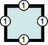	 | 1个值的语法：`border-width: 1em`                  | 设置所有边框宽度                                                                                                                                                                                       |
| 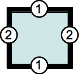      | 	2个值的语法：`border-width: 1em 2em`        | 第一个值设置垂直方向 `top` 和 `bottom` 边框宽度；第二个值设置水平方向 `left` 和 `right` 边框宽度                                                                                    |
| 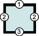      | 3个值的语法：`border-width: 1em 2em 3em`       | 第一个值表示 `top`；第二个值表示水平方向的，即 `left` 和 `right`； 第三个值表示 `bottom`                                                                                             |
| 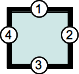    | 4个值的语法：`border-width: 1em 2em 3em 4em` | 这四个值分别表示 `top`、`right`、`bottom`、`left`，即从 `top` 开始的顺时针顺序（提示：`Top-Right-Bottom-Left` 首字母与英文单词 `trouble` 的顺序一致：`TRBL`） |

### 背景 Background
简写属性 `background` 包含以下属性

* `background-color`
* `background-image`
* `background-repeat`
* `background-position`

可以简写成一行属性，依次为其次级属性赋值

```css
background: #000 url(images/bg.gif) no-repeat top right;
```

:warning: 在使用简写属性没有指定其包含的部分次级属性值时，该次级属性会赋予默认值，应注意引起未预期的覆盖行为

```css
/* background-color 默认值为 transparent */
background-color: red;
background: url(images/bg.gif) no-repeat top right;   // 以上样式不会将 `background-color` 设置为 `red`，而是使用默认值 `transparent`，因为第二条规则优先
```

### 字体 Font
简写属性 `font` 包含以下属性

* `font-style`
* `font-weight`
* `font-size`
* `line-height`
* `font-family`

可以简写成一行属性
```css
font: italic bold .8em/1.2 Arial, sans-serif;
```

## 字体
字体样式可以通过简写属性 `font` 进行设置，其中属性值需要依照一定的顺序

```css
font: font-style font-variant font-weight font-size "font-family";
```

### 字体类型 font-family
属性 `font-family` 设置字体类型，可以设置多个字体，字体名之间用逗号 `,` 分隔。

```css
font-family: "font1", "font2", "font3" ...；
```

选用字体原则：

* 指定页面使用的字体类型，**每个操作系统附带一组预先安装的字体**，使用这些字体定制网站可以避免显示错误，应首先考虑。
* 通过指定多个字体，以确保用户无论使用哪种操作系统都可获得一致的体验（因为并非所有字体在每个操作系统上都适用）。浏览器**从左到右查看提供的备选字体**，选择可以正确渲染文本的第一种字体。

用户可以使用自定义字体，如 [Google Fonts](http://www.google.com/fonts) | [中文版](http://www.googlefonts.cn/) 获取开源字体。使用自定义字体时，需要在 HTML 文件的 `<head>` 标签中提供渲染字体所需文件的链接，以在页面加载时供浏览器自动下载。

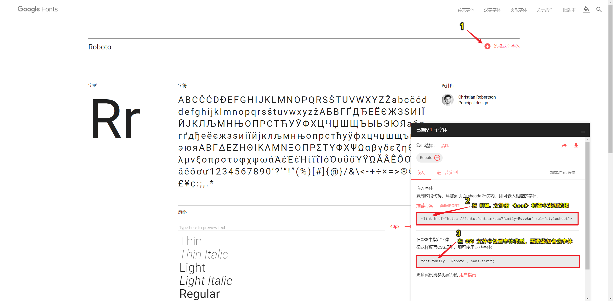

```html
<!-- html -->
<head>
  /* 导入自定义字体 Lato 链接*/
  <link href="https://fonts.font.im/css?family=Lato" rel="stylesheet">
</head>
```

```css
* {
    font-family: 'Lato', sans-serif;
  }
```

:warning: 使用自定义字体应**至少指定一个备用字体**以防无法加载自定义字体。使用自定义字体时，值（字体名称）需要用引号括起来。

:bulb: 常用字体（集）及区别
* `Serif` 有衬线字体，常用于标题
* `Sans Serif` 无衬线字体，常用于段落

### 字体大小 font-size
属性 `font-size` 设置[字体大小](https://developer.mozilla.org/zh-CN/docs/Web/CSS/font-size)

设置字体大小时需要**提供单位**，有两种：
* **绝对单位**
    * 距离单位，如 `cm`、`pt` 磅、`pc` 等
    * 表示 CSS 缩放等级的值，如 `small`等（缩放系数为 1.2）
* **相对单位**
    * 像素 `px`（Chrome 浏览器的默认字体大小是 `16px`），相对于设备分辨率而言
    * 百分数 `%`，**默认大小是`100%`**（相当于 `16px`），相对父元素字体大小
    * `em` 值，相对父元素的字体大小，当父元素字体大小未设置时适用浏览器的默认字体大小（可以在浏览器中进行设置，Chrome 浏览器默认字体大小是 `16px`）

:bulb: 推荐使用相对单位，以基于不同设备动态改变

:warning: 中文字体应该不小于 `12px` 或 `9pt`

:bulb: 对于整页元素 `<body>` 的字体大小设定为 `14 px` 至 `20 px` 之间

### 字体颜色 color
属性 `color` 设置字体颜色

多种方式表示颜色属性值：
* **`rgb` 编码模式**：用三个数字分别指定红色，绿色，蓝色不同比例的搭配，如绿色为 `rgb(0,250,0)`，三个参数值范围是 `0-255`，或 `0％-100％`。也可以添加透明度，即使用 `rgba()` 模式
* **十六进制编码模式**：使用16进制/ `#` 加四位数表示颜色值，**如果每两位的值相同可缩写表示**，如 `color: #aabbcc` 可简写为 `color: #abc`
* **颜色名称模式**：浏览器可以识别**147种**定义的颜色名称，如常见的`red`、`blue`、`orange`
* **`hsl` 色轮选择器**：许多优秀图形设计软件上的色轮使用 hsl 来挑选颜色，H 代表色调（hue），这是色轮光谱，就像不同颜色的彩虹，范围为 `0~360`。S 代表饱和度（saturation），代表颜色有多饱和，范围为 `0~100%` 表示 没有色彩 到 全彩色范围。L 代表亮度（lightness），可以让你将黑色或白色的颜色与你的颜色混合，范围从 `0`（黑色）到 `100%`（白色）。使用 `hsl()` 设置颜色，使用 `hsla()` 可以设置颜色的透明度。

颜色设置相关工具：
* Chrome 的开发者工具提供 **[取色器 Color Picker tool](https://developers.google.com/web/tools/chrome-devtools/inspect-styles/edit-styles#color-picker)** 可快速获取网页的颜色信息
    > 要打开 Color Picker，请在 Styles 窗格中查找一个定义颜色的 CSS 声明（例如 color: blue）。 声明值的左侧有一个带颜色的小正方形。 正方形的颜色与声明值匹配。 点击小正方形可以打开 Color Picker。
* [十六进制色与 RGB 转换](https://www.webfx.com/web-design/hex-to-rgb/)
* [RGB 与16进制色互转工具](https://tool.css-js.com/rgba.html)
* [Web安全色](https://www.bootcss.com/p/websafecolors/)
* [Color Picker — HTML Color Codes](https://htmlcolorcodes.com/color-picker/) 在线拾色器

### 字重 font-weight
属性是 `font-weight` 设置字体粗体

两种方式设置字体粗细：
* **关键字**：标准`normal` 和加粗 `bold`
* **数字**：字重范围 **`100-900`** 由细到粗。**`400`相当于正常粗细 `normal`，`700`相当于加粗 `bold`**


### 字形 font-style
属性 `font-style` 设置字形

* **常规字体**属性值为 `normal`，选择 `font-family` 的常规字体。
* **斜体**属性值为 `italic`，如果当前字体没有可用的斜体版本，会选用倾斜体 oblique 替代
* **倾斜体**属性值为 `oblique`，可在后附加一个参数设置倾斜角度，单位为 `deg`

:bulb: 斜体 `italic` 和倾斜体 `oblique` 都是通过人工倾斜常规字体的字形来模拟的，`italic` 样式一般是指书写体，相比无样式的字体，通常会占用较少的高度，而 `oblique` 字形一般只是常规字形的倾斜版本。

## 字体变形
属性 `font-variant` 设置字体变形

有两个属性值可选：

* `normal` 常规（默认值）
* `small-caps` 将英文文本设置为小型大写字母

## 文本
### 大小写 text-transform
参考：[text-transform - CSS（层叠样式表） | MDN](https://developer.mozilla.org/zh-CN/docs/Web/CSS/text-transform)


属性 `text-transform` 设置文本大小写转换

|      属性值       |                                                                         转换效果                                                                         |
| -------------------- | ------------------------------------------------------------------------------------------------------------------------------------------------------------ |
| `capitalize` | 每个单词**首字母**大写                                                                                                                            |
| `uppercase`  | 所有字母大写                                                                                                                                           |
| `lowercase`  | 所有字符小写                                                                                                                                           |
| `none`           | 阻止所有字母的大小写转换                                                                                                                         |
| `full-width` | 强制字符（主要是表意字符和拉丁文字）书写进一个方形里，并允许它们按照一般的东亚文字（比如中文或日文）对齐 |

### 文本线 text-decoration
属性 `text-decoration` 设置文本线以修饰文本

* 属性值 `none` 无文本线属性（默认值）
* 属性值 `overline` 设置上划线
* 属性值 `underline` 设置下划线
* 属性值 `line-through` 设置删除线
* 属性值 `blink` 闪烁

### 字间距 letter-spacing
字距是印刷业用来描述**字母之间空隙**的一个术语

属性 `letter-spacing` 设置字间距，

* 赋予一个数字（正负值均可）并需要指定单位 `em` 或 `px` 等来设置字间距
* 属性值 `normal` 按照当前字体的正常间距确定，等同于间距 `0`

:bulb: 属性 `word-spacing` 设置元素内**单词之间的间距**（即单词之间空格的宽度）

:warning: 一个很大的正或负的值会让单词变为不可读。很大的正值使字母之间的距离很远，单词将显示为一系列单独的，无有任何关联的字母；很大的负值字母将会互相重叠到一个点，可能无法识别。

### 投影 text-shadow
属性 `text-shadow` 设置文本投影效果，可以设置阴影在 X 和 Y 方向的偏移量、模糊半径和颜色值。

`<p style="font-size: 40px;text-shadow: 4px 5px 1px #666666">text</p>`

* 水平阴影 h-shadow：正为右，负为左。需要提供单位，如 `px`
* 垂直阴影 v-shadow：正为下方，负为上方。需要提供单位，如 `px`
* 阴影模糊距离 blur：值越大越模糊。需要提供单位，如 `px`
* 阴影颜色 color：可以用 rgb 值、颜色名称或十六进制色

:bulb: 可以对同一段文本设置多个阴影，用逗号 `,` 分隔；阴影应用的顺序为从前到后, 第一个指定的阴影在顶部

### 文本内容溢出 text-overflow
[属性 `text-overflow`](https://developer.mozilla.org/zh-CN/docs/Web/CSS/text-overflow) 设置如何向用户发出文本溢出内容的信号。它可以被剪切，然后显示一个省略号 `...` 或显示一个自定义字符串。

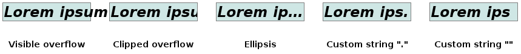

属性值设置信号形式

* `clip` （默认值）在内容区域的极限处截断文本，可能在**字符中间**发生截断，而只显示半个字符。（若希望可以在两个字符过渡处截断，则可使用空字符串 `''` 作为属性值）
* `ellipsis` 用一个省略号 `…` 来表示被截断的文本，由于添加到了内容区域而减少了显示的文本
* `<string>` 指定一个字符（串）来表示被截断的文本，如逗号 `,`，则截断的内容以单个逗号表示，由于添加到了内容区域而减少了显示的文本

:warning: 该属性需要在块元素属性 `overflow: hidden` 才生效。

## 段落
### 行间距 line-height
属性 `line-height` 设置行间距，以保证每一行的上下都有一定的空隙便于用户阅读。

属性值有多种形式
* **（无单位）数字**：行高就是这个无单位数字乘以该元素的字体大小（推荐），桌面浏览器一般默认值约为 1.2
* **带单位的数字**：推荐使用相对单位 `em` 或 `%`，基于字体大小进行变化，如 `1.4em`（`1em`相当于当前字体的尺寸大小）
* **关键词**：如 `normal`，取决于用户端与 `font-family`

:bulb: 主段落内容的 `line-height` 至少应为 1.5 有助于改善低可视条件下的体验，也对认知阻碍者有帮助。

:blub: 将单行块元素的 `line-height` 行高设置为块元素的 `height` 高度，可以快速地实现文字的水平居中。

### 对齐方式
**属性 `text-align` 设置水平对齐方式**

:bulb: 针对在块级元素中文本，但也适用于图像。

常见属性值

| 对齐方式 |    属性值    |
| ------------ | --------------- |
| 向左对齐 | `left`      |
| 向右对齐 | `right`    |
| 居中对齐 | `center`   |
| 两端对齐 | `justify` |

除了显性给出对齐的方向，还可以根据语言的阅读顺序来设置对齐方式（并非所有语言的阅读顺序都是从左到右，如阿拉伯语和希伯来语这类语言都是从右到左阅读）

|     对齐方式      |        属性值        |                                       解释                                        |
| --------------------- | ----------------------- | ----------------------------------------------------------------------------------- |
| 对齐到文本开始 | `start`            | 若语言阅读顺序是左至右，则等于 `left`，反之则为 `right` |
| 对齐到文本末尾 | `end`                | 若语言阅读顺序是左至右，则等于 `right`，反之则为 `left` |
| 继承方向          | `match-parent` | 与继承方向保持一致，且根据父元素 `direction` 方向确定    |

:warning:  对于多行内容的块元素，其「最后一行」无法设置 `justify` 两端对齐，可以通过一些[小技巧](https://www.cnblogs.com/zjjDaily/p/9525350.html)实现。

**属性 `vertical-align` 设置垂直对齐方式**

:bulb: 主要针对**行内元素或表格元素**内容

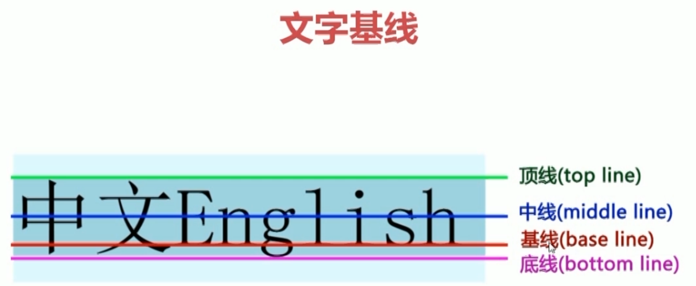

常用属性值

|                                                                                                     对齐方式                                                                                                      |       属性值       |
| :-------------------------------------------------------------------------------------------------------------------------------------------------------------------------------------------------------------------: | :-------------------: |
|                                                                             使元素的基线与父元素的基线对齐（默认值）                                                                              |   `baseline`    |
|                                                                                  使元素的顶部与父元素的字体顶部对齐                                                                                  |   `text-top`    |
|                                                                                  使元素的底部与父元素的字体底部对齐                                                                                  | `text-bottom` |
| 使元素的中部与父元素的基线加上父元素x-height（译注：[x高度](https://www.zhangxinxu.com/wordpress/2015/06/about-letter-x-of-css/)）的一半对齐。 |          `middle`             |
|                                                                      使元素的基线与父元素的下标基线（由浏览器决定）对齐                                                                      |       `sub`        |
|                                                                      使元素的基线与父元素的上标基线（由浏览器决定）对齐                                                                      |      `super`      |
|                                                                                   使元素的顶部与**整行**的顶部对齐                                                                                    |       `top`        |
|                                                                                   使元素的底部与**整行**的底部对齐                                                                                    |     `bottom`     |


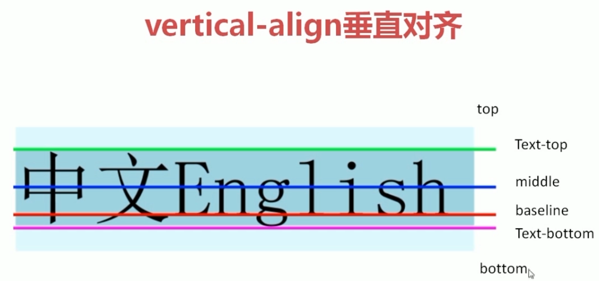

:bulb: 也可以使用具体的数字（单位未 `em` 或 `%`）设置文本基于父元素的基线的偏移量，可以是负数。

:bulb: 属性 `vertical-align` 也可用于表格和图片

* `top` 使单元格内边距的上边缘与该行顶部对齐。
* `middle` 使单元格内边距盒模型在该行内居中对齐。
* `bottom` 使单元格内边距的下边缘与该行底部对齐。

:bulb: 利用 `vertical-align` 和 `line-height` 属性实现内容的水平和垂直居中

* 单行文本，将其 `line-height` 设置为与元素高度 `height` 一致的大小，并设置属性 `text-align: center` 实现水平和垂直居中
* 多行文本，先将容器（父元素）设置为表格 `display: table` 将元素设置为表格项 `display: table-cell`，再在元素中设置 `vertical-align: middle` 和 `text-align: center` 实现水平和垂直居中。

### 缩进 text-indent
属性 `text-indent` 设置文本缩进

:bulb: 段首缩进与段落间隔都是为了区分段落文本的，只采用其中一种设计即可。

属性值需要提供单位，如 `px`、`em`、`%`

### 换行
一行中的字符数限制为 80 个左右比较好，这就是很多网站限制桌面端布局的宽度或在宽屏幕时切换为多列布局的原因，而且现在浏览器一般都支持自动换行，因此通过限制容器最大宽度即可实现换行。

```css
body {
    max-width: 960px;
}
```

但是对于连续的英文或数字可能无法自动换行，可以添加属性 `word-wrap: break-word` 开启强制自动换行。

## 列表
简写属性 `list-style` 设置列表的项目符号样式，设置两个属性值，分别代表 项目符号位置 和 项目符号样式，也可以使用其次级属性 `list-style-postion` 和 `list-style-type`  分别设置

### 项目符号 list-style-type
属性 `list-style-type` 修改项目符号样式，项目符号就是在每一行 `<li>` 开端处的符号

**无序列表**项目符号样式可用属性值：

* `none` 无标记
* `disc` 实心的圆点
* `circle` 空心的圆圈
* `square` 实心的小方块

**有序列表**项目符号样式可用属性值：

* `none` 无标记
* `decimal` 阿拉伯数字
* `lower-alpha` 小写英文字母
* `upper-alpha` 大写英文字母
* `lower-roman` 小写罗马字母
* `upper-roman` 大写罗马字母

```css
ul{
    list-style-type:square;
}
```

### 项目图像 list-style-image
属性 `list-style-image: url(img_path)` 设置项目符号为图像，即每一行 `<li>` 以图标作为开端标识

```css
ol{
   list-style-image:url("https://resource.bcgame-face2face.haorenao.cn/images/email.png");
}
```

:bulb: 当设置以图片作为项目标记时，会覆盖掉已设置的符号标记。

### 项目符号位置 list-style-position
属性 `list-style-position` 设置标记位置，可用属性值：

* `outside` 默认值，符号标记位于文本块左侧，放置在文本以外。
* `inside` 符号标记位于文本块内部，同时**文本被缩进**，且环绕文本根据标记对齐。


## 表格
与盒子模型类似，可以设置尺寸、边框、边距等属性，也有独特的属性，如表格含有外边框和单元格边框
### 表格外观
表格与盒子模型类似，可以设置许多外观属性尺寸、边框、边距等属性，通过选择器可分别设置表格（全局）或单元格（单个）的样式

* 属性 `width` 设置表格容器的宽度

* 属性 `background-color` 设置背景颜色

* 属性 `text-align` 和 `vertical-align` 分别设置单元格内文本的水平和垂直对齐方式。

* 属性 `border` 设置边框样式，该属性是一个简写属性，可通过次级属性分别设置上下边框样式
    * 属性`border-top`修改上边框样式
    * 属性`border-bottom`修改下边框样式

* 属性 `border-spacing` 修改单元格之间的空隙，后跟两个数值，需要设置单位
    * 第一个数值表示单元格**横向距离**
    * 第二个数值表示单元格**纵向距离**

* 属性 `padding` 设置单元格边框与其中内容之间的距离

* 属性 `border-collapse` 设置相邻单元格的边框是否合并
    * 属性值为 `separate`（默认）
        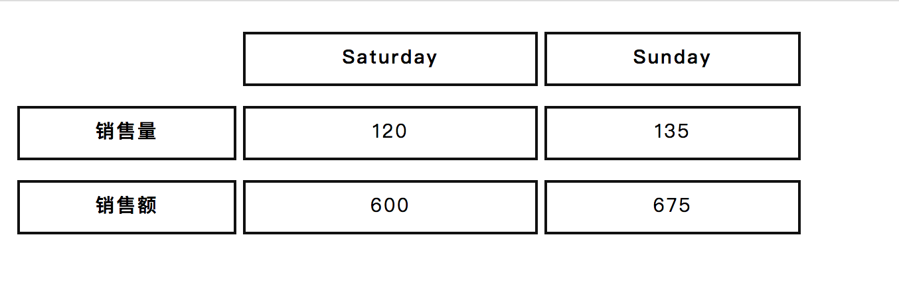
    * 属性值为 `collapse`
        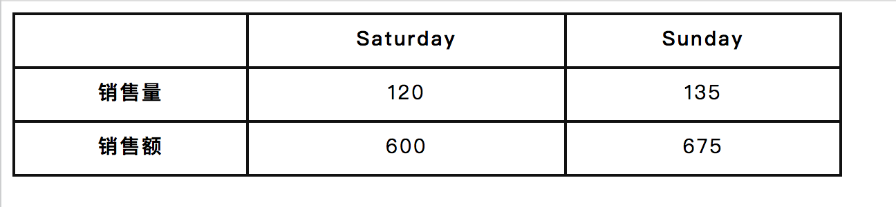

* 属性 `empty-cells` 设置空单元格边框
    * 属性值为 `hidden` 时隐藏空单元格的边框
    * 属性值为 `show` 时显示空单元格的边框

### 内容排版
* 属性 `text-align` 设置表格中内容对齐方式，常用属性值为左对齐 `left` 或右对齐 `right`

* 属性 `text-transform` 将表格**标题内容转换为大写**


## 表单属性
与盒子模型类似，可以设置尺寸、边框、边距等属性

### 表单外观
* 属性 `border` 设置文本框边框

* 属性 `border-radius` 设置边框圆角

* 属性 `background-image` 设置图像为文本框背景

```css
input {
background-image:url("photo_path")
```

* 可以对单选按钮 Radio Buttons 的按钮样式进行定制（结合使用属性 `checked` 可以定制选中状态下的按钮样式），但设置方法较复杂。

## 图片

### 尺寸
属性 `width` 设置图片宽度，需要设置单位，如绝对单位 `px` 或相对单位 `%`
属性 `height` 设置图片长度，需要设置单位，如绝对单位 `px` 或相对单位 `%`

:bulb: `width/height` 一般只指定一个值，则另一个会根据原始图像进行赋值（保持原图比例进行缩放）

:warning: 对图片设置内联样式和内部样式，会依据内部样式进行设置。

### 透明度 opacity
属性`opacity`设置图像透明度，属性值在`0.0`到`1.0`范围内，值越小越透明

## 背景
简写属性 `background` 设置背景的样式，包括次级属性 `background-color`、`background-image` 等

:warning: 背景区包括盒子的 `content` 内容、`padding` 内边距、`border` 边框，但**不**包括 `margin` 外边距。
### 背景颜色 background-color
属性 `background-color` 设置元素背景颜色，属性值为关键字 `transparent`（默认值，是**全透明**黑色的速记法，类似 `rgba(0, 0, 0, 0)` 即背景颜色为透明）或 颜色（可以使用 RGB 色、十六进制色、颜色名称三种模式）

### 背景图 background-image
属性 `background-image` 设置图像作为背景，默认值是 `none` 即无背景图，而需要设置背景图需要提供图片源路径，属性值使用 `url(file_path)` 添加**图片路径**

```css
div {
    background-image: url(file_path)
}
```

:bulb: 背景图默认占据元素的全部尺寸（即包括内边距和边框，不包括外边距）

:warning: 背景图会覆盖背景颜色的设置

#### 背景图固定方式 background-attachment
属性 `background-attachment` 设置背景图固定方式，有两个属性值可选：

* `scroll` 默认值，背景图片随滚动条滚动
* `fixed` 当页面的其余部分滚动时，背景图片不会移动，如可以设置元素 `<body>` 整体的背景图不滚动

#### 背景图重复 background-repeat
若背景图比较小，不能填充整个页面，默认会自动重复图片，属性`background-repeat` 设置背景图重复模式，多种属性值可选：

* `repeat` 重复（默认值，在水平和垂直方向上重复）
*  `no-repeat` 设置背景图不重复（可能造成无法填充满元素）
* `repeat-x` 设置背景图沿水平方向上平铺重复
* `repeat-y` 设置背景图沿竖直方向上平铺

#### 背景图位置 background-position
属性 `background-position` 设置背景图在元素中的位置，默认位置为左上角。

有多种方式设置背景图的位置，可以传递一个属性值（另一个维度默认为 50% 即居中）设置图片相对于容器左边缘的偏移量；也可以传递两个属性值（分别指定横向和垂直的定位）设置图片相对于容器的左边缘和上边缘的偏移量。

有多种属性值可使用，可以是带单位的数值或百分比，也可以是使用关键字。

使用百分比表示背景图相对容器左边缘和上边缘的偏移量，`0%` 代表图片在定位在容器的左边界（上边界），`100%` 代表图片定位在容器的右边界（或下边界），因此 `50%` 代表图片居中。

也可以是使用关键字，可用关键字：
* `top` 背景图上边缘定位在元素顶部中间
* `bottom` 背景图下边缘定位在元素底部中间
* `left` 背景图左边缘定位在元素左侧中间
* `right` 背景图右侧边缘定位在元素右侧中间
* `center` 背景图居中显示

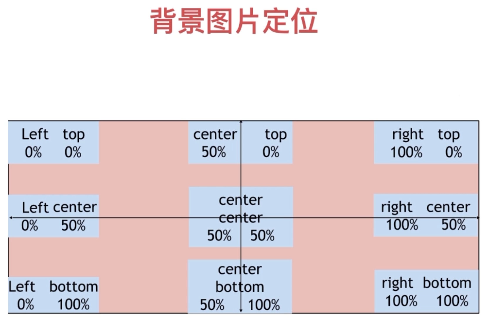

:bulb: 如果背景图片的大小和容器一样，设置百分比的值将永远无效，需要为偏移使用绝对值，如 `px`

#### 背景图大小 background-size
图片默认使用原有的尺寸和重复进行铺排，也可以通过拉伸或缩放进行铺排，通过属性`background-size` 设置背景图片大小（铺排方式）。

常用两种属性值：

* `cover` 拉伸背景图片以完全**覆盖背景区**，可能部分背景图片被裁剪而看不见。
* `contain` 缩放背景图片以完全装入背景区，以保证**完整地展示图片**，可能背景区部分空白。

## 盒子
CSS 盒子模型主要由块元素 `<div>` 组成，可设置多种属性，如盒子尺寸 `width` 和 `height`、边框 `border`、投影 `box-shadow`、背景 `background` 等

**注意**：应设置属性 `box-sizing: border-box` 以便排版更直观

```css
* {
    -webkit-box-sizing: border-box;
    -moz-box-sizing: border-box;
    -ms-box-sizing: border-box;
    box-sizing: border-box;
}
```

参考：[盒子模型](./网页布局.md#盒子模型)

### 盒子尺寸
属性 `width` 与  `height` 设置盒子尺寸的宽与高，需要提供单位 `px`、`em` 或者 `%`**，相对单位是基于父元素的宽度的**，关键字 `auto` 浏览器为元素自动计算并选择一个宽度（默认值）。

可以设置**尺寸限制**使元素根据页面大小动态调整：

* 设置最小宽度的 `min-width` 和最小高度 `min-height` 元素大小只能比限制更大
* 设置最大宽度 `max-width` 和最大高度 `max-height` 元素大小只能比限制更小

:warning: 块元素、替换元素（如 ``、`<input>`、`<textarea>` 等）才可以设置属性 `width` 和 `height`

### 内边距 padding
属性 `padding` 设置盒子模型的内边距，即盒子模型中**内容与边框之间的空隙**。遵循 **1-4值** 语法提供属性值，参考 [简写属性](#简写属性)；需要提供单位，如 `px`

该属性是一个简写属性，可单独设置其次级属性：

* 盒子上方的内边距 `padding-top`
* 盒子下方的内边距 `padding-bottom`
* 盒子右边的内边距 `padding-right`
* 盒子左边的内边距 `padding-left`

### 外边距 margin
属性 `margin`设置盒子模型的外边距，即盒子模型中**盒子之间的空隙**

遵循 **1-4值**语法提供属性值，参考 [简写属性](#简写属性)；需要提供单位，如 `px`

该属性也是一个简写属性，可单独设置其次级属性：
* `margin-top`
* `margin-bottom`
* `margin-right`
* `margin-left`

:bulb: 可以在限制块元素宽度后，使用 `margin: 0 auto` 直接实现居中对齐

:bulb: 一些块元素，如 `<h1>`、`<p>`、`<body>` 等，存在默认的外边距，可以在 CSS 样式表最开始执行以下初始化（覆盖）样式设置

```css
* {
    margin: 0;
    padding: 0;
    box-sizing: border-box;
}
```

:warning: 外边距存在合并/折叠现象，即垂直方向上两个相邻的块元素的外边距会发生合并，合并的高度取决于相邻元素外边距较大值。:bulb: 使用 flexbox 布局也不存在外边距折叠，在现代网页设计中常常采用该灵活布局技术。


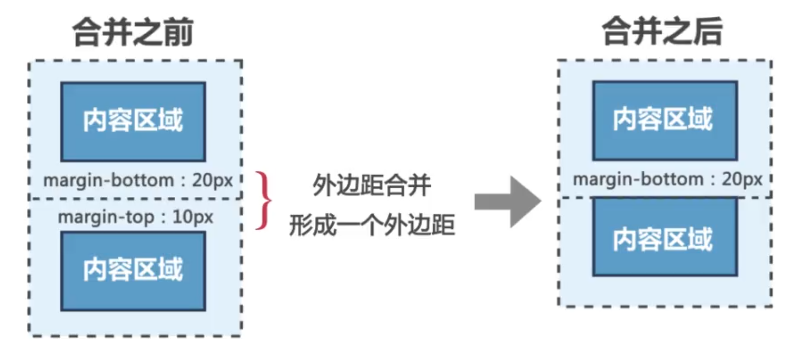

如果希望避免外边距折叠可以采取以下方式：

* 在其间插入另一个块元素，且元素盒子大小**并非为零**）

```html
  <p>Paragraphs are blocks.</p>

  <div style='padding-top: 1px'></div>  <!-- 插入一个内边距为 1 px 的盒子 -->

  <p>Box margin don't collapse.</p>
```

* 只使用块元素的 `padding` 设置边距分隔，由于内边距是不会发生折叠的。

* 只设置块元素垂直方向上一边的外边距，如所有块元素都只设置盒子的 `margin-top` 或 `margin-bottom`。

### 边框 border
参考：[CSS 边框 `CSS Borders`](https://developer.mozilla.org/zh-CN/docs/Web/CSS/border)

属性 `border` 设置盒子的边框样式，是[简写属性](#简写属性)属性，包括多个次级属性：

* 边框宽度 `border-width`
* 边框样式 `border-style`
* 边框颜色 `border-color`

:bulb: 所有边框次级属性都可以在其中添加方向，以单独设置其中一边的样式，如 `border-left-width` 设置左侧边框的宽度，`boder-right-color` 设置边框右侧的颜色，`border-top: 5px red solid` 设置上边框宽度为 5px 颜色为红色实线。

#### 边框宽度 border-width
属性`border-width` 设置边框宽度，需要提供单位如`px`，也可以使用关键字 `thin` 窄、`medium` 中等边框、`thick` 厚边框。

#### 边框样式 border-style
属性 `border-style` 设置边框样式


常用属性值及对应样式

| 样式 | 属性值 |
| --- | --- |
| 实线 | `solid` |
| 方形点 | `dotted` |
| 虚线 | `dashed` |
| 两条实线 | `double` |

:bulb: 属性值 `border-style: none` 相当于没有边框。

#### 边框颜色 border-color
属性 `border-color` 设置边框颜色，**默认与文本颜色相同**，可使用 RGB 色、十六进制色、颜色名称模式。

:bulb: 属性值 `tansparent` 表示边框颜色透明（使用边框就像是额外的内边距一样，因为元素的背景会延伸到边框区域），其中一个好处是能在需要的时候使其可见。这种透明边框相当于内边距。

:warning: 单独设置边框颜色 `border-color` 并不会在页面中显示边框，因为 `border-style` 默认值是 `none` 即不显示，因此还需要同时（或预先）设置 `border-style` 为非 `none` 的其他属性值，如 `solid`。

#### 边框角度 border-radius
属性 `border-radius` 设置元素的外边框圆角，**数值越大，边框角的弧度越大**，需要提供单位如`px`、`em`

该属性是一个**简写属性**，可使用4个属性值依次设置边框四个角，依次设定左上方，右上方，右下方，左下方（顺时针）的边框角度大小。也可以使用次级属性，单独设置一个角的弧度：

* 属性 `border-top-right-radius` 设置右上方的角度
* 属性 `border-bottom-right-radius` 设置右下方的角度
* 属性 `border-bottom-left-radius` 设置左下方的角度
* 属性 `border-top-left-radius` 设置左上方的角度

:bulb: 根据设置的圆弧角度类型不同，可在次级属性后指定一个或两个数值。当提供一个值时，设置圆角半径；当提供两个值时，分别设置圆弧的椭圆的**水平半长轴**和**垂直半长轴**。在简写属性 `border-radius` 中也可以分别设置两个轴的长度，用斜杠 `/` 分隔二组值，其中第一组值表示水平半径，第二组值表示垂直半径。

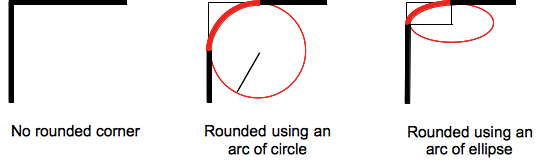

:bulb: 当元素尺寸为正方形时，设置 `border-radius: 50%` 可以将其变成一个圆形，一般用于圆形头像设置。

#### 边框图片
简写属性 `border-image: url(image-path)` 设置图片来填充边框。

可以使用次级属性分别设置样式
* `border-image-source: url(image-path)` 设置图片源
* `border-image-slice` 设置图像的边界向内的偏移（点九切图法），可设置多种属性值数值、百分比、关键字 `fill`（图片完全填充到各个边框区域）
* `border-image-width` 设置图像边界宽度
* `border-image-outset` 指定再边框外部绘制 `border-image-area` 区域大小
* `border-image-repeat` 图片边界是否重复

 :bulb: 图片通过点就切图法切割后（舍弃中间部分），再以相应的方式填入边框中
    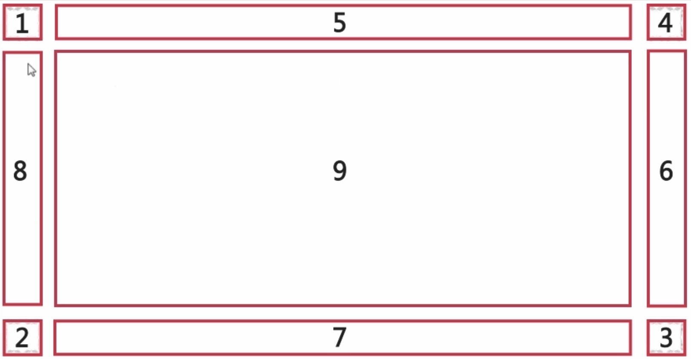


### 盒子投影 box-shadow
属性 `box-shadow` 在元素的框架上添加阴影效果，一般设置阴影为图片增加深度感。可以设置多个投影，多个阴影在 z轴 的顺序是第一个阴影在最上面，类似于 `text-shadows` 规则

可设置多个属性值，包括 X偏移、Y偏移、阴影模糊半径、阴影扩散半径、阴影颜色、内阴影效果：

1. 水平偏移距离 `horizontal length` 正数阴影在右边，负数在左边（必选提供）
2. 垂直偏移距离 `vertical length` 正数阴影在下方，负数阴影在上方（必选提供）
3. 阴影模糊半径 `blur radius` 数值越大越模糊
4. 阴影扩散半径 `spread radius` 数值越大阴影越大
5. 阴影颜色 `shadow color` 可使用颜色名称、十六位进制色、RGB 色
6. 内阴影 `inset` 添加该属性投影会在盒子内部产生

给出两个、三个或四个数字值的情况
* 如果只给出两个值, 这两个值将被解释为 x 轴上的偏移量和 y 轴上的偏移量
* 如果给出了第三个值, 第三个值将被解释为模糊半径的大小 `blur-radius`
* 如果给出了第四个值, 第四个值将被解释为扩展半径的大小 `spread-radius`

:bulb: 使用 CSS matic [box-shadow 生成器](http://www.cssmatic.com/box-shadow) 工具实时可视化阴影效果

### 内容溢出 overflow
在很小的区域内放置大量的文本，属性 `overflow` 设置在盒子模型中内容太大时溢出的方式.

常用的属性值

* `visible` 默认值，内容不会被修剪，会呈现在元素框之外
* `hidden` 超出盒子部分的内容会被直接隐藏
* `scroll` 提供滚动条让用户可拖动浏览超出盒子范围的内容
* `auto` 由浏览器定夺，如果容器可以容纳内容就不会出现滚动条；如果内容过多被修剪，就会显示滚动条

:bulb: 可以使用子属性 `overflow-x` 和 `overflow-y` 分别设置在横轴和纵轴溢出样式。

## 按钮属性
* 属性 `border-bottom` 设置按钮的边框，调粗可产生逼真的3D效果
* 属性 `background-color` 设置按钮背景颜色

## 光标 cursor
通过更改光标样式，向用户传达信息会非常有效。大多数情况**浏览器会自动更改光标**，但是你可以使用光标属性来覆盖默认行为。

属性 `cursor` 设置光标样式，常见鼠标样式对应的属性值：

| 光标样式 | 属性值 | 备注 |
| --- | --- | --- |
| 鼠标箭头样式 | `default` | 默认值 |
| 光标样式 | `auto` | 文本输入时的样式 |
| 十字架样式 | `crosshair` | |
| 小手样式 |`pointer` | |
| 等待样式 | `wait` | 加载转圈圈 |
| 帮助样式 | `help` | 鼠标样式后会有一个小问号 |


```html
<p>请把鼠标移动到单词上，可以看到鼠标指针发生变化：</p>
<p style="cursor:default">default</p>
<p style="cursor:auto">auto</p>
<p style="cursor:crosshair">crosshair</p>
<p style="cursor:pointer">pointer</p>
<p style="cursor:wait">wait</p>
<p style="cursor:help">help</p>
```

## 隐藏元素 visibility
属性 `visibility` 设置元素是否可视

常用属性值：

* 属性值 `hidden` 隐藏元素，但保留了元素原来占用的空间（占位）
* 属性值 `visible` 显示元素

```css
li{
    display:inline;
    margin:10px;
}
li.coming-soon {
    visibility:hidden;
}
```

```html
<ul>
    <li>主页</li>
    <li>产品</li>
    <li class="coming-soon">服务</li>
    <li>关于</li>
    <li>联系人</li>
</ul>
```

:bulb: 若想将元素的占位的空间也隐藏，可设置属性 `display: none`（但使用浏览器「查看源码」选项，依然可见盒子中的内容）

## 元素展示 display
属性 `display` 设置元素展示的方式。有多种可用的属性值

* `block` 按照块元素的行为进行展示
* `inline` 按照行内元素的行为进行展示
* `table` 按照表格元素的行为进行展示，即元素的占位大小根据内容而定
* `flex` 该元素作为 Flex 容器，其子元素按照弹性布局进行排布
* `grid` 该元素作为 Grid 容器，其子元素作为网格项按照网格布局进行排布
* `none` 隐藏该元素