---
tags:
  - css
---

# 网页布局
参考：[学习 CSS 布局](http://zh.learnlayout.com/)

## 视窗
参考：
* [在移动浏览器中使用viewport元标签控制布局](https://developer.mozilla.org/zh-CN/docs/Mobile/Viewport_meta_tag)
* [Responsive Web Design - The Viewport](https://www.w3schools.com/css/css_rwd_viewport.asp)
* [响应式网页开发基础：DPR 与 viewport](https://zhuanlan.zhihu.com/p/26131956)

视窗 `viewport` 是指网页的可视区域，一般是指 layout viewport 即有内容的窗口区域，有时候与浏览器可视区域 visual viewport 的大小不同，这种情况下浏览器会提供滚动条以访问所有内容。

因为许多页面没有做移动端优化，在移动设备等窄屏幕设备的小视窗渲染时会乱掉（或看起来乱），一种权宜之计是使用**虚拟视窗**渲染页面（这个窗口通常比屏幕宽），然后再缩小渲染的结果以便在屏幕内显示所有内容，用户可以通过缩放、移动查看页面的不同区域。但是该方法可能会造成响应式设计无法启动，如可能虚拟视口宽 `980px`，那么在 `640px` 或 `480px` 或更小宽度设置的媒体查询的断点就不会被触发。

为了缓解这个问题，Apple 在 Safari iOS 中引入了 `viewport meta` [标签](https://developer.apple.com/library/archive/documentation/AppleApplications/Reference/SafariHTMLRef/Articles/MetaTags.html#//apple_ref/doc/uid/TP40008193-SW6)，让 Web 开发人员控制视口的大小和比例。在 `<head>` 中的 `<meta>` 标签里设置 `viewport` 属性 ，以设置视窗的宽度：

```html
<head>
    <meta name="viewport" content="width=device-width, initial-scale=1">
</head>
```

* 元数据中 `width` 控制视窗的宽度，可提供具体值，如 `width=600` 设为确切的像素数；或设为特殊值 `width=device-width` 即将视窗宽度 layout viewport 等于该设备屏幕的 dips 宽度，修正 `viewport` 大小以触发响应式设计
* 元数据中 `initial-scale` 设置页面最初加载时的缩放等级。当 `initial-scale=1` 保证网页的 CSS 像素与 dip 比例一直为 1：1，即缩放等级为 `100%` 避免在移动设备横竖屏切换时，只通过改变缩放比例，而非触发响应式设计

## 容器
子元素的大小受到父元素的影响，父元素因此常被称作**容器 container**

一般通过容器限制子元素的大小

* 设定父元素的宽度为绝对值，一般是元素 `<body>` 以限制页面（及子元素）在合适的宽度范围内
* 子元素的宽度采用相对单位（百分比形式），如 `width: 100%`  或 `max-width: 100%` 以避免子元素溢出容器，同时实现响应式设计，推荐对元素 ``、`<video>` 等元素设置最大宽度限制以避免溢出

```css
img, video {
    max-width: 100%;
}
```

## block 与 inline 元素
根据元素的 `display` 属性不同而将元素分为两大类型：

* **块元素 `display: block`**：会尽可能占据更多的宽度，如元素 `<h>`、`<div>` 等
* **行内元素 `display: inline`**：只会依据内容 content-based 占据所需的宽度，如元素 `<span>`，一般无法
设置行内元素的高度值和宽度值

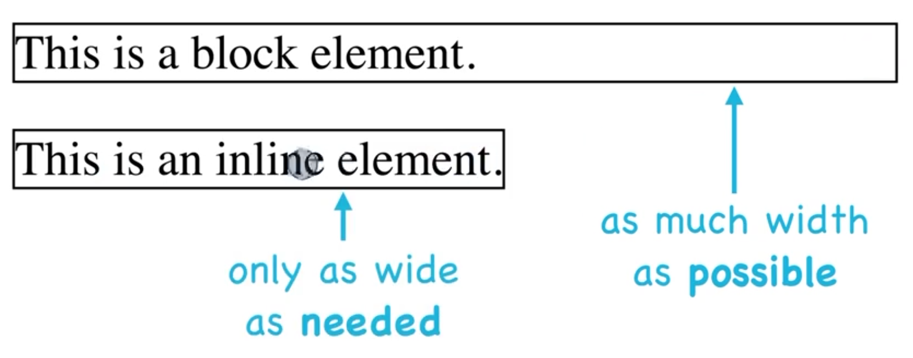

:bulb: 还有一种元素展示类型 `display: inline-block` 行内块元素，行内元素不允许设置宽度、高度、顶部和底部边距。但是行内块元素 `inline-block` 允许你设置这些属性，同时保持它们将彼此水平排列的特征，即元素以 `inline` 行为呈现（在一行中显示，内容过多无法在页面宽度下承载，则会自动换行），同时具有 `block` 相应的特性，可以设置 `width`、`height`、`margin` 等块元素相关属性。

:bulb: 将属性设置为 `display: none` 将元素隐藏（其空间占位也将取消）

### 块级元素
块级元素的默认样式是高度仅能刚好容下其内容（当元素中无内容时，则 `div` 元素的盒子模型没有高度，在页面上不显示了），而宽度占据整个页面。

标签`<div>`是一个典型的块元素，它一般用作「容器」将网页分为多块部分，为不同区块设置不同的样式。

块级元素通过修改其属性 `display: inline`使元素表现为一个内联元素（即排在一排上），一个常用实例是利用列表创建一个菜单栏

```css
<!--将列表排在同一行，使其表现得如一个内联元素一样-->
li {
    display:inline;
    margin:10px;
}
```

```html
<ul>
  <li>主页</li>
  <li>产品</li>
  <li>服务</li>
</ul>
```

### 行内容器
行内容器会基于内容占据空间，而当行内元素的内容过多无法在页面宽度下承载，则会自动换行，此时每一行都称为**行盒/线框**（其实是同一个行内元素，相当于把一个元素断开后分别放在两行）


:bulb: 对于行内元素可内边距，而外边距则只能在水平方向上起作用（而忽略竖直方向的设置）。

常见的行内元素是  `<span>` 元素，常用的行内容器，并没有任何特殊语义，类似于块元素 `<div>`，可以使用它来编组元素以设置某种样式。

修改属性 `display: block` 可以将内联元素的行为修改为块元素。

## 盒子模型
参考：
* [CSS 盒模型简介 (Introduction to the CSS Box Model)](https://developer.mozilla.org/zh-CN/docs/Web/CSS/CSS_Box_Model/Introduction_to_the_CSS_box_model)
* [学习CSS布局 - 盒模型](http://zh.learnlayout.com/box-model.html)
* [国际盒子大小宣传日 (International Box-Sizing Awareness Day)](https://css-tricks.com/international-box-sizing-awareness-day/)

网页由无处不在的盒子组成，网页中的内容都可视盒子，盒子通过嵌套和不同的排布实现网页特定的 layout 布局。浏览器的渲染引擎会根据 CSS 基础框盒模型将所有元素表示为一个个矩形的盒子 box。

每个盒子由四个部分（或称区域）组成，它们由各自的边界 Edge 所定义：

* 内容边界 `Content edge`
* 内边距边界 `Padding Edge`
* 边框边界 `Border Edge`
* 外边距边界 `Margin Edge`

外部空间是指将盒子模型的**外边距 `margin`** 认为是元素的外部空间
    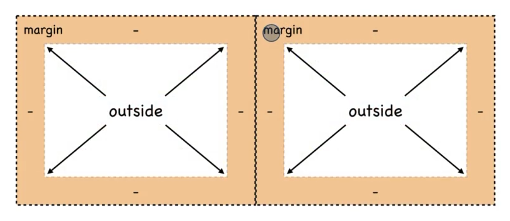

内部空间是指盒子**从边框到内容之间的所有部分**认为是元素的内部空间
    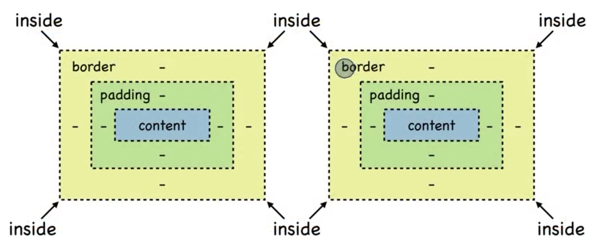

负空间即不含任何内容的空间，以便更好地凸显区分出不同元素内容，盒子模型中设置的边框、内外边距就是负空间

### 盒子大小计算方式
盒子大小的默认计算方式是基于 `content` 内容，即设置宽高时是针对 `content` 部分，因此再添加上 `padding` 和 `border-width` 后实际显示的盒子会比预设的大（因为元素的内边距和边框增加它的宽度）

```css
// 所有元素基于内容计算盒子模型大小
* {
    box-sizing: content-box;
}
```


开发中常用的计算方式（推荐）应该基于边框 `border`，即设置宽高应该针对内部空间部分（即设置的宽高包括了 `content`、`padding`、`boder`三部分），这种计算方式更符合将盒子模型区分为外部空间和内部空间的习惯

```css
// 所有元素基于边框计算盒子模型大小
* {
    box-sizing: border-box;
}
```

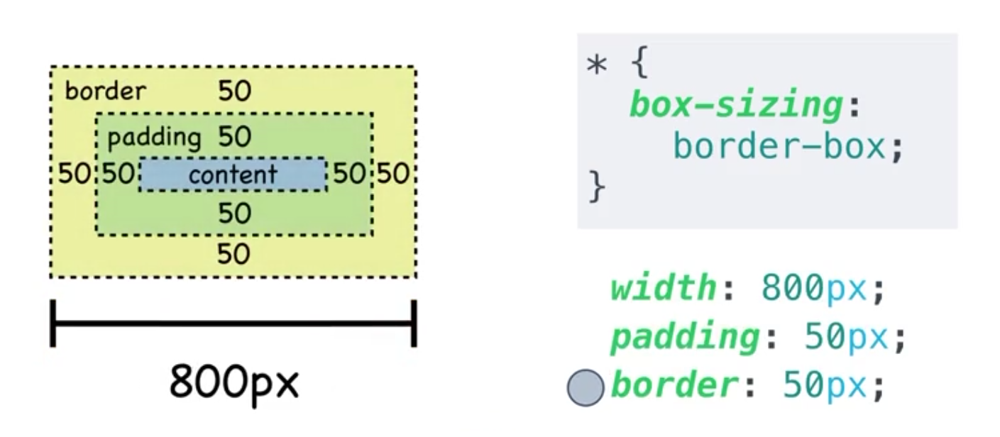

:warning: 确保 `box-sizing: border-box` 设置在旧浏览器上兼容需要添加浏览器专属前缀
* `-webkit`
* `-moz`
* `-ms`

```css
// 将盒子模型计算方式更方便
* {
    -webkit-box-sizing: border-box;
    -moz-box-sizing: border-box;
    -ms-box-sizing: border-box;
    box-sizing: border-box;
}
```

### 盒子模型组成

盒子模型由4部分组成
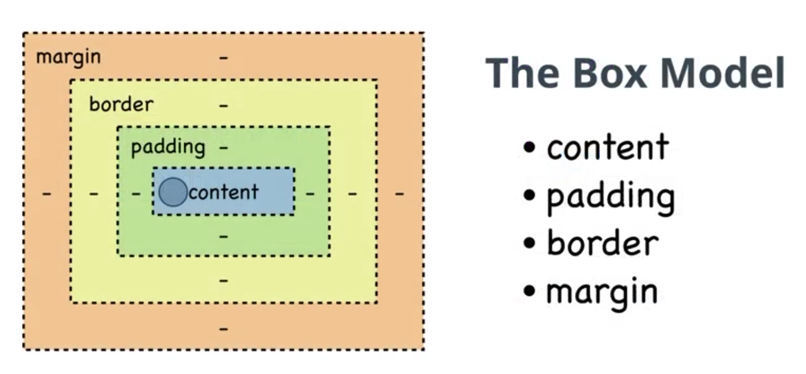

**content**
内容区域 content area  由内容边界限制，容纳着元素的「真实」内容，如文本、图像等。通常含有一个背景颜色（默认颜色为透明）或背景图像。

**padding**
内边距 padding 是指填充在内容与边框之间的距离

* 内边距区域 padding area 由内边距边界限制，扩展自内容区域，因此**其背景色与内容区域相同**。
* 内边距的大小由简写属性 `padding` 设置，遵循 [1-4 值语法](./常用样式.md#简写属性)，也可以通过次级属性 `padding-top`、`padding-right`、`padding-bottom`、`padding-left` 设置

**border**
边框区域 border area 由边框边界限制，扩展自内边距区域，是容纳边框的区域。边框的粗细由简写属性 `border` 设置，也可以使用次级属性 `border-width` 设置。

**margin**
外边距 margin 是元素与其相邻元素之间的空间，通过简写属性 `margin` 设置外边距的大小，或使用次级属性 `margin-top`、`margin-right`、`margin-bottom`、`margin-left` 单独设置个边外边距的大小 。

### 居中对齐
块元素默认会固定留在容器的**左侧**，可通过设置其盒子的 `margin` 属性实现元素的**居中**，将（左右）外间距设置为特殊关键字 `auto`，「自动」拆分元素左右外间距的水平空间，实现块元素居中排布在网页中，这种方法大量用于网站。

```css
div {
    margin: 0 auto;
}
```

:warning: 使用属性 `margin` 实现块元素居中，前提是设置了块元素的宽度大小，因为块元素宽度默认占据一整行，再设置左右边距就没有意义了。

### 可视化盒子
可使用开发者工具 dev tool 或 [盒模型在线工具](https://codepen.io/carolineartz/full/ogVXZj) 可视化盒子模型

* 在 `Elements` 选项中悬停在特定的 `<div>` 元素时可高亮盒子模型
* 选中后可在 `Styles` 标签页中查看盒子模型各部分的参数

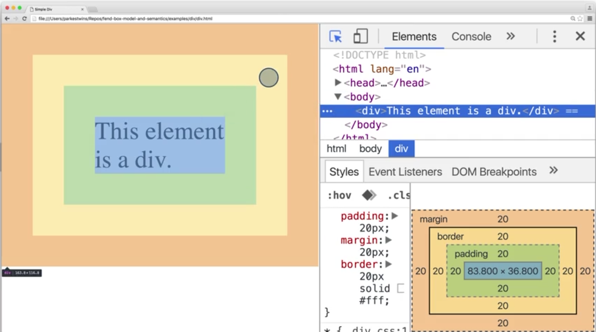

## 内联元素
虽然 `inline` 元素无法设置 `height` 或 `width` 等属性，但仍可以[对排版进行不少设置](./常用样式.md#段落)，如属性 `vertical-align`  设置行内垂直对齐方式，而设置块元素（容器）的水平对齐方式 `text-align` 则行内元素将会继承，属性 `line-height` 设置行间距。

网页中常用的内联元素 `<a>`、`<br>`、``、`<input>`、`<label>`、`<select>`、`<span>` 等
## 默认布局
HTML 元素有默认布局行为，称为普通流/文档流/标准流，即默认状态下元素自动从左往右、从上往下排列。

其中块元素会默认自动 100% 填充满父类元素的宽度，并且在垂直方向上依次排列，即限制为**单列布局**；内联元素会根据内容占据所需的宽度，并依次从左往右排列。

## 浮动布局
参考：
* [第七章：浮动](https://github.com/Benbinbin/INTERNETING-IS-HARD/wiki/Chapter07_Floats)
* [float - CSS | MDN](https://developer.mozilla.org/zh-CN/docs/CSS/float)

Floats 在早期用于实现杂志样式布局（文字围绕图片排列的布局）的技术，因此只能控制块元素水平方向堆叠，可实现块元素水平分布。

在容器（父元素）设置属性 `float` 以后其子元素就会「浮动」，即它们会被移出正常的文档流然后**向左或者向右平移**，直到碰到了所处的容器的边框，或者碰到另外一个浮动的元素。浮动可以实现多种复杂的布局，常见的布局包括：

- 侧栏布局
- 固定宽度布局（居中）
- 等屏宽布局
- 多列布局
- 网格布局
- 杂志样式布局（文字围绕图片排列的布局）

:warning: 开发者应尽可能使用 Flexbox 或 Grid 等现代的布局技术。只有在实现文本围绕布局的样式时（如杂志样式），或者需要兼容旧浏览器时，才使用 floats 技术。

### 浮动元素
通过设置容器（父元素） CSS 属性 `float` 将子元素定位转换为浮动布局。

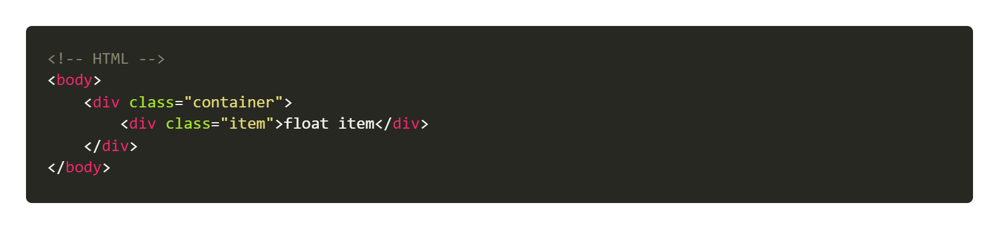
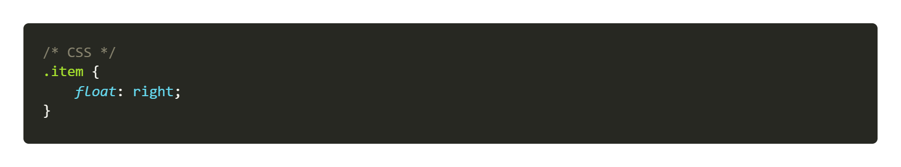

容器常用属性值：
* `float: none` 默认值，表示元素不进行浮动排布
* `float: left` 容器内的块元素在「浮动」到父元素（容器）的左侧，并允许文本等内联元素环绕
* `float: right` 容器内的块元素在「浮动」到父元素（容器）的右侧，并允许文本等内联元素环绕

:warning: 应用属性`float` 意味着子元素使用**块布局**，因此默认修改子元素的属性 `display` 为 `niline-block`

:bulb: 通过为**连续的块元素设置浮动**可以实现基本的网格布局，子元素实现水平并排分布（排布方向可以有多种形式），当部分块元素超出了父元素的宽度会**自动换行**。

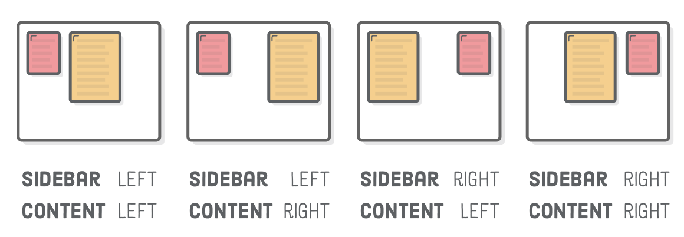

:bulb: 要将块元素设置为居中，可以使用 `margin: 0 auto;` 方法，但前提是**先要显式限制块元素的宽度**，否则块元素会基于父元素（容器）的宽度自动填充，则无左右对齐或居中的意义。而内联元素使用 CSS 属性 `text-align` 设置内容对齐方式的。


:warning: **左侧或右侧浮动与左对齐或右对齐不同**。当元素设置为浮动时，浮动的块元素「跳出」了原来的文档流，浮动在父元素之上，对父元素的垂直高度没有贡献。这也相当于告诉其邻近的块元素它们可以「流动」填充空余的位置，即其下的元素会向上「流动」直至紧挨着最近的未浮动的块元素。

:no_entry: 当上方的元素浮动后下方的元素会向上「流动」，会造成元素的部分重叠（浮动元素会**遮挡**向上「流动」的元素，虽然浮动元素「脱离」了文档流，当依然处在**文本流**当中，即内容并不会被遮挡，因此适合用于实现杂志布局），可以通过**清除浮动**解决这个问题，即忽略上方任何元素发生的浮动，相当于强制使其下方的元素遵循默认的垂直流布局不会「向上流动」。

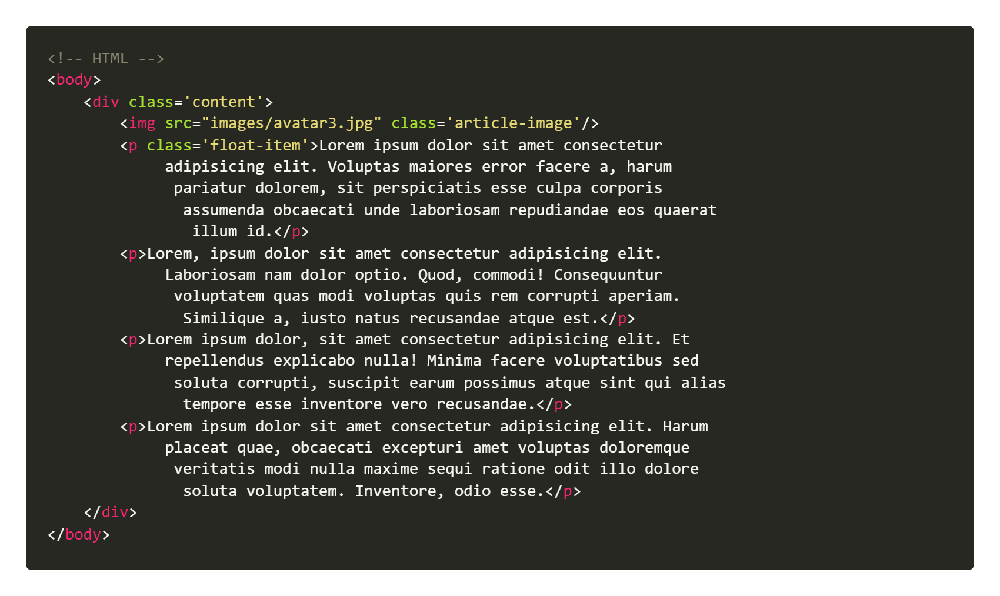
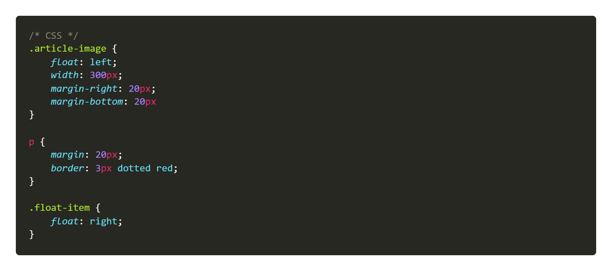
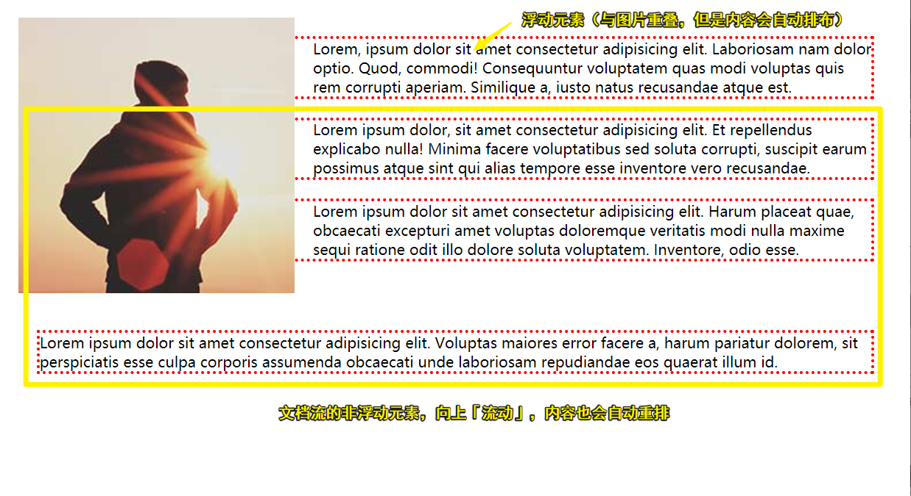

### 清除浮动
浮动后元素脱离普通流，使得包含浮动元素的容器出现「高度塌陷」，即浮动元素高度不纳入父元素（容器）的高度当中，称为 **「浮动溢出」**。

有两种方法解决浮动造成的元素重叠问题，将浮动元素再次纳入父元素（容器）的高度计算当中：

- 当容器内的浮动元素之下紧挨着还有 **（非浮动的）子元素**（如果没有可以在浮动元素后添加一个空的块元素 `<div>` 用以清理浮动），为该元素设置 CSS 属性 `clear`，属性值可以忽略上方特定方向的元素浮动（:warning: 如果对浮动元素设置 `clear` 清除浮动，就会将其自身取消浮动。）
  - `none` 默认值，不清除浮动
  - `left` 忽略其上向左侧浮动的块元素
  - `right` 忽略其上向右侧浮动的块元素
  - `both` 忽略其上两侧浮动（所有）块元素

  :bulb: 也可以使用伪元素选择器 `::after` 在容器最后添加内容，并设置为块元素 `display: block` （由于伪元素默认为行内元素）用以清除浮动
    ```css
    .container::after {
        content: "";
        display: block;
        height: 0;
        visibility: hidden;
        clear: both;
    }
    ```

- 当容器内的浮动元素之下没有（非浮动的）子元素（存在子元素也适用），为 **父元素（容器）** 设置 CSS 属性 `overflow: hidden` 以隐藏「浮动溢出」。

:bulb: 如果需要兼容 IE 6、7 需要为在清除浮动时，为容器设置 CSS 属性 `*zoom: 1`。

:warning: 可以为容器显式设置高度，或将容器也设置为浮动。但这两种方法都会产生额外的问题，如无法响应式改变高度，产生了新的浮动。

若将下方非浮动的子元素设置为 `display: hidden` 则可以实现**内容的隐藏浮动**，即环绕的杂志布局被破坏掉，一般用户评论卡片样式的分布。

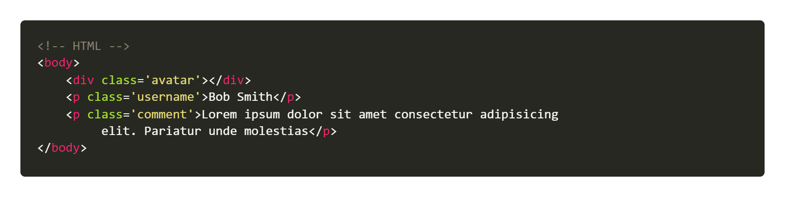
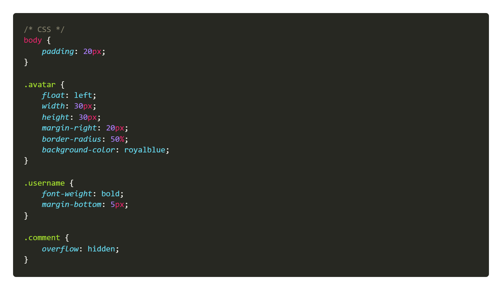
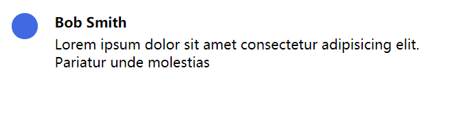

## 弹性布局
参考：
* [第八章：Flexbox](https://github.com/Benbinbin/INTERNETING-IS-HARD/wiki/Chapter08_Flexbox)
* [A Complete Guide to Flexbox](http://css-tricks.com/snippets/css/a-guide-to-flexbox/)（[中译版](https://segmentfault.com/a/1190000007550042)）
* [Flex 布局教程：语法篇](http://www.ruanyifeng.com/blog/2015/07/flex-grammar.html)
* [Flex 布局教程：实例篇](http://www.ruanyifeng.com/blog/2015/07/flex-examples.html)
* [第2天：图解 FlexBox 布局（上）](https://mp.weixin.qq.com/s/T-Z_8he9UxBBfL8Jb3zwtA)
* [第4天：图解 FlexBox 布局（下）](https://mp.weixin.qq.com/s/uct9apWqgznde1m2IMVgwA)

Flexbox 弹性盒提供一种更高效灵活的布局方式，容器的方向可改变，而容器中子项目的宽度或高度可按需改变，如拉伸子项目填满容器，因此称为 `flex`。

:bulb: Flexbox 布局主要适用于应用的组件以及小规模的布局，对于那些较大规模的布局 **[网格布局](https://css-tricks.com/snippets/css/complete-guide-grid/)** 更适用，可查看 [CSS框架](#CSS框架)。

### 概念术语
Flexbox 弹性布局由两类盒子模型组成：

- Flex containers 容器：用于容纳多个 flex items 元素，并定义它们的布局
- flex items 项目：容器的（直接）子元素，作为布局设置的单位


容器有两个轴/方向，项目默认沿主轴排列

* 水平的主轴 main axis
* 垂直的交叉轴 cross axis

Flexbox 是一整个模块，包括一系列属性，如设置多行或单行分布模式的属性 `flex-wrap`。其中一些属性是用在容器（父元素，即伸缩容器）上的，其他一些属性则是用在子元素（伸缩项目）上的。

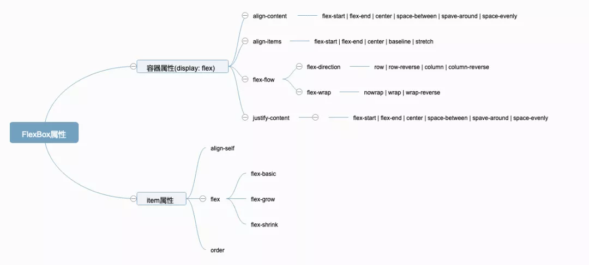

:bulb: 在容器内 flex items 弹性项目按设置排布，而 flex item 也可以作为容器，通过**内嵌**的方式构造出复杂的布局。

**容器的 6 个属性**
* `flex-direction`  主轴的方向（即项目的排列方向）
* `flex-wrap` 默认项目都排在一行，设置为 `wrap` 可实现自动换行
* `flex-flow` 是属性 `flex-direction` 和属性 `flex-wrap` 的简写形式，默认值为 `row nowrap`
* `justify-content` 设置项目在主轴上的对齐方式
* `align-items` 设置项目在交叉轴上的对齐方式
* `align-content` 定义了多根轴线的对齐方式（如果项目只有一根轴线，该属性不起作用），即如果 Flex 容器有「多行」时，它表示在「纵轴」方向的对齐方式。它的值与 `justify-content` 值相同。

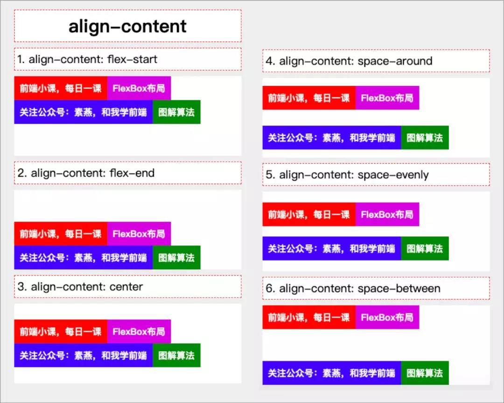

**项目的 6 个属性**
* `order` 定义项目的排列顺序，默认为 `0`，数值越小排列越靠前
* `flex-grow` 定义项目的放大比例，默认为 `0`，即如果存在剩余空间，也不放大
* `flex-shrink` 定义了项目的缩小比例，默认为1，即如果空间不足，该项目将缩小
* `flex-basis` 在分配多余空间之前，项目占据的主轴空间 main size。浏览器根据这个属性，计算主轴是否有多余空间。它的默认值为 `auto`，即项目的本来大小
* `flex` 属性是 `flex-grow`, `flex-shrink` 和 `flex-basis` 的简写（后两个属性可选），默认值为 `0 1 auto`。
* `align-self` 设置单个项目的对齐方式，以实现与其他项目不一样的对齐方式，可覆盖 `align-items` 属性

### 定义 Flex 容器
通过设置 CSS 属性 `display: flex` 将 HTML 元素设置为 Flex 容器，即告诉浏览器该元素内部的所有（直接）子元素都使用 flexbox 模型而非默认的盒子模型，视觉上是可以随着页面大小进行**自适应伸缩排版**

```css
.container {
    display: flex; /* or inline-flex */
```

为了兼容 Webkit 内核的浏览器，如 Safari，需要添加 `-webkit-` 前缀

```css
.container {
    display: -webkit-flex;
    display: flex;
}
```

:bulb: 也开始设置为行内 Flex 容器 `display: inline-flex`

:warning: 设为 Flex 布局以后，子元素的 `float`、`clear` 和 `vertical-align` 属性将失效。

### Flex 容器方向
Flex 容器方向是指容器内的项目排布的方向，通过 CSS 属性 `flex-direction` 设置容器方向，该方向也称为**主轴**，属性值可以是 `row`（默认值） 或 `column` 分别指水平或垂直方向。

响应式设计的关键是在移动和桌面端提供适应的网页布局，**flexbox 布局只需修改容器 CSS 属性 `flex-direction` 即可实现布局切换，是响应式布局的重要工具**。

:warning: 当容器的方向改变后，控制 flex 项目水平或垂直方向上对齐的属性作用也改变了。


容器方向规定了其中的项目排布方向（水平或垂直），此外还可以通过属性 `flex-direction` 设置项目的排布顺序，即项目排布顺序是从左往右或从右往左，还是从上到下或从下到上。

容器属性 `flex-direction` 可以设置多种属性值：

- `row` 项目从左往右排布
- `row-reverse` 项目从右往左排布
- `column` 项目从上向下排布
- `column-reverse` 项目从下向上排布


### flex 项目对齐
通过容器的 CSS 属性 `justify-content` 设置 flex 项目沿水平（主轴）方向。可以设置多种属性值，实现不同的对齐方式：

- `center` 居中
- `flex-start `对齐主轴的起点，一般相当于左对齐（默认值）
- `flex-end` 对齐主轴的终点，一般相当于右对齐
- `space-around` 每个项目两侧的间隔相等（平均分配空间）
- `space-between` 两端对齐，第一个项目贴齐主轴起点，最后一个项目贴齐主轴的终点
- `space-evenly` 每个 item 的间距相等（包括两侧 item 与容器边缘之间的距离）

通过设置容器的 CSS 属性 `align-items` 设置 flex 项目在垂直（交叉轴）方向的对齐方式。可以设置多种属性值，实现不同的对齐方式：

- `center` 居中对齐
- `flex-start` 顶部对齐
- `flex-end` 底部对齐
- `stretch` 项目占满整个容器的高度（如果项目未设置高度或设为 `auto`）
- `baseline` 项目的第一行文字的基线对齐

:bulb: 可以使用 flex 项目属性 `align-self` 设置单个项目自身垂直于主轴的对齐方式，可用属性值与 `align-items` 相同。


:bulb: 对项目进行分组（一般使用通用盒子 `<div>` 包含需要分组的元素），实现更多样化的排布。


### flex 项目换行
在 flexbox 布局中，容器中的项目默认在一行排布，超出容器宽度就会溢出（在浏览器中增添横向滑条），可以设置容器 CSS 属性 `flex-wrap: wrap` 实现项目超出容器宽度换行。

* 单行模式 `flex-wrap: nowrap;` 项目被摆放到到一行（默认不换行），可能导致溢出 Flex 容器
* 多行模式 `flex-wrap: wrap;` 项目可被打断到多个行中，根据容器大小分布元素。当容器变小时，通过多行分布而**保持项目大小不变**（而当容器过小，即每个元素已经是单行分布，元素大小才随容器变化）。
*


:bulb: 反向模式 `flex-wrap: wrap-reverse;` 换行且第一行在下方。


### flex 项目顺序（优先级别）
通过设置 flex 项目的 CSS 属性 `order` 可以改变元素在容器中的定位。flex 项目的 `order` 属性值都默认为 `0`，增加或减小属性值该项目在容器（相对于其他项目）的定位会向左或向右移动。

实际上 flex 项目是按照其 `order` 属性值从小到大排布，而当项目具有相同的属性值，则按照元素在 HTML 文档中的相对先后顺序定位。

:bulb: 项目属性 `order` 可以「跨行/列」进行定位设置（当容器设置了 `flex: wrap`），只要元素在同一个容器中即可，利用这一属性可以方便地调整项目的顺序。
项目属性 `order` 定义项目的排列顺序，**数值越小，排列越靠前**。

* 当项目 `order: -1;` 则优先排列
* 当项目 `order: 1;` 则排列在后（其他项目默认值为 `order: 0;`）

设置媒体查询当页面宽度大于 `700px` 时色块排列顺序改变
```html
<div class="container">
    <div class="blue"></div>
    <div class="green"></div>
    <div class="red"></div>
</div>
```

```css
@media screen and (min-width: 700px){
    .blue {order: 3;}
    .green {order: 2;}
    .red {order: 1;}
}
```

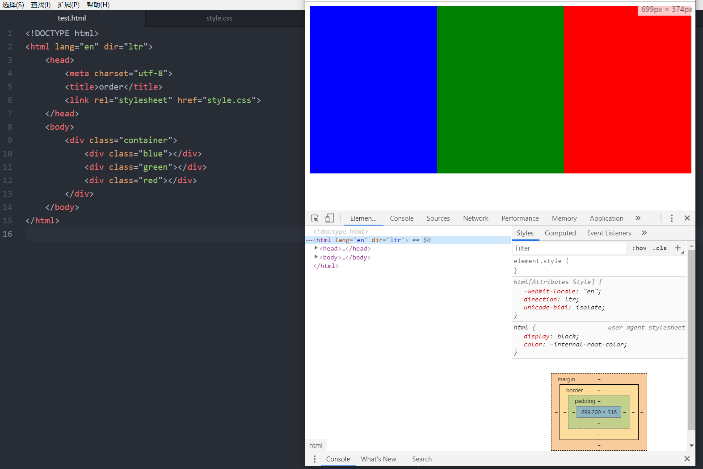

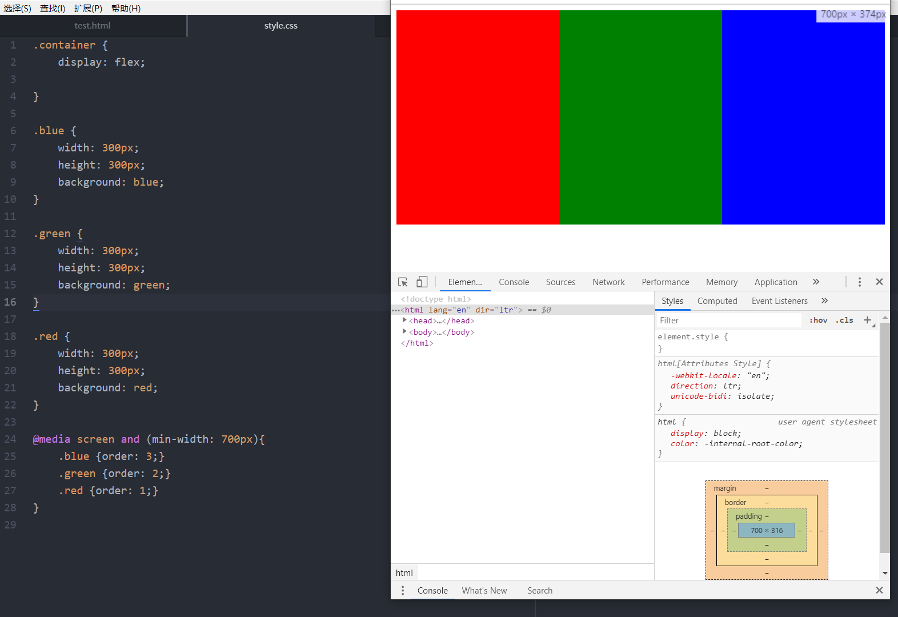

### flex 项目的「弹性」
Flexible box 一个特点是项目的「弹性」，即项目的宽度可以进行收缩和拉伸以匹配其容器的宽度，各项目的**伸缩比例还可以进行单独设置**，以实现多种方式的布局。

通过项目的 CSS 属性 `flex` 定义该元素可分配得到的容器宽度的比例，即属性值是一个权重，默认值为 1。


:bulb: `flex` 属性是 `flex-grow`, `flex-shrink` 和 `flex-basis` 的简写（后两个属性可选），默认值为 `0 1 auto`。

#### flex 项目扩展比例
flex 项目属性 `flex-grow` 的作用就是设定项目的扩展比例，即当所有的 item 未占满容器的宽度时，项目该如何扩充自己以填满容器的剩余空间。

:warning: 它受 `flex-basis` 的影响，一般假设项目在 `flex-basis: auto` 情况。

:bulb: 需要理解剩余空间的概念，它是指在 Flex 容器中如果所有 item 的宽度和小于容器的宽度时，那么容器的剩余空间等于容器宽度减去所有 item 宽度的和。

* 属性 `flex-grow` 的默认值为 0，表示即使有剩余空间 item 也不会扩充
* 将总剩余空间可以看成单位 1 整体，则每个 item 设置的 `flex-grow` 为扩展时占据的剩余空间比例（可以是小数，但不能是负数）
* 如每个 item 都设置了相同的扩展比例，则它们增加的宽度相同，且最终填充完剩余空间
    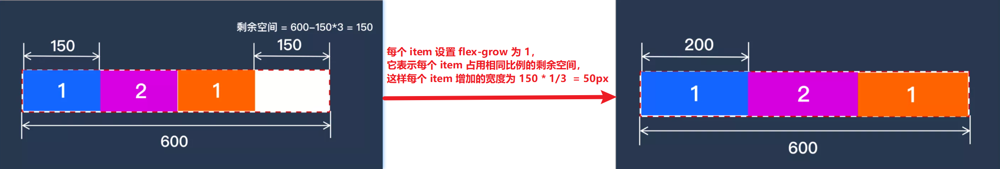
* 如果所有 item 设置了扩展比例之和不足 1，则项目扩展后依然会有剩余空间未被占用。
    

#### flex 项目收缩比例
flex 项目属性 `flex-shrink` 的作用就是设定项目的收缩比例，即当所有的 item 的宽度和大于容器的宽度，就会出现容器空间不足的情况，这时可以通过缩放每个 item 的宽度来适合容器大小。

属性 `flex-shrink` 的默认值为 1，表示即所有项目的收缩比例相同，一旦出现容器空间不足，项目都会缩放相同的尺寸直至适合容器。通过设置该属性可以控制容器内各个项目的收缩方式（比例）。

:warning: 但是这个属性和 `flex-grow` 在极端的情况下表现并不相同，因为在缩小的过程中，不会把 item 的尺寸缩小到 `0`，它会受 `min-content` 的影响，也会受 `min-width` 的影响，缩到一定尺寸后它就不再进行缩放了。

#### flex 项目伸缩基准
flex 项目属性 `flex-basis` 表示 item 未扩展或收缩之前的宽度，可以理解为 item 未放入容器时该有的尺寸。:warning: 该属性会影响剩余空间和不足空间的计算，即对 `flex-grow` 和 `flex-shrink` 有很大的影响。

* 默认值是 `auto` 基于项目内容来计算项目的初始尺寸
* 如果显式地设置了项目的宽度  `width` 属性值，同时 `flex-basis` 为 `auto` 时，就会以该宽度值为 `flex-basis` 的值
* 如果项目显式的设置了 `width` 值，同时显式设置了 `flex-basis` 的具体值，则项目会忽略 `width` 值，会按 `flex-basis` 来计算项目初始宽度 :bulb: 对于 Flexbox 布局中，不建议显式的设置项目的 `width` 值，而是通过 `flex-basis` 来控制项目的宽度，这样更具弹性
* 设置 `flex-basis` 为 `0` 时每个 item 的初始宽度为 0，相当于所有的空间都可以平均进行分配，这样就达到了所有的 项目最终的宽度一样
* 当 Flex 容器剩余空间不足时，项目的实际宽度并不会按 `flex-basis` 来计算，会根据 `flex-grow` 和 `flex-shrink` 设置的值给项目分配相应的空间
* 如果项目显式地设置了 `min-width` 或 `max-width` 值时，当 `flex-basis` 计算出来的值小于 `min-width` 则按 `min-width` 值设置项目宽度，反之计算出来的值大于 `max-width` 值时，则按 `max-width` 的值设置项目宽度

总的来说 `flex-basis` 最终的值会以 `flex-basis` -> `content size` -> `width` 的属性依次确定它的值


## 网格布局
参考：
- [A Complete Guide to Grid](https://css-tricks.com/snippets/css/complete-guide-grid/)（[中译版](https://jirengu.github.io/css-you-should-know/zh-cn/a-complete-guide-css-grid-layout.html)）
- [网格布局的基本概念](https://developer.mozilla.org/zh-CN/docs/Web/CSS/CSS_Grid_Layout/Basic_Concepts_of_Grid_Layout)
- [A Complete Guide to Flexbox](https://css-tricks.com/snippets/css/a-guide-to-flexbox/)
- [An Introduction to the `fr` CSS unit](https://css-tricks.com/introduction-fr-css-unit/)
- [Grid by Example](https://gridbyexample.com/)
- [Explicit and Implicit Grid](https://gridbyexample.com/examples/example10/)

网格布局是将网页划分为规则的网格，便于将元素快速分配对应区域上。

### 基本的网格布局框架
大部分网格布局使用**12列**进行排版，以便于网页可以灵活地实现2、3、4等分的分布设计，可以通过该原则手动构建一个基本的网格布局框架。

:bulb: 为了实现响应式网站，网格的宽度设置均使用百分比

* 父元素设置 `.row` 类设置行占比为 `100%`，可使网格的**行**尽可能地铺满网页
* 子元素设置 `.col` 类，且按需挑选**12种**宽度占比，可使网格按需占位网页宽度

|   类名称  | 页面宽度占比 | 页面宽度百分比 |
| --------- | ----------- | ------------- |
| `.col-1`  | `1/12`      | `8.33%`       |
| `.col-2`  | `2/12`      | `16.66%`      |
| `.col-3`  | `3/12`      | `25%`         |
| `.col-4`  | `4/12`      | `33.33%`      |
| `.col-5`  | `5/12`      | `41.66%`      |
| `.col-6`  | `6/12`      | `50%`         |
| `.col-7`  | `7/12`      | `58.33%`      |
| `.col-8`  | `8/12`      | `66.66%`      |
| `.col-9`  | `9/12`      | `75%`         |
| `.col-10` | `10/12`     | `83.33`       |
| `.col-11` | `11/12`     | `91.66`       |
| `.col-12` | `12/12`     | `100%`        |

:bulb: 希望包含尽可能多的小数点数以保持宽度值准确，一个好的经验法则是**使用 7 位小数点数**。

基本框架格式
```css
/* CSS */
/* grid 类是最顶端的父类，设置属性 margin 使网格在页面居中显示 */
.grid {
        margin: 0 auto;
        width: 100%
    }

/* 设置父元素 row 为 flexbox 布局，其宽度为其父元素 grid 宽度的 100%，使框架尽可能铺满容器*/
.row {
    width: 100%;
    display: flex;
}

/* 提供备选的 12 种子元素样式，依据所需选择 */
.col-1 {
    width: 8.33%;
}

.col-2 {
    width: 16.66%;
}

.col-3 {
    width: 25%;
}

.col-4 {
    width: 33.33%;
}

.col-5 {
    width: 41.66%;
}

.col-6 {
    width: 50%;
}

.col-7 {
    width: 58.33%;
}

.col-8 {
    width: 66.66%;
}

.col-9 {
    width: 75%;
}

.col-10 {
    width: 83.33%;
}

.col-11 {
    width: 91.66%;
}

.col-12 {
    width: 100%;
}
```

```html
<!-- html -->
<div class="row">
		<div class="col-3">3 Columns</div>
		<div class="col-9 end">9 Columns</div>   <!-- 在 HTML 中将网格布局的最后一个网格类名设置为 `.col-9 end` 即未指定宽度占比，则该行除了第一个网格 `col-3` 按照设定占据 `25%`，余下空间都由 `col-9 end` 网格占据，这两个网格组合 `100%` 满铺该行 -->
</div>
```

```css
.row {
    width: 100%;
    margin-bottom: 20px;
    display: flex;
}

.col-3 {
    width: 25%;
}
```

:bulb: 动态网格布局是指**纵列可动态调整**，即将网格布局和 Flexbox 布局相结合，页面网格除了可随页面缩放，当窗口过小网格还会自动顺延到下一行，改变布局以适应页面，提供更佳的响应式设计。多种主流的框架 framework 提供动态网格系统，如 [Bootstrap](http://getbootstrap.com/)，其核心是弹性框 flexbox。

### Grid 新语法
以前开发中一般通过框架 CSS framework 实现网格布局（CSS 框架是是一些用于控制布局的 CSS 类的集合），可以看作是一种**预先准备好的软件框架**，旨在实现更简单、更符合标准的网页设计；而如今利用 CSS Grid 模块新增的语法可以更方便地创建各种不同的网格布局。多种主流的浏览器已[支持 CSS Grid 模块](http://caniuse.com/#feat=css-grid)新的语法，使得用原生的 CSS 语法（而非基于框架）实现各种网格布局更方便。

#### 概念术语

* **Grid Container 网格容器**（HTML 结构概念）：设置了 `display: gird` 的元素，是所有网格项 grid item 的直接父项
* **Grid Item 网格项**（HTML结构概念）：网格容器的**直接子元素**，网格项可以占据单个网格单元 grid cell 也可以跨多个

* **Grid Line 网格分界线**（可视化概念）：包括水平分界线 row grid lines 和垂直分界线 column grid lines，网格结构由分界线组成
* **Grid Track 网格轨迹**：两个相邻网格线之间的空间，即整一行或整一列的空间
* **Grid Cell 网格单元**：两个相邻的行和两个相邻的列网格线之间的空间
* **Grid Area 网格空间**：四个网格线包围形成的闭合总空间，可以由任意数量的网格单元组成，类似于 Grid Item（网格项是从 HTML 结构的角度来描述网格空间）
* **Grid Column 网格列**：从左到右（或网格的宽度）定义网格
* **Grid Row 网格行**：从上到下（或网格的高度）定义网格

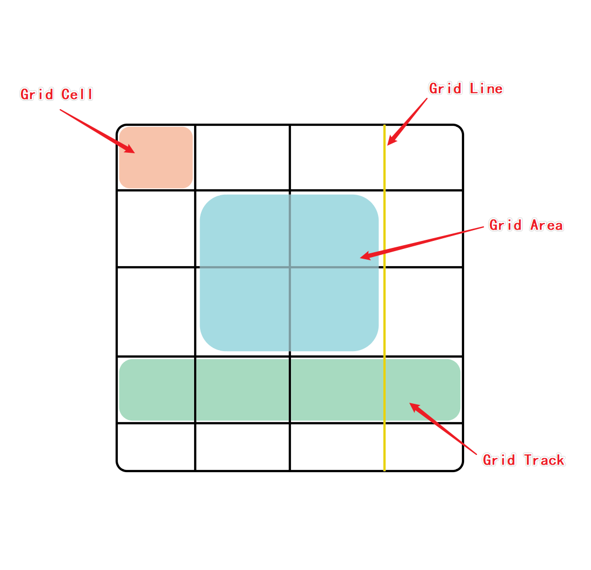

#### 创建网格

将元素定义为网格容器 `display: grid`，即可建立新的网格格式化上下文。实际上还可以创建 `inline-grid` 或 `subgrid`，即生成一个行级 inline-level 网格或一个嵌套网格。

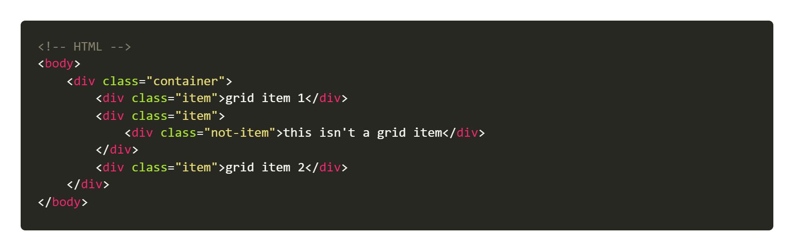
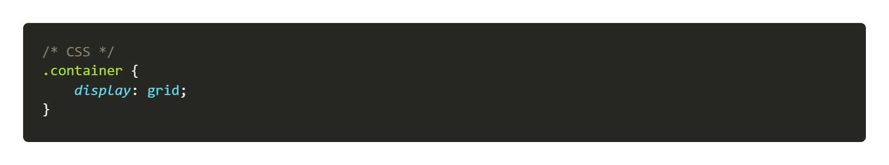

该元素称为父容器 Grid Container，其直接子元素称为网格项 Grid Items，分别具有不同的 CSS 属性用以定制网格的样式（类似于 Flexbox 布局的 Flex 容器与 flex 项目） 。

**Grid Container 的全部属性**：

- `display`
- `grid-template-columns` 定义网格的各列空间大小
- `grid-template-rows` 定义网格的各行空间大小
- `grid-template-areas` 定义网格空间的名称，可以将多个网格单元定义为一样的名称以实习内容扩展到这些单元格
- `grid-template`
- `grid-column-gap` 定义列间距
- `grid-row-gap` 定义行间距
- `grid-gap` 定义列间距或行间距的简写属性
- `justify-items` 定义网格项里的**内容**沿着行轴的对齐方式
- `align-items` 定义网格项里的**内容**沿着列轴的对齐方式
- `justify-content` 定义**网格单元**沿着行轴的对齐方式
- `align-content` 定义**网格单元**沿着列轴的对齐方式
- `grid-auto-columns`
- `grid-auto-rows`
- `grid-auto-flow`
- `grid`

**Grid Items 的全部属性**：

- `grid-column-start`
- `grid-column-end`
- `grid-row-start`
- `grid-row-end`
- `grid-column`
- `grid-row`
- `grid-area`
- `justify-self`
- `align-self`


#### 创建网格模板

使用父容器的 CSS 属性 `grid-template-colums` 和 `grid-template-rows` 定义网格的列与行的大小模板（即 grid track 轨道空间）。

使用以**空格分隔**的多个值来定义网格的列和行（空格可以想象为表格线），值的类型可以不同，如使用绝对单位、相对单位或 `auto` 关键字。

```css
.container {
  display: grid;
  grid-template-columns: 40px 50px auto 50px 40px;
  grid-template-rows: 25% 100px auto;
}
```


上述示例为容器创建一个 3 行 5 列的网格，并定义了轨道空间。

:bulb: `auto` 是一个特殊的值，表示该网格项的空间会自动根据内容动态变更。

:bulb: 定义空间大小的单位可以使用绝对单位如 `px`，或相对单位如百分比 `%` 或 剩余空间等分比例 `fr`

单位 `fr` 指容器的自由空间，即排除容器中所有不可伸缩的 grid item 之后计算得到的空间，其数值表示该网格项占据的自由空间的等分比例。

而百分比则是针对容器的整个空间计算的（并未排除不可伸缩的网格项占据的空间）。

每个 grid item 为 grid container 宽度的三分之一：

```css
.container {
  display: grid;
  grid-template-columns: 1fr 1fr 1fr;
}
```

:bulb: 可以使用函数 `repeat(time, size)` 快速地创建一系列大小相同的区间

```css
.container {
    display: grid;
    grid-template-columns: repeat(4, 1fr);
    grid-template-rows: repeat(4, 1fr);
}
```

:bulb: 网格布局还支持创建嵌套的网格 `subgrid` 相关用法可查看 [CSS Grid subgrid lands in Firefox Nightly](https://www.rachelandrew.co.uk/archives/2019/05/23/css-grid-subgrid-lands-in-firefox-nightly/)

#### 网格模板区域命名

使用父容器的 CSS 属性 `grid-template-areas` 为网格单元进行命名，每一行的命名包括在引号内（每一行中不同单元格命名以空格分隔），不同行以空格分隔。

```css
.container {
  display: grid;
  grid-template-columns: 50px 50px 50px 50px;
  grid-template-rows: auto;
  grid-template-areas:
    "header header header header"
    "main main . sidebar"
    "footer footer footer footer";
}
```

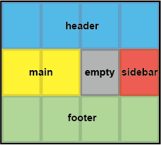

上述示例为容器创建一个 3 行 4 列的网格，除了定义了轨道空间，还为每个网格单元进行命名，**使用相同名称可以实现单元格的「合并」（将网格项映射到对应名称的模板区域时，可以让元素扩展到这些空间中）**。

:bulb: 命名网格单元时使用点 `.` 来声明空单元格

使用父容器的 CSS 属性 `grid-column-gap` 和 `grid-row-gap` 指定网格线的大小，相当于网格单元的间距大小。

```css
.container {
  display: grid;
  grid-template-columns: 100px 50px 100px;
  grid-template-rows: 80px auto 80px;
  grid-column-gap: 10px;
  grid-row-gap: 15px;
}
```


上述示例为容器创建一个 3 行 3 列的网格，并设置了轨道空间和行与列的间距。

:warning: 网格间距只是在列/行之间缝隙，而不在外部边缘创建（可以通过 `margin` 或  `padding` 设置网格容器边缘的空间留白）

:bulb: 可以使用父容器的 CSS 简写属性 `grid-gap` 设置间距，接受两个属性值依次设置行和列的间距，若只传递一个值则默认为行与列的间距相等。

```css
.container {
  grid-gap: <grid-row-gap> <grid-column-gap>;
}
```

#### 网格项的映射

创建了网格模板后，容器中的网格项默认依次（从左向右，从上到下）填入网格模板单格区域中，通过网格项命名，或网格列与行的指定，将网格项放置在网格模板中特定区域。

##### 网格项命名

使用 CSS 属性 `grid-area` 为单个网格设置名称，该名称与父元素（容器）在属性 `grid-template-areas` 中创建的区域名称相对应，以将网格项的元素放置在对应的区域中。

```css
.container {
  display: grid;
  grid-template-columns: 50px 50px 50px 50px;
  grid-template-rows: auto;
  grid-template-areas:
    "header header header header"
    "main main . sidebar"
    "footer footer footer footer";
}

.item-d {
  grid-area: header
}
```

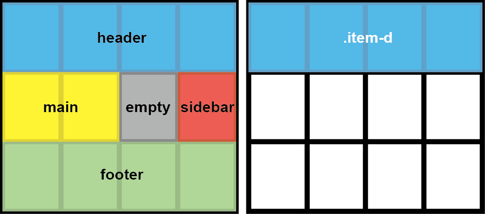

:warning: 网格项 `grid-area` 引用在容器创建的区域预设的名称时，**不**需要引号将字符串包括起来。

##### 网格列和行指定

使用 CSS 属性 `grid-column` 和 `grid-row` 基于网格线制定出一个矩形区域，确定 grid item 在网格内的位置。

属性值可以有多种形式：

* 分别列出网格线的起始位置与终止位置，并以斜线 `/` 分隔 `grid-start-line / grid-end-line`
* 列出网格线的起始位置，并用关键字 `span` 指定横跨的网格数量，并以斜线 `/` 分隔 `grid-start-line / span N`

```css
.container {
  display: grid;
  grid-template-columns: 50px 50px 50px 50px;
  grid-template-rows: auto;
  grid-template-areas:
    "header header header header"
    "main main . sidebar"
    "footer footer footer footer";
}

.item-c {
  grid-column: 1 / 5;
  grid-row: 3 / 4;
}
```

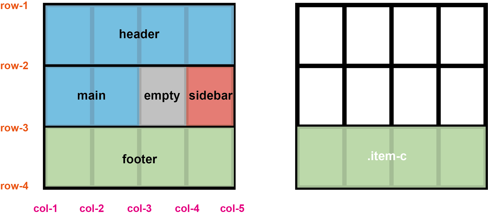

:bulb: 网格线的指定可以使用序号，也可以使用预设的名称。

:warning: 当网格线的终止位置比起始位置（数值）小，则忽略终止位置，按照起始位置为基准元素默认横跨一个网格。

#### 网格项对齐方式

网格项 grid item 对齐方式是指每个网格单元（其中的内容）沿着行轴或列轴对齐方式。

使用父容器 CSS 属性 `justify-items` 和 `align-items` 定义网格项沿水平轴和垂直轴方向的对齐方式，有多个属性值可选以设置不同的对齐方式

* `start` 网格项的内容与网格区域的左端或上端对齐
* `end` 网格项的内容与网格区域的右端或下端对齐
* `center` 网格项的内容位于网格区域的中间位置
* `stretch` 网格项的内容宽度占据整个网格区域空间（默认值）

```css
.container {
  justify-items: center;
    align-items: start;
}
```

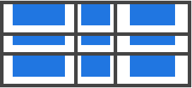

示例将网格项沿行轴居中对齐，沿竖轴顶端对齐。

:warning: 当所有网格项 grid items 都使用像单位 `px` 这样的非弹性单位来设置大小，则可能会造成网格的总大小小于其容器的情况，这时**网格整体的对齐方式**使用的是另外两个不同的属性，分别使用 `align-content`  和 `justify-content` 设置网格整体沿列轴和行轴的对齐方式，有多种属性值可选：

- `start` 网格整体与网格容器的左端或顶部对齐
- `end` 网格整体与网格容器的右端或底部对齐
- `center` 网格整体居中
- `stretch` 调整 grid item 的大小，让高度填充整个网格容器
- `space-around` 在 grid item 之间设置均等宽度的空白间隙，其外边缘间隙大小为中间空白间隙宽度的一半
- `space-between` 在 grid item 之间设置均等宽度空白间隙，其外边缘无间隙
- `space-evenly` 在每个 grid item 之间设置均等宽度的空白间隙，包括外边缘

```css
.container {
  justify-content: center;
}
```


:bulb: 还可以针对**单个网格项**对齐方式进行设置，单个网格项 grid item 的 CSS 属性 `justify-selft` 或 `align-self` 分别设置沿行轴或沿列轴的对齐方式，有多种属性值可选：

- start - 将内容对齐到网格区域的左端或上端
- end - 将内容对齐到网格区域的右端或下端
- center - 将内容对齐到网格区域的中间
- stretch - 填充网格区域的宽度 (这是默认值)

```css
.item-a {
  justify-self: start;
}
```


#### 显式网格与隐式网格

以上手动划分创造的网格项称为 explicit grid 显式网格 ，在使用网格时若超出了预设的（行或列）范围就会自动生成网格轨道，也称为 implicit grid 隐式网格。

隐式网格的轨道（即网格宽度）默认为 0，可以使用网格容器的 CSS 属性 `grid-auto-columns` 或 `grid-auto-row` 预设隐式轨道的大小。

```css
/* create a grid */
.container {
  grid-template-columns: 60px 60px;
  grid-template-rows: 90px 90px
}
/* use grid */
.item-a {
  grid-column: 1 / 2;
  grid-row: 2 / 3;
}
.item-b {
  grid-column: 5 / 6;
  grid-row: 2 / 3;
}
```


```css
/* define implicit grid width */
.container {
  grid-auto-columns: 60px;
}
```

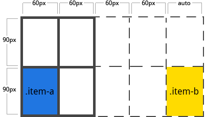

### 定位模型
参考：[第九章：高级定位](https://github.com/Benbinbin/INTERNETING-IS-HARD/wiki/Chapter09_Advanced_Positioning)

CSS 还提供了 position 定位布局模块，它与元素定位和层叠相关，可以实现更高级的元素定位方式，如相对定位、绝对定位、固定定位。这些方式允许使用特定的坐标手动定位元素，这种布局方式一般用于需要更精确定位的元素。

网页大部分的元素都是使用静态流式定位，而少部分（如调整特定元素的位置或为 UI 组件设置动画而不弄乱周围的元素时）需要更精确的元素使用高级定位方式。

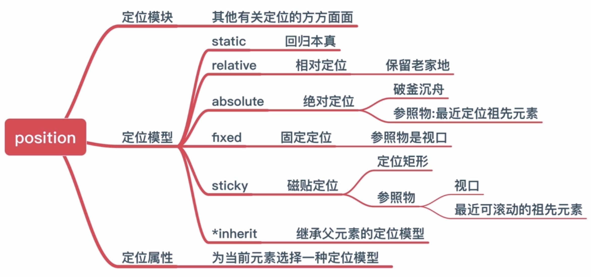

#### 定位元素
元素的 CSS 属性 `position` 可以更改该元素的定位方案，其默认方式是 `static`（静态定位/自然定位模型，即常见的文档流式布局，包括 CSS 盒子模型、浮动模型、flexbox 模型布局方案）。

:bulb: 当元素的 CSS 属性设置为 `position: static` 实现静态定位，则元素会忽略 `top`、`bottom`、`left`、`right`、`z-index` 等与定位元素样式相关的声明。

当一个元素的 `position` 属性值不是 `static` 时，该元素称为**定位元素**，有多种属性值实现不同的定位方式：

- `relative` 相对定位
- `absolute` 绝对定位
- `fixed` 固定定位
- `sticky` 磁贴定位模型


#### 相对定位
将 CSS 属性设置为 `postion:relative` 实现元素的相对定位，即以元素在静态流中的（原始）位置作为基准进行偏移，常用于实现轻推盒子的效果。属性 `top`、`bottom`、`left`、`right` 设置该元素相对于静态位置偏移的方向和距离，类似于为元素设置了一个 (x, y) 坐标。

:bulb: 设置为 `position: relative` 的元素成为**可定位的祖先元素**，即其他定位的参照系，如子元素设置为 `position: absolute` 时参照该元素的位置进行偏移。


:bulb: 属性 `top`、`bottom`、`left`、`right` 的属性值可以是**负数**，即向相反方向移动，

:bulb: 相对定位主要用例之一是移动动画，利用 JavaScript 循环迭代修改元素的偏移参数。

:bulb: 相对定位可以应用于浮动元素，使浮动元素也可以基于浮动后的位置再进行偏移。

:warning: 相对定位元素偏离并不会对其他元素的定位造成影响，**静态（原始）位置作为占位看待**，

#### 绝对定位
将 CSS 属性设置为 `position:absolute` 实现元素的绝对定位，**元素从页面的静态流布局中移除，因此会 影响原始的布局**。绝对定位是以祖先元素（容器）中**最近一个定位元素**（如果祖先元素中没有定位元素，则选择浏览器窗口）作为偏移的参考系。


类似地也是通过元素 CSS 属性 `top`、`bottom`、`left`、`right` 设置偏移的方向和距离。

:bulb: 绝对定位元素**尺寸大小**使用百分比进行设置时，也是以其参照物（最近的定位祖先元素 或 `<body>`）尺寸为基准。

:warning: 绝对定位以整个浏览器窗口为参考的默认行为在大多数情况下并没有那么有用，因为常常造成不可预测的重叠。一般使用**「相对的」绝对定位**（即将绝对定位元素的祖先元素（容器）定义为相对定位元素 `position: relatice` 作为参照物）对子元素进行布局操作。

:bulb: 一个小技巧实现居中定位，将四个方向的偏移量都设置为 0（对齐到祖先元素各边），并将绝对定位元素的外边距四周都设置为 `auto` 即可实现元素（相对于最近的定位祖先元素）居中定位

```css
.container {
    width: 1000px;
    height: 1000px;
    position: relative;
}

/* 后代绝对定位元素实现居中分布（相对于其最近的定位祖先元素） */
.sub-item {
    width: 80px;
    height: 80px;
    position: absolute;
    top: 0;
    bottom: 0;
    left: 0;
    height: 0;
    margin: auto;
```

#### 固定定位
将 CSS 属性设置为 `position: fixed` 实现元素的固定定位，**元素也从静态流布局中移除（因此会影响原始的布局），定位以整个浏览器窗口/视口作为基准**。

类似地也是通过元素 CSS 属性 `top`、`bottom`、`left`、`right` 设置偏移的方向和距离。

与绝对定位的主要区别，在于固定元素**不会随页面一起滚动**（类似于钉在了窗口上，一直在固定区域显示），一般用于导航栏固定在窗口中。


#### 粘性定位
将 CSS 属性设置为 `position: sticky` 实现元素的粘性定位，也称为磁贴定位/吸附定位，可以现象粘性定位是在预设的偏移处有一个「隐形」区域（该区域大小与粘性定位元素尺寸相同），当页面滚动使粘性定位元素进入这个区域，它就会被「吸附」变成一个固定定位元素。

`sticky` 粘性定位是 `fixed` 固定定位和 `relative` 的结合，在未「吸附」时元素以相对定位布局，此时元素并未从静态流布局中移除；而当页面滚动，元素进入「捕获」区域，被「吸附」就变成固定定位，元素就会固定在一个地方。

:bulb: 定位以最近的祖先定位元素（没有祖先定位元素就以整个浏览器窗口/视口作为基准）作为偏移参考系。类似地也是通过元素 CSS 属性 `top`、`bottom`、`left`、`right` 设置偏移的方向和距离。


:point_right: [在线演示](https://codepen.io/benbinbin/pen/abOxEyO)

:bulb: 该属性较新，应该在使用前考虑[浏览器兼容问题](https://caniuse.com/#search=sticky)。类似的效果可以使用 JavaScript 脚本实现。

### Z-index

定位元素跳出了静态流布局，可能与其他元素存在重叠，（必须为定位元素）元素的 CSS 属性 `z-index` 控制元素在页面的深度，属性值可以是正或负的整数（负值表示元素在下方，而正值表示元素会出现在上方），默认值为 0。


## 基本布局设计

### 行布局
默认的文档流，块元素占据单行单列，在桌面端模式元素 （可能为垂直和水平方向上），在缩放时可响应式地进行宽度调整（宽度使用相对单位，一般是百分比）。

垂直水平居中可以利用定位元素

```css
.container {
    position: relative;
}

.sub-item {
    position: absolute;
    left: calc(50% - width/2);
    top: calc(50% - width/2);
}
```

### 列布局
可以采用不同的方法多列布局，常见的是两列布局和混合布局。

* 两列布局：可以将两个容器都设置为浮动元素，而且将其宽度设置为百分比以实现响应式设计。

* 混合布局：将行布局和列布局混合使用，一般在头部和脚注使用行布局（分别占满一行），内容部分一般分为两列（包括侧边栏）。

### 三列布局
参考：

* [In Search of the Holy Grail](https://alistapart.com/article/holygrail/) – A List Apart （[中译版](https://segmentfault.com/a/1190000004524159)）
* [圣杯布局和双飞翼布局的理解与思考](https://www.jianshu.com/p/81ef7e7094e8) - 简书
* :cinema: [CSS圣杯布局和双飞翼布局](https://youtu.be/mYllLGA2_So) - Web前端工程师面试题讲解

有一种特殊的三列布局，其两侧是固定宽度，中间一列是可以响应式的，这种布局有两种经典的方法实现。

#### 圣杯布局
由 Kevin Cornell 提出的一个布局模型概念。它是三列布局，其中左右两列是宽度固定，中间一列宽度是自适应的，在允许任意列的高度最高（即每一列的高度都可作为中间区域的高度参考）。

:bulb: 中间栏在浏览器中需要优先渲染展示，因此需要将中间容器元素比另两列的元素在 HTML 文档中优先编写。

这种布局主要使用的技术：
* 使用 `float` 浮动中间元素实现水平排布
* 容器设置了 `padding-left` 和 `padding-right` 左右内边距，预留空间以容纳 `#left` 和 `#right` 左右两个元素
* 左右元素使用 margin 负值实现移动到特定的位置，左侧元素还需要使用相对定位 `position: relative`

```html
<div class="header">
  <h1>HEADER</h1>
</div>
<div class="container">
  <!-- 需要先加载中间一栏，所以 HTML 里中间 DOM 元素在前 -->
  <div class="column" id="center">
    <h3>CENTER</h3>
  </div>
  <div class="column" id="left">
    <h3>LEFT</h3>
  </div>
  <div class="column" id="right">
    <h3>RIGHT</h3>
  </div>
</div>
<div class="footer">
  <h1>FOOTER</h1>
</div>
```

```css
/*
* 使用 float 浮动中间元素实现水平排布
* 容器使用 padding 在两侧留出空间
* 左右元素使用 margin 负值实现移动到特定的位置
*/
.container {
  /* 容器使用 padding 在两侧留出空间 */
  padding-left: 200px;
  padding-right: 150px;
  overflow: hidden; /* 清除浮动 */
}

/* 中间元素均浮动，实现水平排布 */
.column {
  height: 200px;
  float: left;
}

#center {
  width: 100%;
  background-color: #d6d6d6;
  border: 2px solid yellow;
}

#left {
  width: 200px; /* 左侧宽度固定 */
  background-color: #7abbde;
  /* 通过 margin-left 负值将自身往左移动 100% 父容器宽度，因此达到 #center 元素的左侧 */
  margin-left: -100%;
  /* 再使用相对定位基于自身原来的位置往距离右侧增加 200px，相当于往左移 200px 到达预留的左侧栏 */
  position: relative;
  right: 200px;
}

#right {
  width: 150px; /* 右侧宽度固定 */
  background-color: #fe6635;
  /* 通过 margin-right 负值设置为自身的「宽度」，类似于将自身宽度设为 0，这样就「不占空间」，所以不会换行，直接浮动在同一行，视觉上就相当于占据右侧 */
  margin-right: -150px;
}

```

:point_right: [在线演示](https://codepen.io/benbinbin/pen/rNVgVMe)

:warning: 但是如果将浏览器变窄，「圣杯」将会「破碎」掉，即当 `#center` 部分的宽小于 `#left` 部分时就会发生布局混乱。于是淘宝工程师针对圣杯布局的缺点做了优化，并提出双飞翼布局。

#### 双飞翼布局
类似于圣杯布局，但是**该布局并没使用相对定位**，单纯利用浮动元素实现。

* 使用 float 浮动中间元素，实现水平排布
* 修改了 HTML 结构，为中间布局添加额外的包裹容器 `.main-wrap` ，并为设置 `margin-left` 和 `margin-right` 左右外边距，为左右两个元素预留空间
* 左右元素使用 margin 负值实现移动到特定的位置，不需要使用相对定位

```html
<div class="header">
  <h1>HEADER</h1>
</div>
<div class="container">
  <div id="center" class="column">
    <!-- 增加了一个容器层级 -->
    <div class="main-wrap">
      <h3>CENTER</h3>
    </div>
  </div>
  <div id="left" class="column">
    <h3>LEFT</h3>
  </div>
  <div id="right" class="column">
    <h3>RIGHT</h3>
  </div>
</div>
<div class="footer">
  <h1>FOOTER</h1>
</div>
```

```css
/*
* 使用 float 浮动中间元素，实现水平排布
* 增加了一个容器层级修复了圣杯布局在中间内容部分宽度过小造成「破碎」跑版的问题
* 使用 margin 在容器两侧留出空间
* 左右元素使用 margin 负值实现移动到特定的位置，不需要使用相对定位
*/

.container {
  width: 100%;
  overflow: hidden; /* 清除浮动*/
}

/* 中间元素均浮动，实现水平排布 */
.column {
  float: left;
}

#center {
  width: 100%;
}

/* 增加了一个容器层级，使用 margin 在容器两侧留出空间 */
.main-wrap {
  margin-left: 200px;
  margin-right: 150px;
  background-color: #d6d6d6;
  border: 2px solid yellow;
}

#left {
  width: 200px; /* 左侧宽度固定 */
  height: 100px;
  background-color: #7abbde;
  margin-left: -100%; /* 通过 margin-left 负值将自身往左移动 100% 父容器宽度，因此达到 #center 元素的左侧，即到达预留的左侧栏 */
  /* 不需要使用相对定位 */
}

#right {
  width: 150px; /* 右侧宽度固定 */
  height: 100px;
  background-color: #fe6635;
  margin-left: -150px;
  /* 通过 通过 margin-left 负值将自身往左移动 150px 到达预留的右侧栏 */
}
```

:point_right: [在线演示](https://codepen.io/benbinbin/pen/LYVoVOO)

:bulb: 推荐使用现代的布局方式 Flexbox 或 Grid 网格布局更方便快速实现圣杯布局。