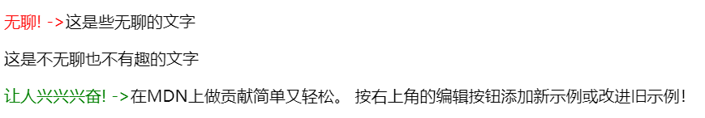

# CSS 选择器

参考：
* [CSS 选择器](https://www.w3cschool.cn/cssref/css-selectors.html)
* [十天精通CSS3](https://www.imooc.com/learn/33)

选择器 selector 用以筛选出需要添加样式的 HTML 元素的代码，可以基于多种标准进行筛选，如标签 `tag` 、属性 `attributes`、伪元素、伪类等。

## 标签选择器
标签选择器基于 HTML 的标签进行筛选设置样式，对于所有具有该标签的内容都进行更改


```css
 /*将所有h1标题元素颜色都改变为绿色*/
 h1 {
     color: green;
 }
```

## 类选择器
`class` 选择器 基于 HTML 元素的 `class` 属性进行筛选。使用**关键字符 `.`** 指明当前正使用 `class` 选择器

```css
.book-summary {
  color: blue;
}
```

:warning: 类属性可以应用于多个 HTML 元素中，即一个类属性可以应用于多个 HTML 元素（标签），一个 HTML 元素也可以设置多个 `class` 属性，只需要用一个**空格将它们分开**，有更大的灵活性。如果需要匹配该类中特定类型元素，可以在类选择器前加上标签选择器作为前缀，如 `p.book-summary` 选择段落标签 `<p>` 且同时具有 `book-summary` 类属性的元素。

## id 选择器
`id` 选择器基于 HTML 元素的 `id` 属性进行筛选。使用**关键字符 `#`** 指明当前使用 `id` 选择器

```css
#site-description {
  color: red;
}
```

**注意**：请保守地使用 `id` 对 HTML 的元素进行标记，由于 `id` 具有唯一性（**一个 HTML 元素只能拥有一个 `id`，而一个 `id` 只能标记一个 HTML 元素**）

## 伪元素选择器
[伪元素 pseudo-elements](https://developer.mozilla.org/zh-CN/docs/Web/CSS/Pseudo-elements) 是一个附加至选择器末的关键词，以两个冒号 `::` 分隔，一般用来对被选择元素的特定部分添加 `content` 内容

```css
selector::pseudo-element {
  property: value;
}
```

常用的伪元素选择器
* `::after (:after)` 在匹配的元素之后添加内容，作为已选中元素的最后一个子元素
* `::before (:before)` 在匹配的元素之前添加内容，作为已选中元素的第一个子元素
* `::first-letter (:first-letter)` 匹配元素的第一个字符（英文字母）
* `::first-line (:first-line)` 匹配元素第一行
* `::selection` 匹配鼠标在页面选中的内容

:bulb: 使用属性 `content` 为选中的元素添加内容，一般只能是文本而不能添加 HTML 元素。

:warning:  添加的 `content` 内容默认是**行内元素**

:warning: CSS3 引入 `::` 符号是为了将伪类选择器区别，浏览器也接受由 CSS 2 规定的 `:` 写法。

```html
<p class="boring-text">这是些无聊的文字</p>
<p>这是不无聊也不有趣的文字</p>
<p class="exciting-text">在MDN上做贡献简单又轻松。
按右上角的编辑按钮添加新示例或改进旧示例！</p>
```

```css
.exciting-text::before {
  content: "让人兴兴兴奋! ->";
  color: green;
}

.boring-text::before {
   content: "无聊! ->";
   color: red;
}
```



## 伪类选择器
伪类 `pseudo-class` 是加在选择器后的关键字，以一个冒号 `:` 分隔，用来指定选中元素的状态，如鼠标悬停、鼠标点击前、点击后等不同状态。对于元素不同的状态设置不同的样式，以展示更精细的样式，以提高了某个选择器的「确定度」。

```css
selector:pseudo-class {
  property: value;
}
```

有几类元素常用伪类选择器：
* 元素通用伪类选择器
    * `:empty` 表示元素内容为空时的状态
    * `:not` 表示匹配所有非指定状态的其余状态

* [光标伪类选择器](https://developer.mozilla.org/zh-CN/docs/Web/CSS/cursor)
    * `:hover` 表示鼠标**悬停**的状态
    * `:active` 表示鼠标点击**激活**元素的状态

* 子元素伪类选择器
    * `:first-of-type`  选择一个父元素下的给定类型的第一个子元素

        ```css
        /* 选择在父元素中第一个出现的 <div> 子元素  */
        div:first-of-type {
          color: red;
        }
        ```

    * `:last-of-type` 选择器：选择一个父元素下给定类型的元素最后一个子元素

        ```css
        /* 选择父元素 <p> 下的最后一个子元素 <em> */
        p em:last-of-type {
          color: lime;
        }
        ```

    * `:nth-child(i)` 选择器：匹配一个父元素下第 `i` 项的子元素
        :bulb: 配合 `:not(:nth-child(i))` 可以匹配所有的子元素

    :warning: 伪类前的元素应该是子元素（而非父级元素），而伪类选择器指定该子元素在容器的相对层级定位

    :bulb: 更详细的子元素伪类选择器（结构选择器）使用方法可以参考[这里](CSS3.md#结构选择器)。

* 锚标签伪类选择器
    默认情况下，浏览器常常**以蓝色显示链接并附带下划线**。可通过设置锚标签的伪类设置链接不同状态的样式，以帮助用户分清他们已经访问过哪些页面

    |      伪类      |                状态                |
    | :--------------: | :----------------------------------: |
    |   `:link`    |       链接未访问的状态       |
    | `:visited` |       链接已访问的状态       |
    |  `:hover`   |  鼠标悬停与链接上的状态   |
    |  `:active`  | 链接激活（被点击）的状态 |

    ```css
    /* 表示链接还未访问的状态 */
    a:link{
        color:red;
    }
    /* 表示鼠标悬停在链接上的状态 */
    a:hover{
        color:cyan;
        text-decoration:underline;
    }
    /* 表示链接被点击的状态 */
    a:active{
        color:pink;
    }
    /* 表示链接已被点击过的状态 */
    a:visited{
        color:pink;
    }
    ```

    :warning: 设置锚元素的伪类的顺序影响着样式的渲染生效，正确顺序应该是 `:link` -> `:visited` -> `:hover` -> `:active`，其中 `:hover` 状态样式需要在 `:visited` 和 `:link`（如果有的话）之后进行设置才生效；`:active` 状态样式必须在 `:hover` 之后设置才生效；而 `:link` 与 `:visited` 两者设置顺序无所谓。

* 表单伪类选择器
    * `:checked` 匹配表单中选项被选中的状态
    * `:disabled` 匹配元素无法操作的状态，如表单中存在非法项，因此提交按钮无法点击
    * `:foucus` 匹配表单输入框被激活的状态（该输入框正在输入）

## 属性选择器
[属性选择器 `Element[attribute]`](https://developer.mozilla.org/zh-CN/docs/Web/CSS/Attribute_selectors) 匹配所有具有属性 `attribute` 的元素 `Element`，也可以为属性附上属性值 `Element[attribute=value]` 匹配有特定属性值的元素


```css
p[title] {
    color: #f00;
}
```
为具有属性 `title` 的段落设置颜色样式。

此外还有比较少用的（类似于正则表达式）属性选择器用法：
* `[attr~=value]` 匹配带有以 `attr` 命名的属性的元素，并且以空格作为分隔的属性值中有一个值为 `value`
* `[attr|=value]` 匹配带有以 `attr` 命名的属性的元素，且属性值为 `value` 或以 `value-`为前缀（`-`为连字符）开头（典型的应用场景是用来匹配语言简写代码，如 `zh-CN`、`zh-TW` 可以用 `zh` 作为 `value` 匹配）
* `[attr^=value]` 匹配带有以 `attr` 命名的属性且属性值是以 `value` 开头的元素
* `[attr$=value]` 匹配带有以 `attr` 命名的属性，且属性值是以 `value` 结尾的元素
* `[attr*=value]` 匹配带有以 `attr` 命名的属性的元素，且属性值为 `value` 出现一次以上

## 组合选择器
参考：[CSS：CSS选择器之【组合选择器】](https://zhuanlan.zhihu.com/p/27219922)

组合选择器通过特定的符号同时使用不同的选择器，以选择更特定的元素集合，包括群组选择器、后代选择器、子选择器和同级元素选择器。

当我们使用组合选择器时，我们从右边开始读它，最靠近开口大括号{的选择器是主选择器，其左侧的选择器是先决条件。如选择器 `.grocery p` 中 `p` 是主选择器，而 `.grocery` 是先决条件，由空格分隔意味着右侧的选择器必须是左侧选择器的子级，即对于 `.grocery p` 我们的目标是获取带 `class="grocery"` 父元素下的子元素 `p` 标签。

### 全局选择器
通配符 `*` 可以匹配所有元素，称为全局选择器。

常用在写在样式表的开头对所有元素进行样式初始化。

### 群组选择器
群组选择器是使用**逗号 `,`** 将多个选择器并排列出，实现同时匹配多个元素。

```css
/*群组选择器*/
h1, h2, h3 {
    font-family: arial;
}
```

常用在 CSS 样式初始化匹配特定群组的元素，群组中各选择器类型可以不同。

### 后代选择器
后代选择器使用**空格**分割选择器，空格前的选择符表示父元素，空格后的选择符则匹配嵌套其中的子元素。可以使用多个空格分隔多个选择器，实现深层后代的筛选

```css
/* 后代选择器 */
/* 匹配 <div> 元素内所有的 <p> 元素
div p {
    color: blue;
}
```

:bulb: 后代选择器的选择可以是间接后代，也可以是直接后代
:warning:  多层嵌套难免会**增加选择器带来高权重**，这样在处理一些元素的特殊样式的时候会带来些困难，所以在实际开发中我们还是应该**避免**出现多层嵌套的后代选择器的存在

### 子选择器
子选择器使用**符号 `>`** 匹配下一层元素，即**直接后代**

```css
/* 子代选择器 */
/* 匹配 <div>  元素的直接后代 <p> 元素
div > p
```

### 同级选择器
使用符号 `+` 选择**相邻的下一个**匹配的同级元素，而使用符号 `~` 选择**该元素后**所有匹配的同级元素

```css
/* 同级选择器 */
/* 选择下一个相邻且同级的段落 */
button:hover + p {
    color: lightblue;
}

/* 选择下方所有匹配且同级的段落 */
button:hover ~ p {
    color: lightsalmon;
```

## 优先级
样式设置的顺序很重要，一般在样式表中依照从顶部往底部的顺序进行样式设置的实现，因此底部的设置会覆盖上部的样式设置。

此外，基于**不同的选择器的样式设置优先级也不同**，即不管样式设置在样式表相对位置如何，基于特定类型的选择器的样式设置**权重**会更重，会对基于另一种类型选择器作出的样式设置进行覆盖。

CSS 选择器优先级顺序如下（权重从上到下依次减弱）：

*  ID 选择器
*  类选择器、属性选择器、伪类选择器
*  元素选择器、伪元素选择器
*  通配符

其实对于每一种选择器都对应一种权值，一个选择器的整体权值就是各种权值之和。当样式设置冲突时，权值相同遵循就近原则应用样式，权值不同适用权值高的样式。

|  选择器类型   | 权值  |
| :----------------: | :-----: |
|    行内样式    | 1000 |
| id 选择器 | 100  |
|    类选择器    |  10   |
|  标签选择器   |   1    |
| 通配符选择器 |   0    |

如 `#main div.warning h2 {...}` 选择器权值为：`100 + 1 + 10 + 1 = 112`

:bulb: CSS 优先级可能引起不可预期的结果，因此一种**只使用类别选择器**设置整个页面样式的方法学 [BEM](http://getbem.com/introduction/) 应运而生，此时只需要考虑样式设置的次序即可。

:bulb: 可以在样式规则之后（以空格分隔）添加关键字 `!important` 调整样式规则的优先级至最高

```css
div {
    color : red !important;
}
```