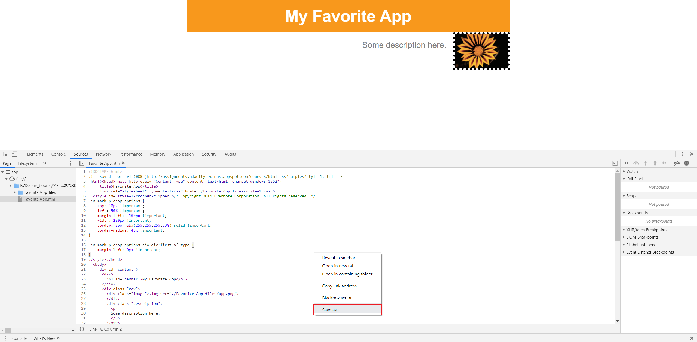
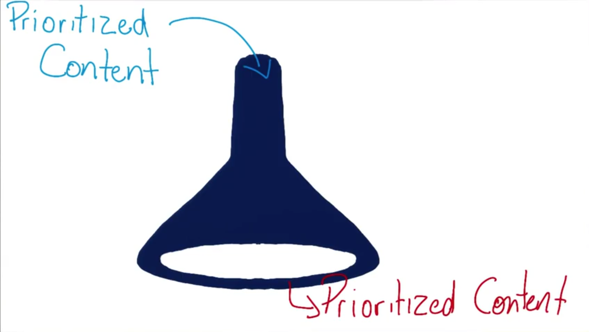

# 从原型到网站
设计师使用 Adobe Photoshop 等软件制作网页**原型**，即具有注释和说明的网站图像。Web 开发者将设计师创建的原型「翻译」为真正的网站，类似于自然语言之间的翻译过程，使用不同的词和短语来表达相同的意思， 前端工程师使用不同的 HTML 元素等创建出与原型效果相同的网页。

## 主要步骤
1. **方框化 boxify**：将设计稿**分割为方框**的过程，寻找网站内容排版特征
2. **盒子布局**：利用标签 `
` 对方框化的页面进行布局，需要使用**有意义的占位符**，可为元素添加（多个） `class` 类属性进行标记
3. **补充内容细节**：填充内容并依据设计原型增添细节，并选用**语义元素**替换占位符元素，设置样式（使用独立的样式表），直至页面与设计稿完全一致

:bulb: 后期修正时可利用 DevTool 浏览器的开发者工具进行**即时测试**。但在开发者工具中所做的**更改都是暂时性**的。如果你想保存这些更改，可以请选中 `Sources` 标签，右键点击选择 `另存为` 保存修改后的源码文件；或在 `Element` 标签中右键单击或按住 `ctrl` 后单击修改后的元素，然后选择 `复制为 HTML`，以保存源码到剪贴板。

参考：
* [Tools for Web Developers - 键盘快捷键参考](https://developer.chrome.com/devtools/docs/shortcuts#opening-devtools)
* [Chrome 开发者工具中文文档 - 键盘快捷键和UI快捷键参考](http://www.css88.com/doc/chrome-devtools/shortcuts/)

## 工作流
在「翻译」设计师原型为 HTML 等代码的过程基本重复以下步骤
* 文本编辑器修改代码
* 保存修改（快捷键：`ctrl+c`）
* 在浏览器查看（刷新 `F5`）

## 响应式开发
设计响应式网页与开发非响应式网页类似，但是需要针对**小屏幕**做优化。

* 从小屏幕（移动端）开始设计网页布局，思考权衡**对于用户最重要的信息**，明确优先显示的内容（以一直留在页面上）
* 通过媒体查询的方法设计断点，以针对不同大小的设备，显示不同的内容与布局。

此外「从小至大」的设计思路和方法还可以满足不同的设备性能（从低到高）。
