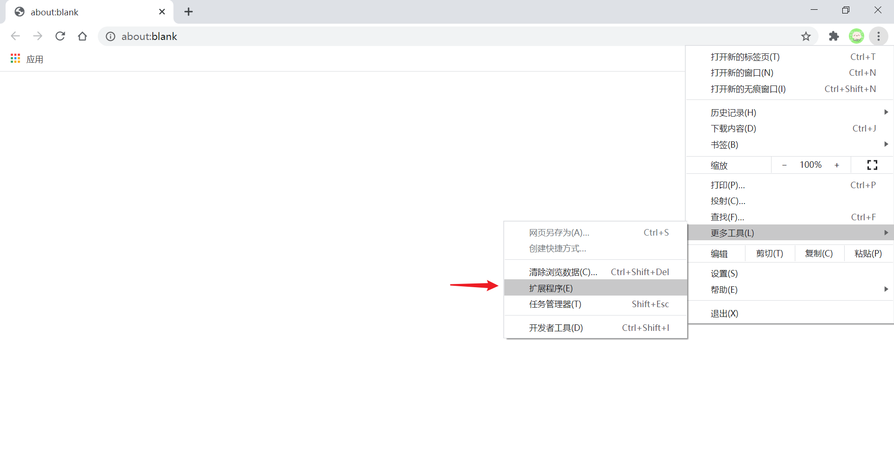
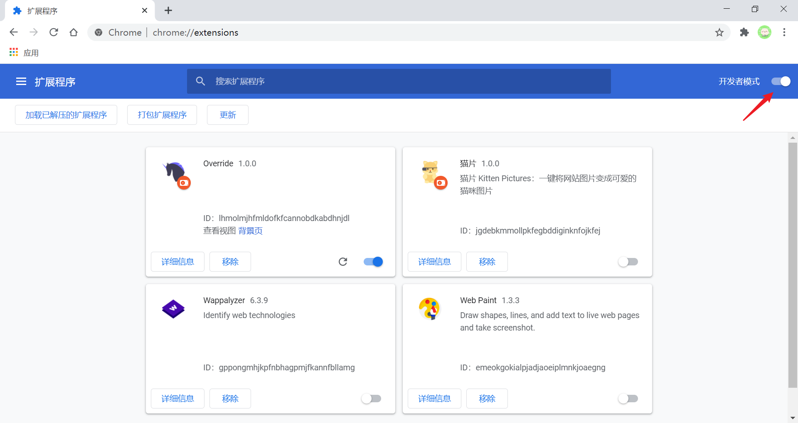

# 简介
主要参考 [《Chrome插件开发全攻略》](https://github.com/sxei/chrome-plugin-demo) 并翻译自 [Daniel Shiffman](https://shiffman.net/) 的教程 [Chrome Extensions (and Bookmarklet)](https://shiffman.net/a2z/chrome-ext/)

Chrome 插件是一个使用通用的 Web 技术开发的用以增强浏览器功能的软件，你可以添加交互元素，打开或关闭页面标签，与地址栏进行交互，修改该激活页面的内容等。它其实就是一个由 HTML、CSS、JS、图片等资源组成的一个`.crx` 后缀的压缩包（在开发者模式下浏览器也可以载入未打包的插件）。

:bulb: 实际上[Chrome 插件使用的接口](https://developer.chrome.com/extensions/api_index)是基于 [WebExtensions APIs](https://developer.mozilla.org/en-US/docs/Mozilla/Add-ons/WebExtensions) 一种开发扩展的[跨浏览器](https://hacks.mozilla.org/2017/06/cross-browser-extensions-available-now-in-firefox/)系统，该系统与Opera 和 W3C 草案社区组织所支持的扩展 API 在很大程度上兼容，因此大多数情况下为这些浏览器编写的扩展只需少许修改即可在 Firefox 或 Microsoft Edge 中运行。而且还可以运行在所有 webkit 内核的国产浏览器，比如360极速浏览器、360安全浏览器、搜狗浏览器、QQ浏览器等。

## 安装插件
1. 打开 Chrome 浏览器（或运行在所有 webkit 内核的国产浏览器），切换到插件管理页面，可以直接在 Chrome 浏览器的地址栏输入 `chrome://extensions`

2. 激活页面右上角的 **开发者模式**

3. 点击 **加载已解压的扩展程序**，并选择项目所在的文件夹以安装插件。对于已发布的 Chrome 插件可以在 [Chrome 网上应用店](https://chrome.google.com/webstore/category/extensions) 搜索并安装

## 基本概念
* `manifest.json` 所有 Chrome Extensions 都需要有一个 `manifest.json` 文件，该文件包含了插件的元信息 metadata，进行相关配置设置、所需权限、使用的资源等。
* Content Scripts 一些 JavaScript 文档（也可以是 CSS 文档），这些文档里的代码会在页面加载完成后再执行，可以操作当前网页页面的 DOM。**这些文档需要在 `manifest.json` 进行引用**。
* Background 运行在浏览器后台的一些 JavaScript 文档，他的生命周期随着浏览器的打开而打开，随着浏览器的关闭而关闭。这些文档的权限非常高，几乎可以调用所有的 Chrome 扩展 API（除了 devtools）。这些文档需要在 `manifest.json` 进行引用。
* browser actions 和 page actions 插件的用户交互元素，以图标的形式添加在浏览器上。其中 browser action 会在浏览器的右上角创建一个按钮，可以在 `manifest.json` 中指定按钮的图标、鼠标悬停在图标时显示的文字提示、点击图标时弹出的页面等；而 page action 会在地址栏（与当前页面相关）创建一个按钮（新版的 Chrome 更改了这一策略，page action 和 browser action 创建的图标一样也是放在浏览器右上角，只不过没有切换到指定页面时是灰色的，激活才点亮为彩色）。
* popup 是通过 browser action 触发的一个弹出框（HTML 页面），该页面可以引用其他 scripts，:warning: 特别注意的是由于单击图标打开 popup，焦点离开又立即关闭，所以 popup 页面的生命周期一般很短。
* 不同的 JavaScript 文档（一般指 content scripts、background 运行的 scripts、popup 页面所引用的 scripts）是在不同的作用域中，它们之间通过 Chrome 提供的 [API](https://developer.chrome.com/extensions/api_index) 进行事件触发和监听以实现数据传递和消息通信。

## 相关教程
- [Chrome Extensions (and Bookmarklet)](https://shiffman.net/a2z/chrome-ext/) | Programming from A to Z
- [《Chrome插件开发全攻略》](https://github.com/sxei/chrome-plugin-demo)
- [Chrome Extension Tutorial](https://www.youtube.com/playlist?list=PLC3y8-rFHvwg2-q6Kvw3Tl_4xhxtIaNlY)