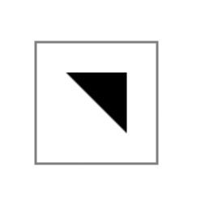
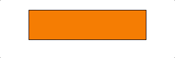

# HTML5 Canvas
参考：
* [Canvas - Dive Into HTML5](http://diveintohtml5.info/canvas.html#text)


使用标签 `<canvas>` 在页面创建一个 canvas 画布，一个 2D 平面，并渲染出指定的画面，如形状、图像、文字、图案等。

## 创建 canvas
使用标签 `<canvas>` 创建画布，该标签可设置多种属性，如 `width` 和 `height` 设置画布宽和高（大小）

canvas 使用坐标系定位图像，在二维图像中，左上角为 `(0,0)` 坐标值依次向右侧（`x` 值）和向下方（`y` 值）增大


## 操作 canvas
使用 JavaScript 操作 canvas

```html
<body>
    <canvas id="c" width="200" height="200"></canvas>
    // 在标签 <canvas> 下使用 JavaScript 操作画布
    <script>
        var c = document.querySelector("#c"); // 使用 id 属性获取 canvas 元素
        var ctx = c.getContext("2d"); // 使用方法 getContext 获取 canvas 的内容，传递参数 2d 以获取画布平面内容

        // 创建一个新的 image 元素，并将其添加到画布中
        var img = new Image();
        img.src = "http://lorempixel.com/300/300"; // 设置图片来源
        // 由于图片加载是异步的，因此使用方法 onload() 待图片加载完成后进行操作
        img.onload = function() {
	        ctx.drawImage(img, 0, 0, c.width, c.height); // 使用方法 drawImage 将图像 img 绘制到画布上，定位坐标是 (0,0)，图片大小与画布大小一致
        };
    </script>
</body>
```

### 绘制图像 drawImage
使用 canvas 对象[方法 `darwImage()`](https://www.w3school.com.cn/tags/canvas_drawimage.asp) 在画布上绘制图像、画布或视频。也可以绘制图像的某些部分，以及/或者增加或减少图像的尺寸。

可设置的参数值

|   参数    |                   描述                    |
| --------- | ----------------------------------------- |
| `img`     | 规定要使用的图像、画布或视频（对象）。              |
| `sx`      | 可选。开始剪切的 `x` 坐标位置。             |
| `sy`      | 可选。开始剪切的`y`坐标位置。               |
| `swidth`  | 可选。被剪切图像的宽度。                   |
| `sheight` | 可选。被剪切图像的高度。                   |
| `x`       | 在画布上放置图像的`x` 坐标位置。            |
| `y`       | 在画布上放置图像的 `y` 坐标位置。           |
| `width`   | 可选。要使用的图像的宽度。（伸展或缩小图像） |
| `height`  | 可选。要使用的图像的高度。（伸展或缩小图像） |

```js
// 剪切图像，并在画布上定位被剪切的部分：
context.drawImage(img,sx,sy,swidth,sheight,x,y,width,height);
```

### 下载图像 toDataURL
使用 canvas 对象方法 `toDataURL()` 输出画布中的图像，该方法创建一个可以表现画布图片的**字符串**，支持输出各种格式的图片。

```js
// 输出图片到变量 saveImage 中
var savedImage = c.toDataURL();

// 打开变量保存的图片
window.open(savedImage);
```

:warning: 图片资源需要托管在服务器，从服务器（或本地服务器）加载才可以使用 `toDataURL()` 下载

### 绘制矩形
使用 canvas 对象（内容）方法 `fillRect()`或 `strokeRect()` 绘制实心矩形或空心矩形

* 可以传递不同的参数以定制矩形外观 `fillRect(posX, posY, width, height)`
* 使用画布 canvas 对象（内容）属性 `fillStyle` 设置填充颜色，或 `strokeStyle` 设置边框颜色属性

示例
```js
var c = document.querySelector("#c");
var ctx = c.getContext("2d");
ctx.fillStyle = "blue";
// Start at (0,0) and draw a 50px x 50px blue rectangle.
ctx.fillRect(0,0,50,50);
```

### 路径
可以通过 [创建路径 Path](https://www.w3.org/TR/2dcontext/#building-paths) 来创作出一个复杂的形状
* 使用 canvas 对象（内容）方法 `beginPath()` 「声明」需要创建一个新的路径
* 配合使用canvas 对象（内容）方法方法 `moveTo(x, y)` 和 `lineTo(x, y)` 创建路径，前一个方法确定路径开始点，后一个方法基于上方的坐标和该方法给出的坐标之间创建一条路径
* 使用 canvas 对象（内容）方法 `fill()` 或 `stroke()` 结束路径并创建实心或空心的图形

```js
<script>
    ctx.strokeRect(50, 50, 100, 100);

    ctx.beginPath();
    ctx.moveTo(75, 75);
    ctx.lineTo(125, 75);
    ctx.lineTo(125, 125);
    ctx.lineTo(75, 75);
    ctx.fill();
</script>
```
画布结果


### 颜色
使用 canvas 对象（内容）属性 `fillStyle` 或 `strokeStyle` 设置填充或线框颜色，支持使用 CSS 规范声明的约 140 种[颜色名称](https://zh.wikipedia.org/wiki/%E7%BD%91%E9%A1%B5%E9%A2%9C%E8%89%B2)或 RGB 十六进制码

注意：设置的颜色仅适用于（该转换命令后创建的）后续对象

### 擦除画布 clearRect
使用 canvas 对象（内容）方法 `clearRect(posX, posY, width, height)` 擦除特定区域的画布

示例
```js
// 将参数设置为画布的尺寸，擦除整个画布
ctx.clearRect(0, 0, c.width, c.height);
```

### 变换图像
注意：下述设置的任何转换都适用于（该转换命令后创建的）所有后续对象

#### 缩放 scale
使用 canvas 对象（内容）的方法 `scale(x,y)` 将后续绘制命令的 `x` 和 `y` 值乘以给定系数，即放大相应的倍数

#### 移动 translate
使用 canvas 对象（内容）的方法  `translate(x,y)` 将所有后续绘制命令水平移动 `x` 个像素，垂直移动 `y` 个像素。

#### 旋转 rotate
使用 canvas 对象（内容）的方法  `rotate(angleRadians)` 将对象（通常）绕中心转动特定弧度

提示：度数与弧度的关系 `radians = degrees * (Math.PI/180)`

### 保存与恢复画布状态
使用 canvas 对象（内容）的方法 `save()` 和 `restore()` 来保存和恢复画布状态，更方便地在不同样式间切换，以绘画出不同的图形。

可以保存的画布状态包括：
- 当前转换矩阵（旋转、缩放、移动）
- `strokeStyle`
- `fillStyle`
- `font`
- `globalAlpha`
- `lineWidth`
- `lineCap`
- `lineJoin`
- `miterLimit`
- `shadowOffsetX`
- `shadowOffsetY`
- `shadowBlur`
- `shadowColor`
- `globalCompositeOperation`
- `textAlign`
- `textBaseline`
- 当前剪辑区域

### 绘制文本
使用 canvas 对象（内容）的方法 `fillText(string, x, y)` 或 `strokeText(string, x, y)` [绘制（空心或实心）文本](https://developer.mozilla.org/zh-CN/docs/Web/API/Canvas_API/Tutorial/Drawing_text)，其中坐标为字符串左下角位置。

* 文本的填充样式或边框样式与当前（命令上方）设置的样式一致
* 使用 canvas 对象（内容）属性 `font` 设置字体样式与字体大小，默认使用 CSS `font` 属性相同的语法，默认值字体和大小是 `10px sans-serif`
* 使用 canvas 对象（内容）属性 `textAlign` 设置文本对齐方式，可选的值包括
    * `start` 默认值
    * `end`
    * `left`
    * `right`
    * `center`
* 使用 canvas 对象（内容）属性 `fillStyle` 或 `strokeStyle` 设置填充颜色
* 使用 canvas 对象（内容）属性 `lineWidth` 设置边框宽度

### 图片数据
画布支持的图片使用 JavaScript 表示为一个 `ImageData` 对象，该对象包含源图像三种属性
* 宽度 `width`
* 高度 `height`
* 数据 `data` 存储每个像素的 RGB 数据 和 Alpha 值（范围是 0-255，其中 0 是透明的，255 是完全可见的），一般使用 `Uint8ClampedArray` 数组表示，数组每四个元素表示一个像素点信息，即 RGBA 值

尝试用以下函数检索或修改图片数据
* `createImageData` 初始化一个空的图像数据对象
* [`getImageData(x, y, width, height)`](https://www.w3school.com.cn/tags/canvas_getimagedata.asp) 复制画布上指定矩形的像素数据，起始点为 `(x,y)` ，大小范围是宽 `width`，高 `height`
* `putImageData` 存储数据到背景画布

```js
// 将画布中每隔 10 个像素设置为绿色
<script>
    var imgData = ctx.getImage(0, 0, c.width, c.height);

    function paintGreen(imagData) {
        var numPix = imgData.data.length / 4;

        for (var i = 0; i < numPix; i++) {
            if(i % 10 === 0) {
                imgData.data[i*4 + 1] = 255; // 将第 i 个像素的 Green 值设置为 255（需要背景原色为白色，否则还需要编辑 red 值和 blue 值
                imgData.data[i*4 + 3] = 255; // 将第 i 个像素的 Alpha 值设置为 255（非透明）
            }
        }
        ctx.putImageData(imgData, 0, 0);
    }
    paintGreen(imgData);
</script>
```

```js
// 将彩色图片转换为黑白（灰）图片
<script>
    var img = new Image();
    img.src = "test.jpg";
    img.onload = function() {
        ctx.drawImage(img, 0, 0, c.width, c.height);
        imgData = ctx.getImageData(0, 0, c.width, c.height);
        gray(imgData); // 调用灰度函数
    }

    // 灰度函数
    function gray(imagData) {
        var numPix = imgData.data.length / 4;

        for (var i = 0; i < numPix; i++) {
            let gray = (imgData.data[i*4] + imgData.data[i*4+1] + imgData.data[i*4+2])/3
            imgData.data[i*4] = gray;
            imgData.data[i*4+1] = gray;
            imgData.data[i*4+2] = gray;
            imgData.data[i*4 + 3] = 255;
        }
        ctx.putImageData(imgData, 0, 0);
    }
</script>
```

### 视频特效
参考：
* [你需要知道的requestAnimationFrame](https://juejin.im/post/5a82f0626fb9a06358657c9c)
* [requestAnimationFrame for Smart Animating](https://www.paulirish.com/2011/requestanimationframe-for-smart-animating/)
* [Animating with requestAnimationFrame](https://www.kirupa.com/html5/animating_with_requestAnimationFrame.htm)
* [window.requestAnimationFrame - Web API 接口参考 | MDN](https://developer.mozilla.org/zh-CN/docs/Web/API/window/requestAnimationFrame)

将视频放置在画布中，通过提取其帧图像，利用图片数据处理方法，可以为视频添加特效。

为了可以流畅在视频播放时流畅地「抽帧」应使用函数 `requestAnimationFrame` ，其作用相当于一个定时器（类似于 [setTimeout](https://developer.mozilla.org/zh-CN/docs/Web/API/Window/setTimeout) 和 [setInterval](https://developer.mozilla.org/zh-CN/docs/Web/API/Window/setInterval)） 让浏览器流畅地循环执行（渲染）一帧动画的操作

函数 `requestAnimationFrame` 接受一个动画执行函数作为参数，这个函数的作用是仅执行一帧动画的渲染，并根据条件判断是否结束，如果动画没有结束，则继续调用 `requestAnimationFrame` 并将**函数自身**作为参数传入（循环调用）。

```js
function animationWidth() {
  var div = document.getElementById('box');
  div.style.width = parseInt(div.style.width) + 1 + 'px';

  if(parseInt(div.style.width) < 200) {
    requestAnimationFrame(animationWidth)
  }
}

animationWidth();
```


提示：游戏循环是使用应用或游戏时连续运行的一系列事件，`requestAnimationFrame` 会处理大多数繁重的工作，以便确保在活跃查看应用时，应用的运行速度尽可能达到 60 帧/秒。

### 处理键盘输入

尽管手动处理键盘流程并不太难，但我更愿意站在巨人的肩膀上，使用具有能帮助我执行所需操作的完善库的开源项目。

在遵循 [Kibo](https://github.com/marquete/kibo) 公共命名 `('a', '3', 'up')` 的基础上允许你引用按键值而不是它们的[键码值](https://segmentfault.com/a/1190000005828048)，这将会极大地简化你的代码。你也可以在按下或者松开的时候附加事件同样适用于修饰键和通配符。

```js
var k = new Kibo();
k.down(\['up', 'w'\], function() {
    // Do something cool on the canvas
});

k.up(\['enter', 'q'\], function() {
    // Do other stuff.
});
```

### 处理鼠标输入
就像许多其他的 DOM 元素，画布可以接收 **点击** 和 **鼠标按下**事件。我们确实需要做点小工作来确定用户在画布上的哪个位置点击了。鼠标点击事件返回 `clientX` 和 `clientY` 在浏览器窗口全局中的位置。每个元素知道它相对于浏览器 `(0,0)` 即 (`offsetLeft`和`offsetTop`)的位置。要获取一次相对于画布的点击，你需要从 `clientX` 和 `clientY` 中减去 `offsetLeft` 和 `offsetTop` 值。 查看下面的示例代码:

```js
var c = document.querySelector("canvas");

function handleMouseClick(evt) {
        x = evt.clientX - c.offsetLeft;
        y = evt.clientY - c.offsetTop;
        console.log("x,y:"+x+","+y);
}
c.addEventListener("click", handleMouseClick, false);
```

[Kibo.js](https://github.com/marquete/kibo) 是处理键盘输入的一个 JavaScript 库。