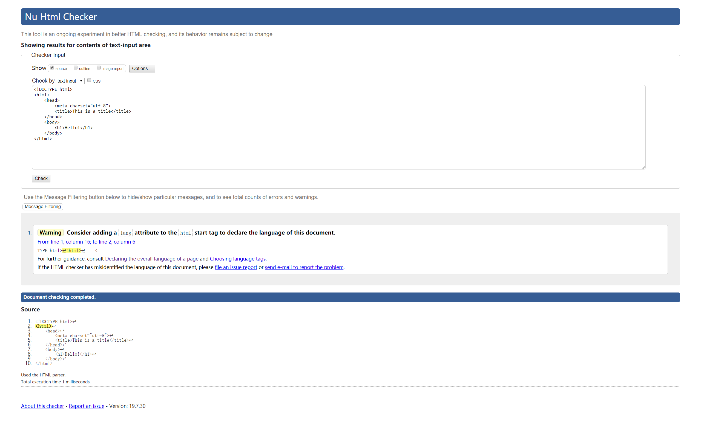
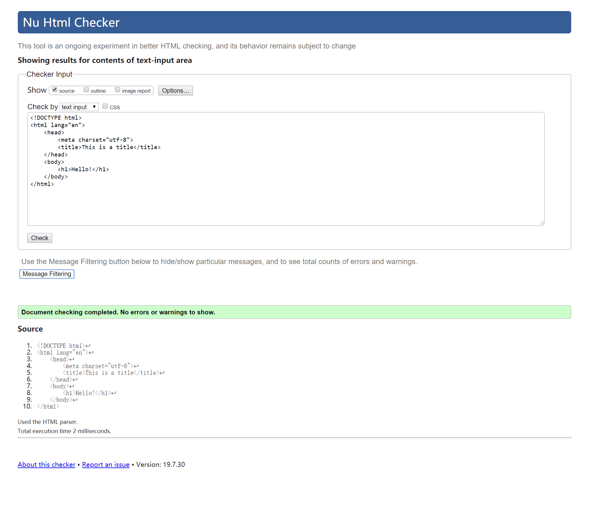

# HTML文档结构


HTML 文档一般有两部分组成

*  head 头部文件，描述站点的元信息，以提供网页正确的渲染和交互，这部分的内容不会在网页正文中显示。
* body 主体文件，描述用户将会看到在页面上的实际内容。

:bulb: 省略其中的一些信息并不意味着不能正常显示页面。由于浏览器也会假设模板缺失的部分已经存在（可在开发者工具 `Elements` 面板中看到浏览器会自动补充省略的内容）。:warning: 如果创建 HTML 文件不完整，虽然现代浏览器会自动补充，网页仍可正常浏览**但这是不确定的行为**，在较低版本的浏览器中可能无法补全 HTML，因此最好写上模板中的所需的所有基本元素以确保页面正常显示。

## HTML 文档类型
HTML 文档通常以类型声明开始，由于 HTML 存在多个版本，如 HTML5、HTML4、XHTML 等等，使用 `DOCTYPE` 标注当前文档使用了哪个版本语言编写，以帮助浏览器正确地解析文档。

```html
<!DOCTYPE html>
```

这个标注放在 HTML 文档**第一行**以指明该文档使用 HTML5，将拥有所有最新功能的触发标准模式。该标签声明文档类型，其中一个作用是让所有浏览器默认按照**标准盒子模型**来解析元素（即盒子大小设置是针对其 `content` 内容）

:bulb: 有关文档类型声明和不同渲染模式的内容参考 [Quirks Mode and Standards Mode](https://developer.mozilla.org/en-US/docs/Web/HTML/Quirks_Mode_and_Standards_Mode)

:warning: `<!DOCTYPE>` 不是一个 HTML 标签

### head 头部文件
`<head>` 标签里描述有关站点的**元信息**，但内容始终是**不可见**的，其中有描述页面的信息和指向其它文件的链接，这些都是浏览器正确渲染网页所需要的。

 `<head>` 元素可内嵌多种元素，如 `<title>`、`<meta>`、`<style>`、`<link>`、`<script>` 等

#### `<title>` 元素
`<title>` 元素标记网页标签的标题（在浏览器的标签中显示的文本）

```html
<head>
    <title>About Me</title>
</head>
```

#### `<meta>` 元素
`<meta>` 元素提供多种作用，常见如下：

* 指定网页使用的编码字符集，一般设置为 `<meta charset="utf-8">` 即使用 [Unicode 字符](https://unicode-table.com/cn/) 对网页文档进行编码
* 提供关键字、作者和页面相关描述 `<meta name="description" content="anytime about website">` 用于搜索引擎优化 SEO

```html
<head>
    <meta charset="utf-8">
    <meta name="description" content="This is what my website is all about!">
</head>
```

#### `<style>` 元素
`<style>` 标签设置外部 CSS 文件（样式表）链接

```html
<head>
    <link rel="stylesheet" type="text/css" href="style.css">
</head>
```

#### `<script>` 元素

`<script>` 标签设置外部 JavaScript 文件（脚本文件）链接

```html
<head>
    <script src="animations.js"></script>
</head>
```


### body 主体文件
`<body>` 标签内所有内容会显示在浏览器主窗口中

## HTML 验证程序
[HTML 验证程序](https://validator.w3.org/)会分析你的网站并验证你**是否在编写有效的 HTML**。

如输入模板
```html
<!DOCTYPE html>
<html>
    <head>
        <meta charset="utf-8">
        <title>This is a title</title>
    </head>
    <body>
        <h1>Hello!</h1>
    </body>
</html>
```
检测输出一个 warning 建议提供默认语言



修改添加了 `lang="en"` 再检测无输出 `Warning`

