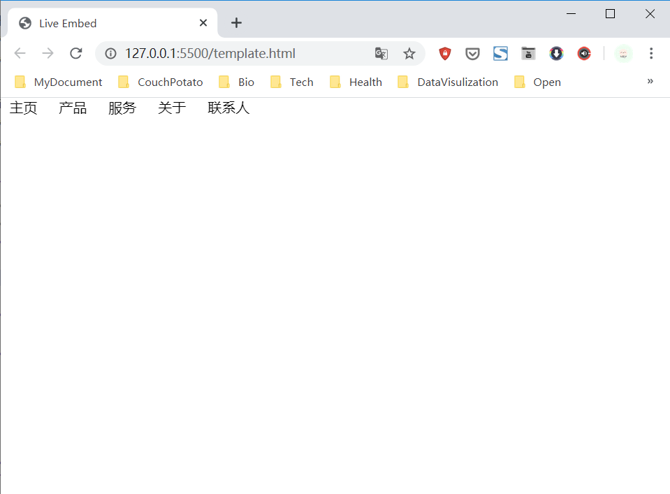
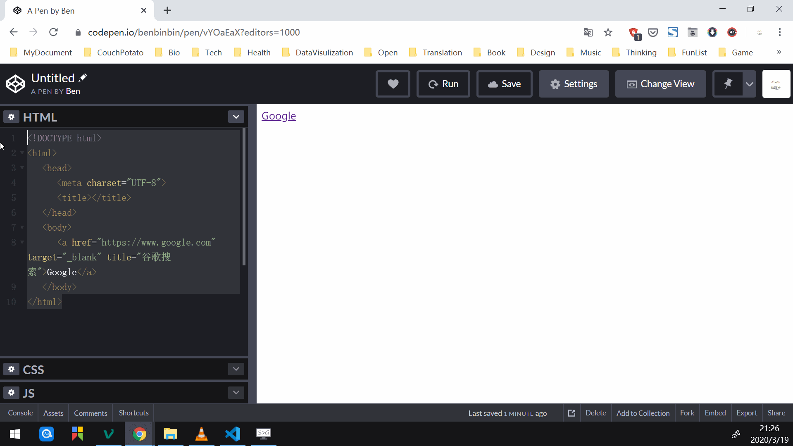
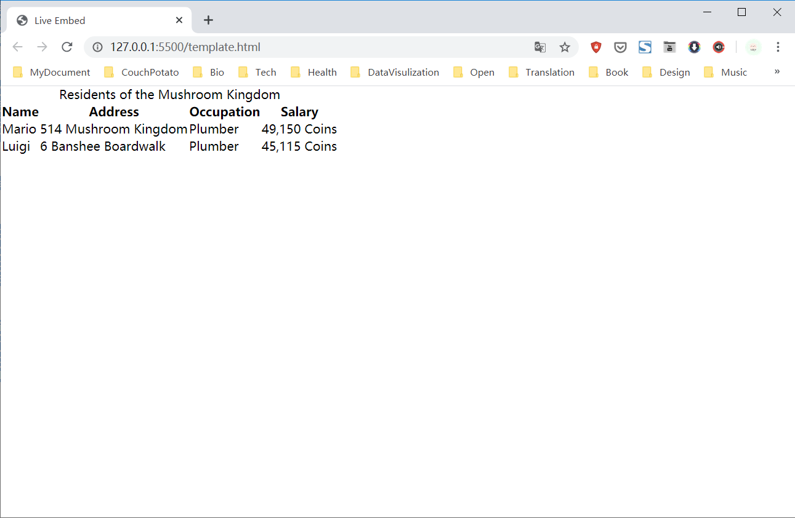
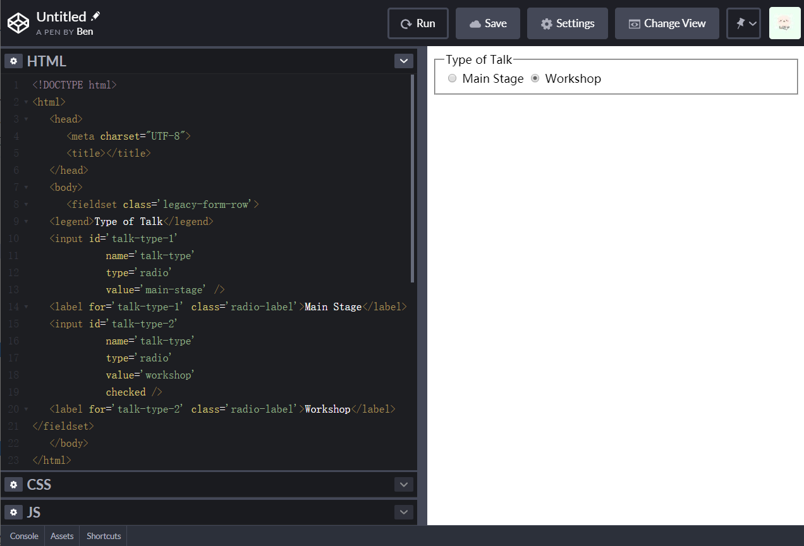
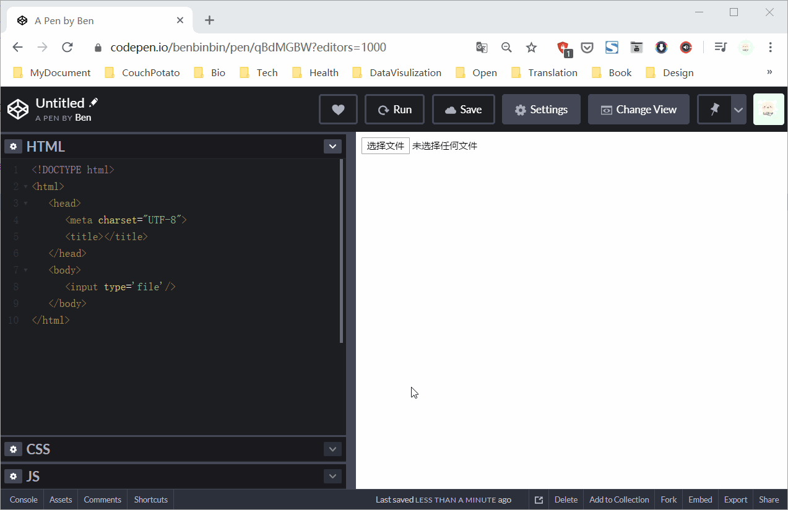

# 常用元素
HTML 由不同元素 element 组成，其中每个元素都有其特有的标签 `<tag>`，可以在 [MDN HTML 元素参考](https://developer.mozilla.org/zh-CN/docs/Web/HTML/Element)寻找需要使用的元素

HTML 的标签通常是**成对出现**
* 开始标签 start tag，以尖括号作为标记，如 `<h1>`
* 结束标签 end tag，以尖括号和反斜线作为标记，如 `</h1>`

HTML 元素包括行内元素和块元素
* 块级元素，即`<div>`、`<p>`、`<ul>`等，默认状态下会独占一行宽度。
* 内联元素，默认状态下不独占一行，根据内容大小而占据相应的宽度。

可以通过属性 `display` 相互转换
* 属性值`inline`使元素具有内联元素行为，即该块级元素会排在一行上
* 属性值`block`使元素具有转换为块级元素行为

```html
<!-- 将默认为块级元素的列表项转换为行内元素 -->
<!-- 列表项会排列到一行上，一般用以创建导航栏 -->
<style>
    li {
        display:inline;
        margin:10px;}
</style>

<ul>
    <li>主页</li>
    <li>产品</li>
    <li>服务</li>
    <li>关于</li>
    <li>联系人</li>
</ul>
```



## 注释
注释就是在代码中写一段话，但是不会在运行结果中显示出来。注释能让代码更易理解

### 单行注释

```html
<!--这是一行注释-->
```

### 多行注释
```html
<!--
这是多行注释
这是多行注释
这是多行注释
-->
```

## 通用元素
通用元素一般作为容器，为容器内的子元素添加一致的样式。一般包括块级元素 `<div>` 和行内元素 `<span>`

更多元素行内和块元素的归类可查看：
* [块级元素 - HTML（超文本标记语言）](https://developer.mozilla.org/zh-CN/docs/Web/HTML/Block-level_elements) | MDN
* [行内元素 - HTML（超文本标记语言）](https://developer.mozilla.org/zh-CN/docs/Web/HTML/Inline_elements) | MDN

### 块级元素
块级元素 `<div>` ，是单词 division 的缩写，以表示该代码块处于同一区域，允许将一组元素集中到一起。

一般作为容器用于将网页分为多块部分，可增加代码可读性但不可滥用。


### 内联元素
元素 `<span>` 是短语内容的通用行内容器，并没有任何特殊语义。它也是用来对元素进行组合划分，方便添加类属性或者 id 属性以设置特定的样式。

:warning: 正确的元素嵌套可以构建出合理的网页布局：
* 部分块级元素允许嵌套部分块级元素，但元素 `<p>` 中不可嵌套其他块级元素
* 行内元素内不可嵌套其他块元素
* 块级元素与块级元素并列，行列元素与行内元素并列

## 文本元素

### 标题
标题元素一般以字母 `h` 开始取单词 heading 首字母，其后可添加数值 `1-6` 依次表示六个不同级别的标题。

`<h1>` 级别最高，`<h6>` 级别最低，对应的默认样式是字号依次减小，文字的显著程度依次降低。

```html
<h1>首标题</h1>
<h2>副标题</h2>
<h3>次标题</h3>
<h4>次次标题</h4>
<h5>小标题</h5>
<h6>小小标题</h6>
```

### 段落
段落元素 `<p>` 取单词  paragraph  首字母。

### 斜体
斜体字元素 `<i>` 表示由于某种原因可以在文本范围中区别于正常文本，例如技术术语、外语短语或角色想法。

:bulb: 斜体字的创始人是文艺复兴时期的意大利文人 Niccolo Niccoli，因为他的国籍 Italy，英文 italic表示斜体字

### 强调

### 着重
着重元素 `<em>` 是单词 emphasis 的缩写，标记出重要的内容，表现为斜体。

:bulb: 该元素可嵌套，嵌套层次越深，表示内容越重要。

### 强调
强调元素 `<strong>`是单词 strong 缩写，表示文本十分重要，表现为粗体显示。

### 加粗
加粗元素 `<b>` 是单词 bold 缩写

:bulb: 加粗标签无语义，只是表示与正常文本在风格上不同的文本，推荐使用有语义的强调元素 `<strong>`

### 变小
元素 `<small>` 将文本的字体变小一号，在 HTML5 中其语义被重新定义为表示边注释和附属细则，如版权和法律文本。

### 上角标
上角标元素 `<sup>` 默认样式是比一般文本区域显得更高并且更小

### 下角标
下角标元素 `<sub>` 默认样式是比一般文本区域展示得更低并且更小

## 插入与删除
插入元素 `<ins>` 是单词 insert 的缩写，标记被新增插入文档中的文本，默认样式是文本添加有下划线。

```html
<ins>这一段文本是新插入至文档的。</ins>
```

删除元素 `<del>` 是单词 delete 的缩写，标记一些被从文档中删除的文字内容，默认样式是文本中添加删除线。

```html
<del ><p >This paragraph has been deleted.</p ></del >
```

以上标签可以设置的属性

* `cite` 指向一个文档的 URL，该文档解释了文本被插入或修改的原因。
* `datetime` 指示的此修改发生的时间和日期，并且该特性的值必须是一个有效的日期或者时间字符串。

## 缩写元素
元素 `<abbr>` 是单词 abbreviation 缩写，其作用是标注内容为缩写，默认样式是下划虚线。

可以设置属性 `target` 备注完整名称，当鼠标悬停在该元素上时，完整名称将会作为提示显示。

## 链接/锚标签
超链接使用 [链接元素](https://developer.mozilla.org/zh-CN/docs/Web/HTML/Element/a) `<a>` 创建，也称为锚元素。

为文本添加超链接后，默认样式是带下划线的蓝色文本，且鼠标悬停在锚标签时显示为手形 :point_up_2:

```html
<a href="url">这里加上代表这个链接的文字</a>
```

可设置多种属性
* 属性`href` 设置需要指向的超链接地址，用双引号 `""` 包含。可以设置为 `#` 表示空连接，即点击后跳转到当页顶部；而设置为 `""` 空时，点击锚标签就会刷新页面。
* 属性 `target` 设置访问超链接的框架，默认值为 `_self` 在当前窗口跳转，设置为 `_blank"` 在新窗口打开（还有 `_top` 在框架中打开，`_parent` 在父窗口打开，`framename`）:bulb: 当设置为一个任意（非保留字）的属性值，第一次点击会在新窗口打开网页，当页面已打开再点击链接就会实现直接切换跳转，避免多开窗口
* 属性 `title` 设置链接提示文字，当鼠标悬停在锚标签时会弹出 tooltip text 工具提示文本



:bulb: 链接可以是外部路径或内部路径，也可以是相对路径或绝对链接

:bulb: 使用超链接来包含其他元素，如图片元素`` 这样当你单击图片时将跳转到另一个页面。

:bulb: 锚标签还可以链接跳转到当前页面内或其他页面的特定元素所在区域，元素需要先设置 `id` 属性（也称作锚点）「打上」唯一的标记，属性 `href` 设置为带 `#id`。这一用法常常作为网页内导航栏，这种链接也称作 deep link 深度链接。:warning: HTML5 锚标签已不支持属性 `name`，锚点只能使用属性 `id` 进行设置。

```html
// 网页内跳转
<a href="#idName">Catalog</a>

// 网页间跳转
<a href="website#idName">description</a>
```

:bulb: 属性 `title` 常用于元素 `<form>`  和 `<a>`，以提示关于输入格式和链接目标的相关信息。此外也是元素 `<abbr>`（用于展示缩写）可选属性，用于备注完整名称。

:bulb: 链接属性 `href` 设置为不同的地址，即可使用不同的扩展功能
* 属性设置为 `href="mailto:BenThomson@gmail.com"` 设置为邮箱，即可点击链接打开系统内置的邮件应用发送邮件到指定的邮箱。
* 属性设置为 `href=filePath"` 设置为文件路径，即可点击下载该文件。

## 文档根 UTL 元素
元素 `<base>` 指定文档中包含的所有相对 URL 的根目录。

* 属性 `href` 设置基础 URL
* 属性 `target` 设置所有 URL 的访问使用的框架，默认值为 `_blank`

:warning: 一个文档只能有一个 `<base>` 元素，只会使用第一个 href 和 target 值, 其余都会被忽略。
:warning: 当需要使用锚标签指向文档中某个片段时，应谨慎使用 `<base>` 标签，因为会造成 URL 解析时附加基本链接

## 图片元素
图片标签有多种，如 ``、`<figure>`

### ``
[图像](https://developer.mozilla.org/zh-CN/docs/Web/HTML/Element/img)元素 ``，**没有结束标签**

``

默认情况下 `` 是行内元素，它将与其周围元素内联。

可设置多种属性

* 属性`src`（必须）添加图片文件所在的路径
* 属性 `alt` 添加图片的「替代描述」，用在无障碍设计中，或图像无法加载时显示的文本。属性 `alt` 的文本应该对于重要图片具有描述性，而对于纯装饰性的图片 `alt` 属性应该为空
* 属性 `height` 和 `width` 设置图片的高与宽，可以使用绝对单位或相对单位，属性值需要用引号 `""` 包括

:bulb: 在开发初期常常会使用占位图片，即根据需求先使用特定像素大小的图片占位以查看网页布局

|                                              常用网址                                               |                                   用法                                    |
| :-----------------------------------------------------------------------------------------------------: | :-------------------------------------------------------------------------: |
|                        [placeholder](https://placeholder.com/)                         | `https://via.placeholder.com/[width]x[height]`  |
|                         [placekitten](https://placekitten.com/)                          |     `http://placekitten.com/[width]x[height]`     |
|                        [place-puppy](http://place-puppy.com/)                        |     `http://place-puppy.com/[width]x[height]`     |
|               [SVG占位图](https://oktools.net/placeholder)（国内）               |           `https://oktools.net/ph/1080x720`            |
| [Lorem Picsum](https://picsum.photos/)（推荐，结合 Unplash 提供图片） |             `https://picsum.photos/[width]/[height]`             |

:bulb: [Lorem Picsum](https://picsum.photos/) 支持更多定制化，如产生多张尺寸相同的随机图以避免浏览器缓存。

```html


```

### `<figure>`
`<figure>` 元素是[可附标题内容的元素](https://developer.mozilla.org/zh-CN/docs/Web/HTML/Element/figure)，用在主文中引用的图片、插图、表格、代码段等，经常与说明类元素 `<figcaption>` 配合使用。

`<figcaption>` 元素是与其相关联的图片的说明/标题

```html
<figure>
    
    <figcaption>An elephant at sunset</figcaption>
</figure>
```

## 视频
视频元素 `<video>`

```html
<video controls src="file_path"></video>
```

可设置多种参数
* 属性 `src` 提供视频的路径，URL 包含在双引号 `""` 内
* 属性 `preload` 设置控制加载视频的模式
    * 属性值 `"auto"` 浏览器在页面加载同时载入视频
    * 属性值 `"none"` 在用户按下播放按钮之前，浏览器不会加载视频、
    * 属性值 `"metadata"` 当页面加载后仅加载音频/视频的**元数据**
* 属性 `controls`加载默认的播放控件，允许用户控制视频的播放，包括音量，跨帧，暂停/恢复播放等
* 属性 `loop` 重复播放模式
* 属性 `autoplay` 自动播放模式
* 属性 `poster` 允许我们在首次加载时为视频设置界面。


## 音频
音频元素 `<audio>`

```html
<audio controls src="......" ></audio>
```

设置参数
* 属性 `src` 设置音频的路径，URL 包含在双引号 `""` 内
* 属性 `controls` 加载默认的播放控件，允许用户控制视频的播放，包括音量，跨帧，暂停/恢复播放等
* 属性 `autoplay` 自动播放
* 属性 `loop` 重新反复播放
* 属性 `preload` 设置音频文件的预加载方法，有三个值 `none`、`auto`（默认）、`metadata` 备选，如果未使用`preload`属性，页面将将其视为选择了 `auto`，这将预加载音频文件的所有信息。如果音频文件不是页面的基本组件，请使用 `metadata` 或 `none` 值，这将减少页面加载时间，从而提供更好的用户体验。

## iframe
元素 `<iframe src="url"></ iframe>` 将网站 `url`页面嵌入到当前页面中。

## 列表
### 有序列表
有序列表元素 `<ol>` 是单词 ordered list 的缩写，每一个列表项/每一行 list 都需要使用元素 `<li>` 标注。

有序列表一般用于列举有顺序的步骤。

```html
<ol>
    <li>list_1</li>
    <li>list_2</li>
    <li>list_3</li>
    <li>list_4</li>
</ol>
```

元素 `<ol>` 设置特性 `start` 定义有序列表的启动数字。

设置属性 `type` 以定制不同形状的列表顺序标签

|      属性值       |       效果       |
| :------------------: | :-------------: |
| `1`（默认值） |  阿拉伯数字   |
|        `a`         |    小写字母    |
|        `A`         |    大写字母    |
|        `i`         | 小写罗马数字 |
|        `I`         | 大写罗马数字 |


### 无序列表
无序列表元素 `<ul>` 是单词 unordered list 的缩写，每一个列表项/每一行 list 都需要使用元素 `<li>`标注。

无序列表可以用于列举相似的事物。

```html
<ul>
    <li>list_1</li>
    <li>list_2</li>
    <li>list_3</li>
    <li>list_4</li>
</ul>
```

设置属性 `type` 以定制不同形状的列表项图标

|   属性值   |  效果   |
| :-----------: | :-------: |
|  `disc`（默认值）  |  圆形   |
| `square` | 正方形 |
| `circle` | 空心圆 |

:bulb: 列表项除了使用内置的标签图标，还可以用图片。

### 定义列表
定义列表元素 `<dl>` 是单词  definition list 的缩写，包括一系列术语及其定义，每一项都由元素 `<dt>` 和 `<dd>` 组成，相当于标题和描述内容的组合。

* `<dt>` 被定义的列表项
* `<dd>` 列表项的相应描述，默认有相应的缩进样式。

```html
<dl>
    <dt>word_1</dt>
    <dd>definition_1</dd>
    <dt>word_2</dt>
    <dd>definition_2</dd>
<dl>
```

:bulb: 对于每一个 `<dt>` 定义标题可以有多个 `<dd>` 定义描述。
:warning: `<dt>` 和 `<dd>` 是同级标签。

## 表格
参考：
* [MDN 元素参考](https://developer.mozilla.org/zh-CN/docs/Web/HTML/Element#%E8%A1%A8%E6%A0%BC%E5%86%85%E5%AE%B9)
* [表元素的完整指南](https://css-tricks.com/complete-guide-table-element/)

表格元素 `<table>` 主要由三个元素构成：

* `<table>` 每个表格都是使用一组 `<table>` 标签标注
* `<tr>` 表格的每一行都使用一组行该标签标注
* `<td>` 每行的每一个单元格都用该标签标注

```html
<table>
  <caption>Residents of the Mushroom Kingdom</caption>
  <!-- build table here -->
    <!-- table first row -->
    <thead>
      <tr>
	   <th>Name</th>
        <th>Address</th>
        <th>Occupation</th>
        <th>Salary</th>
      </tr>
    </thead>
    <!-- table data set -->
    <tbody>
      <tr>
        <td>Mario</td>
        <td>514 Mushroom Kingdom</td>
        <td>Plumber</td>
        <td>49,150 Coins</td>
      </tr>
      <tr>
        <td>Luigi</td>
        <td>6 Banshee Boardwalk</td>
        <td>Plumber</td>
        <td>45,115 Coins</td>
      </tr>
    </tbody>
</table>
```



还有其他拓展标签，表格结构标签使表格具有更多的语义：

* `<caption>` 表格的标题， 常作为 `<table>` 的第一个子元素出现，每一个表格只能设置一个标题
* `<thead>` 标注表头（表格第一行），其子元素 `<tr>` 这一行，再嵌套的子元素则用 `<th>` 标签，默认样式是**居中加粗**
* `<tbody>` 标注表格主体部分，其子元素 `<tr>` 标注表格每一行，再嵌套元素 `<td>` 标注表格的每个单元格
* `<tfoot>` 定义了一组表格中各列的汇总行，表格的脚注

构建[跨越单元格](https://developer.mozilla.org/zh-CN/docs/Learn/HTML/Tables/Basics#允许单元格跨越多行和列)，设置跨行或列后，相应多余的单元格删除

* `colspan` 设置跨列，属性值为跨列数，如 `colspan="2"` 将两列单元格合并为一
* `rowspan` 设置跨行，属性值为跨行数，如 `rowspan=2` 将两行单元格合并为一

:bulb: 表格支持嵌套，需要将另一个完整的表格元素 `<table>`嵌套在 `<td>` 标签内。

:warning: 避免滥用表格跨行与跨列以及表格嵌套，因为不规则的表格会增加代码维护成本。
## 文本域/多行表单
文本域元素 `<textarea>` 接受用户输入大量的文字，通过设定参数调整文本框大小

* `cols="90"` 调整文本域宽度
* `rows="8"` 调整文本域纵向占据的行数

```html
<textarea>text</textarea>
```

## 预设格式
预设格式元素 `<pre>` 是单词  preformatted 缩写，文本以等宽字体的形式展现，且文本中的空白符（比如空格和换行符）都会保留显示出来，即在浏览器中显示的排版与编辑器中的源文件格式一样。

## 代码/等宽元素
元素 `<code>` 默认样式是以等宽字体显示，一般用于呈现计算机代码片段。

:bulb: 由于 `<code>` 元素内部不会保留换行、缩进等格式，因此可以在外用元素 `<pre>` 将其包括，以保留显示代码的结构化。

## 空元素
空元素是指只有一个标签的元素。

### 换行符
换行符元素 `<br/>` 是空标记，是单词换行/断裂 break 的缩写。

相当于打字输入 `Enter` 回车键的效果

### 水平线
水平线元素 `<hr/>` 是空标记，是单词  horizontal  的缩写。

一般用于表示主题转换，如一个章节的主题的改变。

### 图片
图片元素 `` 是空标记

### 表单
表单元素 `<form>` 用于收集用户输入的不同类型信息，其子元素有多种，如 `<input/>`、`<select>`、`<textarea>`等。

HTML 表单的功能实现分两个方面

* 前端用户界面：表单的外观（由 HTML 和 CSS 定义）
* 后端服务器：处理表单的代码（将数据存储在数据库中，对用户输入的数据执行相关操作，如向用户提供的邮箱发送电子邮件等）

常见的表单元素
|     表单元素     |              功能               |
| :--------------: | :-------------------------: |
|   `<input>`    |        表单输入标签         |
|  `<select>`   |       菜单和列表标签       |
| `<textarea>` |          文本域标签          |
| `<button>` | 提交按钮 |

:bulb: 空元素 `<input/>` 其样式和功能[因不同的其属性 `type` 而不同](https://developer.mozilla.org/zh-CN/docs/Web/HTML/Element/input)（不同类型的输入框可以接受用户输入的信息类型不同，通过该属性可以进行基本的**数据类型验证**）。

常见的 `<input/>` 类型
| `type` | 功能 |
| :--------: | :----: |
| `text` | 单行表单/文本框 |
| `password`| 密码框|
| `file`| 文件输入/上传框 |
| `checkbox`| 复选框 |
| `radio` | 单选按钮 |
| `submit`| 提交按钮 |
| `reset` | 重置按钮 |

:bulb: 点击重置按钮 `<input type='reset'/>` 元素后，表单所有输入框的值 `value` 都会恢复默认值
:bulb: 元素 `<input type='button'/>` 将创建一个普通的按钮（无默认操作的按钮），一般配合 JavaScript 脚本使用。而表单内的按钮元素 `<button>` 则可以作为提交按钮。

:bulb: 表单提交有两种按钮，一种是 `<input type="submit" />`；另一种是 `<button></button>` 默认情况下，元素 `<button>` 将执行与 `"submit"` 类型的输入相同的操作，因此不必包含 `type` 属性。

表单元素 `<form>` 可设置多种属性，其中 `action` 和 `method` 最重要，分别设置处理表单的服务器地址 URL 和数据传输的方法（常见为 `POST` 和 `GET`）。


属性 `action` 定义了处理表单数据的服务器地址 URL，即当用户点击按钮元素 `<button>` 提交表单时，用户在表单中输入的数据将会传输到 `action` 指定后端服务器（后端服务器通过  [Node.js](https://nodejs.org/en/)、[PHP](http://php.net/)、[Ruby on Rails](http://rubyonrails.org/) 构建数据处理程式）。

属性 `method` 定义了数据传输的方法，主要使用两种方法：

* [`POST`](https://developer.mozilla.org/zh-CN/docs/Web/HTTP/Methods/POST) 一般是需要修改服务器上的数据时使用的方法，作为 HTTP 请求体的一部分，对所发送的数据大小无限制。
* [`GET`](https://developer.mozilla.org/zh-CN/docs/Web/HTTP/Methods/GET) 需要从服务器获取已存在的数据时使用的方法。该方法提交数据的形式是将表单直接赋到 URL 之后，并以问号 `?` 分隔，各项数据存储在属性`name` 定义的变量名中（通过赋值符号 `=` 相连）；各项数据之间以 `&` 分隔。:warning: 该方法传递的数据会作为 URL 传递参数的一部分，即数据会暴露在 URL 中，且对于传输的数据大小有限制。

属性 `target` 设置打开 `action` 中设置的 URL

属性 `enctype` 是当 `method` 属性值为 `post` 时置发送表单数据之前如何对其进行编码方式（MIME 类型），有多种属性值可选：
* `application/x-www-form-urlencoded` 默认值。
* `multipart/form-data` 此值用于一个 `type` 属性设置为 `"file"` 的 `<input>` 元素。
* `text/plain` HTML5

#### 单行表单
单行表单/文本框元素 `<input type="text">`

```html
<form>
    <label form='login-name'>登录名：</label>
    <input id='login-name' type="text" name="username" maxlength="30"/>
</form>
```

:bulb: 文本输入框有一个「附加」的元素 `<label>` 以描述文本框（这是一个 HTML 语义标签，类似于元素 `<figcaption>` 图片的可视化描述），而为了实现文本输入框与标签的「配对」，元素 `<input/>` 的属性 `id` 和元素 `<label>` 的属性 `for` 需要设置为相同值。


:bulb: 还可以这样使用 `<label>` 来包含 `<input>`，以省略使用 `for` 和 `id`

```html
<label>
  Email
  <input type="email" name="email" />
</label>
```

单行表单 `<input>` 可以设置多个属性

* `size` 设置控件的大小（不需要设置单位，以像素为单位），默认值为 20。 此属性仅适用于当属性 `type` 为 `text`、`search`、`tel`、`url`、`email` 或 `password`。但当属性 `type`  为 `text` 或 `password` 时它表示输入的字符的长度。
* `maxlength` 限制用户最多可以输入的字符个数（按照 Unicode 编码方式计数），它可以大于或小于属性 `size` 的值
* `name` 设置表单的名字（以用来区分不同表单），该变量用以存储用户输入的数据，以便数据在传输给服务器后可以通过该变量名调用
* `label` 设置提示符，出现在输入文本框前，提示用户输入内容
* `value` 设置框内预先填充的文本
* `placeholder` 在输入框为空时显示一些默认文本，如一些文本格式或提示语言（用户输入文本后会消失），这是一种很好的 UX 设计以提示用户参照格式输入自己的值

#### 密码框
密码框元素 `<input type="password"/>` 是一种特殊类型的单行表单，输入时密码框里的字符会被掩盖

```html
<label>密码：</label>
<input type="password" name="password" maxlength="30"/>
```

#### 邮件输入框
邮件输入框元素 `<input type='email'>` 只接受输入邮件格式的文本。

#### 多行表单
多行表单/文本域元素 `<textarea>` 创建多行的文本输入编辑控件，以接收用户输入的大量（文本）数据，适合用于收集个人简介，短文和评论等。需要设置元素的属性 `name` 以创建存储数据的变量。

```html
<label for='abstract'>Abstract</label>
<textarea id='abstract' name='abstract'></textarea>
```
元素 `<label>` 每个按钮对应的标记，其中 `for` 属性值需要与对应 `<input/>` 的 `id` 值相同（以配对）

主要设置两个属性
* `cols` 调整文本域宽度（占据的列数）
* `rows` 调整文本域高度（占据的行数）

:bulb: 但表单默认是可让用户通过拖拽输入框右小角调整输入控件尺寸大小的，可设置属性 `resize: none` 取消该功能。
:warning: 元素 `<textarea>` 与元素 `<input/>` 不同，后者是「空」元素，而前者输入的文本是在开始标签和结束标签之间（并非在属性 `value` 设置）。

#### 单选按钮
单选按钮元素 `<input type='radio'/>`

单选按钮其实由多个元素集合而成，以增加其语义：

* `<fieldset>` 包含其他所有元素（相当于一个容器）
* `<legend>` 描述按钮集，为表单控件组合添加标题
* `<input type='radio'/>` 每个按钮
  * **所有的按钮 `name` 属性值必须相同**，以表示属于同一集合（单选按钮的变量名唯一，以向服务器发送唯一选中的数据）
  * 每个按钮都需要预设 `value` 值，由于用户只能进行点击交互（而不能输入数据，因此发送给服务器的值需要预设）
  * 属性 `checked` 是一个布尔值（即不需要设置属性值），当该属性出现在元素 `<input/>` 中表示该按钮/复选框被默认选中
* `<label>` 每个按钮对应的标记，其中 `for` 属性值需要与对应 `<input/>` 的 `id` 值相同（以配对）

包括选项集的说明 `<legend>`，各选项的描述 `<label>` 和选项 `<input>`，并将这些元素都嵌套在元素 `<fieldset>` 中。

```html
<fieldset class='legacy-form-row'>
  <legend>Type of Talk</legend>
  <input id='talk-type-1'
         name='talk-type'
         type='radio'
         value='main-stage' />
  <label for='talk-type-1' class='radio-label'>Main Stage</label>
  <input id='talk-type-2'
         name='talk-type'
         type='radio'
         value='workshop'
         checked />
  <label for='talk-type-2' class='radio-label'>Workshop</label>
</fieldset>
```



#### 复选框
复选框元素 `<input type="checkbox">` 类似 ToDoList 为提供用户选择一个或多个预设的备选项

:bulb: 复选框与单选按钮类似，**只是复选框可以选中多个选项**，因此不需要为各选项的属性 `name` 设置同一个值（反而应该设置不同的变量值存储各选项预设的 `value` 数据，也不需要将选项包含在元素 `<fieldset>` 选项集中）

可设置多个属性
* `name` 指定每一个复选框的「名称」，以选中时作为该选项的变量存储相应的值，传递给服务器
* `value` 指定当前复选框的值，当提交表单时若该值被选中就会发送到服务器
* `checked` 设定当前复选框在加载时默认被选中

```html
<p>请选择你喜欢的食物</p>
<input type="checkbox" name="food-1" value="pizza" checked="checked"/><span>Pizza</span>
<input type="checkbox" name="food-2" value="pasta"/><span>Pasta</span>
<input type="checkbox" name="food-3" value="brownie"/><span>Brownie</span>
```

#### 下拉菜单
标签 `<select>` 创建下拉菜单，可以将它作为单选按钮的替代品（交互方式不同），不同的是下拉菜单是包含一系列元素 `<option>` 表示各选项的（并非由多组 `<label>` 与 `<input/>` 配对构成）。

```html
<select id='t-shirt' name='t-shirt'>
    <option value='xs'>Extra Small</option>
    <option value='s'>Small</option>
    <option value='m'>Medium</option>
    <option value='l'>Large</option>
</select>
```

元素 `<select>` 可设置多种属性
* `size` 设置列表中可见选项的数目（其他选项以滑动形式浏览）:warning: 此时表单样式是一个列表，而非一个下拉菜单
* `name`指定下拉列表框的「名称」，作为存储选中值的变量

元素 `<option>` 可设置多种属性
* `selected` 属性添加到选项元素时，当页面加载时**默认被选中**该选项
* `value`指定选项的值，当该选项被选中后需要发送到服务器的值

:bulb: 可以添加一项 `<option>--请选择--</option>` 作为默认选中的选项，以提示用户进行下拉选择。
:bulb: 下拉菜单支持多选，元素 `<select>` 添加属性 `multiple` 时可以实现多选，就可以按住 `Shift` 或 `Ctrl` 进行多选
:bulb: 可以使用元素 `<optgroup>` 包括部分的 `<option>` 元素为 `<select>` 下拉菜单的部分选项归类一组，设置属性 `label` 对不同组别进行标记

#### 文件输入
表单 `<input type='file'/>` 接收用户手动指定文件路径上传文件



:bulb: 可以将属性 `name` 设置为数组（在名称后加一个 `[]` 中括号），以接收用户同时上传多个文件，后端服务器会合并遍历该数组读取所有文件。

```html
<input type='file' name='test[]'/>
```

#### 隐藏域
元素 `<input type='hidden' name='' value=''/>` 创建一个用户不可见，但数据仍然在提交时传递给服务器的表单，如提交必要的元信息。

#### 提交按钮
在表单内使用元素 `<button>` 创建提交按钮。

```html
<button>Submit</button>
```

当用户点击提交按钮时，浏览器会对所有的输入框 `<input/>` 进行**数据校验**，只有当所有验证通过才会将表单提交给表单属性 `action` 指向的 URL。

:bulb: 也可以使用 `<input type='submit' value='提交'/>` 元素，默认样式是一个按钮，按钮的提示内容为 `value` 值

:bulb: 可以使用 `<input type='image' src='' alt='description'/>` 元素，创建一个由图片构成的更具个性化的 Submit 按钮

:warning: 如果表单内的控件设置了特性 `readonly` 则提交时仍然可以将相应的值 `value` 提交到后端，但是设置了特性 `disabled` 的控件的值就不能提交到后端。