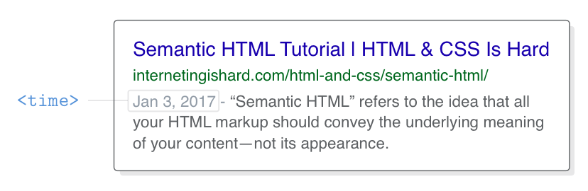

# 语义化元素
参考：
* [Schema.org microdata](http://schema.org/docs/gs.html) 可让您更改网站在搜索引擎结果中的外观
* [Twitter cards](https://dev.twitter.com/cards/getting-started) 定义如何在推文中显示您的网页
* [Open Graph metadata](https://developers.facebook.com/docs/sharing/webmasters#markup) 更改 Facebook 分享内容的方式
* [SEO 初学者指南（Beginners Guide to SEO）](https://moz.com/beginners-guide-to-seo)（[中译版](http://blog.sina.com.cn/s/blog_14992d4910102x950.html)）
* 关于无障碍浏览及网页设计参考[该课程](https://classroom.udacity.com/courses/ud882/lessons/3574748851/concepts/37757186550923)，重点介绍为图片添加 `alt` 元素以添加替代描述，让屏幕阅读器「读出」图片。

使用**语义化元素**编写 HTML 文档可以提升**网站搜索引擎的优化**程度，并提供网页预览，此外使用语义化元素有利于**无障碍浏览**。

可在 [HTML 元素参考](https://developer.mozilla.org/zh-CN/docs/Web/HTML/Element) 网页根据不同功能将元素分组，可以查找合适的元素构建网页。:warning: 在[过时的和弃用的元素](https://developer.mozilla.org/zh-CN/docs/Web/HTML/Element##过时的和弃用的元素)主题下列出了 Web 过去曾经使用的元素，由于不再支持这些元素（也许这些元素仍有效），因此应避免使用这些元素。

常见的语义化块元素如下：

* **内容分区元素** 适用于在页面上安排布局。:warning: 其中有许多元素对包含的内容有相应的要求，如 `<article>` 元素通常标记一篇完整的文章
* **章节与大纲元素** 如 `<h1>`、`<section>` 等元素，标记文档并生成大纲。
* **文本内容元素** 适用于标记文本，以组织章节里的的内容，如 `<blockquote>` 适用于表示其中的文字是引用内容。

此外[**内联元素**](https://developer.mozilla.org/zh-CN/docs/Web/HTML/Element#内联文本语义)也有文本语义相关的元素定义一个单词、一行内容，或任意文字的语义、结构或样式。如 `<em>`、`<span>`、`<code>`（以等宽字体显示代码）、`<data>`、`<progress>`、`<time>` 等元素。

:bulb: 在探索优化 HTML 的过程中，语义标签并非唯一的工具，还可以**使用 `id` 和 `class` 属性**。

## header 标签
元素 `<header>` 与标题元素不同，用以标记介绍性内容，如在导航栏中的公司 Logo 或文章作者信息。一般将网页名称、Logo 和主导航栏包含在 `<header>` 元素内，因为这些信息都是整个网页的概述信息。

该元素可以包含 `<section>`、`<article>` 或整个网页的概述内容，即在一个页面中可以设置多个 `<header>` 标签以标记网页不同部分的介绍信息。

## nav 标签
元素 `<nav>` 标记网页的导航部分，包括导航栏、侧边栏（链接到相关网页）或其他有大量相关链接集合的区域。该元素对于搜索引擎而言该元素的语义信息十分有用，可以帮助机器快速发现页面的链接。

在单个页面上如果有多个链接集，则网页可以包含多个导航元素。

## article 标签
元素 `<article>` 用以表示网页中独立的文章内容部分，**其包装的内容应该是完整的，即这部分内容即时「取出」后插入到其他网页也不影响理解的**，即元素 `<article>` 类似于一个微型网页，它有必要的文档大纲，即使只将这部分的内容移至其他网页也不会引起理解上的问题。

一般博客文章、新闻文章或单个网页都只有一个主题，因此常常使用一个 `<article>` 元素，但是在目录或导航类型的页面可以使用多个 `<article>` 标签。如将大量博客帖子归类到一个页面，每一篇文章的概述都可以包装在单独的 `<article>` 元素中。

## 大纲
每一个 HTML 文档都应该有一个大纲结构，最基本的大纲由标题元素 `<h1>` 至 `<h6>` 构成，应该根据内容上下文的重要关系，采用合适的标题标签构建大纲结构，以便搜索引擎和屏幕阅读器识别网页的内容结构。

通过标题标签可以创建大纲结构，其遵循的规则如下：
* 每个标题标签 `<h1>` 创建一个新的章节
* 每个标题后的次级标题标签被视为其下的小节。

:bulb: 在使用标题标签构建网页大纲结构时，上下标题的层级关系起重要作用（而非标题实际绝对等级）。

使用 [HTML5 Outliner](https://gsnedders.html5.org/outliner/) 工具可以十分便捷地分析提取页面文档的大纲结构，并对网页结构进行可视化。


:warning: 可以使用 `<section>` 标签可以**显式地手动定义章节**（因此会破坏原来标题元素形成的层级结构），使得层级结构基于元素的嵌套关系的（而非根据上下文的标题相对等级关系），这意味着每个 `<section>` 内部使用的标题标签层级关系（独立）与外部的标题层级关系互不影响。元素 `<section>` 章节名称是其内部的第一个标题标签的内容，如果该元素内没有标题标签，则该章节为 `Untitled Section`。因此应该尽量避免使用元素 `<section>` 手动显式创建章节，因为浏览器、屏幕阅读器和搜索引擎无法准确地解析标签 `<section>` 对文档大纲的影响，应该尽量使用语义清晰的标题标签。不应该随意将元素 `<section>` 作为独立内容的容器（而应该使用 `<article>` 元素），也不应该纯粹作为实现布局的容器（而应该使用 `<div>` 通用容器）。仅在隐式定义网页部分，以实现不同样式设置时，替代通用盒子 `<div>` 元素以提供更多的语义信息。

## section 标签
标签 `<section>` 与 `<article>` 类似，也是用以包装部分内容的，但是包含的内容**不需要**独立于上下文。类似于 `<div>` 元素，`<section>` 元素是 HTML5 中通用容器，但是比 `<div>` 具有语义。

:warning: 该标签的作用可以理解为***显式***手动地定义网页章节（破坏了原有的基于标题元素相对等级关系构建的大纲），以便为嵌套的内容设置新特定的样式（而不使用标题标签的默认样式），因此应该谨慎使用该元素。

## aside 标签
元素 `<aside>` 标记出额外添加的内容，一般表示所包含的信息是与整个网页的内容相「分离」，因此常常用于标记网页的侧边栏，如嵌套在 `<article>` 中的赞助广告信息可通过该元素标记出来。

此外元素 `<aside>` 适用于突出显示定义、统计信息或引文，并为该元素（及其包含的内容）设置与本文的其余部分不同的样式。

## footer 标签
元素 `<footer>` 用以标记网页或文章的脚注信息，与元素 `<header>` 用法用类似（作用相反），常见的用例包括版权声明、页脚导航和博客文章末尾的作者履历等内容，同样在一个页面可以使用多个  `<footer>` 标签以标记网页的不同部分。

## div 元素与网页布局
在前端开发中应该尽可能使用 HTML 语义标签创建网页，以方便机器正确解析页面结构，但是不能滥用。如果找不到合适的语义元素，可以使用 `<div>` 通用容器，这样开发者可避免被不正确的语义标签所混淆和误解。

当需要对特定的元素集合进行布局样式的设计时，而无法使用合适的语义标签进行标注时，可以使用通用容器 `<div>`。如希望使用 auto-margin 技术将页面居中，可以将整个页面包含在固定宽度的容器 `<div class='page'>` 中，再对容器进行相应的样式设置；或者使用 flexbox 布局，为了实现复杂的网页布局可能需要使用多个 `<div>` 将 flex 项目进行组合。

## 日期和时间标签
人类表示时间的格式有多种，为了让机器准确解析，可以使用标签 `<time>` 的属性 `datatime` 设置规范的日期，以便浏览器将其自动链接到用户的日历，并帮助搜索引擎清楚地识别日期。一般使用时间标签为文章添加发布日期。

当网页添加了 `<time>` 标签后，在 Google 搜索引擎的词条中会展示出相应的日期。



通过元素 `<time>` 的属性 `datetime` 设置相应的规范的日期，格式是从大到小列出年、月、日，可以添加具体的时间点（24 小时制）和相应的时区 。

```html
<time datetime='2017-1-3 15:00-0800'>January 3rd</time>
```

示例中 `-0800` 是相对格林尼治标准时间 GMT 的时区偏移量，表示太平洋标准时间。

## 地址
元素 `<adress>` 提供有关文章或网页作者的联系信息，与 `<time>` 类似并非结构标签，而是为网页提供元信息。地址元素的默认样式是字体为斜体。

```html
<address>
    Please contact <a href='mailto:troymcclure@example.com'>Troy McClure</a> for questions about this article.
</address>
```

示例在文章的注脚中添加了作者的联系方式，其中[链接指向作者的邮箱](https://developer.mozilla.org/zh-CN/docs/Learn/HTML/Introduction_to_HTML/Creating_hyperlinks##电子邮件链接)（通过 `mailto:` 语法实现，当点击一个链接或按钮时，打开一个新的电子邮件发送信息而不是连接到一个资源或页面）。

:warning: 不应该使用标签 `<address>` 来描述邮政地址，除非这些信息是联系信息的组成部分。

## 图片和标题
元素 `<figure>`  和 `<figcaption>` 分别标注一个独立的图形（如图表、插图甚至是代码片段）以及图片的描述性文字。

通过这两个标签组合，可以为内嵌在 `<figure>` 的标签 `` 所指向的图片添加可视描述（无论图片是否正常显示），而元素 `` 的属性 `alt` 设置的是（图片未正常显示时）图片的*替代性*描述。

:bulb: 元素 `<figcaption>` 与属性 `alt` 类似，都可以为浏览器和 SEO 提供图片信息，因此可以根据使用的图像类型，只使用可见的 `<figcaption>` 元素描述图片，降低代码冗余程度。

:bulb: 其实 `<figure>` 是可以标记其他媒体内容的，而 `<figcaption>` 就定义标题

## 旧浏览器的 CSS 注意事项

本文介绍的 HMTL 语义元素很多都是 HTML5 标准新增的元素，旧浏览器可能无法正确识别解析。因此需要添加以下代码，将这些元素行为设置为与通用容器 `<div>` 一致（因为它们大部分都是块元素，而非内联元素）。

```css
section, article, aside, footer, header, nav {
    display: block;
}
```

