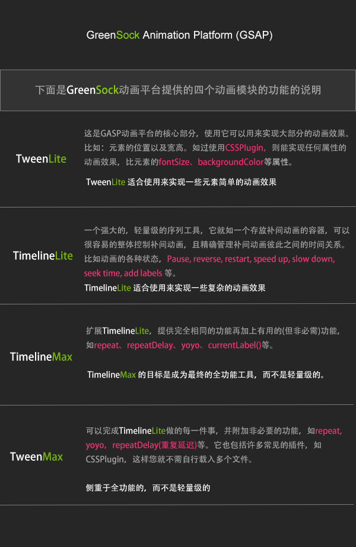
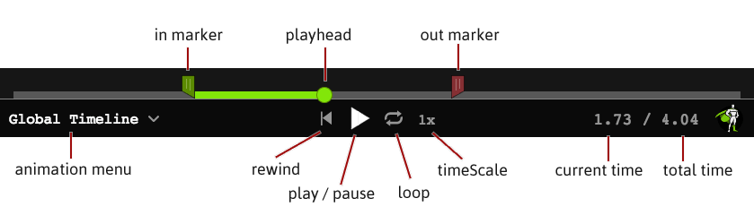

# GreenSock
参考：

* [GreenSock](https://greensock.com/)
* [TweenMax中文网（GreenSock动画平台,GSAP）](https://www.tweenmax.com.cn/)
* [TweenMax中文手册/TweenLite中文手册](https://www.tweenmax.com.cn/api/tweenmax/)
* [TimelineMax中文手册/TimelineLite中文手册](https://www.tweenmax.com.cn/api/timelinemax/)

GreenSock Animation Platform，GSAP 是一个久负盛名的 JavaScript 动画库，它可以实现和 CSS 一样的高性能动画效果。GSAP 提供了 TweenLite、TimelineLite、TimelineMax 和 TweenMax 四个不同功能的动画模块，可以按需使用，一般都会加载全功能模块 TweenMax。

>*GSAP最初在 Flash 时代（2004-2006）是作为 Flash 软件的插件用来增添动画效果，当时的名字是 GreenSock Tweening Platform（GreenSock 补间平台）。后来 Flash 逐渐没落，出于自身发展考虑，GreenSock 在 v12（第十二版）中，加入了 JavaScript 的 Class，也就是说我们可以在 HTML 网页中使用TweenLite 或 TweenMax…等来制作动画，也借此版本把发展计划的名称更名为 GreenSock Animation Platform（GreenSock 动画平台，GSAP），主要是把 Tweening 换成 Animation，因为前者主要为 Flash 在使用的名词，而后者就属于比较广义的「动画」，后来逐步发展为全平台均可应用的动画库。*



`TweenMax.js` 是 GSAP 的一个特殊文件，为了使用简便，它把常用的插件整合到了一起，只要加载了它就可以使用四个核心工具、CSSPlugin、BezierPlugin、高级时间曲线等。

:bulb: Tween 是指初始状态和结束状态之间的动画过渡设置，称作补间动画。


## TweenMax 使用方法

1. 加载文件：[官网](https://greensock.com/docs/v3/Installation)提供了多种加载 GSAP 的方式
   * 通过 CDN 方式加载 `<script src="https://cdnjs.cloudflare.com/ajax/libs/gsap/3.5.0/gsap.min.js"></script>`
   * 通过 NPM 按照 GSAP 模块 `npm install gsap`
   * 下载压缩文件

2. 使用 [Tween 提供的 API](https://greensock.com/docs/v2/TweenMax)（[中译版](https://www.tweenmax.com.cn/api/tweenmax/)）设置指定 DOM 元素（或 DOM 数组）动画，有多种方式，其中一种常用方式如下：

   ```js
   /**
    * {object/array} element: DOM or DOM array
    * {number} duration: animation duration base on second (without the s suffix)
    * {object} vars: animation setting params
    */

   // method 指 TweenMax 内置的各种常用动画方式，如 to、from、stagger 等
   TweenMax.method(element, duration, vars)
   ```

:bulb: GSAP 3.x 不再使用 `TweenMax` 而是[统一使用 `gsap` 调用相应的 API](https://greensock.com/docs/v3/GSAP/Tween)，单大部分方法都是兼容的。

一个动画需要四个基本要素：

* 动画目标
* 起始状态（可忽略）
* 终点状态
* 补间效果

```js
// fromTo 方法用于创建一个动画对象
// 其中第一个动画对象参数设置动画起始点状态，而第二个动画对象参数设置动画的结束点状态
TweenMax.fromTo('div', 5, {opacity:1}, {opacity:0});
// 动画目标：div
// 起始状态：opacity:1
// 终点状态：opacity:0
// 补间：5秒完成状态改变
```

### 动画结构

TweenMax 提供了多种设置动画目标和起始、终点状态的动画的结构化方法，指定动画的方向和形式

#### TweenMax

`TweenMax(target:Object, duration:Number, vars:Object)` 用来构建一个 TweenMax 动画对象

参数：

* `target` 需要设置动画的 DOM 元素或 DOM 元素数组
* `duration` 动画持续时间，一般是秒（不需要写单位）
* `vars` 动画参数（CSS属性、延迟、重复次数等）

```js
// 动画对象使用类属性选择器选择 .box 元素
// 动画持续时间是 3s
// 动画最终状态是：水平向右平移 300 作为单位，透明度设置为 0.3
new TweenMax('.box', 3, {
    x: 500,
    alpha : 0.3,
});
```

:gear: [在线演示](https://codepen.io/benbinbin/pen/BaKRdyd)

<iframe height="265" style="width: 100%;" scrolling="no" title="TweenMax()" src="https://codepen.io/benbinbin/embed/BaKRdyd?height=265&theme-id=light&default-tab=js,result" frameborder="no" loading="lazy" allowtransparency="true" allowfullscreen="true">
  See the Pen <a href='https://codepen.io/benbinbin/pen/BaKRdyd'>TweenMax()</a> by Benbinbin
  (<a href='https://codepen.io/benbinbin'>@benbinbin</a>) on <a href='https://codepen.io'>CodePen</a>.
</iframe>


#### TweenMax.to

`TweenMax.to(target:Object, duration:Number, vars:Object)` 用于创建一个从当前属性到指定目标属性的 TweenMax 动画对象

参数：

* `target` 需要设置动画的 DOM 元素或 DOM 元素数组
* `duration` 动画持续时间，一般是秒
* `vars` 动画参数（CSS属性、延迟、重复次数等），目标属性状态

```js
// 通过类属性选择器选择 .box 元素有多个
// 使用函数并返回值的方式分别设置各个元素在 x 轴的运动距离
var myTween = TweenMax.to(".box", 1, {
  x: function(index, target) {
    return (index + 1) * 100   // 三个元素在 x 轴方向上的运动距离分别为 100, 200, 300
  }
})
```

:gear: [在线演示](https://codepen.io/benbinbin/pen/zYqwdmv)

<iframe height="265" style="width: 100%;" scrolling="no" title="TweenMax.to()" src="https://codepen.io/benbinbin/embed/zYqwdmv?height=265&theme-id=light&default-tab=css,result" frameborder="no" loading="lazy" allowtransparency="true" allowfullscreen="true">
  See the Pen <a href='https://codepen.io/benbinbin/pen/zYqwdmv'>TweenMax.to()</a> by Benbinbin
  (<a href='https://codepen.io/benbinbin'>@benbinbin</a>) on <a href='https://codepen.io'>CodePen</a>.
</iframe>

:bulb: 与前一方法 `TweenMax` 类似

```js
  // 以下两种方式创建的动画效果相同
  var myTween = new TweenMax(obj, 1, {x:100})
  var myTween = TweenMax.to(obj, 1, {x:100})
```


#### TweenMax.from

`TweenMax.from(target:Object, duration:Number, vars:Object)` 用于创建一个动画**从设置点开始返回原始状态**

```js
TweenMax.from(".box", 3, {
  x: 500,   // 元素从500px开始，返回原来位置
})
```

:gear: [在线演示](https://codepen.io/benbinbin/pen/rNemGyM)

<iframe height="265" style="width: 100%;" scrolling="no" title="TweenMax.from()" src="https://codepen.io/benbinbin/embed/rNemGyM?height=265&theme-id=light&default-tab=css,result" frameborder="no" loading="lazy" allowtransparency="true" allowfullscreen="true">
  See the Pen <a href='https://codepen.io/benbinbin/pen/rNemGyM'>TweenMax.from()</a> by Benbinbin
  (<a href='https://codepen.io/benbinbin'>@benbinbin</a>) on <a href='https://codepen.io'>CodePen</a>.
</iframe>


#### TweenMax.fromTo

`TweenMax.fromTo(target:Object, duration:Number, fromVars:Object, toVars:Object)` 设置动画起始点和结束点来初始化一个 TweenMax 动画对象，相当于动画从第一个设置点到第二个设置点。

参数：

* `fromVars` 起始点动画参数
* `toVars` 结束点动画参数

```js
// 盒子水平方向从 200 移动到 500，持续时间是 3s
TweenMax.fromTo('.box', 3, {x: 200,},{x: 500,});
```

:gear: [在线演示](https://codepen.io/benbinbin/pen/rNemGyM)

<iframe height="265" style="width: 100%;" scrolling="no" title="TweenMax.fromTo()" src="https://codepen.io/benbinbin/embed/vYGmeez?height=265&theme-id=light&default-tab=css,result" frameborder="no" loading="lazy" allowtransparency="true" allowfullscreen="true">
  See the Pen <a href='https://codepen.io/benbinbin/pen/vYGmeez'>TweenMax.fromTo()</a> by Benbinbin
  (<a href='https://codepen.io/benbinbin'>@benbinbin</a>) on <a href='https://codepen.io'>CodePen</a>.
</iframe>


#### TweenMax.staggerTo

`TweenMax.staggerTo(targets:Array, duration:Number, vars:Object, stagger:Number, onCompleteAll:Function, onCompleteAllParams:Array, onCompleteAllScope:* )` 为多个目标制作一个有间隔的动画序列，:bulb: 需要设置每个动画的开始间隔 `stagger`，如不设置则为零，同时开始动画。

参数：

* `stagger` 可以是 `number`/`object`/`function` 多种形式，默认为数字 `0` 即各元素之间的动画同时发生，如果为一个正数，即设置每个动画对象的起始间隔。

  更多高级设置可以参考：:gear: [Advanced staggers in GSAP 3](https://codepen.io/GreenSock/pen/jdawKx)

* `onCompleteAll` 当所有显示对象都完成动画后调用的函数

* `onCompleteAllParams` 函数 `onCompleteAll` 的参数，以数组形式传入

* `onCompleteAllScope` 函数 `onCompleteAll` 的作用域，设定 `this` 的指向

```js
// 每个盒子动画间隔 0.5 秒
TweenMax.staggerTo(".box", 1, {rotation:360, y:100}, 0.5);
```

:gear: [在线演示](https://codepen.io/benbinbin/pen/abNWLXq)

<iframe height="265" style="width: 100%;" scrolling="no" title="TweenMax.to()" src="https://codepen.io/benbinbin/embed/abNWLXq?height=265&theme-id=light&default-tab=css,result" frameborder="no" loading="lazy" allowtransparency="true" allowfullscreen="true">
  See the Pen <a href='https://codepen.io/benbinbin/pen/abNWLXq'>TweenMax.to()</a> by Benbinbin
  (<a href='https://codepen.io/benbinbin'>@benbinbin</a>) on <a href='https://codepen.io'>CodePen</a>.
</iframe>

类似地，stagger 系列方法中还有相应的方法设置动画的结束点或起始点和结束点：

* `TweenMax.staggerFrom()` 设定序列动画的[从终点返回到原始状态](https://www.tweenmax.com.cn/api/tweenmax/TweenMax.staggerFrom())
* `TweenMax.staggerFromTo()` 设定序列动画的[起点和终点](https://www.tweenmax.com.cn/api/tweenmax/TweenMax.staggerFromTo())

:warning: stagger 系列方法可用于 TweenMax、TimelineLite、TimelineMax，不可用于 TweenLite。


#### TweenMax.set

`TweenMax.set(target:Object, vars:Object)` 立即设置目标的属性值而不产生过渡动画。相当于动画时间为 `0`

:bulb: 相当于直接在 JavaScript 中设置元素的 CSS 样式。

```js
//以下两个设置作用相同
TweenMax.set(myObject, {x:100});
TweenMax.to(myObject, 0, {x:100});
```


### 动画设置

在动画结构的对象 `vars` 中设置动画的参数，除了常见的 CSS 属性外，GreenSock 还提供了其他动画相关的属性（参考侧栏的 [动画初始设置](https://www.tweenmax.com.cn/api/tweenmax/)）。

:warning: 由于在 JavaScript 中设置 CSS 样式，因此样式名称会有区别，其中值得注意的一点时 JavaScript 不支持连字符，应该使用相应的小驼峰形式代替。

常用的动画初始设置：

* `repeat` 动画在第一次完成后应重复的次数，`repeat` 应该始终是一个整数。。如果 `repeat: 1`，则动画将总共播放两次（初始播放加1次重复）。要无限期重复，请使用 `repeat: -1`。

* `cycle` 在动画结构为 stagger（错开）系列方法中用该属性设定属性组（一个数组），这样就可以给每个元素设置特定的样式。:bulb: 还可使用 `function` 函数按照特定规律生成一系列的属性值，函数可接受两个参数 `index` 和 `target` 以基于元素的索引和目标元素生成排序动画，以返回的值来设置每个元素的动画效果

  ```js
  // 对 8 个盒子设置动画，之间的动画间隔 0.5s
  TweenMax.staggerTo(".box", 1, {
  	cycle: {
  		// 为 8 个盒子循环设置 3 种不同的结束点颜色属性
  		backgroundColor: ["red", "green", "blue"],
  		//通过 function 返回属性
  		y: function(index, target) {
  			// 基于索引值 index 为不同盒子设置结束点的 y 值
  			return index * 20;
  		},
  	},
  }, 0.5);
  ```

  :gear: [在线演示](https://codepen.io/benbinbin/pen/JjXNpOO)

  <iframe height="265" style="width: 100%;" scrolling="no" title="cycle" src="https://codepen.io/benbinbin/embed/JjXNpOO?height=265&theme-id=light&default-tab=html,result" frameborder="no" loading="lazy" allowtransparency="true" allowfullscreen="true">
    See the Pen <a href='https://codepen.io/benbinbin/pen/JjXNpOO'>cycle</a> by Benbinbin
    (<a href='https://codepen.io/benbinbin'>@benbinbin</a>) on <a href='https://codepen.io'>CodePen</a>.
  </iframe>

* `yoyo` 配合属性 `repeat` 使用，在重复动画时以往返方式进行，布尔值默认是 `false`，当设置为 `true` 时就会采用往返的方式进行动画重复。

  ```js
  // 盒子无线往返运动
  new TweenMax('.box', 3, {
      x: 500,
      repeat:-1,
      yoyo:true,
  });
  ```

  :gear: [在线演示](https://codepen.io/benbinbin/pen/abNWqPE)

  <iframe height="265" style="width: 100%;" scrolling="no" title="yoyo" src="https://codepen.io/benbinbin/embed/abNWqPE?height=265&theme-id=light&default-tab=css,result" frameborder="no" loading="lazy" allowtransparency="true" allowfullscreen="true">
    See the Pen <a href='https://codepen.io/benbinbin/pen/abNWqPE'>yoyo</a> by Benbinbin
    (<a href='https://codepen.io/benbinbin'>@benbinbin</a>) on <a href='https://codepen.io'>CodePen</a>.
  </iframe>

* `ease` 设置动画过渡效果的速度曲线（缓动效果）。

  ```js
  new TweenMax('.box', 3, {
      x: 500,
      ease: Bounce.easeOut
  });
  ```

  GreenSock [预设](https://greensock.com/docs/v2/Easing)了多种缓动效果，部分缓动效果 :gear: [在线演示](https://codepen.io/benbinbin/pen/JjXNJOx)

  <iframe height="265" style="width: 100%;" scrolling="no" title="GreenSock eases" src="https://codepen.io/benbinbin/embed/JjXNJOx?height=265&theme-id=light&default-tab=js,result" frameborder="no" loading="lazy" allowtransparency="true" allowfullscreen="true">
    See the Pen <a href='https://codepen.io/benbinbin/pen/JjXNJOx'>GreenSock eases</a> by Benbinbin
    (<a href='https://codepen.io/benbinbin'>@benbinbin</a>) on <a href='https://codepen.io'>CodePen</a>.
  </iframe>

  也支持使用官网提供的[在线工具](https://greensock.com/ease-visualizer)进行定制化：

  * [CustomEase](https://greensock.com/docs/v2/Easing/CustomEase)
  * [CustomBounce](https://greensock.com/docs/v2/Easing/CustomBounce)
  * [CustomWiggle](https://greensock.com/docs/v2/Easing/CustomWiggle)

* `stagger` 在动画结构为 stagger 系列方法中设置的属性，默认是使用数字 number 类型设置各元素动画间隔时间，也可以使用 object 类型或 function 函数返回 :gear: [更复杂的设置](https://codepen.io/GreenSock/full/jdawKx)。

  * 如果属性值为对象 object 类型，则可以设置以下参数：

    * `amout`（类型为 number）设置间隔的总时间（以秒为单位），如 `amout: 1` 且针对 100 个元素，则每个元素的动画起始时间间隔 0.01s。如果使用负数则间隔时间就会「反向」，即从 DOM 元素数组中最后一个元素开启动画。
    * `each`（类型为 number）设置每个元素之间的动画启动的间隔时间，如 `each: 1` 表示每个元素之间动画起始时间间隔都是 1s。类似地也可以使用负数。
    * `from`（类型为 integer 或 string）设置动画开启的元素，默认为 `0` 即从第一个元素开启动画。如果使用整数，如 `from: 4` 表示从 DOM 元素数组的第 `5` 个元素开启动画，而在数组定位中越靠近该索引位置的元素开启动画就越早（间隔时间由 `amout` 或 `each` 决定）；也可以使用关键字 `"start"`、`"center"`、`"edges"`、`"random"`、`"end"` 来设置动画开启的元素，:bulb: 如果使用 GreenSock V3.1.0 还可以使用 `"random"` 表示选择随机元素开启动画。

    * `grid`（类型为 array 或关键字 `"auto"`）和 `axis`（类型为 string）与 :gear: [网格布局](https://codepen.io/GreenSock/pen/gyWrPO?editors=0010)的 DOM 元素数组动画设置相关。
    * `ease` 设置间隔时间的缓动变化（类似于设置 `duration` 的缓动变化），默认值 `"none"` 即元素按照间隔依次开启动画。如 `ease: power2` 会产生元素数组中元素动画起始依次开始，然后最后的元素动画起始较都接近同步开启。

  * 如果属性值为函数 funciton 则对于 DOM 元素数组中的每个元素都会调用一次该函数，函数可以接受三个参数： `index` （当前元素在数组中的索引），`target` 当前元素，`list` DOM 元素数组，使用这些参数计算并返回延迟时间（即当前元素距离第一个开启动画的元素的时间点而言，而不是相邻元素的动画起始间隔时间）


## TimelineMax 使用方法

如果要构建复杂的动画序列一般需要用 `delay` 为每个动画设置开始时间，但以这种方式排序、管理、组织大量的动画序列将会非常麻烦，因此 GreenSock 推出了 TimelineMax 模块，可创建时间轴 timeline 作为动画或其他时间轴的容器，这使得整个动画控制和精确管理时间变得简单。

```js
var tl = new TimelineMax();   // 初始化一个时间轴对象
tl.add( TweenMax.to(element, 1, {left:100}) );   // 将一个动画添加到时间轴
tl.add( TweenMax.to(element, 1, {top:50}) );   // 将一个动画添加到时间轴末端，即与前一个动画接续
tl.add( TweenMax.to(element, 1, {opacity:0}) );   // 将一个动画添加到时间轴末端，即与前一个动画接续

// 可以通过时间轴控制整个动画序列
tl.reverse();
// 也可以随意调整任何动画，如增加第一个动画的持续时间，TimelineMax 都会自动调整，而不必担心延迟时间会发生混乱。
```

:bulb: 可以使用类似于 [TweenMax 的动画结构 `.to()`、`.from()`、`.staggerto()` 等方法](#动画结构)**直接在时间轴对象上设置动画**，并通过链式调用的方式将多个动画依次添加到时间轴上，使代码更加简洁。

```js
// 和以上示例作用相同
var tl = new TimelineLite();
tl.to(element, 1, {left:100}).to(element, 1, {top:50}).to(element, 1, {opacity:0});
```

:bulb: GreenSock 推出了配套的 [GSDevTools](https://greensock.com/gsdevtools) 工具，可以在页面底部加载时间轴，以提供更直观的可视化调试方式。下载压缩文件或使用 CDN 加载。

```html
<!-- 加载 GSDevTools -->
<script src="https://cdnjs.cloudflare.com/ajax/libs/gsap/3.5.1/gsap.min.js"></script>

<!-- 启动 GSDevTools 工具 -->
<script>
    // Instantiate GSDevTools
	GSDevTools.create();
</script>
```




### 时间轴初始化及动画管理

#### TimelineMax.add

`TimelineMax.add(value:*, position:*, align:String, stagger:Number)` 向时间轴添加动画、其他时间轴、回调函数或标签（或它们的数组）等。

:bulb: 该方法返回该时间轴以便链式调用。

参数：

* `value` 添加的动画、时间轴、回调函数或标签（或它们的数组
* `position` 添加的时间点，使用数字来表示以秒为单位的绝对时间（或基于帧的时间轴的帧），或使用 `"+="` 或 `"-="` 前缀来设置相对时间。
* `string` 序列方式，仅当属性 `value` 是数组时需要设置，默认 `string: normal`
  - `sequence` 排队添加，即一个完成后再到下一个
  - `start` 全部同时开始，并忽略 `delay`
  - `normal` 全部同时开始，不忽略 `delay`
* `stagger` 序列时间间隔（或帧），仅当属性 `value` 是数组时需要设置，默认 `stagger: 0`

```js
 // 将一个动画添加到时间轴的末尾
 tl.add( TweenLite.to(element, 2, {left:100}) );

 // 将一个函数添加到1.5秒处
 tl.add(func, 1.5);

 // 将一个标签添加至时间轴结束后2秒
 tl.add("myLabel", "+=2");

 // 将另一个时间轴添加至"myLabel"标签处
 tl.add(otherTimeline, "myLabel");

 // 将一个动画数组添加至标签"myLabel"后2秒处
 tl.add([tween1, tween2, tween3], "myLabel+=2");

 // 将一个动画数组添加至时间轴结尾后2秒处，每个动画都在前一个动画结束0.5秒后开始
 tl.add([tween1, tween2, tween3], "+=2", "sequence", 0.5);
```


#### TimelineMax.to

`TimelineMax.to(target:Object, duration:Number, vars:Object, position:*)` 添加一个`TweenMax.to()`动画到时间轴，相当于`TimelineMax.add(TweenMax.to(...))`

:bulb: 该方法返回该时间轴以便链式调用。

类似地，有 `TimelineMax.to()`、`TimelineMax.from()`、`TimelineMax.staggerto()` 等方法，其中[时间轴初始化设置](https://www.tweenmax.com.cn/api/timelinemax/delay)与 TweenMax 的动画设置[相似](#动画设置)。

```js
//创建一个时间轴
var tl = new TimelineLite({onComplete:myFunction});
// 使用简写形式和链式调用方法构造动画序列
tl.to(element, 1, {left:100})   // 添加一个动画
  .to(element, 1, {top:50}, "-=0.25")   // 在时间轴末端前0.25秒（即时间轴0.75秒）处添加该动画
  .set(element, {opacity:0})   // 在时间轴末端立即设置动画元素的透明度
  .call(otherFunction)   // 在时间轴末端执行函数otherFunction()
  .staggerTo([e1, e2, e3], 1.5, {rotation:45}, 0.25);   // 最后在时间轴末端旋转 e1, e2, e3 元素，动画之间的起始间隔是 0.25 秒
```


### 时间轴初始化设置

参考：[时间轴初始化设置](https://www.tweenmax.com.cn/api/timelinemax/delay)

可设置的属性与 [TweenMax 的动画设置](#动画设置)提供的属性和功能相似。


## 插件

GreenSock 除了提供四个不同功能的动画模块以为，还提供了各种功能的[插件](https://greensock.com/gsap-plugins/)。

:warning: GreenSock 即 GSAP 下载包内的所有插件可免费用于个人和商业网站或应用，只有用于访客付费才可浏览内容的网站，如收费视频网站或应用才需要购买授权。而对于其他插件（SplitText、Physics2DPlugin、DrawSVGPlugin、MorphSVGPlugin等）是需要付费，可以到[该地址](https://greensock.com/licensing)购买授权。

:bulb: 如果希望尝试和练习使用这些插件，可以使用官方提供的 :gear: [Codepen 模板](https://codepen.io/GreenSock/pen/OPqpRJ)（已通过 CDN 加载了相应的插件文档）：

* :gear: [MorphSVG How-To Pens](https://codepen.io/collection/noQGjq)
* :gear: [DrawSVG How-To Pens](https://codepen.io/collection/XRqLgd)
* :gear: [ScrollTrigger How-To Pens](https://codepen.io/collection/AEbkkJ)


### MorphSVGPlugin

MorphSVGPlugin 是 GreenSock 动画平台用于 SVG 变形的插件，操纵路径元素 `<path>` 中的 `d` 属性值实现在各形状之间平滑的变形动画。

```html
<!-- 载入 TweenMax.min.js 和 MorphSVGPlugin.min.js 文件 -->
<script src="js/TweenMax.min.js"> </script>
<script src="js/MorphSVGPlugin.min.js"> </script>

<!-- svg path -->

<script>
    // 将公鸡变成兔子
	TweenMax.to("#cock", 3, {morphSVG:"#rabbit" });
</script>

```

:bulb: 对于 SVG 中的基本图形，可以使用该插件的方法 `MorphSVGPlugin.convertToPath(shape:*)` 转换为相应的路径 `<path>` 元素，这样也可以进行变形。

:bulb: 可以使用该插件的 `MorphSVGPlugin.pathDataToBezier(path:*, vars:Object) ` :cinema: [方法 将路径元素 `<path>` 转换为贝塞尔曲线](https://youtu.be/nAc9k8sXrUo)作为元素的动画轨迹

更多功能用法参考：

* GreenSock | Docs | Plugins | [MorphSVGPlugin](https://greensock.com/docs/v2/Plugins/MorphSVGPlugin)
* :gear: [MotionPath How-To Demos](https://codepen.io/collection/DYRzxd) | Codepen
* :gear: [MorphSVGPlugin 使用方法](https://www.tweenmax.com.cn/MorphSVGPlugin/)


### DrawSVGPlugin

DrawSVGPlugin 是 GreenSock 动画平台用于描绘 SVG 路径的插件，可以对SVG 的 `<path>`、`<line>`、`<polyline>`、`<polygon>`、`<rect>`、`<ellipse>` 进行绘图动画。

```html
<!-- 载入TweenMax.min.js和DrawSVGPlugin.min.js文件 -->
<script src="js/TweenMax.min.js"> </script>
<script src="js/DrawSVGPlugin.min.js"> </script>

<!-- svg path -->

<script>
    // 以 10% 的长度从 polyline 的起始位置移动到结尾，形成绘制元素 #path 路径的效果
    // drawSVG: "10%" 相当于 drawSVG: "0 10%" 即绘制/展示 #path 元素的 0~10% 这部分的路径
    // drawSVG: "90% 100%" 即绘制/展示 #path 元素的 90%~100% 这部分的路径
	TweenMax.fromTo("#path", 4, {drawSVG:"10%"}, {drawSVG:"90% 100%"});
</script>
```

:bulb: `drawSVG` 设置绘制的区间可以使用绝对像数值或百分比，如果设置为 `drawSVG: 0 100%` 或 `drawSVG: 100%` 可以使用简写形式 `drawSVG: true`。

更多功能用法参考：

* [DrawSVGPlugin](https://greensock.com/drawsvg/) - Plugins - GreenSock
* :gear: [DrawSVG How-To Pens](https://codepen.io/collection/XRqLgd) | Codepen
* [DrawSVGPlugin 使用方法](https://www.tweenmax.com.cn/DrawSVGPlugin/)


### SplitText

[SplitText](https://greensock.com/docs/v3/Plugins/SplitText) 插件（[中译版](https://www.tweenmax.com.cn/SplitText/)）是 GreenSock 动画平台用于将文本打散成数组从而进行动画。


### Physics2DPlugin

[Physics2DPlugin](https://greensock.com/physics2d/) 是 GreenSock 动画平台用于进行物理动画的拓展插件（[中译版](https://www.tweenmax.com.cn/Physics2DPlugin/)），包括重力、速度、加速度、摩擦力动画等等。


### Draggable

[Draggable](https://greensock.com/draggable) 是 GreenSock 动画平台用于设置拖拽动态交互的插件，一般配合 [`ThrowPropsPlugin` 插件](https://greensock.com/docs/v2/Plugins/ThrowPropsPlugin)使用