---
tags:
  - vue
---

# Vue Cli
参考：
* [介绍 | Vue CLI](https://cli.vuejs.org/zh/guide/)
* [Vue CLI 3 - Creating our Project - Real World Vue.js](https://www.vuemastery.com/courses/real-world-vue-js/vue-cli/) | Vue Mastery

对于制作原型或学习可以使用 CDN 直接下载 Vue.js，即直接使用标签 `<script>` 引入，Vue 会被注册为一个全局变量。在用 Vue 构建大型应用时，推荐使用 NPM 安装 Vue（以及项目所依赖的其他模块，如 `webpack`、`Browserify` 等，以便更好地管理）。

此外推荐安装 Vue 官方提供的配套 **Command Line Interface 命令行工具** Vue CLI，它基于 Webpack 打造的一个开发工具，可以提供多种开发脚手架，即根据需求选择预设的模板快速搭建繁杂的开发环境。它主要帮助开发者解决工具和环境的配置问题，确保 Vue 生态中的工具基础标准化，各种构建工具能够基于智能的默认配置即可平稳衔接，这样你可以专注在撰写应用上，而不必花好几天去纠结配置的问题。Vue CLI 也适合快速搭建开发[单文件组件](https://cn.vuejs.org/v2/guide/single-file-components.html)和单页面应用 SPA 的开发环境。

:bulb: 对于中国大陆用户，建议将 NPM 源设置为[国内的镜像](https://npm.taobao.org/)可以大幅提升安装速度。

:thumbsdown: 但是 Vue CLI 也有限制，它不便于开发非 SPA 的网页，这种情况下可以使用 CDN 方法载入 Vue。

## 安装
参考：
* （旧版本）[vuejs/vue-cli at v2](https://github.com/vuejs/vue-cli/tree/v2#vue-cli--)
* （新版本）[安装 | Vue CLI](https://cli.vuejs.org/zh/guide/installation.html)
* [Vue Cli 3 目录结果说明（与 Vue Cli 2 对比）参考：《Vue 出一個電商網站》- Vue Cli 的建置與運作原理 - Vue Cli 所產生的資料夾結構說明](https://www.udemy.com/course/vue-hexschool/)

:bulb: 新版本 Vue CLI 的包名称由 `vue-cli` 改成了 `@vue/cli` 如果你已经全局安装了旧版本的 `vue-cli` (1.x 或 2.x)，你需要先通过 `npm uninstall vue-cli -g` 或 `yarn global remove vue-cli` 卸载它。（以下笔记操作仍使用旧版本）

:warning: Node.js 和 npm 版本要求：[Node.js](https://nodejs.org/en/) (>=6.x, 8.x preferred), npm version 3+ and [Git](https://git-scm.com/)

> 新版 Vue CLI 需要 [Node.js](https://nodejs.org/) 8.9 或更高版本 (推荐 8.11.0+)。你可以使用 [nvm](https://github.com/creationix/nvm) 或 [nvm-windows](https://github.com/coreybutler/nvm-windows) 在同一台电脑中管理多个 Node 版本。

```bash
# 安装全域的 vue cli
$ npm install -g vue-cli
```

:bulb: 推荐使用 [nvm](https://github.com/nvm-sh/nvm) 安装和管理 Node.js 不同版本，具体操作参考：[《用 VueJS 搭配 Firebase 實作一個部落格網站》- Vue.js介紹 & 前端頁面建立 - Vue-CLI 介紹與環境建置.mp4](https://www.udemy.com/course/build-blog-with-vuejs-and-firebase-cloud/)

## 常用命令
### 查看可用指令
```bash
$ vue
```

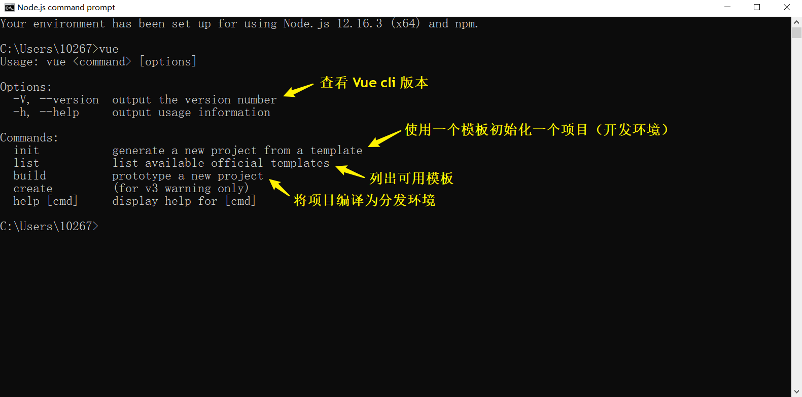

### 查看官方模板
```bash
$ vue list
```

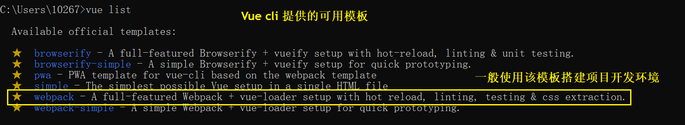

### 模板安裝

```bash
$ vue init {‌{模板名稱}} {‌{資料夾名稱}}
```

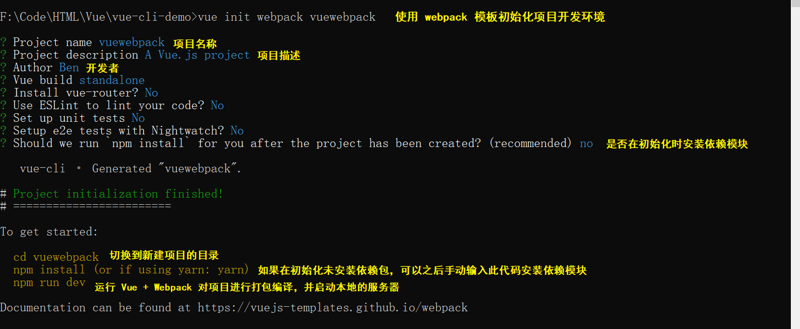

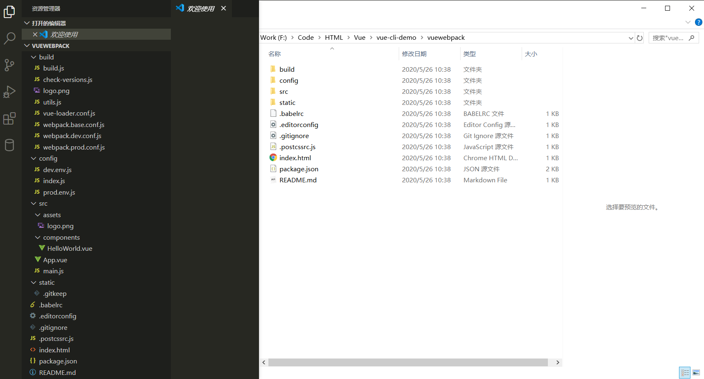

### 安裝依赖模块
:bulb: 需要将终端切换到项目所在目录下，每个项目只有第一次执行即可安装项目所依赖的所有包

```bash
$ npm install
```

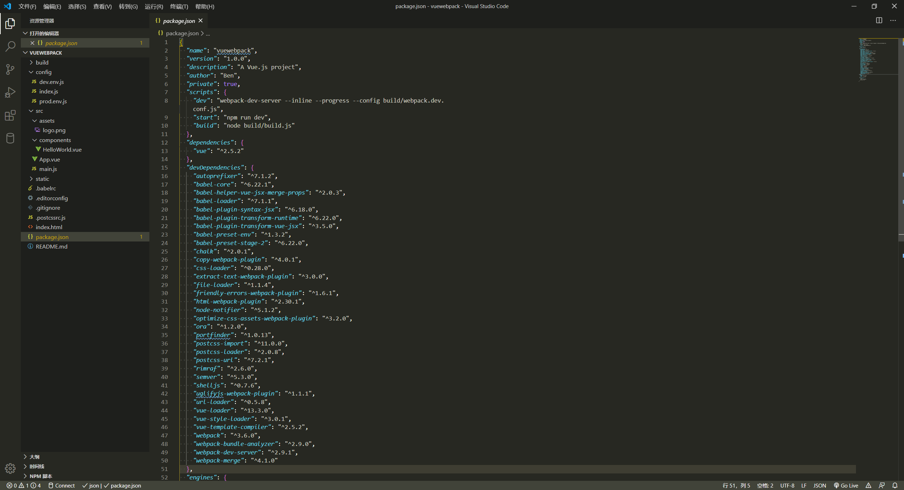

:bulb: 对于中国大陆用户，建议将 NPM 源设置为[国内的镜像](https://npm.taobao.org/)可以大幅提升安装速度。该仓库是淘宝制作的一个完整 `npmjs.org` 镜像，可以用此代替官方版本（只读），同步频率目前为 **10分钟** 一次以保证尽量与官方服务同步。

可以使用我们定制的 cnpm (gzip 压缩支持) 命令行工具代替默认的 npm

```bash
$ npm install -g cnpm --registry=https://registry.npm.taobao.org
```

然后使用 `cnpm` 命令执行常用的操作

```bash
# 安装模块
$ cnpm install [name]

# 同步模块，直接通过 sync 命令马上同步一个模块, 只有 cnpm 命令行才有此功能
$ cnpm sync connect

# 可以直接通过 web 方式来同步 /sync/connect
$ open https://npm.taobao.org/sync/connect

# 其它命令
# 支持 npm 除了 publish 之外的所有命令, 如:
$ cnpm info connect
```

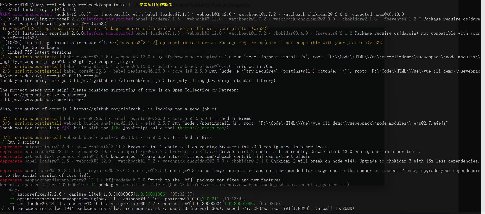

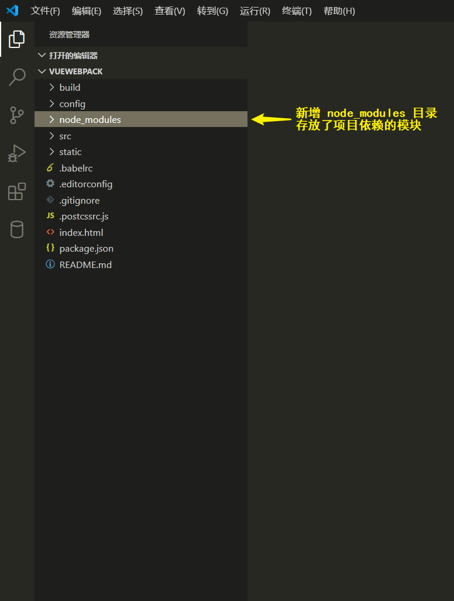

### 打包编译
运行 Vue + Webpack 对项目进行打包编译，并**启动本地的服务器**

```bash
$ npm run dev
```

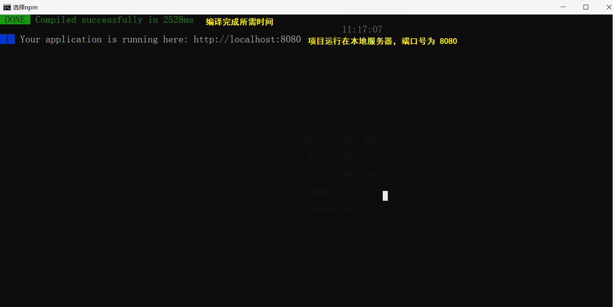

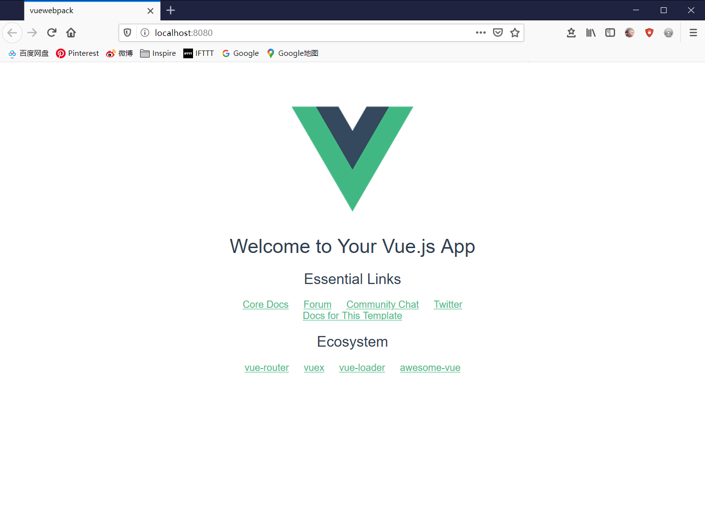
### 编译分发版本
编译为 Production （分发）版本

```bash
$ npm run build
```

:warning: 编译后的分发本版如果希望在本地浏览，必须在本地创建服务器打开它，不能直接通过打开文件查看，否则项目应用无法运行。

## Webpack
Webpack 用于对项目进行打包编译，将项目所需的文件（源码和媒体文件）整合转换为浏览器可识别的内容，如编译 `.sass` 文件为 `.css`，使用 babel 将 ES6 编译为旧浏览器可识别的代码等。

相关概念介绍：[《Vue 出一個電商網站》- Vue Cli 的建置與運作原理 - Webpack 腳本介紹及自定義環境變數](https://www.udemy.com/course/vue-hexschool/)

使用 Vue cli 搭建的开发环境中，Webpack 的源码存放在目录中 `build` 中，其中 `webpack.base.conf.js` 基础的脚本，另外两个文件 `webpack.dev.conf.js` 和 `webpack.pro.conf.js` 都会引用基础脚本，它们分别是开发和分发时进行打包时的配置文档。

在文档 `webpack.base.conf.js` 中设置了基础配置

* 对象 `entry` 定义了 Webpack 的进入点 entry 文档，一般为文件 `main.js`，我们一般在该文档中设置需要导入 `import` 的文档，进行编译打包压缩
* 对象 `output` 定义了 Webpack 编译后文件输出的目录，一般为 `dist` 目录
* 对象 `resolve` 设置可省略的文件拓展名名，以及定义一些路径的别名，更方便模块导入
* 对象 `module` 设置了许多 `loader` 以便识别更多类型的文件（Webpack 默认识别 `.js` 类型文件）可对其进行压缩编译

## 环境变量
如果需要在项目中经常使用的变量，可以在文件 `config/dev.env.js` 和 `config/prod.env.js` 中添加环境变量。两个文件分别配置开发时或分发时的环境变量，如常用的 URL 路径，可以在开发时使用本地的资源，而实际分发时就切换到真实的 API 路径。

```js
// 📁 dev.env.js
// ...
// 配置开发时的环境变量
module.exports = merge(prodEnv, {
  NODE_ENV: '"development"',
  HTTP_PATH: '"https://localhost/"'   // 属性名大写表示它是环境变量
})
```

:warning: 注意环境变量中所使用的（双）引号，否则调用时输出的就不是字符串了。

```js
// 📁 App.vue
// 在其他文件中使用环境变量
process.env.HTTP_PATH
```

:bulb: （新版本）Vue CLI 3 使用 [`.env` 文档](https://cli.vuejs.org/zh/guide/mode-and-env.html)来配置环境变量。

## 使用组件
参考：[《用 VueJS 搭配 Firebase 實作一個部落格網站》- Vue.js介紹 & 前端頁面建立 - Components 組件在Vue-Cli中的使用](https://www.udemy.com/course/build-blog-with-vuejs-and-firebase-cloud/)

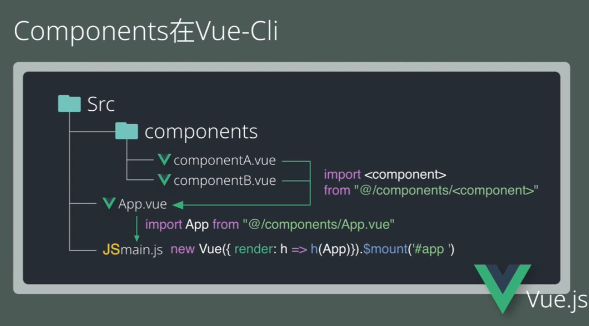

在 Vue-Cli 中组件会存储为单独的 `.vue` 文档（[单文件组件](https://cn.vuejs.org/v2/guide/single-file-components.html)），并使用 JavaScript 的[模块系统](https://cn.vuejs.org/v2/guide/components-registration.html#模块系统) `import` 组件来使用，这样更方便代码管理。

在单文件组件中，其模板在标签 `<template>` 中编写、逻辑交互在标签 `<script>` 中编写，而且还可以使用局部样式 `<style scoped>`（仅适用于该组件），相当于一个单文件组件就包含完整的 HTML、CSS、JavaScript 而且系统在内部将它们耦合，使得组件更加内聚且更可维护。

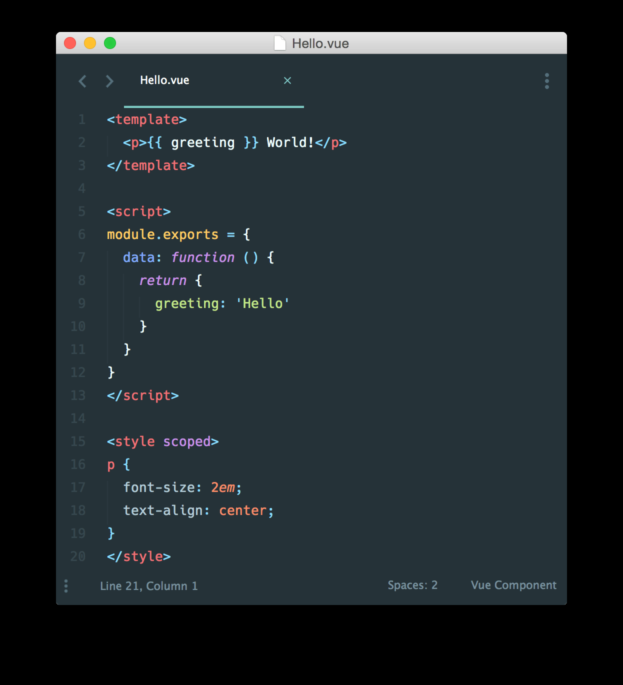

:bulb: 单文件组件还支持把 JavaScript、CSS 分离成独立的文件然后做到热重载和预编译。也支持导入其他组件 `import component_name from '@/components/component_name.vue'`，作为当前组件的子组件，通过组件嵌套的方式构建更复杂的大型网页。

```vue
<!-- my-component.vue -->
<template>
  <div>This will be pre-compiled</div>
</template>
<script src="./my-component.js"></script>
<style src="./my-component.css"></style>
```

:bulb: Vue-Cli 针对单文件组件提供了命令 `vue serve component_name.vue`，用于快速构建原型进行开发测试。

## 安装外部模块
在开发过程中可能需要为项目引入外部的模块，如 [Bootstrap](https://getbootstrap.com/docs/4.5/getting-started/download/#npm)、[vue-axios](https://www.npmjs.com/package/vue-axios) 等，可以通过 `npm`（或 `cnpm`）命令安装模块，然后在 Webpack 中载入（在入口 entry 文件 `main.js`）。

### 引入 Bootstrap
参考：[Integrating and Using CSS Frameworks with Vue.js](https://www.digitalocean.com/community/tutorials/vuejs-css-frameworks-vuejs)

Bootstarp 是一个 CSS 框架，它主要由 scss （CSS 前置语言）编写，我们如果要对其进行定制化修改，除了按照 `bootstrap` 模块，还需要按照相应的模块 `node-sass` 和 `sass-loader`

```bash
$ cnpm install bootstrap node-sass sass-loader --save
```

:bulb: 关键字 `--save` 表示将这些模块写入 `package.json` 的依赖包对象 `dependencies` 中，还有关键字 `--save-dev` 表示将依赖包写入到 `devDependencies` 中，即表示只在开发时才安装这些依赖包

:warning: 注意安装模块的版本，可能由于最新版的模块会与其他模块的旧版代码存在兼容性问题，可以按需安装特定版本的模块 `cnpm install packageName@版本号`，或者在 `package.json` 文件的依赖包对象中修改模块的版本号

然后在 Webpack 入口 entry 文件，一般是 `main.js`，引入 Bootstrap 模块（预编译好的文件），即在 `node_module/bootstrap` 目录下 `dist` 中的分发版本的文件（`bootstrap.min.css` 文件）

```js
// 在 entry 文件 main.js 引入 Bootstrap 模块
import 'bootstrap';   // 引入 Bootstrap 的 JavaScript 文件
import './../node_modules/bootstrap/dist/css/bootstrap.min.css';   // 引入 Bootstrap 的 CSS 文件
```

:warning: 由于 Bootstrap 是依赖 jquery 和 popper.js 模块的，所以终端可能报错，提示如果要使用 Bootstrap 还需要安装这两个依赖模块，如果在网页中需要使用到 Bootstrap 组件的交互功能，还需要在 `main.js` 或在相应的页面/组件（`.vue` 文件）中导入 jquery

```bash
cnpm install jquery popper.js --save
```

或者在特定的组件的 `<style>` 元素中引入 Bootstrap 模块中的源代码文件（未编译的文件），即在 `node_module/bootstrap` 目录下 `scss` 中的源文件（其中完整的文件是 `bootstrap.scss`），然后就可以进行在 Boostrap 源码基础上进行定制样式（覆盖 Bootsrtap 原有的预设）.

:bulb: 如果需要针对 Bootstrap 特定的模块进行修改，如 `_variables.scss` 文件，可以将文件拷贝副本到目录 `src/assets` 下进行修改（而不是在 `node_module` 目录中修改模块的源码），记得在网页导入/引用自定义的 `.scss` 文件。

```html
<!-- 在 Vue 组件中标签 <style> 引入 Bootstrap 的未编译的 SCSS 文件 -->
<!-- 需要在 <style> 标签中声明语言 -->
<style lang="scss">
/* 使用 @import 导入外部样式表，其中 ~ 告诉 Webpack 我们导入的是模块文件 */
/* 即文件需要在存放模块的目录 node_modules 中寻找 */
@import "~bootstrap/scss/bootstrap";
</style>
```

参考：[Complete Vue.js 2 Web Development: Practical guide to building end-to-end web development solutions with Vue.js 2](https://books.google.com/books?id=JtCBDwAAQBAJ)

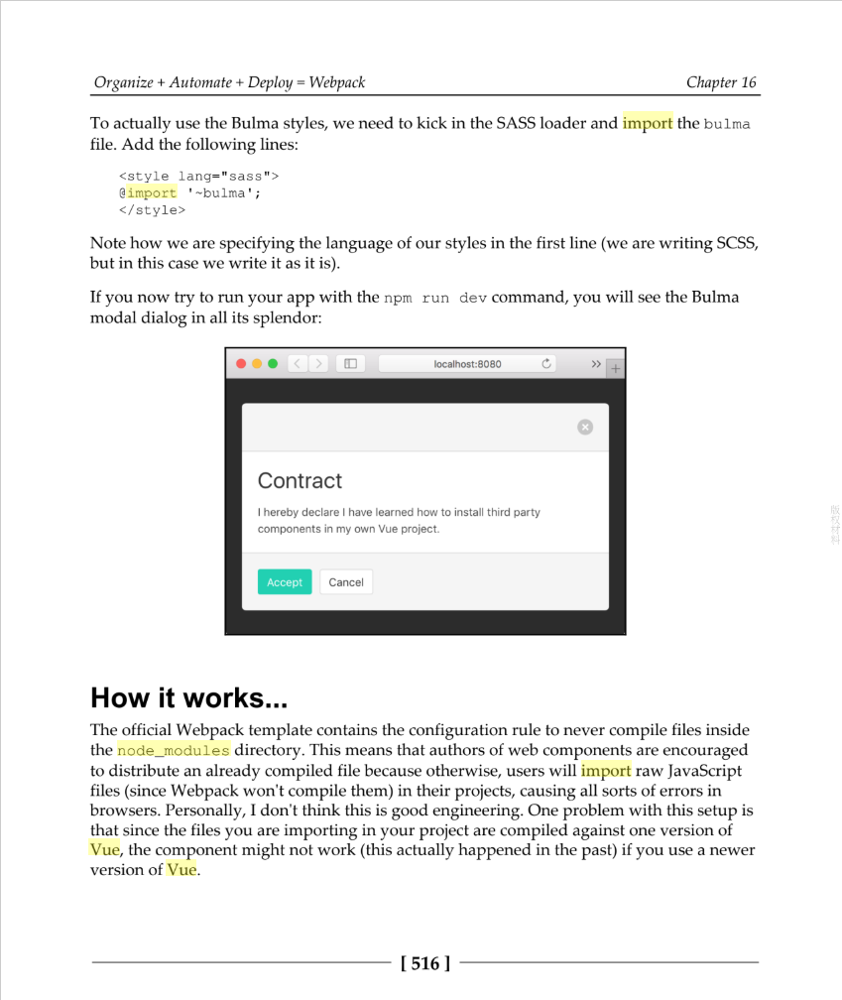

### 引入 vue axios
参考：[vue-axios - npm](https://www.npmjs.com/package/vue-axios)

axios 是一个 ajax 工具，可向服务器发出异步跨域请求。

在终端输入命令安装相应的模块

```bash
$ cnpm install --save axios vue-axios
```

然后在 Webpack 入口 entry 文件，如 `main.js`，引入 axios 模块

```js
import axios from 'axios'   // 主要的 AJAX 模块
import VueAxios from 'vue-axios'   // 将上述模块转换为 Vue 组件

Vue.use(VueAxios, axios)   // 添加到 Vue 实例中，然后就可以在其选项对象中使用相应的方法发送 AJAX 请求
```

```js
// Vue 实例
// 发送异步请求
// ...
this.$http.get(api).then((response) => {
  console.log(response.data)
})
```

### 引入 Bootstrap-Vue
参考：[BootstrapVue](https://bootstrap-vue.org/)

BootstrapVue 是一个整合了 Bootstrap 和 Vue.js（将 Bootstrap 组件整合为 Vue 组件）的 CSS 框架，它提供了丰富的组件和网格系统，还有其他的资源 670+ 个图标，可以让使用 Vue 的开发者快速开发出布局多样、交互功能丰富的响应式网站，此外它的组件具有 [WAI-ARIA](https://www.w3.org/WAI/standards-guidelines/aria/) 标记提高了网页的可访问性。

使用 Vue-Cli 开发项目时，将 Bootstrap-Vue [作为其中一个 node 模块引入](https://bootstrap-vue.org/docs#vue-cli-3)


## 快速原型开发
你可以使用 `vue serve` 和 `vue build` 命令对单个 `*.vue` 文件进行快速原型开发，而不需要预先通过 Vue Cli 搭建开发环境。

额外安装一个全局的扩展：

```bash
npm install -g @vue/cli-service-global
```

:warning: `vue serve` 的缺点就是它需要安装全局依赖，这使得它在不同机器上的一致性不能得到保证。因此这只适用于快速原型开发。

### 编译
然后在这个 `*.vue` 文件所在的目录下运行

```bash
vue serve
```

:bulb: `vue serve` 使用了和 `vue create` 创建的项目相同的默认设置（webpack、Babel、PostCSS 和 ESLint）。它会在当前目录自动推导入口文件，入口可以是 `main.js`、`index.js`、`App.vue` 或 `app.vue` 中的一个，也可以显式地指定入口文件：

```bash
vue serve MyComponent.vue
```

如果需要，你还可以提供一个 `index.html`、`package.json`、安装并使用本地依赖、甚至通过相应的配置文件配置 Babel、PostCSS 和 ESLint。

### 分发
可以使用 `vue build` 将目标文件构建成一个生产环境的包并用来部署：

```bash
vue build MyComponent.vue
```

:bulb: `vue build` 也提供了将组件构建成为一个库或一个 Web Components 组件的能力。查阅[构建目标](https://cli.vuejs.org/zh/guide/build-targets.html)了解更多。