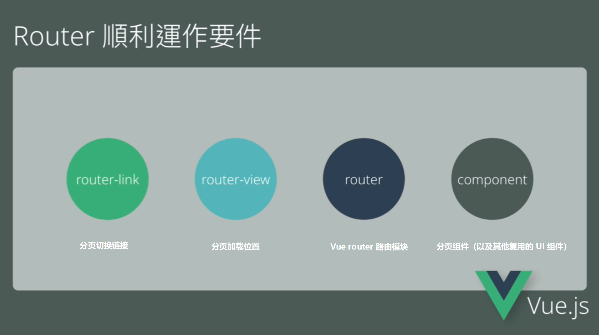
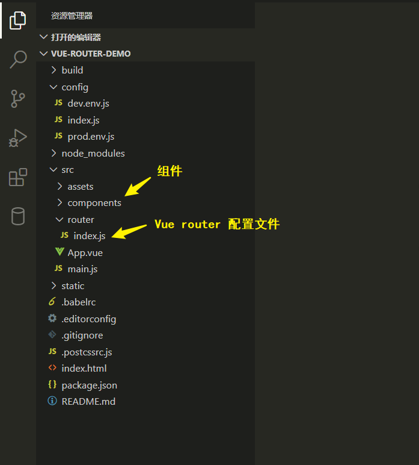
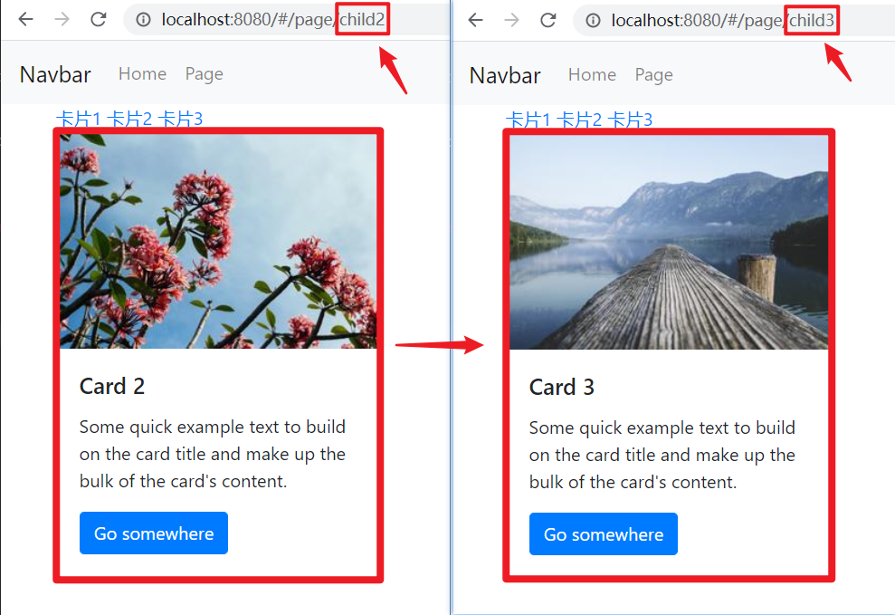

# Vue router
[Vue Router](https://router.vuejs.org/zh/) 是官方的路由管理器，使用 Vue.js  我们已经可以通过组合组件来组成应用程序，当你要把 Vue Router 添加进来，我们就可以将组件 components 映射到路由 routes，通过 Vue Router 可以通过前端模拟后端的路由切换，就可以在单页面（同一地址）上动态加载/渲染相应的组件。使用 Vue.js 配合 Vue Router 使得创建单页应用变得非常简单。



Vue router 包含的功能有：

- 嵌套的路由/视图表
- 模块化的、基于组件的路由配置
- 路由参数、查询、通配符
- 基于 Vue.js 过渡系统的视图过渡效果
- 细粒度的导航控制
- 带有自动激活的 CSS class 的链接
- HTML5 历史模式或 hash 模式，在 IE9 中自动降级
- 自定义的滚动条行为

## 安装 Vue router
使用 Vue router 模块之前，需要现在项目中安装依赖包

```bash
$ npm install vue-router --save
```



## 配置路由


如果在一个模块化工程中使用它，还需要在配置文件中引入官方组件（Router 配置文件是 `src/router/index.js`，它存储了组件 components 与路由 routes（网址）的映射关系），并通过 `Vue.use()` 明确地在 Vue 实例中安装/加载路由功能，还要使用关键字 `export` [将配置文件/模块的变量或函数导出](../../JavaScript/语法基础/模块.md)将配置好的映射关系（`VurRouter` 对象）导出，以供 Webpack 读取/导入

```js
// 📁 index.js
// 导入官方组件
import Vue from 'vue';
import VueRouter from 'vue-router';

// 在 Vue 实例全局上安装路由功能
Vue.use(VueRouter);

// 新建 VueRouter 对象并导出，其中包含虚拟路由地址和组件的映射
export default new VueRouter({});
```

:bulb: 如果使用全局的 `<script>` 标签以 CDN 方式加载 Vue router 功能，则无须如此 (手动安装)。

再在 Webpack 的入口 entry 文件 `main.js` 读取/导入 `import`

```js
// 📁 main.js
// ...
import router from './router';

// 在 Vue 实体中添加该方法
new Vue({
  // ...
  router,
});
```

## 模拟页面切换
在 Router 配置文件是 `src/router/index.js` 定义虚拟路由路径和组件的映射关系，以实现模拟页面切换的功能。在属性 `routes` 中配置的每个路由对象为 **路由记录**，它表示路由路径和组件之间的关系。

:bulb: 需要先在配置文件中导入所要使用的组件。如果使用的是 Vue-Cli 3 可以在配置路由的 componet 属性时用箭头方式的形式导入对应的组件 `component: () => import('../views/component_name.vue')`

```js
// 📁 index.js
// 导入自定义的分页组件（以下示例中以重命名方式导入模块）
import Home from '@/components/HelloWorld';

// ...
// 配置虚拟路由路径和元件的映射关系
exprot default new VueRouter({
  routes: [
    {
      name: '首页',   // 组件呈现的名称
      path: '/index',   // 对应的虚拟路径
      component: Home,   // 对应的组件
    },
  ],
});
```

在组件的根节点 `App.vue` 的 HTM 模板中使用元素 `<router-link to="path">` 设置切换路由的链接，类似于锚元素 `<a>`，但它使用特性 `to` 指定跳转的路径，也可以用动态绑定的方式 `:to="{name: 'Name'}"`（以虚拟路由的名字 `name` 来表示）；使用元素 `<router-view>` 表示切换路由时渲染元件的位置。

```vue
// 📁 App.vue
<templat>
  <div id="app">
    <!-- 导航栏 -->
    <ul>
      <!-- 以下两种方式「跳转」到同一页面 -->
      <li><router-link to="/index">Home</router-link></li>
      <li><router-link :to="{name: '首页'}">Home</router-link></li>
    </ul>
    <!-- 切换路由时动态渲染组件的位置 -->
    <router-view></router-view>
  </div>
</template>
```

:bulb: 有时候想在同一个路由地址/页面中展示多个视图（同级视图，而不是嵌套展示）`<router-view>`，如在同一个布局中同时渲染 `sidebar` 和 `main` 两个组件，这个时候可以在 HTML 模板中使用多个[命名视图](https://router.vuejs.org/zh/guide/essentials/named-views.html) `<router-view name="componentName">` 相应名称的组件就会在 URL 切换到该页面时就会被渲染；如果 `<router-view>` 没有设置名字，那么它就是默认 default 视图，该页面在 `VueRouter` 注册的组件就会在这里渲染（这个组件没有相应的命名视图）。

```js
// 📁 index.js
// 导入所需的组件
import Page from '@/components/pages/page';
import Menu from '@/components/pages/menu'

// 设置组件和路由的映射关系
export default new VueRouter({
  routes: [
    // ...
    {
      name: '分页',
      path: '/page',
      // 使用 components 对象指定同个路由/路径下对应（加载）多个组件
      components: {
        default: Page,   // 默认组件，在默认视图中渲染
        menu: Menu,  // 在对应的命名视图中渲染
      },
    },
  ],
});
```

```vue
// 📁 App.vue
// 设置加载多个视图
<template>
  <div id="app">
    <!-- code block -->
    <!-- 命名视图 -->
    <router-view name="menu"></router-view>
    <div class="container">
      <!-- 默认视图 -->
      <router-view></router-view>
    </div>
  </div>
</template>

<!-- code block -->
```

:bulb: 如果希望用户任意输入路径时，可以自动重定向到指定的页面，可以添加一个特定的路由记录（置于 `routes` 路由配置对象最后），其 `path` 属性使用通配符 `*` 来匹配任意路径，并通过属性 `redirect` 来指定重定向的路径；或者将其映射到 `NotFound.vue` 组件，向用户展示 404 页面，并提供返回主页的按钮。

```js
// 📁 index.js
// 配置路由的重定向
export default new Router({
  routes: [
  // ...
    {
      path: '*',
      redirect: '/login'
    },
  ]
})

```

## 嵌套路由
实际开发中应用界面通常由多层嵌套的组件组合而成，而且希望可以实现页面部分区域更新切换组件，可通过设置嵌套路由，动态切换 URL 中的部分段时可以选择加载相应的嵌套组件。



Vue Router 配置文件是 `src/router/index.js`，在其中定义嵌套路由路径和组件的映射关系（需要将相应组件导入），并在相应的组件中使用元素 `<router-link>` 和 `<router-view>` 添加「跳转」链接和组件渲染位置。

```js
// 📁 index.js
// 导入嵌套组件
import child from '@/components/pages/child';
import child2 from '@/components/pages/child2';
import child3 from '@/components/pages/child3';

export default new VueRouter({
  routes: [
    // ...
    {
      // 当嵌套组件设定了默认加载时，需要删除父组件的 name 使用默认加载组件的名字
      path: '/page',
      component: Page,
      // 添加嵌套路由和嵌套组件的对应关系
      children: [
        {
          name: '卡片1',
          path: '',   // 不指定路由路径的嵌套组件作为默认加载组件
          component: child,
        },
        {
          name: '卡片2',
          path: 'child2',
          component: child2,
        },
        {
          name: '卡片3',
          path: 'child3',
          component: child3,
        },
      ]
    },
  ],
});
```

:bulb: 以 `/` 开头的嵌套路径会被当作根路径，因此在设置嵌套组件与路由 `path` 的映射关系时，可以直接写嵌套路由对应的（即组件特有的）部分即可，而无需考虑 URL 前面公用的部分。

在父组件中设置嵌套组件的插入位置及切换的链接

```vue
// 📁 page.vue
<template>
  <div class="hello container">
    <router-link to="/page/">卡片1</router-link>   <!-- 默认嵌套组件 -->
    <router-link to="/page/child2">卡片2</router-link>
    <router-link to="/page/child3">卡片3</router-link>
    <div class="card">
      <router-view></router-view>
    </div>
  </div>
</template>
```

## 动态路由
我们经常需要把某种模式匹配到的所有路由（URL 路径）全都映射到同个组件，如我们有一个 User 组件，对于所有 ID 各不相同的用户（通过 Ajax 获取）数据，都要使用这个组件来渲染。

Vue Router 配置文件是 `src/router/index.js` 定义动态路由路径参数 dynamic segment 来实现多个路径映射到同一个组件。

```js
// 📁 index.js
// 导入所需的元件
import User from '@/components/user';

export default new VueRouter({
  routes: [
    // ...
    {
      name: '用户',
      path: '/user/:id',   // 动态路径参数以冒号开头
      component: User,   // 所有符合以上模式的动态 URL 都映射到 User 组件
    },
  ],
});
```

```vue
// 📁 user.vue
// User 组件
<template>
  <div>
    <p>{{ user.results[0].name.first }}</p>
  </div>
</template>

<script>
export default {
  data() {
    return {
      user: {}
    };
  },
  created() {
    let id = this.$route.params.id;   // 获取浏览器地址栏中的 URL 部分片段，与动态路由路径的 id 部分相应
    // 将 id 作为 seeds，使用 axios 向 api 发出异步请求
    this.$http.get(`https://randomuser.me/api/?seed=${id}`).then(response => {
      this.user = response.data;
    })
  }
};
</script>
```

:bulb: 一般在组件中**使用方法 `this.$route.params.id` 获取 URL 动态变化的相应片段**，以获取特定的数据

:bulb: 如果需要使用[编程式的导航](#路由导航)，如方法 `router.push()`，切换到特定 `id` 的页面，可以使用参数 `params`

```vue
// 命名的路由，浏览器路径切换为 /user/123
router.push({ name: 'user', params: { userId: '123' }})
```

## 路由导航
除了使用 `<router-lnk>` 创建导航链接，以供用户点击切换页面，Vue router 实例提供了一些方法，可用于实现路由导航（即 URL 的改变）以触发页面渲染相应的组件

- `router.push()`
- `router.replace()`
- `router.go()`
- `router.back()`
- `router.forward()`

:bulb: 当 Vue 实例安装/加载了 `router` 功能，则在 Vue 实例内部可以通过 `this.$router` 访问路由实例，其方法可以通过 `this.$router.push` 这种形式调用。

### push 方法
导航到不同的 URL `location`，这个方法会向 history 栈**添加一个新的记录**，所以当用户点击浏览器后退按钮（或调用方法 `router.back()`）时，则回到之前的 URL。

```js
router.push(location, [onComplete], [onAbort])

router.push(location).then(onComplete).catch(onAbort)
```

参数说明：
*  参数 `location` 是希望导航切换的路径，可以是一个字符串路径，或者一个描述地址的对象。

    ```js
    // 字符串
    router.push('home')

    // 对象
    router.push({ path: 'home' })

    // 命名的路由，变成 /user/123
    router.push({ name: 'user', params: { userId: '123' }})

    // 带查询参数，变成 /register?plan=private
    router.push({ path: 'register', query: { plan: 'private' }})
    ```

* （可选）参数 `onComplete` 和 `onAbort` 是回调函数，将会在导航成功完成 (在所有的异步钩子被解析之后) 或终止 (导航到相同的路由、或在当前导航完成之前导航到另一个不同的路由) 的时候进行相应的调用。此时如果支持 Promise，router.push 或 router.replace 将返回一个 Promise。

|                 声明式                 |           编程式           |
| ----------------------------------------- | ----------------------------- |
| `<router-link :to="...">` | `router.push(...)` |


### replace 方法
跟 `router.push` 很像，唯一的不同就是，**它不会向 history 添加新记录**，而是跟它的方法名一样，即替换掉当前的 history 记录，因此无法通过点击浏览器后退按钮（或调用方法 `router.back()`）回到前一个页面的 URL，而是再前一个页面 URL

```js
router.replace(location, onComplete?, onAbort?)
```

| 声明式 | 编程式 |
| --- | --- |
| `<router-link :to="..." replace>` | `router.replace(...)` |

### go 方法
这个方法的参数是一个整数，意思是在 history 记录中向前或者后退多少步，类似 `window.history.go(n)`。

```js
// 在浏览器记录中前进一步，等同于 history.forward() 或 $this.router.forward()
router.go(1)

// 后退一步记录，等同于 history.back() 或 $this.router.back()
router.go(-1)

// 前进 3 步记录
router.go(3)

// 如果 history 记录不够用，那就默默地失败呗
router.go(-100)
router.go(100)
```

## 导航守卫

参考：:cinema: [Vue.js Firebase Authentication - Add To An Existing Project](https://www.bilibili.com/video/bv12K4y147pX) | 结合 Firebase 后端验证

Vue router 通过跳转或取消的方式提供[导航守卫](https://router.vuejs.org/zh/guide/advanced/navigation-guards.html)，即禁止在特定的条件下访问特定的 URL。有多种方法将守卫植入路由导航过程中，如全局的、单个路由独享的、或者组件级的。

常用 `router.beforeEach` 注册一个全局前置守卫，它会在页面进行切换时触发，对路由导航进行控制，如访问的页面需要登陆时可以检查页面的登陆状态以决定是否「放行」。

```js
router.beforEach((to, from, next) => {
  // ...
})
```

参数说明：
- 参数 `to` 即将要进入的目标路由对象
- 参数 `from` 当前导航正要离开的路由
- 参数 `next` 触发的回调函数，**路由导航执行效果依赖 `next` 方法的 `resolve` 结果**，确保 `next` 函数在任何给定的导航守卫中都被严格调用一次。
    - `next()` 进行管道中的下一个钩子。如果全部钩子执行完了，则导航的状态就是确认的 confirmed，即「放行」可访问 `to` 指向的路径
    - `next(false)` 中断当前的导航。如果浏览器的 URL 改变了（可能是用户手动或者浏览器后退按钮），那么 URL 地址会重置到 `from` 路由对应的地址。
    - `next('/')` 或者 `next({ path: '/' })` 跳转到一个不同的地址。当前的导航被中断，然后进行一个新的导航。可以向 `next` 传递任意位置对象，且允许设置诸如 `replace: true`、`name: 'home'` 之类的选项以及任何用在 [`router-link` 的 `to` prop](https://router.vuejs.org/zh/api/#to) 或 [`router.push`](https://router.vuejs.org/zh/api/#router-push) 中的选项。
    - `next(error)` (在 Vue Router 版本 2.4.0+ 新增) 如果传入 `next` 的参数是一个 `Error` 实例，则导航会被终止且该错误会被传递给 [`router.onError()`](https://router.vuejs.org/zh/api/#router-onerror) 注册过的回调。

```js
// 📁 main.js
// 在用户未能验证身份时重定向到 /login
router.beforeEach((to, from, next) => {
  if (to.name !== 'Login' && !isAuthenticated) next({ name: 'Login' })
  else next()
})
```

:bulb: 守卫是异步解析执行，此时导航在所有守卫 `resolve` 完之前一直处于 **等待中**。
:warning: 确保 `next` 函数在任何给定的导航守卫中都被严格调用一次，否则默认执行守卫，即禁止访问相应路径并将 URL 地址会重置到 `from` 路由对应的地址。

一个页面是否需要验证可以在 `routes` 配置中的路由对象/路由记录的[路由元信息](https://router.vuejs.org/zh/guide/advanced/meta.html) `meta` 属性中进行定义。

当路由导航时，一个路由（路径）匹配到的所有路由记录（我们称呼 `routes` 配置中的每个路由对象为 **路由记录**，:bulb: 由于路由记录可以是嵌套的，因此一个路由可能匹配多个路由记录）会暴露为 `$route` 对象（还有在导航守卫中的路由对象）的 `$route.matched` **数组**，因此我们需要遍历 `$route.matched` （如使用[数组方法 `some()`](../../JavaScript/语法基础/数组.md) 遍历其中的元素）来检查路由记录中的 `meta` 字段。一般在全局导航守卫中检查元字段，对于需要登陆授权的页面会在 `next` 回调函数中进行验证登陆状态，才决定是否「放行」。

```js
// 📁 index.js
// 为特定的路由设置登陆限制
export default new Router({
  routes: [
    {
      path: '/',
      name: 'HelloWorld',
      component: HelloWorld,
      meta: { requiresAuth: true },
    },
  ]
})

```

```js
// 📁 main.js
// 在导航守卫中检查登陆状态
router.beforeEach((to, from, next) => {
  // 查看访问的页面（路由路径）是否需要登陆
  if(to.meta.requiresAuth) {
    // 访问 API 检查用户是否处于登陆状态
    const api = `${process.env.API_PATH}/api/user/check`;
    axios.post(api).then(response => {
      console.log(response.data);
      if (response.data.success) {
        // 如果 API 返回结果表示处于登陆状态就「放行」
        next();
      } else {
        // 如果 API 返回结果表示用户未登录就切回到登陆的页面
        next({
          path: '/login'
        })
      }
    });
  } else {
    // 如果页面不需要登陆可以直接「放行」
    next();
  }
})
```