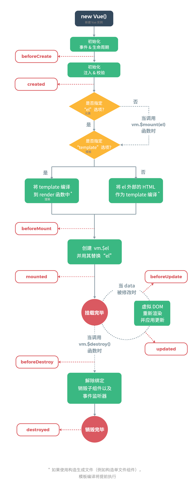

# 生命周期
每个 Vue 实例（包括组件实例化过程）在被创建时都要经过一系列的初始化过程，如设置数据监听、编译模板、将实例挂载到 DOM，并在数据变化时更新 DOM 等。Vue 提供了一系 API 让开发者在不同阶段可以运行自己的代码，如 [`created`](https://cn.vuejs.org/v2/api/#created)、[`mounted`](https://cn.vuejs.org/v2/api/#mounted)、[`updated`](https://cn.vuejs.org/v2/api/#updated)、[`destroyed`](https://cn.vuejs.org/v2/api/#destroyed) 等，这些称为 **[生命周期钩子](https://cn.vuejs.org/v2/api/#选项-生命周期钩子)** 的函数作为 Vue 实例的属性，在相应的阶段系统会自动调用。

```js
new Vue({
  data: {
    a: 1
  },
  created: function () {
    // this 指向 vm 实例
    console.log('a is: ' + this.a)
  }
})
// 在一个实例被创建之后执行 created 生命周期钩子函数、
// 在控制台输出 => "a is: 1"
```

:warning: 所有的生命周期钩子自动绑定 `this` 上下文到实例中，因此可以 `this` 访问实例的数据，对 property 和方法进行运算。因此意味着**不能使用箭头函数来定义一个生命周期方法** (如 `created: () => this.fetchTodos()`)，因为箭头函数绑定了父级上下文（实际是没有 `this`），使得其 `this` 与期待的 Vue 实例不同，`this.fetchTodos` 的行为未定义。



一般使用的生命周期钩子函数：

* `created()`  可以操作 Vue 实例的数据对象，但不能操作 Vue 实例绑定的 DOM 节点（及其中生成的子节点）
* `mounted()` 可以操作数据和 DOM（已完成 Vue 实例的挂载）

## beforeCreate
生命周期钩子函数 `beforeCreate` 在实例初始化之后，但页面创建之前，即数据监听 (data observer) 和 `event`/`watcher` 事件配置之前调用，此时不能读取 Vue 实例的数据对象。

## created
生命周期钩子函数 `created` 在实例创建完成后被立即调用。在这一步实例已完成以下的配置：

* 数据观测（data observer）建立（即可以访问数据）
* property 和方法的运算
* watch/event 事件回调

但 Vue 实例挂载到页面上的阶段还没开始，`$el` property 目前尚不可用，因此**不能在该阶段操作 DOM**。

## beforeMount
在挂载渲染实例/组件开始之前被调用：相关的 `render` 函数首次被调用。**该钩子在服务器端渲染期间不被调用。**

## mounted
实例/组件被挂载后调用，这时 `el` 被新创建的 `vm.$el` 替换了（**即 Vue 实例与 DOM 节点绑定**）。如果根实例挂载到了一个文档内的元素上，当 `mounted` 被调用时 `vm.$el` 也在文档内。

:warning: `mounted` **不会**保证所有的子组件也都一起被挂载。如果你希望等到整个视图都渲染完毕，可以在 `mounted` 内部使用 [vm.$nextTick](https://cn.vuejs.org/v2/api/#vm-nextTick)：

```js
mounted: function () {
  this.$nextTick(function () {
    // Code that will run only after the
    // entire view has been rendered
  })
}
```

:warning: **该钩子在服务器端渲染期间不被调用。**

## beforeUpdate
数据更新时调用，发生在虚拟 DOM 打补丁之前。这里适合在更新之前访问现有的 DOM，比如手动移除已添加的事件监听器。

:warning: **该钩子在服务器端渲染期间不被调用，因为只有初次渲染会在服务端进行。**

## updated
由于数据更改导致的虚拟 DOM 重新渲染和打补丁，在这之后会调用该钩子。

当这个钩子被调用时，组件 DOM 已经更新，所以你现在可以执行依赖于 DOM 的操作。然而在大多数情况下，你应该避免在此期间更改状态。如果要相应状态改变，通常最好使用[计算属性](https://cn.vuejs.org/v2/api/#computed)或 [watcher](https://cn.vuejs.org/v2/api/#watch) 取而代之。

:warning: `updated` **不会**保证所有的子组件也都一起被重绘。如果你希望等到整个视图都重绘完毕，可以在 `updated` 里使用 [vm.$nextTick](https://cn.vuejs.org/v2/api/#vm-nextTick)：

```
updated: function () {
  this.$nextTick(function () {
    // Code that will run only after the
    // entire view has been re-rendered
  })
}
```

:warning: **该钩子在服务器端渲染期间不被调用。**

## activated
被 `keep-alive` **缓存的组件**激活时调用。

:warning: **该钩子在服务器端渲染期间不被调用。**

- [构建组件 - keep-alive](https://cn.vuejs.org/v2/api/#keep-alive)
- [动态组件 - keep-alive](https://cn.vuejs.org/v2/guide/components-dynamic-async.html#%E5%9C%A8%E5%8A%A8%E6%80%81%E7%BB%84%E4%BB%B6%E4%B8%8A%E4%BD%BF%E7%94%A8-keep-alive)

## deactivated
被 `keep-alive` **缓存的组件**停用时调用。

:warning: **该钩子在服务器端渲染期间不被调用。**

- **参考**：

- [构建组件 - keep-alive](https://cn.vuejs.org/v2/api/#keep-alive)
- [动态组件 - keep-alive](https://cn.vuejs.org/v2/guide/components-dynamic-async.html#%E5%9C%A8%E5%8A%A8%E6%80%81%E7%BB%84%E4%BB%B6%E4%B8%8A%E4%BD%BF%E7%94%A8-keep-alive)

## beforeDestroy
实例销毁之前调用。在这一步实例仍然完全可用。

:warning: **该钩子在服务器端渲染期间不被调用。**

## destroyed
实例销毁后调用。该钩子被调用后，对应 Vue 实例的所有指令都被解绑，所有的事件监听器被移除，所有的子实例也都被销毁。

:warning: **该钩子在服务器端渲染期间不被调用。**

## errorCaptured
在 Vue 2.5.0+ 版本新增的函数，当捕获一个来自子孙组件的错误时被调用。此钩子会收到三个参数：错误对象、发生错误的组件实例以及一个包含错误来源信息的字符串。此钩子可以返回 `false` 以阻止该错误继续向上传播。

你可以在此钩子中修改组件的状态，在捕获错误时在模板或渲染函数中有一个条件判断来绕过其它内容很重要，不然该组件可能会进入一个无限的渲染循环。

**错误传播规则**：

- 默认情况下，如果全局的 `config.errorHandler` 被定义，所有的错误仍会发送它，因此这些错误仍然会向单一的分析服务的地方进行汇报。
- 如果一个组件的继承或父级从属链路中存在多个 `errorCaptured` 钩子，则它们将会被相同的错误逐个唤起。
- 如果此 `errorCaptured` 钩子自身抛出了一个错误，则这个新错误和原本被捕获的错误都会发送给全局的 `config.errorHandler`。
- 一个 `errorCaptured` 钩子能够返回 `false` 以阻止错误继续向上传播。本质上是说“这个错误已经被搞定了且应该被忽略”。它会阻止其它任何会被这个错误唤起的 `errorCaptured` 钩子和全局的 `config.errorHandler`。