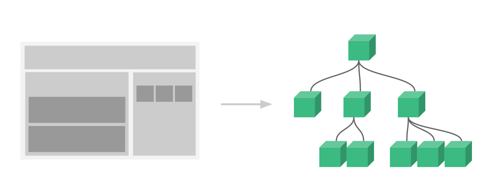
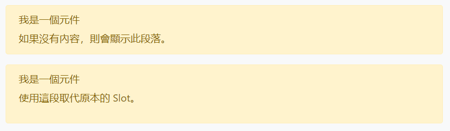
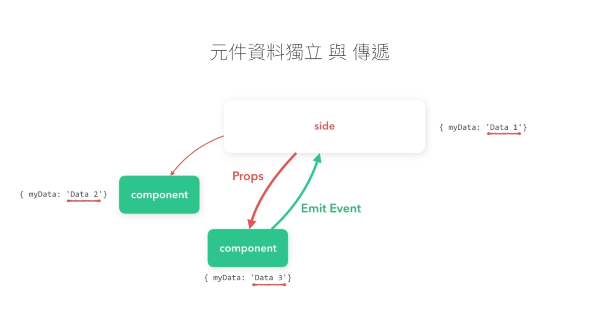

---
tags:
  - vue
---

# 组件
组件系统是 Vue 的一个重要概念，为了复用一些 Vue 实例（实例中的数据和方法），我们将它们抽象为一种独立的部分，称为 Vue component 组件，它们可以在不同的 Vue 实例中进行重复调用。一个组件本质上是一个拥有预定义选项的一个 Vue 实例，因此它们也有属性 `data`、`method` 等属性，也有自己的生命周期钩子函数。

实际上几乎任意类型的应用界面都可以抽象为一个组件树，使用小型、独立、可复用的组件构建大型应用。



## 注册组件
使用组件前需要先进行[组件注册](https://cn.vuejs.org/v2/guide/components-registration.html)，可以将注册全局组件和局部组件。

### 全局组件
使用方法 `Vue.component()` 注册全局组件 ，这样组件就可以在任何新创建的 Vue 根实例中使用，也包括其组件树中的所有子组件的模板中。

```js
Vue.component('my-component-name', { /* ... */ })
```

参数说明：

* 第一个参数是组件名字，组件名称可以使用 kebab-case 风格，即使用连字符 `-` 连接单词，在使用组件（自定义元素）时也只能使用 kebab-case；也可以使用 PascalCase 风格，即驼峰法连接单词，在使用组件（自定义元素）时两种命名法都可以使用，尽管如此直接在 DOM (即非字符串的模板) 中使用时只有 kebab-case 是有效的。
* 第二个（可选）参数提供一个对象，用以描述组件。类似于 Vue 实例（但不需要设置 `el` 属性绑定特定的 DOM 元素节点），它包含多种属性，如 `data`、`method`，还有其他组件特有的属性，如属性 `template` 用于预设组件的 HTML 模板，属性 `props` 用于设置 HTML 模板的自定义特性 attribute，一般用于从外层传递数据到组件。

:warning: 组件选项对象的属性 `data` 与 Vue 实例有所不同，它需要是计算属性而且返回值是一个对象，即以[函数返回一个对象](https://cn.vuejs.org/v2/guide/components.html#data-必须是一个函数)作为属性值，因为通过这种方式每个实例可以维护一份被返回对象的独立的拷贝，因此在一个 Vue 实例中复用的组件都是**独立的**，数据都封闭在组件内部相互不影响。

```js
// ...component
data: function () {
  return {
    count: 0
  }
}
```

### 局部组件
我们也可以在特定的 Vue 实例中注册组件，它们称为局部组件，只能在该 Vue 实例中调用，其他 Vue 应用并不能使用该局部组件。

在特定 Vue 实例的属性 `components` 中定义组件，该属性值是一个对象，它的每个 property 就是组件的名字，相应的 property 值就是组件的选项对象，一般引用一个预先编写好的普通 JavaScript 对象

```js
// 预先编写好的普通 JavaScript 对象
var ComponentA = { /* ... */ };
var ComponentB = { /* ... */ };

// Vue 实例
new Vue({
  el: '#app',
  components: {
    'component-a': ComponentA,   // 局部组件
    'component-b': ComponentB,   // 局部组件
  }
})
```

:warning:  局部注册的组件在其子组件中不可用，如希望 `ComponentA` 在 `ComponentB` 中可用则需要这样写：

```
var ComponentA = { /* ... */ }

var ComponentB = {
  components: {
    'component-a': ComponentA
  },
  // ...
}
```

## 使用组件
通过 HTML 标签调用 Vue 组件，和一般的 HTML 元素一样也是由开始标签和结束标签构成，标签的名称就是组件的名称。

:bulb: 实例化组件后会构成一个父组件和子组件的关系，在 HTML 中的标签都是父组件，如挂载了 Vue 实例的 DOM，**以及组件标签本身**；而由组件 template 生成的标签就是子组件。

:warning: 需要将标签插入到有 Vue 实例挂载的 DOM 元素节点内，此时 Vue 实例就是「外层」，组件标签除了实例化组件以外，还是组件内部与外层进行交互的「中介」，如数据的传递、事件抛出等，外层（Vue 实例）的数据可以通过组件的 `props` 属性读取，而组件的数据可以通过 `$emit` 触发事件向外传递。

```html
<div id="app">
  <ol>
    <!-- 通过循环迭代 Vue 实例的数据参数 groceryList 生成一系列的 todo-item 组件的实例 -->
    <!-- 将组件模板的 todo 特性绑定到 Vue 实例数据参数 item 上 -->
    <!-- 还为每个组件提供一个 key -->
    <todo-item
      v-for="item in groceryList"
      v-bind:todo="item"
      v-bind:key="item.id"
    ></todo-item>
  </ol>
</div>

<script>
// 定义名为 todo-item 的组件
Vue.component('todo-item', {
  // 属性 props 用于设置自定义 attribute
  // 这个 attritube 名为 todo
  props: ['todo'],
  template: '<li>{{ todo.text }}</li>'
})

// 创建 Vue 实例并绑定到 DOM 节点 #app-7
var app = new Vue({
  el: '#app',
  data: {
    groceryList: [
      { id: 0, text: '蔬菜' },
      { id: 1, text: '奶酪' },
      { id: 2, text: '随便其它什么人吃的东西' }
    ]
  }
})
</script>
```

:bulb: 在一个 Vue 实例中可以多次调用同一个组件，它们都是**独立的**，即调用的每个组件都会创建新实例，它们都会独立存储自己的状态，数据都封闭在组件内部相互不影响。

:bulb: Vue 组件类似于[自定义元素](https://www.w3.org/wiki/WebComponents/)，但也有区别，可查看 Vue 文档[相关部分](https://cn.vuejs.org/v2/guide/index.html##与自定义元素的关系)。

:warning: 解析 DOM 模板时需要注意有些 HTML 元素，如 `<ul>`、`<ol>`、`<table>`、`<select>`，它们对于出现在其内部的元素是有严格限制的，同样地有些元素，如 `<li>`、`<tr>` 和 `<option>`，只能出现在其它某些特定的元素内部。如果直接将自定义组件（标签）用于这种元素内部，会被作为无效的内容提升到外部，并导致最终渲染结果出错。Vue 为此提供了 `is` attribute，它允许将正确的标签作为「容器」，先将它们插入到父元素内，再动态其后特性 `is` 指定的组件的模板进行渲染。

```html
<table>
  <tr is="blog-post-row"></tr>
</table>
```

## 组件模板
组件选项对象的属性 `template` 用于预设组件的 HTML 模板，当组件被调用时会依据 template 在页面渲染出相应的 HTML 元素。

:warning: **HTML 模板必须有一个根元素**，如果模板中有多个兄弟元素，可以可以将它们都包裹在一个父元素 `<div>` 内

:bulb: 如果组件的 HTML 模板特别大，可以将代码写在一个 `<script type="text/x-template>` 元素中，并为其设置 `id` 特性，然后组件 `template` 的属性值设置为 `#id`，这样可以让组件的结构更简洁。但是其它情况下请避免使用，因为这会将模板和该组件的其它定义分离开。

```html
<!-- 使用 x-template 定义组件模板 -->
<script type="text/x-template" id="hello-world-template">
  <p>Hello hello hello</p>
</script>

<script>
// 组件 hello-world
Vue.component('hello-world', {
  template: '#hello-world-template'
})
</script>
```

## 插槽
Vue 实现了一套内容分发的 API，这套 API 的设计灵感源自 [Web Components 规范草案](https://github.com/w3c/webcomponents/blob/gh-pages/proposals/Slots-Proposal.md)，将 `<slot>` 元素作为承载分发内容的出口。

在组件的模板 `template` 中使用 `<slot>` 标签作为占位符（最终渲染 `<slot>` 标签并不会输出），当实例化组件时在组件标签中添加的内容（文本或 HTML 源码）可以替换 `<slot>` 标签。:bulb: 可以在 `<slot>` 标签内预设默认显示的内容，它只会在实例化组件时没有提供内容的时候被渲染。

```html
<!-- 两个实例化的组件 -->
<single-slot-component></single-slot-component>

<single-slot-component>
  <p>使用這段取代原本的 Slot。</p>
</single-slot-component>

<!-- 组件模板 -->
<script type="text/x-template" id="singleSlotComponent">
<div class="alert alert-warning">
  <h6>我是一個元件</h6>
  <slot>
    如果沒有內容，則會顯示此段落。
  </slot>
</div>
</script>
```



当我们需要在模板中不同位置插入内容时，需要在组件 `template` 中设置多个 `<slot>` 标签，可以通过给每个 `<slot>` 添加特性 `name` 用以区分，它们称为**具名插槽**；在实例化时在组件的标签中插入的内容（标签，如果没有标签的文本内容可以借助 `<template>` 标签）需要添加相应的特性 `slot` 进行插入位置的定位。

```html
<!-- 实例化的组件 -->
<base-layout>
  <template slot="header">
    <h1>Here might be a page title</h1>
  </template>

  <template slot="default">
    <p>A paragraph for the main content.</p>
    <p>And another one.</p>
  </template>

  <template slot="footer">
    <p>Here's some contact info</p>
  </template>
</base-layout>

<!-- 组件模板 -->
<script type="text/x-template" id="namedSlotComponent">
<div class="container">
  <header>
    <slot name="header"></slot>
  </header>
  <main>
    <slot></slot>
  </main>
  <footer>
    <slot name="footer"></slot>
  </footer>
</div>
</script>
```

:bulb: 模板中不具名的 `<slot>` 作为默认插槽，实例化时优先将内容插入，也可以在实例化时在标签中使用 `slot="default"` 明确规定插入默认插槽。

:warning: 在 2.6.0 中，我们为具名插槽和作用域插槽引入了一个新的统一的语法 `v-slot` 指令（如 `v-slot:header` 将内容插入/替换对应的 `<slot name="header">` 中），注意 **`v-slot` 只能添加在 `<template>` 上**，因此在实例化组件中需要用 `<template>` 作为容器包裹插入的内容 (只有[一种例外情况](https://cn.vuejs.org/v2/guide/components-slots.html#l#独占默认插槽的缩写语法))，而标签 `<template>` 在渲染时并不会输出；这一点和已经废弃的 [`slot` attribute](https://cn.vuejs.org/v2/guide/components-slots.html##废弃了的语法) 不同（它可以添加到实例化组件的任何标签中）。

## 数据传输
组件和外层（Vue 实例或父组件）之间通过不同的方式进行数据传递，组件通过其属性 `props` 读取外层数据（父传子），而组件通过 `$emit` 触发事件向外传递（子传父）。



### props 属性
选项对象可以设置属性 `props` 为组件（标签）注册一些自定义 attribute，该属性的值是一个数组，其元素（字符串）就是组件（标签）的自定义特性名称。

由于每一个组件实例都是独立的，它们有自己的数据对象存储自己的状态，数据都封闭在组件内部相互不影响。如果需要读取外层的数据（将数据由外而内进行传递），需要通过选项对象的属性 `props` 为组件（标签）注册一些自定义 attribute，然后在组件实例化时，**在组件标签中为其中任何一个自定义 attribute 传递一个值（可以是父组件的数据对象 `data` 中的属性值或是其方法 `method` 中的函数），然后该 prop 就变成了那个组件实例的一个属性 property，这样就可以组件内部或 HTML 模板（组件标签）中直接使用该属性 property**。

```html
<div id="app">
  <!-- 为自定义的 attribute 传递静态值 -->
  <blog-post title="My journey with Vue"></blog-post>
  <!-- 为自定义的 attribute 绑定父级的数据对象（动态值） -->
  <blog-post
    v-for="post in posts"
    v-bind:key="post.id"
    v-bind:title="post.title"
  ></blog-post>
</div>

<script>
// 组件
Vue.component('blog-post', {
  props: ['title'],   // 自定义的 attribute
  template: '<h3>{{ title }}</h3>'   // 自定义的 attribute 也是组件的 property，可以直接在模板调用
})

// Vue 实例
new Vue({
  el: '#blog-post-demo',
  data: {
    posts: [
      { id: 1, title: 'My journey with Vue' },
      { id: 2, title: 'Blogging with Vue' },
      { id: 3, title: 'Why Vue is so fun' }
    ]
  }
})
</script>
```

#### prop 名称
由于 HTML 是大小写不敏感的（即浏览器会把所有 HTML 标签的大写字符解释为小写字符），而 JavaScript 是大小写敏感的，因此使用使用 camelCase 驼峰法命名 prop 时 ，**需要在 HTML 文件的组件标签中使用其等价的 kebab-case 短横线分隔的命名**，否则在 HTML 标签中 camelCase 转为小写后无法识别。

```html
<!-- 在 HTML 中使用相应的 kebab-case 格式 -->
<blog-post post-title="hello!"></blog-post>

<script>
// ...
Vue.component('blog-post', {
  // 在 JavaScript 中是 camelCase 的格式
  props: ['postTitle'],
  template: '<h3>{{ postTitle }}</h3>'
})
</script>
```

#### prop 类型
在组件的属性 `props` 中通过以字符串数组形式设置多个自定义的 prop，但是如果希望每个 prop 都有指定的值类型，以备 Vue 对外层传入的数据类型进行检查，可以通过对象形式列出 prop，其键和值分别是 prop 各自的名称和类型

```js
// ...
// 组件 props 属性
props: {
  title: String,
  author: Object,
  callback: Function,
}
```

:bulb: 当传入的数据是错误的类型时，开发者可以从浏览器的 JavaScript 控制台得到提示反馈。

如果需要为 prop 设置默认值（在 prop 未接收外层数据传入时，在组件的 `template` 或组件内部进行调用时会使用默认值），可以将对象作为 prop 的属性值

```js
// ...
// 组件的 props 属性
props: {
  cash: {
    type: Number,
    default: 200
  }
}
```

:bulb: 如果在 HTML 组件标签中为自定义 attribute 传递静态的数据时，默认传递的数据类型是**字符串**类型；如果需要确保传入的数据类型正确，需要通过 `v-bind` 动态赋值，即使传入的值是不变的。

```html
<!-- 静态方式传入一个的数据是字符串 -->
<blog-post likes="42"></blog-post>

<!-- 即便 42 是静态的，我们仍然需要 v-bind 来告诉 Vue -->
<!-- 这是一个 JavaScript 表达式而不是一个字符串。-->
<blog-post v-bind:likes="42"></blog-post>
<!-- 简写形式 -->
<blog-post :likes="42"></blog-post>

<!-- 以动态形式传入一个对象（即时对象的属性值是固定的） -->
<!-- 可以在 HTML 模板内部/子组件中使用该对象的属性值 -->
<blog-post v-bind="post"></blog-post>
```

#### 单向数据流
将外层数据传递到组件内是通过为任意 prop 赋值，即在组件标签中为其中任何一个自定义 attribute 传递一个值（同时该 prop 就变成了那个组件实例的一个属性 property，可以在组件内部或模板中进行调用）。

传递的数据可以是静态的值，如字符串，或是[通过 `v-bind` 绑定父级属性](https://cn.vuejs.org/v2/guide/components.html#通过-Prop-向子组件传递数据)来动态获取值.

在 Vue 中通过属性 `props` 进行单向数据传递（单向下行绑定），即父级的数据更新时会同时将子组件中的相应 prop 属性值进行更新，但是反过来（通过改变子组件的 prop 值来操作父元素的属性值）则不行，Vue 会在浏览器的控制台中发出警告，这样会防止从子组件意外变更父级组件的状态，从而导致你的应用的数据流向难以理解。

:warning: 你**不**应该在一个子组件内部改变 prop。

如果希望变更一个 prop 传递进来的值，应该将该值**拷贝**到组件的数据对象 `data` 属性或计算属性中，将通过 prop 接收的外部传递进来的值作为初始值，然后在模板中双向绑定相应的数据对象 `data` 属性或计算属性。

* 在子组件中定义一个本地的 `data` property 拷贝 prop 接收的数据，将其作为初始值，然后在模板中通过 `v-bind` 对该「本地」的 property 进行双向绑定，其后进行的修改就不会影响父级的数据

    ```js
    // ...
    // 子组件
    props: ['initialCounter'],
    data: function () {
      return {
        counter: this.initialCounter
      }
    }
    ```

* 在子组件中定义一个计算属性将 prop 接收的数据作为原始值进行转换等处理，该过程并不对原始数据进行改动

    ```js
    // ...
    // 子组件
    props: ['size'],
    computed: {
      normalizedSize: function () {
        return this.size.trim().toLowerCase()
      }
    }
    ```

:bulb: 在 JavaScript 中对象和数组是通过 **[引用](../../JavaScript/语法基础/对象.md#引用类型)** 传入的，所以对于一个数组或对象类型的 prop 来说，在子组件中变更这个对象或数组本身**将会**影响到父组件的状态（而且 Vue 并不会在控制台发出警报，但也应该避免对父组件传递进来的数据进行修改，因为该对象可能在其他组件也被引用）。

### $emit
属性 `props` 可以接收外层传递的数据，如果需要将子组件的数据向外层传递，则使用 Vue 提供的 API `$emit`在触发当前实例上的自定义事件，可以将附加参数/数据传给父组件的监听器回调。

```html
<!-- 父组件实例 -->
<div id="app">
  <!-- 监听自定义事件 welcome -->
  <welcome-button v-on:welcome="sayHi"></welcome-button>
</div>

<script>
// 组件
Vue.component('welcome-button', {
  // 模板
  template: `
    <button v-on:click="$emit('welcome')">   // 点击子组件的按钮会触发自定义事件 welcome
      Click me to be welcomed
    </button>
  `
})

// Vue 实例
new Vue({
  el: '#app',
  methods: {
    sayHi: function () {
      alert('Hi!')
    }
  }
})
</script>
```

方法 `$emit()` 可以在（可选）第二个参数附加数据以传给父组件的监听器回调函数

```html
<div id="app">
  <p>我存储了 {{ cash }} 元</p>
  <button-counter v-on:increment="incrementTotal"></button-counter>
</div>

<script>
Vue.component('buttonCounter', {
  template: `<div>
    <button @click="incrementCounter" class="btn btn-outline-primary">增加 {{ counter }} 元</button>
    <input type="number" v-model="counter">
  </div>`,
  data: function() {
    return {
      counter: 1   // 默认增加值为 1，可以通过子组件的 input 元素进行修改（双向绑定）
    }
  },
  methods: {
    incrementCounter: function() {
      // 触发自定义事件 increment，同时向父组件的事件监听器回调函数传递数据
      this.$emit('increment', Number(this.counter));
    }
  }
});

var app = new Vue({
  el: '#app',
  data: {
    cash: 300
  },
  methods: {
    // 父组件回调函数接收子组件传递进来的数据 newNumber
    incrementTotal: function(newNumber) {
      this.cash = this.cash + newNumber;
    }
  }
});
</script>
```

:bulb: `props` 和 `$emit` 实际上是两种数据传递的方式，但两者有很大不同，外层数据传递到到组件内部是通过绑定的方式，即只要外层数据更新，子组件内部的数据也会同步更新；而子组件数据传递给外层，需要用户主动触发子组件的事件调用方法 `$emit` 才会将数据传递到外层。

### event bus
参考：
* [Vue 组件通信之 Bus](https://juejin.im/post/5a4353766fb9a044fb080927)
* [Vue 组件间通信六种方式（完整版）](https://juejin.im/post/5cde0b43f265da03867e78d3#heading-4)
* [从 Vue 1.x 迁移 — Vue.js | $dispatch 和 $broadcast 替换](https://cn.vuejs.org/v2/guide/migration.html#dispatch-和-broadcast-替换)

组件实例的作用域是相互独立的，这就意味着不同组件之间的数据无法相互引用，一般使用 `$emit` 和 `props` 实现子组件和上一层父组件之间的数据传递。对于大型项目的跨组件间数据传递，官方推荐的状态管理方案是 [Vuex](https://github.com/vuejs/vuex)，但是对于小型项目可以使用 event bus。

event bus 是一个空的 Vue 实例，作为中央事件总线（事件中心）。它一般注册在全局 Vue 的 `prototype` 上，便于在任何组件实例中都可以（作为 Vue 实例的属性）调用，它作为**集中式的事件中间件**，在其上进行使用 `$emit`、`$on`、`$off` 分别来分发、监听、取消监听事件。

在组件中在 event bus 上使用 `$on` 监听事件时，其回调函数使用箭头函数，就可以将 `this` 指向该组件，其中回调函数的参数是其他组件使用 event bus 的方法 `$emit` 传递的信息，通过一个「中间人 」bus（一个空的 Vue 实例）可以实现跨组件的数据传递。

```vue
// 📁 main.js
// 在全局声明一个 bus（作为 Vue 原型中的方法）
Vue.prototype.$bus = vue;
```

```vue
// 分发事件的组件
// ...
methods: {
  todo() {
    this.$bus.$emit('todoSth', params);  //params是传递的参数
    //...
  }
}
```

```vue
// 监听的组件
// ...
created() {
  this.$bus.$on('todoSth', (params) => {   //获取传递的参数并进行操作
      //todo something
  })
},
// 最好在组件销毁前
// 清除事件监听
beforeDestroy () {
  this.$bus.$off('todoSth');
},
```

:bulb: 如果需要监听多个组件，只需要更改 **bus** 的 **eventName**:

```
// 监听的组件
// ...
created() {
  this.$bus.$on('firstTodo', this.firstTodo);
  this.$bus.$on('secondTodo', this.secondTodo);
},
// 清除事件监听
beforeDestroy () {
  this.$bus.$off('firstTodo', this.firstTodo);
  this.$bus.$off('secondTodo', this.secondTodo);
},
```

## 动态组件切换
在实例化组件时，可以在标签 `<component>` 中使用特性 `is` 来指定实际渲染所使用的组件模板，因此我们可以用 `v-bind` 将特性 `is` 与数据对象的属性绑定，通过修改数据对象属性，如下述示例的属性 `currentTabComponent`，实现不同组件的切换。

```html
<!-- 实例化组件会在 currentTabComponent 改变时改变 -->
<component v-bind:is="currentTabComponent"></component>
```

在上述示例中，`currentTabComponent` 可以包括
- 已注册组件的名字
- 一个组件的选项对象

:bulb: 也可以在常规 HTML 元素使用特性 `is` 但这些元素将被视为组件，即实际渲染时会使用相应组件的模板，这意味着所有的 attribute **都会作为 DOM attribute 被绑定**。对于像 `value` 这样的 property，若想让其如预期般工作，你需要使用 [`.prop` 修饰器](https://cn.vuejs.org/v2/api/#v-bind)。

:bulb: 切换组件默认会重新创建一个新的组件实体，如果想保持这些组件的状态，以避免反复重渲染导致的性能问题可以[用一个 `<keep-alive>` 元素将其动态组件包裹起来](#维持状态与生命周期)。

## 维持状态与生命周期
[动态组件](https://cn.vuejs.org/v2/guide/components.ht#动态组件)使用特殊的 `is` attribute 来实现切换（显示与隐藏），但是每次切换时 Vue 都创建了一个新组件实体，因此无法保持这些组件的原有状态，为了解决这个问题，我们可以用一个 `<keep-alive>` 元素将其动态组件包裹起来。

```html
<!-- 失活的组件将会被缓存！-->
<keep-alive>
  <component v-bind:is="currentTabComponent"></component>
</keep-alive>
```

## 外部组件
Vue 生态十分丰富，网路上有众多开发者开源了自己设计开发的 Vue 组件，如整合了 Bootstrap 的 [BootstrapVue](https://bootstrap-vue.org/) 套件，可以[按照步骤](https://bootstrap-vue.org/docs)载入到项目中使用其提供的组件。

