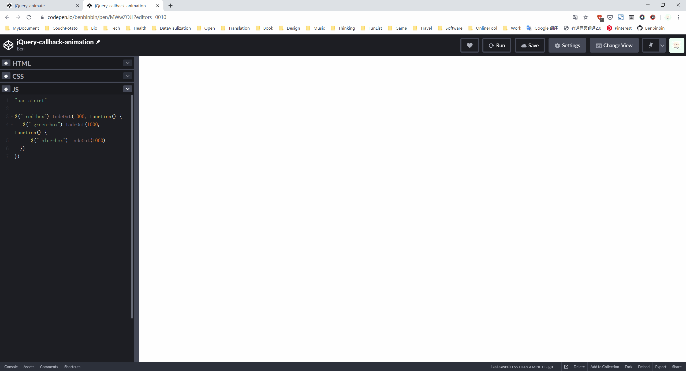
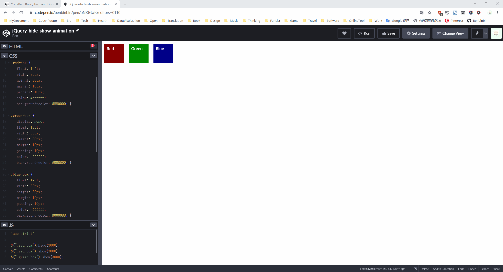
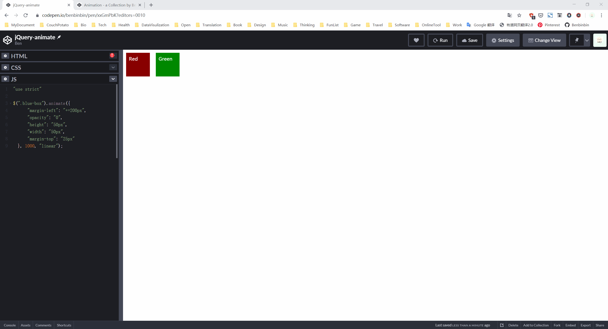

---
tags:
  - jquery
---

# 动画

## 淡入与淡出
使用 jQuery 对象内置函数 `fadeIn(time-ms)` 和 `fadeOut(time-ms)` 可以方便地实现元素淡入、淡出动画特效，传递的参数是动效持续时间（毫秒，默认值为 400）。

```js
$(selector1).fadeIn(1000);
$(selector2).fadeOut(1000);
```

:bulb: 函数 `fadeIn()` 和 `fadeOut()` 传递的参数也可是关键字设置动效速度
* `slow` 动效持续时间为 600ms
* `normal` 动效持续时间为 400ms（默认值）
* `fast` 动效持续时间为 200ms

:bulb: 淡出后该元素在页面布局中占位取消，实际上 `fadeIn()` 和 `fadeOut()` 函数是对元素 CSS 属性 `display` 进行了修改（淡出就将属性设置为 `display: none`）

此外还可以使用 jQuery 对象的内置函数 `fadeTo(time-ms, opacity)` 将元素淡入/淡出至特定的透明度，传递的参数是动效持续时间（毫秒）和透明度（百分比或小数）

```js
$(selector).fadeTo(1000, 0.8)
```

:bulb: 函数 `fadeTo()` 实际修改元素的 CSS 属性 `opacity`，由于 `fadeOut()` 并未修改 `display` 属性，因此通过 `fadeTo(time-ms, 0)` 将透明度设置为 0 隐藏元素时，其空间占位仍存在。
:warning: 当元素通过 `fadeOut()` 淡出隐藏后，无法通过 `fadeTo()` 将其显示，因为后者无法修改该 `display: none` 属性值。

当我们需要在淡入和淡出两种状态之间进行切换时，还可以使用jQuery 对象的内置函数 `fadeToggle(time-ms)`，传递的参数是动效持续时间（毫秒）。该函数会根据当前元素的状态自动进行淡入（到原始的状态，保留原始透明度等状态）或淡出状态的切换选择，一般可以通过两次调用实现元素的闪烁以提示用户关注。

```js
$(selector).fadeToggle(time-ms)
```

:bulb: 有时候需要延迟执行动态变换，可以使用 jQuery 对象的方法 `delay(time-ms)` 设置延迟时间，并通过**链式**调用的方式将「动画」函数设置在后面

```js
// 按照顺序执行代码时，延迟 1s 再执行该元素的淡入操作
$(selector).delay(1000).fadeIn()
```

:bulb: 如果希望依次执行动态变换，可以将下一个「动画」函数作为上一个动画函数的**回调函数**，这样就可以在上一个动画结束后再执行下一个动画。:warning: 虽然可以进行不断的嵌套，但是应该避免深层嵌套导致代码可读性和可维护性降低。

```js
$(selector).fadeOut(1000, function(){
    $(selector).animate();
});
```


:point_right: [在线演示](https://codepen.io/benbinbin/pen/MWwZOJL)

## 隐藏与显示
使用 jQuery 对象的函数 `hide()` 和 `show()` 可以方便地对元素进行隐藏或显示，可以传递参数设置动效持续时间（毫秒）

```js
$(selector).hide(1000);
$(selector).show();
```

当设置了动效持续时间时，其隐藏与显示过程是一个左上角或右上角缩放动画。


:point_right: [在线演示](https://codepen.io/benbinbin/pen/oNXJGwR)

## 上滑与下滑
使用 jQuery 对象的函数 `slideUp()` 和 `slideDown()` 可以方便地对元素进行上滑（隐藏）或下滑（显示），参数传递数字以设置动效持续时间（毫秒）。

:bulb: 可以使用 `slideToggle()` 函数基于元素当前的状态自动采取上滑/下滑切换。

## animate 动效
使用 jQuery 对象的函数 `animate()` 可以将元素外观样式进行动态变换（类似于 CSS 的 `animation` [关键帧动画](https://juejin.im/post/5e6f967b518825492442e717#heading-13)）。

函数 `animate()` 可以传递多个参数：
* 对象`{}` 存储元素相应属性（最终）的样式，样式属性与属性值以键值对形式列出，:warning: 属性名 key 也需要是字符串（使用引号包括）
* 数字表示动效持续时间（毫秒）
* 动效过渡函数，如 `linear`

```js
// 该动效最终效果是元素向右淡出
// 将元素往右移动 200px（即左侧外边距增加 200px），并将透明度设置为 0，动效持续 1s，动效过渡线性匀速进行
$(select).animate({
    "margin-left": "+=200px",
    "opacity": "0",
    "height": "50px",
    "width": "50px",
    "margin-top": "25px"
  }, 1000, "linear");
```



:point_right: [在线演示](https://codepen.io/benbinbin/pen/xxGmPbK)