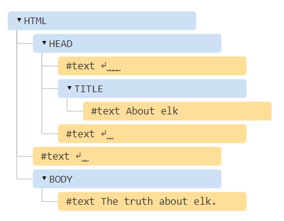
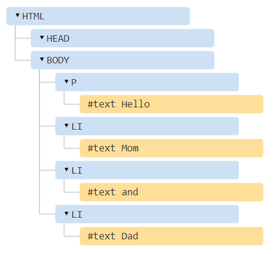
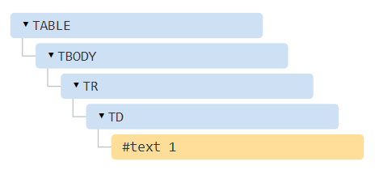
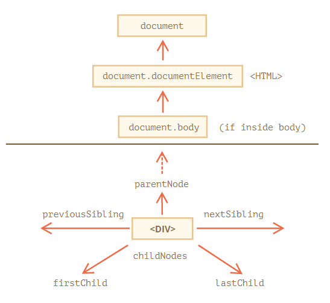
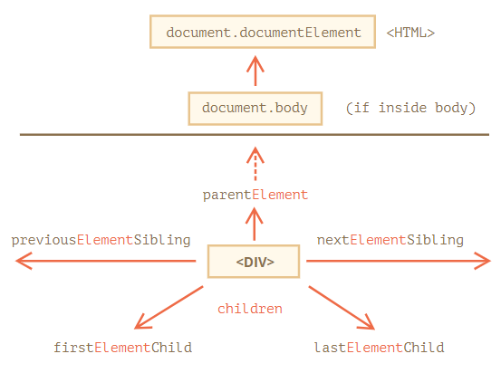
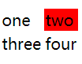
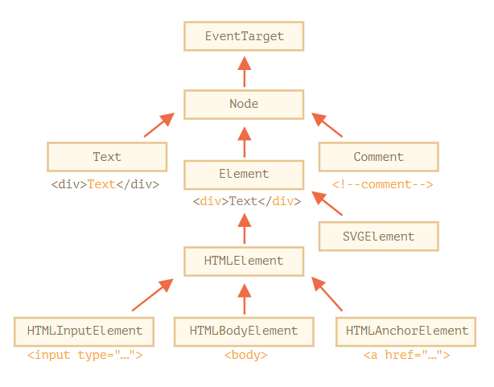
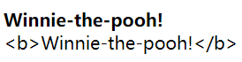

# DOM
根据文档对象模型（Document Object Model，DOM）HTML 文档是由各种对象构成的，可以通过 JavaScript 来操作这些对象以修改页面，如 `document.body` 表示 `<body>` 标签的对象，可以通过修改该对象的属性 `style.background` 设置网页背景颜色。

```js
document.body.style.background = 'red'; // 将背景设置为红色
setTimeout(() => document.body.style.background = '', 3000); // 3s 后恢复回去
```

## DOM 树结构
HTML 文档以树形结构组织起来，DOM 将该结构的每个节点都表示为一个对象。

```js
<!DOCTYPE HTML>
<html>
<head>
  <title>About elk</title>
</head>
<body>
  The truth about elk.
</body>
</html>
```



上图是实例的 DOM 结构，每个树的节点都是一个对象，这里包括 元素节点/元素 和 文本节点（被标记为 `＃text`）。其中包含了特殊的字符 换行符 `↵`（在 JavaScript 中为 `\n`）和 空格 `␣`（由于内嵌标签缩进而产生），因为完整的 DOM 树中文本节点中空格和换行符都是完全有效的字符，就像字母和数字，它们形成文本节点并成为 DOM 的一部分。只有两个顶级排除项会自动忽略这两种特殊字符，一个是 `<head>` 元素节点由于历史原因它之前的空格和换行符均被忽略；另一个是 `</body>` 元素节点，在它之后放置的内容会被自动移动到 `<body>` 内并处于 `<body>` 中的最下方，因为 HTML 规范要求所有（页面可视）内容必须位于 `<body>` 内，在 `</body>` 之后不能有空格。

:bulb: 使用浏览器的开发者工具查看 DOM 结构时，通常不会在文本的开始/结尾显示空格，并且在标签之间也不会显示空文本节点（换行符），通过这种方式节省屏幕空间。

:bulb: HTML 中的所有内容，都会成为 DOM 的一部分（即 DOM 对象），包括 开头的 `<!DOCTYPE...>`、注释等都是 DOM 节点。DOM 一共有 [12 种节点类型](https://dom.spec.whatwg.org/#node)，常用到的是其中的 4 种：

1. **`document`** 表示整个文档，DOM 的「入口点」，在形式上也是一个 DOM 节点
2. **元素节点** 表示 HTML 标签，树构建块。`<html>` 在根节点，`<head>` 和 `<body>` 是其子项
3. **文本节点**  表示文本，一个文本节点只包含一个字符串。它没有子项，并且总是树的叶子。
4. **注释** 有时我们可以将一些信息放入其中，它不会显示，但 JS 可以从 DOM 中读取它。

:bulb: 可以将 HTML 文档源码输入到在线分析工具 [Live DOM Viewer](http://software.hixie.ch/utilities/js/live-dom-viewer/) 以可视化交互形式展现 DOM 结构；也可以使用浏览器的开发者工具，切换到 Elements 选项卡以查看 DOM 结构，并在控制台使用 JavaScript 与其进行交互，如通过 `$0` 表示最后选中的元素对象，`$1` 表示先前选择的元素对象。

浏览器遇到格式不正确的 HTML，它会在形成 DOM 时自动更正，以形成一个正常的 DOM，如顶级标签总是 `<html>` 即使它不存在于 HTML 文档源码中，它也会出现在 DOM 中，因为浏览器会创建它。对于在页面中可视的内容都需要包装到 `<body>` 内，如果 HTML 文档源码缺省了也会在 DOM 自动补上；浏览器会自动处理文档中的错误，如在读取标签时会自动填补缺失的关闭标签等。

```html
<p>Hello
<li>Mom
<li>and
<li>Dad
```



:bulb: 表格是一个有趣的特殊的例子，按照 DOM 规范它们必须具有 `<tbody>`，但 HTML 文本却（官方的）忽略了它，在浏览器创建 DOM 时会自动地创建 `<tbody>`。

```html
<table id="table"><tr><td>1</td></tr></table>
```



## 遍历 DOM
DOM 让我们可以对元素和它们中的内容做任何事，但是首先我们需要获取到对应的 DOM 对象。对 DOM 的所有操作都是以 `document` 对象开始（:bulb: 它是 DOM 的主「入口点」），从 `document` 开始通过各种**导航 navigation 属性**（基于树结构中元素之间的层级相对关系）可以访问 DOM 的各个节点（包括文本节点）或节点集合（使用属性 `childNodes` 访问子节点集合）。



:bulb: 在访问 DOM 节点时如果返回 `null` 就意味着「不存在」或者「没有这个节点」。

### 最顶层节点
最顶层 `<html>`、`<head>`、`<body>` 元素在 DOM 结构中对应的树节点可以直接作为 `document` 的属性来使用

* `<html>` 标签的 DOM 节点 = `document.documentElement`
* `<body>` 标签的 DOM 节点 = `document.body`
* `<head>` 标签的 DOM 节点 = `document.head`

:warning: 脚本无法访问在运行时不存在的元素，尤其是当一个脚本是在 `<head>` 中那么脚本是访问不到 `document.body` 元素的，因为浏览器还没有读到它，这会导致`document.body` 的值可能是 `null`

```js
<html>
    <head>
      <script>
        alert( "From HEAD: " + document.body );   // From HEAD: null，这里目前还没有 <body>
      </script>
    </head>

    <body>
      <script>
        alert( "From BODY: " + document.body );   // From BODY: [object HTMLBodyElement]，现在存在了
      </script>
    </body>
</html>
```

### 子节点
* 属性 `childNodes` 表示给定节点的所有子节点的 **集合**（返回一个称为 NodeList 类数组对象，它实时动态反映 DOM 结构，可以通过索引访问其中的元素）
    NodeList 保存一组有序的节点（包含文本节点），该对象具有属性 `length` 和 `item`，可以获取子节点相关信息
    ```js
    let nodeList = elem.childNodes;
    // 获取子节点的数量
    console.log(nodeList.length);
    // 获取第 2 个子节点，两种方法
    nodeList[1];
    nodeList.item(1)
    ```
* 属性 `firstChild` 和 `lastChild` 表示给定节点的第一个和最后一个子节点（如果元素存在子节点），它们实际是简写，相当于 `elem.childNodes[0] === elem.firstChild` 和 `elem.childNodes[elem.childNodes.length - 1] === elem.lastChild`

:bulb: 可以使用  `elem.hasChildNodes()` 返回的布尔值的 `true` 或 `false` 来判断节点对象 `elem` 是否含有子节点

:bulb: 需要区分两个术语概念
- **子节点/元素** 是指直系的子元素，即它们给定的元素第一层嵌套元素，如 `<head>` 和 `<body>` 就是 `<html>` 元素的子元素。
- **子孙节点/元素** 是指嵌套在给定元素中的所有元素，包括子元素、子元素的子元素等。

```js
<html>
<body>
  <div>Begin</div>

  <ul>
    <li>Information</li>
  </ul>

  <div>End</div>

  <script>
    for (let i = 0; i < document.body.childNodes.length; i++) {
      alert( document.body.childNodes[i] ); // Text, DIV, Text, UL, ..., SCRIPT
    }
  </script>
  <!-- more stuff -->
  <div>more stuff</div>
  <div>other stuff</div>
</body>
</html>
```

:warning: 上述实例代码输出最后结果为 `[object HTMLScriptElement]` 即最后一个可以访问的子元素为 `<script>` 但实际上在其后文档下面还有其他元素，这个脚本无法「看到」它们，因为在这个脚本运行的时候，浏览器还没有读到下面的内容。

:warning: 通过 `childNodes` 属性获取的 DOM 集合是一个**类数组的可迭代对象**（但不是一个数组），可以使用循环 for-of 结构来迭代其中的元素（但不要使用 for-in 结构来遍历，因为循环结构会遍历对象所有可枚举的  enumerable 属性，包括一些 DOM 集合特有的方法）；却无法使用数组的方法，如果需要使用数组的方法可以先使用 `Array.from(DOM_collection)` 将 DOM 集合对象转换为数组。

```js
for (let node of document.body.childNodes) {
  alert(node);   // 迭代显示集合中的所有节点
}

alert(document.body.childNodes.filter);   // undefined（这里没有 filter 方法！）
alert( Array.from(document.body.childNodes).filter );   // function，转换以后可以使用数组的方法
```

DOM 集合需要注意的特点：

* DOM 集合是只读的，不能通过类似 `childNodes[i] = ...` 的简单操作来替换/修改一个子节点，修改子节点需要使用其它方法。
* DOM 集合是**实时**的（除小部分例外），如果我们保留一个对 elem.childNodes 的引用，然后向 DOM 中添加/移除节点，那么这些节点的更新会自动出现在集合中，即 DOM 集合反映了页面的当前状态。

### 兄弟节点和父节点
* 属性 `nextSibling` 获取下一个兄弟节点
* 属性 `previousSibling` 获取上一个兄弟节点
* 属性 `parentNode` 获取父节点

:bulb: 需要了解兄弟节点 Sibling node 这个术语概念，它是指有同一个父节点的节点，如元素 `<head>` 和 `<body>` 在 DOM 结构树中所对应的节点，它们的关系就是兄弟节点，`<body>` 可以说是 `<head>` 的「下一个」/「右边」兄弟节点；`<head>` 可以说是 `<body>` 的「前一个」或者「左边」兄弟节点。

```js
// <body> 的父节点是 <html>
alert( document.body.parentNode === document.documentElement );   // true

// <head> 的后一个是 <body>
alert( document.head.nextSibling );   // [object HTMLBodyElement]

// <body> 的前一个是 <head>
alert( document.body.previousSibling );   // [object HTMLHeadElement]
```

:bulb: 在任意子节点中可以使用 `elem.ownerDocument` 获取 `document` 文档节点

### 纯元素节点导航
在一些通用的导航属性，如 `childNodes` 中，可以获取所有节点，包括文本节点、元素节点，甚至注释节点，但是在实际开发中一般只是希望操纵代表标签的和形成页面结构的**元素节点**。

可以使用只匹配**元素节点** 的导航链接 navigation link，它们一般包含 `Element` 关键字

* 属性 `children` 表示给定元素节点的**子代元素节点**集合，可以使用索引 `n` 获取第 `n` 个子元素节点。:bulb: 可以使用 `elem.childElementCount` 获取当前节点包含的子元素节点的个数
* 属性 `firstElementChild` 和 `lastElementChild` 表示给定元素节点的**第一个和最后一个子元素节点**。
* 属性 `previousElementSibling` 和 `nextElementSibling` 表示给定元素节点的**前一个或后一个兄弟元素节点**。
* 属性 `parentElement` 表示**父元素节点**




```js
<html>
<body>
  <div>Begin</div>

  <ul>
    <li>Information</li>
  </ul>

  <div>End</div>

  <script>
    for (let elem of document.body.children) {
      alert(elem);   // DIV, UL, DIV, SCRIPT
    }
  </script>
  <!-- more stuff -->
  <div>more stuff</div>
  <div>other stuff</div>
</body>
</html>
```

:warning: `parentElement` 属性返回的是元素类型的父节点，而 `parentNode` 返回的是任何类型的父节点，这一点对于 `document.documentElement` 节点有明显的不同（其他节点的父节点一般也都是元素类型的节点，所以这两种属性返回的节点一般都相同），由于 `<html>` 元素节点的父节点 **`document` 并不是一个元素节点**，所以 `document.documentElement.parentNode` 返回了 `document`，但 `document.documentElement.parentElement` 返回的是 `null`。

```js
alert( document.documentElement.parentNode ); // document
alert( document.documentElement.parentElement ); // null
```

如果希望得到从任意节点 `elem` 到 `<html>` 的父节点，而不是到 `document` 节点时，这个细节可能很有用

```js
while(elem = elem.parentElement) {   // 从 elem 开始向上不断输出父节点（元素类型），直到 <html>
  alert( elem );
}
```

### 表格节点导航
方便起见某些类型的 DOM 元素节点可能会提供特定于其类型的其他属性（导航链接），如[表格元素就提供了很多额外的属性](https://html.spec.whatwg.org/multipage/tables.html)用于元素内的导航。

`<table>` 元素节点提供以下这些属性
* **`table.rows`** 表示 `<tr>` 元素节点的集合（可迭代对象可以结合索引获取特定的 `<tr>` 表格行）
* **`table.caption/tHead/tFoot`** 分别表示 `<caption>`、`<thead>`、`<tfoot>` 其子元素节点
* **`table.tBodies`** 表示 `<tbody>` 子元素节点的集合（根据标准表格中至少会有一个 `<tbody>` 节点，也可以有多个）

`<thead>`，`<tfoot>`，`<tbody>` 元素节点提供了 **`rows`** 属性表示表格内部 `<tr>` 元素节点的集合。

`<tr>` 元素节点提供以下这些属性
* **`tr.cells`** 表示在给定 `<tr>` 中的 `<td>` 和 `<th>` 单元格的节点集合。
* **`tr.sectionRowIndex`** 表示在给定的 `<tr>` 在封闭的 `<thead>/<tbody>/<tfoot>` 中的位置（索引）。
* **`tr.rowIndex`** 表示在整个表格中给定 `<tr>` 的位置（索引）（包括表格的所有行）。

`<td>` 和 `<th>` 元素节点提供属性 **`cellIndex`** 表示在封闭的 `<tr>` 中给定单元格的位置（索引）。

```js
<table id="table">
  <tr>
    <td>one</td><td>two</td>
  </tr>
  <tr>
    <td>three</td><td>four</td>
  </tr>
</table>

<script>
  // 获取带有 "two" 的 td（第一行，第二列）
  let td = table.rows[0].cells[1];
  td.style.backgroundColor = "red"; // highlight it
</script>
```



## 搜索元素节点
当元素彼此靠得近时使用 DOM 导航属性 navigation property 可以快速获取所需的节点，但是如果需要获取页面上的任意元素，还可以通过搜索方法快速获取满足指定条件的元素节点（或 HTMLCollection 集合，它是类数组对象，实时反映 DOM 结构）。

:bulb: 这些搜索方的接口/入口依然是 `document` ，即这些方法只能通过 `document` 对象进行调用。

有 6 种主要的方法，可以在 DOM 中搜索节点，返回 HTMLCollection 类数组对象

|                 方法                  | 搜索基于参数 |                                是否可以通过元素调用                                |      是否返回实时 DOM 集合       |
| --------------------------------------- | ------------------ | -------------------------------------------------------------------------------------------- | -------------------------------------------- |
| `querySelector`                | CSS-selector  | :white_check_mark:                                                                 | :negative_squared_cross_mark: |
| `querySelectorAll`           | CSS-selector  | :white_check_mark:                                                                 | :negative_squared_cross_mark: |
| `getElementById`              | `id`              | :negative_squared_cross_mark:（仅使用 `document` 对象调用） | :negative_squared_cross_mark: |
| `getElementsByName`         | `name`           | :negative_squared_cross_mark:（仅使用 `document` 对象调用） | :white_check_mark:                 |
| `getElementsByTagName`    | tag or `'*'`（传递 `!` 在 IE 中匹配注释节点）  | :white_check_mark:                                                                 | :white_check_mark:                 |
| `getElementsByClassName` | class              | :white_check_mark:                                                                 | :white_check_mark:                 |

目前为止最常用的是 `querySelector` 和 `querySelectorAll`，但是 `getElementBy*` 可能会偶尔有用。

:bulb: 此外针对特定的元素类型，浏览器提供了相应的属性获取 HTMLCollection（相应元素节点集合），相当于使用方法 `document.geElementsByTagName(tagName)`

* `document.scripts` 获取页面的所有脚本元素节点的集合
* `document.links` 获取页面的所有锚标签元素节点的集合
* `document.images` 获取页面的所有图片标签元素节点的集合
* `document.forms` 获取页面的所有表单元素节点的集合
* `tr.cells` 获取指定的表格中特定行的单元格节点的集合
* `select.options` 获取指定下拉菜单中选项节点的集合

HTMLCollection 是类数组对象（可以使用索引访问其中的元素），它包含多个属性
* 属性 `length`：HTMLCollection 包含的子节点的数量
* 属性 `item`
* 属性 `namedItem`：该属性值是一个方法，它接受一个参数 `.nameItem(parameter)`，返回 HTMLCollection 集合中具有指定 `id` 或 `name` 属性值的（第一个匹配到的）元素

:bulb: 基于 CSS 选择器进行匹配还有两种方法：

- `elem.matches(css)` 用于检查 `elem` 与给定的 CSS 选择器是否匹配。
- `elem.closest(css)` 用于查找与给定 CSS 选择器相匹配的最近的祖先节点，`elem` 本身也会被检查。

### getElementById
如果一个元素有 id 特性 attribute 就可以使用 `document.getElementById(id)` 方法获取该元素。

```html
<div id="elem">
  <div id="elem-content">Element</div>
</div>

<script>
  // 获取该元素
  let elem = document.getElementById('elem');

  // 将该元素背景改为红色
  elem.style.background = 'red';
</script>
```

:warning: 在[规范](http://www.whatwg.org/specs/web-apps/current-work/#dom-window-nameditem) 中规定了一种标准，以通过**以 `id` 命名的全局变量来访问元素**（除非声明一个具有相同名称的 JavaScript 变量将该全局变量覆盖了），但该标准是考虑到兼容性才支持的，因为浏览器尝试通过混合 JavaScript 和 DOM 的命名空间来帮助我们。但是这种直接调用节点的方式可能会造成命名冲突，另外当人们阅读 JavaScript 代码且看不到对应的 HTML 时，该全局变量的来源就会不明显。在实际开发中 `document.getElementById("idName")` 是首选方法。

```html
<div id="elem">
  <div id="elem-content">Element</div>
</div>

<script>
  // elem 是对带有 id="elem" 的 DOM 元素的引用
  elem.style.background = 'red';
  // id="elem-content" 内有连字符，所以它不能成为一个变量
  // ...但是我们可以通过使用方括号 window['elem-content'] 来访问它
</script>

<script>
  let elem = 5;   // 覆盖全局变量，现在 elem 是 5，而不是对 <div id="elem"> 的引用
  alert(elem);   // 5
</script>
```

:warning: 方法 `getElementById` 只能在 `document` 对象上调用，它会在整个文档中查找给定的 `id` 元素的节点。

### getElementsBy*
还有其他通过标签、类属性等查找节点的方法，但在现代 JavaScript 中它们大多已经成为了历史（因为 `querySelector` 功能更强大，写起来更短），可能在一些旧脚本中找到这些方法。

- `elem.getElementsByTagName(tag)` 查找给定标签的元素，并返回它们的 DOM 集合。如果参数是通配符星号 `"*"` 即匹配「任何标签」。
- `elem.getElementsByClassName(className)` 返回具有给定 CSS 类的元素的 DOM 集合。
- `document.getElementsByName(name)` 返回在文档范围内具有给定 `name` 特性的元素。

:warning: 上述属性返回可能是 DOM 集合，即匹配多个节点，因此注意在属性关键字有 `s`，即 `getElementsBy*` 而~~不是 `getElementBy*`~~

```html
<table id="table">
  <tr>
    <td>Your age:</td>

    <td>
      <label>
        <input type="radio" name="age" value="young" checked> less than 18
      </label>
      <label>
        <input type="radio" name="age" value="mature"> from 18 to 50
      </label>
      <label>
        <input type="radio" name="age" value="senior"> more than 60
      </label>
    </td>
  </tr>
</table>

<script>
  // 获取文档中的所有 div 元素节点
  let divs = document.getElementsByTagName('div');

  // 获取文档中所有 input 表单元素节点
  let inputs = table.getElementsByTagName('input');

  for (let input of inputs) {
    alert( input.value + ': ' + input.checked );
  }
  // young: true
  // mature: false
  // senior: false
</script>
```

:bulb: 属性 `getElementsBy*` 返回的是一个 DOM 集合（而不是一个元素），因此对结果进行操作时应该以遍历集合或通过对应的索引来获取元素（:warning: 即使 DOM 集合里只有一个节点）。

```html
<script>
// 行不通
document.getElementsByTagName('input').value = 5;

// 应该可以运行（如果有 input）
document.getElementsByTagName('input')[0].value = 5;
</script>

<!-- 分割线 -->
<form name="my-form">
  <div class="article">Article</div>
  <div class="long article">Long article</div>
</form>

<script>
// 按 name 特性查找
let form = document.getElementsByName('my-form')[0];

// 在 form 中按 class 查找
let articles = form.getElementsByClassName('article');
alert(articles.length); // 2, found two elements with class "article"
</script>
```

:bulb: 所有的 `"getElementsBy*"` 方法都会返回一个 **实时的 live** 集合，即集合始终反映的是文档的当前状态，并且在文档发生更改时会「自动更新」。

```html
<div>First div</div>

<script>
  let divs = document.getElementsByTagName('div');
  alert(divs.length); // 1
</script>

<div>Second div</div>

<script>
  alert(divs.length); // 2
</script>
```

### querySelectorAll
到目前为止最通用的方法是 `elem.querySelectorAll(cssSelector)` 它返回 `elem` 节点内中与给定 CSS 选择器匹配的所有元素节点（返回 **StaticNodeList 一个静态的类数组对象**，包含 DOM 节点集合，但并不动态反映 DOM 结构），利用丰富的 CSS 选择器类型可以匹配页面任意节点；如果没有匹配的元素节点返回空的集合。

```html
<ul>
  <li>The</li>
  <li>test</li>
</ul>
<ul>
  <li>has</li>
  <li>passed</li>
</ul>
<script>
  // 查找作为最后一个子元素的 <li> 元素节点
  let elements = document.querySelectorAll('ul > li:last-child');
  for (let elem of elements) {
    alert(elem.innerHTML);   // "test", "passed"
  }
</script>
```

:bulb: 作为参数的 CSS 选择器可以使用伪类，如 `:hover` 和 `:active` 也都是被支持的。

:bulb: `querySelectorAll` 返回的是一个 **静态的** 集合，就像元素的固定数组，即返回的 DOM 集合只是反映查询那会文档的状态，如果在文档稍后发生更改 DOM 集合并不会更新。该行为与属性 `getElementsBy*` 返回的 DOM 集合不同。

```html
<div>First div</div>

<script>
  let divs = document.querySelectorAll('div');
  alert(divs.length); // 1
</script>

<div>Second div</div>

<script>
  alert(divs.length); // 1
</script>
```

### querySelector
`elem.querySelector(cssSelector)` 调用会返回与给定 CSS 选择器匹配的**第一个匹配的元素**，相当于 `elem.querySelectorAll(css)[0]`；如果没有匹配的元素节点返回 `null`。

### matches
`elem.matches(cssSelector)` 检查给定的元素节点 `elem` 是否能与给定的 CSS 选择器匹配，返回 `true` 或 `false`。可用于遍历 DOM 集合并进行过滤筛选。

```html
<a href="http://example.com/file.zip">...</a>
<a href="http://ya.ru">...</a>

<script>
  // 不一定是 document.body.children，还可以是任何集合
  for (let elem of document.body.children) {
    if (elem.matches('a[href$="zip"]')) {
      alert("The archive reference: " + elem.href );
    }
  }
</script>
```

### closest
`elem.closest(cssSelector)` 方法会查找与 CSS 选择器匹配的**最近的祖先**，`elem` 自己也会被搜索，即方法 `closest` 在元素中得到了**提升**，并检查每个父级。如果它与选择器匹配，则停止搜索并返回该祖先。

:bulb: 需要了解祖先 ancestor 这个术语概念，它表示父级，父级的父级等。祖先们一起组成了从元素到顶端的父级链。

```html
<h1>Contents</h1>

<div class="contents">
  <ul class="book">
    <li class="chapter">Chapter 1</li>
    <li class="chapter">Chapter 1</li>
  </ul>
</div>

<script>
  let chapter = document.querySelector('.chapter'); // LI

  alert(chapter.closest('.book'));   // [object HTMLUListElement]
  alert(chapter.closest('.contents'));   // [object HTMLDivElement]

  alert(chapter.closest('h1'));   // null（因为 h1 不是祖先）
</script>
```

### contains
则使用方法  `elemA.contains(elemB)` 检查子级与父级之间关系，如果 `elemB` （是 `elemA` 的后代）在 `elemA` 内或者 `elemA==elemB` 将返回 `true`。

## DOM 节点常用标准属性
每个 DOM 节点（对象）都属于一种内建 built-in 类，不同的类之间通过继承的方式「传递」属性和方法，使得 DOM 节点具有多种内建属性，除了有继承自祖先类的共有属性和方法以为，每个节点对应的类还提供特定的属性和方法，如标签 `<a>` 相对应的元素节点具有链接相关的 link-related 属性，标签 `<input>` 相对应的元素节点具有与输入相关的属性等。

DOM 节点是常规的 JavaScript 对象，因此除了从内建类获取的内建（标准）属性外，还可以像常规的 JavaScript 对象一样手动为节点（对象）添加属性。

```js
document.body.myData = {
  name: 'Caesar',
  title: 'Imperator'
};

alert(document.body.myData.title); // Imperator

document.body.sayTagName = function() {
  alert(this.tagName);
};

document.body.sayTagName(); // BODY（这个方法中的 "this" 指代 document.body）
```

### DOM 节点类
每个 DOM 节点多对应，它们之间存在继承关系，形成层次结构 hierarchy



具体继承规则如下：
- [`EventTarget` 类](https://dom.spec.whatwg.org/#eventtarget) 是所有类的根，它作为一个基础，以便让所有 DOM 节点都支持所谓的「事件」event。该类是抽象类 abstract，即该类的对象从未被创建
- [`Node` 类](http://dom.spec.whatwg.org/#interface-node) 充当 DOM 节点的基础，提供了 DOM 树的核心功能，如为节点提供属性 `parentNode`，`nextSibling`，`childNodes` 等（它们都是 getter 方法），它也是一个抽象类，即该类的对象从未被创建，以供其他具体的节点类继承，如文本节点的 `Text`，元素节点的 `Element`，以及更多异域 exotic 类，如注释节点的 `Comment`
- [`Element` 类](http://dom.spec.whatwg.org/#interface-element) 是 DOM 元素节点的基本类，提供了元素级的导航navigation 属性，如 `nextElementSibling`，`children` 等，以及像 `getElementsByTagName` 和 `querySelector` 这样的搜索方法。浏览器中不仅有 HTML，还会有 XML 和 SVG，对应的类 `SVGElement`，`XMLElement` 和 `HTMLElement` 都是继承自 `Element` 类。
- [HTMLElement](https://html.spec.whatwg.org/multipage/dom.html#htmlelement) 所有 HTML 元素的基本类。各种 HTML 元素均继承自它，如 [`HTMLInputElement`](https://html.spec.whatwg.org/multipage/forms.html#htmlinputelement) 即 `<input>` 元素的类、[`HTMLBodyElement`](https://html.spec.whatwg.org/multipage/semantics.html#htmlbodyelement) 即 `<body>` 元素的类、[`HTMLAnchorElement`](https://html.spec.whatwg.org/multipage/semantics.html#htmlanchorelement) 即 `<a>` 元素的类等

:warning: 在规范中 DOM 类不是使用 JavaScript 来描述的，而是一种特殊的 [接口描述语言（Interface description language）](https://en.wikipedia.org/wiki/Interface_description_language) 简写为 IDL，它通常很容易理解。在 IDL 中所有属性以其数据类型开头，如 `DOMString`、`boolean` 等。

以下是摘录（excerpt）

```
// 定义 HTMLInputElement
// 冒号 ":" 表示 HTMLInputElement 继承自 HTMLElement
interface HTMLInputElement: HTMLElement {
  // 接下来是 <input> 元素的属性和方法

  // "DOMString" 表示属性的值是字符串
  attribute DOMString accept;
  attribute DOMString alt;
  attribute DOMString autocomplete;
  attribute DOMString value;

  // 布尔值属性（true/false）
  attribute boolean autofocus;
  ...
  // 现在方法："void" 表示方法没有返回值
  void select();
  ...
}
```

:bulb: 最后类都是继承自 `Object` 这个通用的对象，因此节点（对象）会有如 `hasOwnProperty` 这样的「普通对象」也有的方法。

考虑一下 `<input>` 元素的 DOM 对象，它属于 `HTMLInputElement` 类，该类通过以下继承方式（按继承顺序列出）让对象拥有多种属性和方法：

- `HTMLInputElement` 类提供特定于输入的属性
- `HTMLElement` 类提供了通用的 HTML 元素方法（以及 getter 和 setter）
- `Element` 类提供通用元素方法
- `Node` 类提供通用 DOM 节点属性
- `EventTarget` 类为事件（包括事件本身）提供支持
- 最后继承自 `Object`

可以通过访问对象的属性 `constructor` 查看其对应的类，其中 `constructor.name` 就是类的名称；也可以使用 `alert(nodeObj)` 默认调用 `toString` 方法查看类名

```js
alert( document.body.constructor.name );   // HTMLBodyElement
alert( document.body );   // [object HTMLBodyElement]
```

可以使用 `instanceof` 操作符检查继承（链）关系

```js
alert( document.body instanceof HTMLBodyElement ); // true
alert( document.body instanceof HTMLElement ); // true
alert( document.body instanceof Element ); // true
alert( document.body instanceof Node ); // true
alert( document.body instanceof EventTarget ); // true
```

:bulb: 此外可以使用一种旧的属性 `nodeType` 来获取 DOM 节点所属的类，只能读取 `nodeType` 而不能修改它，它返回一个数值型的值对应于特定的类，常见的数值节点对照关系

- 对于元素节点 `elem.nodeType == 1`
- 对于文本节点 `elem.nodeType == 3`
- 对于 document 对象 `elem.nodeType == 9`

```html
<body>
  <script>
  let elem = document.body;

  // 让我们检查一下它是什么？
  alert(elem.nodeType); // 1 => element

  // 第一个子节点是
  alert(elem.firstChild.nodeType); // 3 => text

  // 对于 document 对象，类型是 9
  alert( document.nodeType ); // 9
  </script>
</body>
```

### nodeName 和 tagName 属性
使用属性 `nodeName` 或 `tagName` 读取给定 DOM 节点的标签名，一般两者返回值都是相同，但是对于会元素节点会不一样：
- `tagName` 属性**仅适用于 `Element` 节点**
- `nodeName` 是为任意 `Node` 定义的
    - 对于元素，它的意义与 `tagName` 相同。
    - 对于其他节点类型（text，comment 等），它拥有一个对应节点类型的字符串。

```html
<body><!-- comment -->

  <script>
    // for comment
    alert( document.body.firstChild.tagName ); // undefined（不是一个元素）
    alert( document.body.firstChild.nodeName ); // #comment

    // for document
    alert( document.tagName ); // undefined（不是一个元素）
    alert( document.nodeName ); // #document
  </script>
</body>
```

:warning: 浏览器有两种处理文档（document）的模式：HTML 和 XML。通常 HTML 模式用于网页；只有在浏览器接收到带有 header `Content-Type: application/xml+xhtml` 的 XML-document 时，XML 模式才会被启用。在 HTML 模式下 `tagName/nodeName` 始终是大写的，即对于 `<body>` 节点属性 `tagName/nodeName` 返回 `BODY`，而不是 `<body>` 或 `<BoDy>`。在 XML 模式中，大小写保持为「原样」，如今 XML 模式很少被使用。

### innerHTML 属性
属性 [`innerHTML`](https://w3c.github.io/DOM-Parsing/#widl-Element-innerHTML) 获取给点元素节点内的 HTML 并以字符串形式返回。此外为该属性赋值可以修改该（完全替换）节点内的内容

```html
<body>
  <p>A paragraph</p>
  <div>A div</div>

  <script>
    alert( document.body.innerHTML ); // 读取当前内容，以字符串形式返回源码
    document.body.innerHTML = 'The new BODY!'; // 替换它
  </script>

</body>
```

:bulb: 可以使用 `elem.innerHTML = ''` 快速实现移除元素里的内容。

:bulb: 当赋值为无效的 HTML，如缺少闭合标签，浏览器会自动修复。

:warning: 如果 `innerHTML` 将一个 `<script>` 标签插入节点中，它会成为 HTML 的一部分但是**不会执行**。

:warning: 如果通过 `nodeName.innerHTML += "content"` 方式将 HTML 附加到元素上，该过程不仅仅是单纯地附加内容，而是会触发重新加载原有的内容，这会造成一些副作用，如元素原有大量的文本和图片资源都将重写加载，这可能会耗费更多的时间，如果这里有一个带有用户输入的文本的 `<input>`，那么这个被输入的文本将会被移除。即`innerHTML+=` 做了以下工作：

1. 移除旧的内容。
2. 然后写入新的 `innerHTML`（新旧结合）。

### outerHTML 属性
属性 `outerHTML` 获取给定节点的完整 HTML（包含了节点对应的元素本身），相当于 `innerHTML` 加上元素本身一样。

```html
<div id="elem">Hello <b>World</b></div>

<script>
  alert(elem.outerHTML); // <div id="elem">Hello <b>World</b></div>
</script>
```

:warning:  在赋值修改属性值时，与属性 `innerHTML` 行为不同，写入 `outerHTML` 不会改变元素，而是在对应 DOM 节点位置上进行替换，这会造成一个难以理解的现象，即通过属性 `outerHTML` 修改节点内容后，变量原来存储的节点其内容却依然是原始值。

```html
<div>Hello, world!</div>

<script>
  let div = document.querySelector('div');

  // 使用 <p>...</p> 替换 div.outerHTML 内容
  div.outerHTML = '<p>A new element</p>'; // (*)

  // div 变量还是原来那样
  alert(div.outerHTML); // <div>Hello, world!</div> (**)
</script>
```

在 `(*)` 行使用 `<p>A new element</p>` 替换 `div` 节点内容。在外部文档 DOM （页面）中我们可以看到的是新内容，但访问旧的 `div` 变量并没有被改变，这是因为`outerHTML` 赋值是将旧的内容从 DOM 节点中删除并在其位置插入新的 HTML：
1. `div` 被从文档中移除。
2. 另一个 HTML 片段 `<p>A new element</p>` 被插入到其位置上
3. `div` 仍拥有其旧的值，**新的 HTML 没有被赋值给任何变量**。

这种修改方式很容易出错，如果以为修改 `div.outerHTML` 后继续使用 `div`，就好像它包含的是新内容一样；但事实并非如此。

### nodeValue 和 data 属性
属性 `innerHTML` 仅对元素节点有效，如果希望获取其他节点类型内的内容，如文本节点，可以使用它们的对应属性 `nodeValue` 或 `data`，这两者在实际使用中几乎相同，只有细微规范上的差异。

```html
<body>
  Hello
  <!-- Comment -->
  <script>
    // 读取文本节点内容
    let text = document.body.firstChild;
    alert(text.data); // Hello

    // 读取注释节点内容
    let comment = text.nextSibling;
    alert(comment.data); // Comment
  </script>
</body>
```

### textContent 属性
`textContent` 提供了对元素内的 **文本** 的访问权限，即只获取给定节点内的文本，去掉所有 `<tags>` 标签，相当于将所有 `<tags>` 都被剪掉了一样。

```html
<div id="news">
  <h1>Headline!</h1>
  <p>Martians attack people!</p>
</div>

<script>
  alert(news.textContent);
  // Headline!
  // Martians attack people!
</script>
```

在实际开发中，用到只读取节点中的文本的场景非常少（由于节点内嵌赋值的其他元素，仅提取文本内容会破坏这些原始的嵌套结构信息），但**写入 `textContent`** 要有用得多，因为它允许以「安全方式」写入文本，如有一个用户输入的任意字符串，我们可以将其赋值给属性 `textContent`将写入到页面以显示出来。

- 如果使用 `innerHTML`，我们将用户输入的内容作为 HTML 格式插入，如果用户输入的内容带有所有 HTML 标签，就会在显式相应的格式。
- 使用 `textContent`，我们将用户输入的内容作为 纯文本 插入，即使用户输入的内容带有所有 HTML 标签的，但所有符号均按字面意义处理。

```html
<div id="elem1"></div>
<div id="elem2"></div>

<script>
  let name = prompt("What's your name?", "<b>Winnie-the-pooh!</b>");

  elem1.innerHTML = name;
  elem2.textContent = name;
</script>
```

:hammer:



:bulb: 类似属性是 `elem.innerText` 获取给定节点内（从开始标签至结束标签之间）的文本，相对应的有属性 `elem.outerText`，但如果赋值会将该节点也替换掉（不常用）。:warning: 但 Firefox 浏览器不支持该属性。

### hidden 属性
属性 `hidden` 是一个 HTML 元素的布尔属性，其作用相当于  `style="display:none"` 将元素隐藏，在 DOM 节点中也有该属性，通过 JavaScript 将该属性设置为 `true` 或 `false` 以指定元素是否可见。

```html
<div id="elem">A blinking element</div>

<script>
  // 闪烁显示元素
  setInterval(() => elem.hidden = !elem.hidden, 1000);   // 每 1 秒进行显式/隐藏切换
</script>
```

### 表单属性
表单元素节点有多种布尔属性

* 属性 `checked` 设置选项选中，适用于单选 `type="radio"` 或多选 `type="checkbox"` 表单
* 属性 `selected` 设置选项选中，适用于下拉菜单选项 `<option>` 元素节点
* 属性 `readOnly` 设置输入型表单控件是否只读
* 属性 `disabled` 设置表单控件是否无效
* 属性 `mutiple` 设置下拉菜单 `<select>` 元素节点是否为多选

## 特性和属性
当浏览器加载页面时，它会「读取」/「解析」HTML 并从中生成 DOM 对象，对于元素节点**大多数标准的 HTML 特性 attributes 会自动变成 DOM 对象的属性 properties**，如标签是 `<body id="page">` 那么 DOM 对象就会有相应的属性 `document.body.id`（属性值为 `"page"`）。

- 特性（attribute）是写在 HTML 中的内容。
- 属性（property）是 DOM 对象中的内容。

|        | 属性                                                    |                    特性                    |
| :----: | :--------------------------------------------------------: | :--------------------------------------------: |
| 类型 | 任何值，标准的属性具有规范中描述的类型 | 字符串                                    |
| 名字 | 名字（name）是大小写敏感的                 | 名字（name）是大小写不敏感的 |

:warning: **只有 标准的（固有的）特性才会自动生成相应的 DOM 属性**，而且一个元素的标准特性对于另一个元素可能是未知的，如 `"type"` 是 `<input>` 的一个标准的特性（[HTMLInputElement](https://html.spec.whatwg.org/#htmlinputelement)），但对于 `<body>`（[HTMLBodyElement](https://html.spec.whatwg.org/#htmlbodyelement)）来说则不是。另外很多 HTML 固有特性（attribute）与 DOM 节点属性（property）并不总是相同的，特别是那些依赖于 `class` 的属性，如 `<input>` 元素对应的 DOM 节点 `HTMLInputElement` 支持 `value`、`type` 属性；`<a>` 元素对应的 DOM 节点 `HTMLAnchorElement` 则支持 `href` 属性。

```html
<input type="text" id="elem" value="value">

<script>
  alert(elem.type); // "text"
  alert(elem.id); // "elem"
  alert(elem.value); // value
</script>
```

完整的 HTML 固有特性与 DOM 属性列表可在 [HTML Standard](https://html.spec.whatwg.org/) 查找；或者在浏览器控制台使用命令 `console.dir(elem)` 输出节点的所有属性。

大多数浏览器在其开发者工具中都支持 `console.log` 和 `console.dir` 这两个命令，对于 JavaScript 对象这些命令通常做的是相同的事；但对于 DOM 元素，它们是不同的：

- `console.log(elem)` 显示元素的 DOM 树（即 HTML 内容）。
- `console.dir(elem)` 将元素显示为 DOM 对象，非常适合探索其属性。

:warning: 元素的类 `class` 特性并不会在 DOM 对象中有相应的属性，即不能使用 `elem.class` 获取元素的类，应该使用 `elem.className` 或 `elem.getAttribute('class')`。

```html
<body id="test" something="non-standard">
  <script>
    alert(document.body.id); // test
    // 非标准的特性没有获得对应的属性
    alert(document.body.something); // undefined
  </script>
</body>
```

:bulb: 可以使用 `elem.attributes` 获取元素的**所有特性的集合**（返回的是类数组对象 NamedNodeMap，实时反映 DOM 结构变化，是一个可迭代对象，它有多个属性 `item`（可以使用该属性 `.item(n)` 访问指定的元素）、`length` 等），可以通过索引 `.attribute[n]` 或 `.attributes['attributeName']` 访问指定的元素；也可以通过循环遍历其中的所有元素。元素的特性（标准和非标准的）作为 `name` 和 `value` 属性分别存储在这个对象中。

```html
<body something="non-standard">
  <div id="elem" about="Elephant"></div>

  <script>
    // 遍历查看所有特性
    alert( elem.outerHTML );   // <div id="elem" about="Elephant"></div>
    for (let attr of elem.attributes) {   // 列出所有特性
      alert( `${attr.name} = ${attr.value}` );
    }
    // id = elem
    // about = Elephant
  </script>
</body>
```

:bulb: 当一个标准的特性被改变，（除了几个特例）对应的属性也会自动更新，反之亦然，即属性和相应的特性是同步的。

```html
<input>

<script>
  let input = document.querySelector('input');

  // 特性 => 属性
  input.setAttribute('id', 'id');
  alert(input.id); // id（被更新了）

  // 属性 => 特性
  input.id = 'newId';
  alert(input.getAttribute('id')); // newId（被更新了）
</script>
```

但也有例外，如 `input.value` 只能从特性同步到属性，反过来则不行，这个特殊的「功能」是因为在实际使用中用户行为可能会导致 `value` 的更改，然后在这些操作之后，如果我们想从 HTML 中恢复「原始」值，那么该值依然在特性中。

```html
<input>

<script>
  let input = document.querySelector('input');

  // 特性 => 属性
  input.setAttribute('value', 'text');
  alert(input.value); // text

  // 这个操作无效，属性 => 特性
  input.value = 'newValue';
  alert(input.getAttribute('value')); // text（没有被更新！）
</script>
```

### 操作特性
标准的特性可以通过相应的属性进行操作，但实际上所有特性（包括非标准/自定义的特性）都可以通过使用以下方法进行访问操作

- `elem.hasAttribute(name)` 检查给定节点对应的元素是否存在名为 `name` 的特性，返回一个布尔值 `true` 或 `false`
- `elem.getAttribute(name)` 获取这个特性值。
- `elem.setAttribute(name, value)` 设置这个特性值，如果属性值是字符串，必须使用引号包括。
- `elem.removeAttribute(name)` 移除这个特性。

```html
<body something="non-standard">
  <div id="elem" about="Elephant"></div>

  <script>
    alert( elem.getAttribute('About') );   //'Elephant'，读取非标准特性
    elem.setAttribute('Test', 123);   // 写入新增特性，变成字符串类型（HTML 特性值都是字符串）

    // 查看新增的特性是否在 HTML 中
    alert( elem.outerHTML );   // <div id="elem" about="Elephant" test="123"></div>
  </script>
</body>
```

:bulb: HTML 特性的名字是大小写不敏感的，如上述实例中传递参数 `About` 也可以获取到相应的特性值。它们的值总是字符串类型的。

### 属性与特性的区别
DOM 属性不总是字符串类型的，如 `input.checked` 是布尔型的， `style` 属性是一个对象（而特性是字符串类型）

```html
<div id="div" style="color:red;font-size:120%">Hello</div>

<script>
  // 特性是字符串
  alert(div.getAttribute('style')); // color:red;font-size:120%

  // DOM 属性是对象
  alert(div.style); // [object CSSStyleDeclaration]
  alert(div.style.color); // red
</script>
```

:bulb: 有一种非常少见的情况，锚标签的 `href` 特性与相应的 DOM 属性不一定相等（虽然两者都是字符串类型），该特性可以是一个相对路径或者包含一个 `#hash`，但 DOM 属性一直是一个 **完整的** URL。

```html
<a id="a" href="#hello">link</a>
<script>
  // 特性
  alert(a.getAttribute('href')); // #hello

  // 属性
  alert(a.href ); // http://site.com/page#hello 形式的完整 URL
</script>
```

### 非标准的特性
非标准的特性常常用于**将自定义的数据从 HTML 传递到 JavaScript**，或者用于**为 JavaScript 「标记」 HTML 元素**。

```html
<!-- 标记这个 div 以在这显示 "name" -->
<div show-info="name"></div>
<!-- 标记这个 div 以在这显示 "age" -->
<div show-info="age"></div>

<script>
  // 用于替换相应标记的数据
  let user = {
    name: "Pete",
    age: 25
  };

  for(let div of document.querySelectorAll('[show-info]')) {
    // 在字段中插入相应的信息
    let field = div.getAttribute('show-info');
    div.innerHTML = user[field];   // 将 HTML 内的 "name" 标记变为 Pete，"age" 标记变为 25
  }
</script>
```

但是 HTML 语言是在不断发展的，自定义的特性在未来可能作为 HTML 标准特性，为了避免冲突已规定 [`data-` 开头的特性](https://html.spec.whatwg.org/#embedding-custom-non-visible-data-with-the-data-*-attributes)均被保留供开发者使用，而且可以在 DOM 对象中使用属性 `dataset` 快捷地读取这些特性。

```html
<body data-about="Elephants">
<script>
  alert(document.body.dataset.about); // Elephants
</script>
```

:bulb: 如果特性以多次的形式命名可以使用驼峰式进行调用。

```html
<style>
  .order[data-order-state="new"] {
    color: green;
  }

  .order[data-order-state="pending"] {
    color: blue;
  }

  .order[data-order-state="canceled"] {
    color: red;
  }
</style>

<div id="order" class="order" data-order-state="new">
  A new order.
</div>

<script>
  // 读取
  alert(order.dataset.orderState); // new

  // 修改
  order.dataset.orderState = "pending"; // (*)
</script>
```

上述示例通过自定义特性 `.order-state-new`，`.order-state-pending`，`order-state-canceled` 标记元素的状态，并使用 JavaScript 切换，以更改元素的外观对应订单的状态。