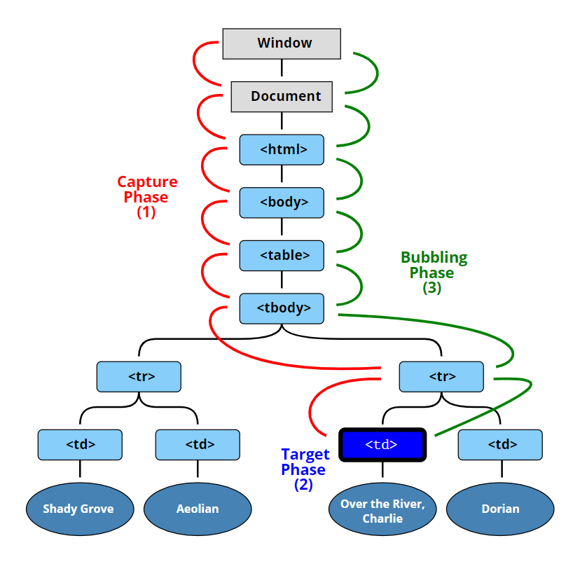
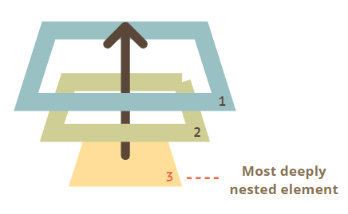

---
tags:
  - javascript
  - dom
  - browser
---

# 事件
**事件** 是某事发生的信号，所有的 DOM 节点都生成这样的信号（但事件不仅限于 DOM），JavaScript 就是通过事件与 HTML（DOM 节点）进行交互的。

最有用的 DOM 事件的列表如下：

**鼠标事件：**

- `click` 当鼠标点击一个元素时（触摸屏设备会在点击时生成）。
- `contextmenu` 当鼠标右键点击一个元素时。
- `mouseover`/`mouseout` 当鼠标指针移入/离开一个元素时。
- `mousedown` / `mouseup` 当在元素上按下/释放鼠标按钮时。
- `mousemove` 当鼠标移动时。

**表单（form）元素事件**：

- `submit` 当访问者提交了一个 `<form>` 时。
- `focus` 当访问者聚焦于一个元素时，如聚焦于一个 `<input>`。

**键盘事件**：

- `keydown`/`keyup` 当访问者按下然后松开按键时。

**Document 事件**：

- `DOMContentLoaded` 当 HTML 的加载和处理均完成，DOM 被完全构建完成时。

**CSS 事件**：

- `transitionend` 当一个 CSS 动画完成时。

## 事件处理程序
为了对事件作出响应，我们可以为元素节点分配一个 **处理程序（handler）**，即一个在事件发生时被调用/运行的函数。

:bulb: 处理程序中的 `this` 的值是对应的元素，就是处理程序所在的那个元素。

```html
<button onclick="alert(this.innerHTML)">Click me</button>
// 点击按钮，弹出提示框内容为 Click me
```

有 3 种分配事件处理程序的方式：

* HTML 特性（attribute） `onclick="..."`。
* DOM 属性（property） `elem.onclick = function`。
* 方法（method） `elem.addEventListener(event, handler, [phase])` 用于添加，`removeEventListener()` 用于移除。

### HTML 特性
处理程序可以设置在 HTML 中名为 `on<event>` 的特性 attribute 中。

```html
// 为一个 input 元素分配一个 click 鼠标点击事件的处理程序
<input value="Click me" onclick="alert('Click!')" type="button">
```

:warning:  HTML 特性的值需要是**字符串**，因此如果在 `onclick` 特性值本身使用的是双引号，那么其内部如果需要使用字符串，就只能使用单引号 `''`

:bulb: HTML 特性不是编写大量代码的好位置，可以创建一个 JavaScript 函数然后在 HTML 特性中调用这个函数（函数作为特性值也是以字符串形式，**函数需要有括号**）。当浏览器解析该 HTML 特性时，会创建一个处理程序，并将 **特性中的内容** 作为处理程序的内容（即事件触发后调用处理程序，并运行里面的函数），并将这个处理程序写入元素节点 DOM 属性（property）。**实际上处理程序总是在 DOM 属性中，HTML 特性只是初始化它的方法之一**。

```html
<script>
  function sayThanks() {
    alert("Thanks!");
  }
</script>

<input type="button" onclick="sayThanks()" value="click" />
```

浏览器解析 HTML 元素的特性时会根据内容创建一个新的处理程序

```html
button.onclick = function() {
  sayThanks(); // 特性中的内容
};
```

:warning: **不要使用方法 `setAttribute`** 为 HTML 元素添加处理程序，因为这种方式会将函数变成字符串

```js
// 点击 <body> 将产生 error，
// 因为特性总是字符串的，函数变成了一个字符串
document.body.setAttribute('onclick', function() { alert(1) });
```

### DOM 属性
可以使用 DOM 属性（property）`on<event>` 来分配处理程序。

```html
<input id="elem" type="button" value="Click me">
<script>
  elem.onclick = function() {
    alert('Thank you');
  };
</script>
```

:warning: 因为 DOM 只有一个 `onclick` 属性，所以我们无法为 DOM 元素针对点击事件分配更多事件处理程序，其他事件也是一样的。而且 DOM 属性 `on<event>` 和 HTML 特性 `on<event>` 实际上是一样的，因此用这两种方式为同一个元素针对同一类型事件分配事件处理程序时，其中之一（HTML 特性）会被覆盖。

```html
<input type="button" id="elem" onclick="alert('Before')" value="Click me">
<script>
  elem.onclick = function() { // 覆盖了现有的处理程序
    alert('After'); // 只会显示此内容
  };
</script>
```

:warning: 使用 DOM 属性 `on<event>` 为元素分配事件处理程序时，如果处理程序的函数事先定义，**则函数应该以函数体（而非调用函数的方式，不应该带括号）进行传递**。因为如果我们添加了括号，如 `sayThanks()` 这是一个函数调用，下述实例的后一行代码，实际上获得的是函数执行的 **结果**，即 `undefined`（假设这个函数没有返回值），此代码不会工作。

```js
// 正确
button.onclick = sayThanks;

// 错误
button.onclick = sayThanks();
```


### addEventListener
使用方法 `elem.addEventListener()` 针对事件 `event` 为元素 `elem` 分配处理程序 `handler`，通过这种方式**可以分配多个处理程序**。

```js
element.addEventListener(event, handler, [options]);
```

参数说明

* `event` 事件名，如 `"click"`。
* `handler` 处理程序
* `options`可选对象，具有以下属性用于对事件处理程序进行更多设置
    - `once` 如果为 `true`，那么会在被触发后自动删除监听器
    - `capture` 设置处理程序在事件第几阶段被调用，如果为 `false`（默认值）则在**冒泡阶段**设置处理程序；如果为 `true`，则在**捕获阶段**设置处理程序
    - `passive` 如果为 `true`，那么处理程序将不会调用 `preventDefault()`，即浏览器会执行默认行为

```html
<input id="elem" type="button" value="Click me"/>

<script>
  function handler1() {
    alert('Thanks!');
  };

  function handler2() {
    alert('Thanks again!');
  }

  // 针对 click 事件为元素 elem 添加三个事件处理程序
  elem.onclick = () => alert("Hello");
  elem.addEventListener("click", handler1); // Thanks!
  elem.addEventListener("click", handler2); // Thanks again!
</script>
```

:warning: 方法 `addEventListener` 是设置事件处理程序的另一种备选方法，但是对于默写事件，如  `transtionend`、`DOMContentLoaded` 等，必须使用方法 `addEventListener` 设置事件处理程序，因此 **`addEventListener` 更通用**

除了分配函数作为事件处理程序， 还可以接收一个**对象作为处理程序**，该对象有方法 `handleEvent`，当事件发生时就会调用该对象的 `handleEvent` 方法。

```html
<button id="elem">Click me</button>

<script>
  elem.addEventListener('click', {
    handleEvent(event) {
      alert(event.type + " at " + event.currentTarget);
    }
  });
</script>
```

### removeEventListener

要**移除处理程序**，可以使用方法 `removeEventListener()` 需要传入与分配的函数完全相同的函数

```js
element.removeEventListener(event, handler, [options]);
```

:warning: 由于在移除事件处理程序需要传入与分配的函数**完全相同的函数**，因此通过匿名函数设置的事件处理程序无法移除

```js
elem.addEventListener( "click" , () => alert('Thanks!'));
elem.removeEventListener( "click", () => alert('Thanks!'));   // 处理程序代码相同，但没有名称，因此获取了另一个函数

/*---------- 分割线 ----------*/

// 正确方法
// 将匿名函数存储在一个变量中
function handler() {
  alert( 'Thanks!' );
}

input.addEventListener("click", handler);
input.removeEventListener("click", handler);   // 通过变量名（函数名）获取事件处理程序
```

## 事件对象
当事件发生时，浏览器会创建一个 **`event` 对象**，将详细信息放入其中，并将其作为参数传递给处理程序。

不同的事件产生的事件对象拥有不同属性，如鼠标点击事件 `click` 创建的 `event` 对象常用属性

* `event.type` 事件类型，这里是 `"click"`。
* `event.currentTarget` 处理事件的元素（即设置了事件监听器的元素），它与 `this` 相同（除非处理程序是一个箭头函数，或者它的 `this` 被绑定到了其他东西上），可以从 `event.currentTarget` 获取元素
* `event.clientX / event.clientY` 鼠标事件的指针的窗口相对坐标
* `event.pageX` 和 `event.pageY` 鼠标事件的指针的页面相对坐标
* `event.screenX` 和 `event.screenY` 鼠标事件的指针的屏幕相对坐标


:bulb: 如果在 HTML 中分配了一个处理程序，也可以使用 `event` 对象，因为`event` 会作为默认参数传递给处理程序。当浏览器读取特性（attribute）时，它会创建处理程序 `function(event) { alert(event.type) }` 其中第一个参数是 `"event"`

```html
<input type="button" onclick="alert(event.type)" value="Event type">
```

## 事件阶段
[DOM 事件](http://www.w3.org/TR/DOM-Level-3-Events/)标准描述了事件传播的 3 个阶段：

1. 捕获阶段（Capturing phase）—— 事件（从 Window）向下走近元素。
2. 目标阶段（Target phase）—— 事件到达目标元素。
3. 冒泡阶段（Bubbling phase）—— 事件从元素上开始冒泡。

:bulb: 冒泡和捕获为「事件委托」奠定了基础，基于该行为可以实现非常强大的事件处理模式。

当一个事件发生时，发生该事件的嵌套最深的元素被标记为「目标元素」`event.target`

- 首先就会发生**捕获阶段**，事件从文档根节点向下移动到 `event.target`，并在途中调用分配了 `addEventListener(..., true)` 的处理程序（`true` 是 `{capture: true}` 的一个简写形式）。
- 然后事件会在目标元素自身上的触发
- 接着就会发生**冒泡阶段**，事件从 `event.target` 向上移动到根，调用使用 `on<event>` 和没有第三个参数的，或者第三个参数为 `false/{capture:false}` 的 `addEventListener` 分配的处理程序。

:bulb: 所有事件对象 `event` 具有的通用属性，每个处理程序都可以访问

- `event.target` 引发事件的层级最深的元素
- `event.currentTarget`（=`this`） 处理事件的当前元素，即设置了并当前正执行的处理程序的元素
- `event.eventPhase` 当前阶段，以数值表示（capturing=1，target=2，bubbling=3）



上图实例演示了点击事件的 3 个阶段。点击 `<td>` 事件首先通过祖先链向下到达元素（捕获阶段），然后到达目标（目标阶段），最后上升（冒泡阶段），在途中调用处理程序。

### 冒泡
事件冒泡 bubbling 是指当一个事件发生在一个元素上，它会首先运行在该元素上的处理程序（如果该元素针对该事件设置了处理程序），然后运行其父元素上的处理程序（假如设置了处理程序），然后一直向上到其他祖先上的处理程序。

这个过程被称为冒泡（bubbling），因为事件就像在水里的气泡一样从内部元素「冒泡」到所有父级，一路触发相应的事件处理程序。

```html
<style>
  body * {
    margin: 10px;
    border: 1px solid blue;
  }
</style>

<form onclick="alert('form')">FORM
  <div onclick="alert('div')">DIV
    <p onclick="alert('p')">P</p>
  </div>
</form>
```

上述实例代码演示了冒泡的过程，点击内部的 `<p>` 会运行 `onclick` 事件处理程序

1. 在该 `<p>` 上的。
2. 然后是外部 `<div>` 上的。
3. 然后是外部 `<form>` 上的。
4. 以此类推，直到最后的 `document` 对象。



:warning: **几乎** 所有事件都会冒泡，除了个别事件，如 `focus` 事件不会冒泡。

:bulb: 事件从目标元素开始向上冒泡，通常它会一直上升到 `<html>`，然后再到 `document` 对象，有些事件甚至会到达 `window`，它们会调用路径上所有的处理程序。

但是可以在冒泡「路径」上的元素设置相应的事件处理方法为 `event.stopPropagation()` ，表示事件已经被完全处理并停止冒泡，该事件就会在「冒泡」到该元素时停止再向上冒泡，因此该元素外的祖先元素设置的相应事件的处理程序都无法被触发，但该元素上设置的其他相应事件处理程序依然可以运行。

```html
<body>
  <div id="first" onclick="alert('first')">first
    <div id="second">second
      <div id="third" onclick="alert('third')">third</div>
    </div>
  </div>
  <script>
    // 在元素 div 上针对点击事件 click 设置 event.stopPropagation() 阻止事件冒泡
    document.getElementById('second').addEventListener("click", function() {
      event.stopPropagation();
    });

    // 该元素还设置了点击事件 click 的另一个处理程序，它会运行
    document.getElementById('second').addEventListener("click", function() {
      alert("second");
    });
  </script>
</body>
```

:bulb: 如果希望**当前的元素上的相应事件的处理程序都被阻止**可以使用方法 `event.stopImmediatePropagation()` 。

:warning: **不要在没有需要的情况下停止冒泡！** 因为停止冒泡会产生隐形的陷阱，如我们创建了一个嵌套菜单，每个子菜单各自处理对自己的元素的点击事件，并调用 `stopPropagation` 以便不会触发外部菜单。之后我们决定捕获在整个窗口上的点击，以追踪用户的行为（有些分析系统会获取用户点击的位置），因此使用 `document.addEventListener('click'…)` 来捕获所有的点击。但是存在有一个「死区」，由于之前设置的停止冒泡 `stopPropagation` 会阻止点击菜单区域的事件不能在窗口上「侦测」到。

### event.target
引发事件的那个**嵌套层级最深的元素**被称为目标元素，即事件发生的「第一个」元素，可以通过 `event.target` 访问。

:bulb: `event.target` 与 `event.currentTarget` 之间的区别
- `event.target` 是引发事件的「目标」元素，它在冒泡过程中不会发生变化
-  `event.currentTarget`（一般都是与 `this` 等价，即表示「当前」正在运行的处理程序所在/所绑定的元素

上述实例中，如果我们点击了元素 `<p>` 那么该元素就是 `event.target` 同时该元素也是 `event.currentTarget`，点击事件会触发 `<p>` 元素上设置的事件处理程序，然后事件会冒泡到元素 `<div>`，该元素的事件处理程序会被触发，此时 `event.currentTarget` 就变成元素 `<div>`，但 `event.target` 不变，依然是元素 `<p>`。

### 捕获
捕获阶段 Capturing phase 是指事件（从 Window）通过祖先链向下走近目标元素。

为了在捕获阶段捕获事件，我们需要将处理程序  `addEventListener(event, handler)` 的 `capture` 可选参数设置为 `true`(`false` 是默认值，表示在冒泡阶段设置处理程序）

```js
elem.addEventListener(..., {capture: true})
// 或者，用 {capture: true} 的别名 "true"
elem.addEventListener(..., true)
```

:bulb: 捕获阶段很少被使用，DOM 属性 `on<even>` 、HTML 特性（attribute）或使方法 `addEventListener(event, handler)` 添加的处理程序，默认都是在事件冒泡阶段（在第二阶段和第三阶段）被触发执行的，对捕获一无所知。

```html
<style>
  body * {
    margin: 10px;
    border: 1px solid blue;
  }
</style>

<form>FORM
  <div>DIV
    <p>P</p>
  </div>
</form>

<script>
  for(let elem of document.querySelectorAll('*')) {
    elem.addEventListener("click", e => alert(`Capturing: ${elem.tagName}`), true);
    elem.addEventListener("click", e => alert(`Bubbling: ${elem.tagName}`));
  }
</script>
```

上述实例代码为文档中的 **每个** 元素两个阶段（捕获阶段和冒泡阶段）都设置了点击处理程序，以演示了事件在捕获阶段和冒泡阶段触发处理程序的过程。当点击了 `<p>` 那么处理程序依次被触发并输出相应的信息：

1. `HTML` → `BODY` → `FORM` → `DIV`（捕获阶段第一个监听器）：
2. `P`（目标阶段，触发两次，因为我们设置了两个监听器：捕获和冒泡）
3. `DIV` → `FORM` → `BODY` → `HTML`（冒泡阶段，第二个监听器）。

:bulb: 如果我们在**同一阶段**设置了多个事件处理程序，并通过 `addEventListener` 分配给了相同的元素，则它们的运行顺序与创建顺序相同

```js
elem.addEventListener("click", e => alert(1)); // 会先被触发
elem.addEventListener("click", e => alert(2));
```

## 事件委托
捕获和冒泡允许我们在「外层」祖先元素上对事件作出反应，这种事件处理模式称为 **事件委托**，它通常用于为许多相似的元素添加相同的处理。

基本过程：

1. 在容器 container/共同祖先元素上放一个事件处理程序（就不必为每个元素分配一个处理程序）
2. 在处理程序中通过事件对象属性`event.target` 获取触发事件的「真实」元素
3. 执行相应的处理

该模式有显著的优点：

- 简化初始化并节省内存：无需添加许多处理程序。
- 更少的代码：添加或移除元素时，无需添加/移除处理程序。
- DOM 修改 ：我们可以使用 `innerHTML` 等，来批量添加/移除元素。

但是事件委托也有其局限性：

- 事件必须冒泡，低级别的处理程序不应该使用 `event.stopPropagation()` 阻止事件冒泡
- 委托可能会增加 CPU 负载，因为容器级别的处理程序会对容器中任意位置的事件做出反应，而不管我们是否对该事件感兴趣（但是通常负载可以忽略不计）。

使用事件委托将处理程序设置在文档级 `document`，适用于（监控）整个页面的元素，这样就可以在 HTML 元素设置自定义特性或类属性来添加相应的功能。这种以**声明**的方式将 JavaScript 操作添加/绑定到 HTML 元素方式称为 行为模式 behavior pattern。

```html
<!-- 点击一个具有 data-toggle-id 特性的元素将显示/隐藏具有给定 id 的元素 -->
<button data-toggle-id="subscribe-mail">
  Show the subscription form
</button>

<!-- 只需要向元素添加特性 data-toggle-id 即可使元素具有显示/隐藏的功能 -->
<form id="subscribe-mail" hidden>
  Your mail: <input type="email">
</form>

<script>
  // 在文档级设置事件监听器
  document.addEventListener('click', function(event) {
    let id = event.target.dataset.toggleId;
    if (!id) return;
    let elem = document.getElementById(id);
    // 切换元素显示/隐藏状态
    elem.hidden = !elem.hidden;
  });
</script>
```

行为模式十分方便，无需为每个这样的元素编写 JavaScript，只需要创建一个方法并将相应的特性/类属性放入 HMTL 标签中即可，而且可以设置多个特性实现多种行为。

:warning: 在文档级设置处理程序始终使用方法 `addEventListener` 而不是 `document.on<event>`，因为后者会引起冲突，新的处理程序会覆盖旧的处理程序，而在实际项目中， 一般会在不同部分为 `document` 设置了许多处理程序。