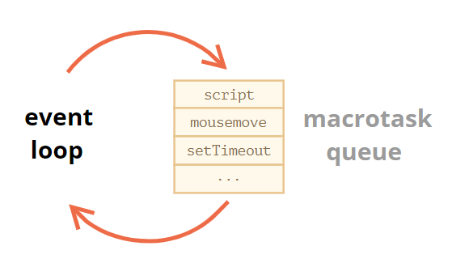

---
tags:
  - javascript
  - dom
  - browser
---

# 事件循环
**事件循环**是指 JavaScript 引擎在等待任务 -> 执行任务 -> 进入休眠状态等待更多任务，这几个状态之间转换的无限循环。

一个任务到来时，引擎可能正处于繁忙状态，那么这个任务就会被排入队列，多个任务组成了一个队列，即所谓的「宏任务队列」（v8 术语）：

微任务仅来自于代码，它们通常是由 promise 创建的，处理程序 `.then/catch/finally` 或者使用 `await`  会生成成为微任务，还有一个特殊的函数 `queueMicrotask(func)`，它对 `func` 进行排队，以在微任务队列中执行。**每个宏任务之后，引擎会立即执行微任务队列中的所有任务，然后再执行其他的宏任务，或渲染，或进行其他任何操作**。

事件循环的更详细的算法（尽管与 [规范](https://html.spec.whatwg.org/multipage/webappapis.html#event-loop-processing-model) 相比仍然是简化过的）：

1. 从 **宏任务** 队列（例如 “script”）中出队（dequeue）并执行最早的任务。
2. 执行所有 **微任务**：
    - 当微任务队列非空时：
        - 出队（dequeue）并执行最早的微任务。
3. 执行渲染，如果有。
4. 如果宏任务队列为空，则休眠直到出现宏任务。
5. 转到步骤 1。

:warning: 引擎执行任务时永远不会进行渲染 render，如果任务执行需要很长一段时间也没关系。仅在任务完成后才会绘制对 DOM 的更改。如果一项任务执行花费的时间过长，浏览器将无法执行其他任务，无法处理用户事件，因此，在一定时间后浏览器会在整个页面抛出一个如「页面未响应」之类的警报，建议你终止这个任务。这种情况常发生在有大量复杂的计算或导致死循环的程序错误时。

* 使用零延迟的 `setTimeout(f)` 安排（schedule）一个新的 **宏任务**：它可被用于将繁重的计算任务拆分成多个部分，以使浏览器能够对用户事件作出反应，并在任务的各部分之间显示任务进度。此外，也被用于在事件处理程序中，将一个行为（action）安排（schedule）在事件被完全处理（冒泡完成）后。

* 使用 `queueMicrotask(f)` 或 promise 处理程序的微任务队列安排一个新的 **[微任务](../语法基础/promise.md#微任务)**：在微任务之间没有 UI 或网络事件的处理：它们一个立即接一个地执行。所以，我们可以使用 `queueMicrotask` 来在保持环境状态一致的情况下，异步地执行一个函数。

:bulb: 对于不应该阻塞事件循环的耗时长的繁重计算任务，我们可以使用 [Web Workers](https://html.spec.whatwg.org/multipage/workers.html)，它会在另一个并行线程中运行代码的方式。Web Workers 可以与主线程交换消息，但是它们具有自己的变量和事件循环；它没有访问 DOM 的权限，因此它们对于同时使用多个 CPU 内核的计算非常有用。