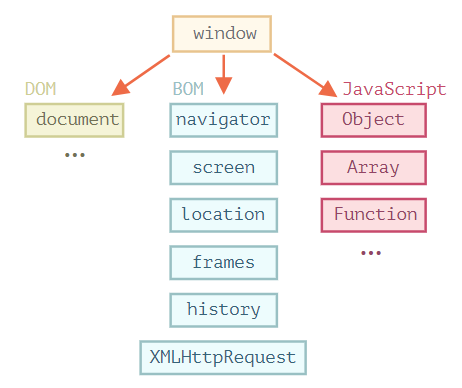

# 浏览器环境
参考：
* [Standards — WHATWG](https://spec.whatwg.org/)
* [Web API 接口参考](https://developer.mozilla.org/zh-CN/docs/Web/API)

JavaScript 语言最初是为动态操作 Web 浏览器创建的，后来它已经发展成为一种适用于多平台具有多种的语言。现在适用的平台包括浏览器、Web 服务器等，称为**主机环境 *host environment***。

每个主机环境提供特定于平台功能的对象和语言核心以外的函数，如 Web 浏览器提供了一种控制网页的方法，Node.JS 提供了服务器端功能等 。

其中一个 Web 浏览器环境中特有的重要对象是称为 **`window` 的「根」对象**，它有两个特定于浏览器的作用：

1. 它是 JavaScript 语言的[全局对象](../语法基础/对象.md#全局对象)
2. 它代表「浏览器窗口」，而且浏览器环境提供了很多方法控制该对象



```js
function sayHi() {
  alert("Hello");
}
// 全局函数是全局对象的方法：
window.sayHi();

// 将它用作浏览器窗口，通过特定的方法以查看窗口高度
alert(window.innerHeight);   // 内部窗口高度
```

## 文档对象模型 DOM
文档对象模型 Document Object Model 简称 DOM，**将所有页面内容表示为可以修改的对象**，`document` 对象是页面的主要「入口点」，根据文档对象模型 DOM，每个 HTML 标签都是一个对象，标签内的文本也是一个对象。通过这个「入口点」利用 JavaScript 可以操作该模型的所有对象，以更改或创建页面上的任何内容。

```js
// 将背景颜色修改为红色
document.body.style.background = "red";

// 在 1 秒后将其修改回来
setTimeout(() => document.body.style.background = "", 1000);
```

:bulb: 在 [DOM Living Standard](https://dom.spec.whatwg.org) 规范中对于模型中对象的属性和方法有详细描述

:bulb: DOM 不仅仅用于浏览器，也适用于一些非浏览器的设备，如下载 HTML 文件并对其进行处理的服务器端脚本也可以使用 DOM，但可能仅支持部分规范内容。

:bulb: CSS 规则和样式表的结构与 HTML 不同，它使用 [CSS Object Model (CSSOM)](https://www.w3.org/TR/cssom-1/) 规范解释如何将 CSS 表示为对象以及如何读写它们。当我们修改文档的样式规则时，CSSOM 与 DOM 是一起使用的，我们很少需要从 JavaScript 中添加/删除 CSS 规则，通常 CSS 规则是静态的，但需要知道这是可行的。

## 浏览器对象模型 BOM
浏览器对象模型 rowser Object Model 简称 BOM，表示由浏览器（主机环境）提供的**用于处理文档（document）之外的所有内容的其他对象**，而且还提供操作这些对象的方法。如 [location](https://developer.mozilla.org/zh/docs/Web/API/Window/navigator) 对象允许我们读取当前 URL；[navigator](https://developer.mozilla.org/zh/docs/Web/API/Window/navigator) 对象提供了有关浏览器和操作系统的背景信息（最为常用的属性是 `navigator.userAgent` 关于当前浏览器，以及 `navigator.platform` 关于平台，可以帮助区分 Windows/Linux/Mac 等）；函数 `alert/confirm/prompt` 是用于与用户通信的纯浏览器方法。

```js
alert(location.href); // 显示当前 URL
if (confirm("Go to Wikipedia?")) {
  location.href = "https://wikipedia.org"; // 将浏览器重定向到另一个 URL
}
```

:bulb: BOM 是通用 [HTML 规范](https://html.spec.whatwg.org/) 的一部分，其中还包括 HTML 语言（标签、特性）、一堆对象、方法和浏览器特定的 DOM 扩展，即「广义的 HTML」的规定。

