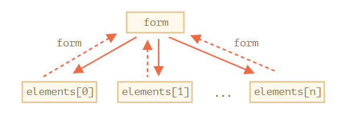

# 表单
表单 form 是商务网站最常见的元素，如 `<input>` 的控件，它有许多特殊的属性和事件。

**特殊的文档对象 `document.forms`** 是命名的集合 collection，它包含页面中的所有表单 `form`（对象），该集合中的每个元素都是是命名的（通过 `<form>` 元素的 `name` 特性） ，也是有序的（可迭代的），因此可以通过**名字**作为属性或表单在页面的**顺序**作为索引获取特定的表单 `form` 对象。

```html
<body>
<form name="first">
    ...
</form>

<form name="second">
...
</form>

<script>
  // 获取文档表单，其名字为 second
  let formByName = document.forms.second;   // <form name="second"> 元素

  // 使用索引获取同样的表单对象
  // 获取文档表单集合 collection 中第二个表单
  let formByIndex = document.forms[1];   // <form name="second"> 元素
  alert(formByName == formByIndex);   // true
</script>
</body>
```

## 表单属性和方法
表单对象具有属性 `elements` 返回其包含节点（控件对象）的集合 collection，类似地，也是可以通过**名字**和**索引**获取特定控件（对象）。

```html
<form name="my">
  <input name="one" value="1">
  <input name="two" value="2">
</form>

<script>
  // 获取表单
  let form = document.forms.my; // <form name="my"> 元素

  // 通过表单的属性 elements 基于控件的名字获取表单中的元素
  let elem = form.elements.one; // <input name="one"> 元素

  alert(elem.value); // 1
</script>
```

:bulb: 除了通过属性 `elements` 获取表单包含控件的集合，再进一步通过索引/名字属性访问具体控件；还可以将控件的名称或索引作为属性，即 `for[index/name]` 方式，直接获取控件对象。:warning: 但通过两种方式访问控件可能会引起问题，如果我们访问一个元素，然后修改它的 `name` 之后它仍然可以被通过旧的 `name` 访问到（当然也能通过新的 `name` 访问），但通常很少修改表单元素的名字。

```html
<form id="form">
  <input name="login">
</form>

<script>
  alert(form.elements.login == form.login); // true，与 <input> 相同

  form.login.name = "username"; // 修改 input 的 name

  // form.elements 更新了 name：
  alert(form.elements.login); // undefined
  alert(form.elements.username); // input

  // form 允许我们使用两个名字：新的名字和旧的名字
  alert(form.username == form.login); // true
</script>
```

:bulb: 可能会有多个名字相同的元素，如单选按钮中有多个特性 `name` 相同的 `<input>` 元素，在这种情况下 `form.elements[name]` 将会返回一个集合，通过索引可以获取其中具体对象。

```html
<form>
  <input type="radio" name="age" value="10">
  <input type="radio" name="age" value="20">
</form>

<script>
let form = document.forms[0];

let ageElems = form.elements.age;

alert(ageElems[0]); // [object HTMLInputElement]
</script>
```

如果表单中有 `<fieldset>` 元素，则它也具有 `elements` 属性，返回其包含节点（控件对象）的集合 collection，类似地，也是可以通过**名字**和**索引**获取特定控件（对象）。

```html
<body>
  <form id="form">
    <fieldset name="userFields">
      <legend>info</legend>
      <input name="login" type="text">
    </fieldset>
  </form>

  <script>
    alert(form.elements.login); // <input name="login">

    let fieldset = form.elements.userFields;
    alert(fieldset); // HTMLFieldSetElement

    // 我们可以通过名字从表单和 fieldset 中获取 input
    alert(fieldset.elements.login == form.elements.login); // true
  </script>
</body>
```

:bulb: 对于任何元素，都可以通过 `element.form` 访问到其对应的表单。即表单引用了所有元素，元素也**反向引用**了表单。



```html
<form id="form">
  <input type="text" name="login">
</form>

<script>
  // form -> element
  let login = form.login;

  // element -> form
  alert(login.form); // HTMLFormElement
</script>
```

## 表单控件
常见的表单控件也有很多属性，一般于 HTML 特性相对应。

### input 和 textarea
可以通过 `input.value`（字符串） 或 `input.checked` （布尔值）来访问/设置输入框或复选框的值

```js
input.value = "New value";
textarea.value = "New text";

input.checked = true; // 对于复选框（checkbox）或单选按钮（radio button）
```

:warning: 虽然多行表单 `<textarea>...</textarea>` 将输入的内容作为嵌套的文本节点，但绝不应该使用 `textarea.innerHTML` 访问其值，因为该文本节点仅存储了页间加载时最初的 `value` 值，而不是当前的值，应该使用 `textarea.value` 获取当前用户输入的内容。

### select 和 option
下拉菜单 `<select>` 元素节点有 3 个重要的属性

* `select.options` 返回子元素（对象）的集合，
* `select.value` 获取当前所选择的 `<option>` 的 `value` 值
* `select.selectedIndex` 获取当前所选择的 `<option>` 的编号（这些子元素是有顺序/可迭代的）

选项 `<option>` 元素节点具有是3 个重要的属性

* `option.selected` 布尔值，表示 `<option>` 是否被选择
* `option.index` 索引，`<option>` 在其所属的 `<select>` 中的编号。
* `option.text` 选项在页面显示的文本内容

下拉菜单最常见的操作是设置**选中**选项 `<option selected>`，相应地有 3 中方式

* 将 `option.selected` 设置为 `true`。
* 将 `select.value` 设置为对应的 `value`。
* 将 `select.selectedIndex` 设置为对应 `<option>` 的编号。

```html
<select id="select">
  <option value="apple">Apple</option>
  <option value="pear">Pear</option>
  <option value="banana">Banana</option>
</select>

<script>
  // 以下三行代码是三种选中第二个选项的方法
  select.options[2].selected = true;
  select.selectedIndex = 2;
  select.value = 'banana';
</script>
```

:bulb: 当下拉菜单 `<select>` 具有 `multiple` 特性就表示允许多选，即允许在多个子元素 `<option>` 中设置 `selected` 特性。

```html
<select id="select" multiple>
  <option value="blues" selected>Blues</option>
  <option value="rock" selected>Rock</option>
  <option value="classic">Classic</option>
</select>

<script>
  // 从 multi-select 中获取所有选定的 `value`
  let selected = Array.from(select.options)
    .filter(option => option.selected)
    .map(option => option.value);

  alert(selected);   // blues,rock
</script>
```

在 [规范](https://html.spec.whatwg.org/multipage/forms.html#the-option-element) 给出了 `new Option()` 构造器快速创建新的 `<option>` 元素，再将其添加 `append` 到下拉菜单元素对象中。

```js
option = new Option(text, value, defaultSelected, selected);
```

参数说明

- `text` 设置 `<option>` 中的文本，
- `value` 设置 `<option>` 的 `value` 值
- `defaultSelected` 如果为 `true` 为该选项添加 HTML 特性 `selected`
- `selected` 如果为 `true` 表示这个 `<option>` 被选中（一般与前一个参数值相同）

## 表单事件

### 聚焦
当用户点击（或使用键盘上的 Tab 键）输入型的表单控件时，该元素将会获得聚焦 focus，通常意味着该控件准备接受数据，该行为会**触发事件 `focus`**，我们可以监听该事件并执行相应的操作，如弹出提示信息指导用户输入数据。

相应地，失去焦点 blur 发生在用户点击（或者按下 Tab 键跳转）页面的其它地方，通常意味着数据已经输入完成，该行为会**触发事件 `blur`**，我们可以监听该事件并执行相应的操作，如运行代码来检查输入的内容格式是否正确，甚至可以将数据自动传输保存到服务器上。

```html
<style>
  .invalid { border-color: red; }
  #error { color: red }
</style>

<body>
    <form>
        <label for="input">Your email please: </label>
        <input type="email" id="input">
        <div id="error"></div>
    </form>
</body>


<script>
// 监听 blur 事件，处理程序会检查是否有输入或输入值是否符合格式（需要有字符 @），否则显示一个 error
input.onblur = function() {
  if (!input.value.includes('@')) { // not email
    input.classList.add('invalid');
    error.innerHTML = 'Please enter a correct email.'
  }
};

// 监听 focus 事件，处理程序会隐藏 error 信息
input.onfocus = function() {
  if (this.classList.contains('invalid')) {
    // 移除 "error" 指示，因为用户想要重新输入一些内容
    this.classList.remove('invalid');
    error.innerHTML = "";
  }
};
</script>
```

:bulb: 现代 HTML 允许我们使用 `input` 特性进行多种验证，如 `required`，`pattern` 等，但当我们需要更大的灵活性时，可以使用 JavaScript 结合事件 `focus` 和 `blur` 设置验证程序。

:bulb: 节点方法 `elem.focus()` 和 `elem.blur()` 可以设置/移除元素上的焦点，即以「手动」触发相应的事件。

:warning: 很多种原因可以导致焦点丢失，如用户点击了其它位置；一个 `alert` 会将焦点移至自身，因此会导致元素失去焦点（触发 `blur` 事件），而当 `alert` 对话框被取消时，焦点又回重新回到原元素上（触发 `focus` 事件）；如果一个元素被从 DOM 中移除，那么也会导致焦点丢失。如果稍后它被重新插入到 DOM，焦点也不会回到它身上。这些特性有时候会导致 `focus/blur` 处理程序发生异常，因此在处理聚焦事件相关的程序时应该格外小心。

#### tabindex
用户可交互的元素，如 `<button>`，`<input>`，`<select>`，`<a>` 等，支持聚焦；但默认情况下很多元素不支持聚焦，如列表项 `<li>`，为了实现样式格式化而存在的元素（如 `<div>`，`<span>` 和 `<table>` 等）。可以为 HTML 元素添加**特性 `tabindex` 让元素变成可聚焦**（使用 Tab 切换实现聚焦，或者使用 `elem.focus()` 手动实现聚焦），该特性的值是数值，表示切换聚焦的顺序。

（按照 `tabindex` 值）聚焦切换顺序从具有 `tabindex=1` 的元素开始，并依据特性值递增进行元素切换，然后是不具有 `tabindex` 的可聚焦的元素（如常规的 `<input>`），它们之间按照默认顺序（元素在文档流的顺序）进行切换。

两个特殊的值：
- `tabindex="0"` 会使该元素与那些不具有 `tabindex` 的元素放在一起，即当我们切换元素时，具有 `tabindex="0"` 的元素将排在那些具有 `tabindex ≥ 1` 的元素的后面。通常它的作用只是使元素可聚焦，但保留默认的切换顺序。
- `tabindex="-1"` 具有负值的元素**只允许以编程「手动」的方式实现聚焦**，即 Tab 键切换聚焦时会忽略这样的元素，但 `elem.focus()` 有效。

```html
<p>点击第一项，然后按 Tab 键。</p>
<p>顺序就像这样：1 -> 2 -> 0</p>
<ul>
  <li tabindex="1">One</li>
  <li tabindex="0">Zero</li>
  <li tabindex="2">Two</li>
  <li tabindex="-1">Minus one</li>
</ul>

<style>
  li { cursor: pointer; }
  :focus { outline: 1px dashed green; }
</style>
```
:bulb: 为元素对象设置属性 `elem.tabIndex` 和添加相应的特性效果一样。

#### 事件委托
**事件 `focus` 和 `blur` 不会向上冒泡**，因此无法设置事件代理捕获子元素的聚焦事件。

可以使用两种方法实现 `focus/blur` 事件代理

* 方案一：虽然 `focus/blur` 不会向上冒泡，但这两种事件会**在捕获阶段向下传播**，可以在父元素 `<form>` 添加监听器 `elem.addEventListener()` 将可选参数 `capture`设定为为 `true`，以监听捕获阶段的事件。

    ```html
    <style>
        .focused { outline: 1px solid red; }
    </style>
    <body>
        <form id="form">
          <input type="text" name="name" value="Name">
          <input type="text" name="surname" value="Surname">
        </form>

        <script>
          // 将处理程序置于捕获阶段（最后一个参数为 true）
          form.addEventListener("focus", () => form.classList.add('focused'), true);
          form.addEventListener("blur", () => form.classList.remove('focused'), true);
        </script>
    </body>
    ```

* 方案二：使用 `focusin` 和 `focusout` 事件，它们与事件 `focus/blur` 完全一样，只是它们会冒泡，:warning: 而且只能使用方法 `addEventListener()` 设置监听器，不能使用 `on<event>`。

    ```html
    <style>
        .focused { outline: 1px solid red; }
    </style>
    <body>
        <form id="form">
          <input type="text" name="name" value="Name">
          <input type="text" name="surname" value="Surname">
        </form>

        <script>
          form.addEventListener("focusin", () => form.classList.add('focused'));
          form.addEventListener("focusout", () => form.classList.remove('focused'));
        </script>
    </body>
    ```

### 更改
当表单控件**发生更改且完成时**会触发 `change` 事件。

* 对于文本输入框，发生内容发生更改并且元素失去焦点时，就会触发 `change` 事件。
* 对于其它元素：`select`，`input type=checkbox/radio`，会在选项更改后立即触发 `change` 事件。

```html
<input type="text" onchange="alert(this.value)">

<select onchange="alert(this.value)">
  <option value="">Select something</option>
  <option value="1">Option 1</option>
  <option value="2">Option 2</option>
  <option value="3">Option 3</option>
</select>
```

### 输入
每当用户在输入型表单中输入值，（只要值改变了）就会触发 `input` 事件，类似键盘事件，但不同仅仅是通过键盘触发（但那些不涉及值更改的键盘输入，如按下方向键，并不会触发该事件），还可以使用鼠标粘贴或使用语音识别来输入文本触发该事件。

```html
<input type="text" id="input"> oninput: <span id="result"></span>
<script>
  input.oninput = function() {
    result.innerHTML = input.value;
  };
</script>
```

:warning: 无法使用 `event.preventDefault()` 阻止由事件 `input` 引发的默认行为，因为当输入值更改后就会立即触发 `input` 事件，再阻止默认行为已经太迟了，不会起任何作用了。

### 剪切/复制/粘贴
在输入型表单中剪切/拷贝/粘贴内容的时候，会触发相应的事件 `cut/copy/paste`，它们属于 [ClipboardEvent](https://www.w3.org/TR/clipboard-apis/#clipboard-event-interfaces) 类，在[规范](https://www.w3.org/TR/clipboard-apis/#dfn-datatransfer) 中描述了这些事件对象一系列方法，可用于对剪贴板（clipboard）的不同数据进行读/写，如 `event.clipboardData.getData('text/plain')` 读取剪贴板的纯文本内容。

使用 `event.preventDefault()` 来中止事件的默认行为，即什么内容都不会被剪切/复制/粘贴。

```html
<input type="text" id="input">
<script>
  input.oncut = input.oncopy = input.onpaste = function(event) {
    alert(event.type + ' - ' + event.clipboardData.getData('text/plain'));
    return false;
  };
</script>
```

:bulb: 不仅可以复制/粘贴文本，还可以复制/粘贴所有内容，如我们可以在 OS 文件管理器中复制一个文件并粘贴它，该操作也会触发相应的事件。

:warning: 剪贴板是「全局」操作系统级别的，安全起见大多数浏览器仅在特定的用户行为下，如在 `onclick` 事件处理程序中，才允许对剪贴板进行读/写，而且除火狐（Firefox）浏览器外，所有浏览器都禁止使用 `dispatchEvent` 生成「自定义」剪贴板事件。

### 提交
提交表单时会触发 `submit` 事件，通常监听该事件以**在将表单发送到服务器之前对表单进行校验**，基于校验结果可以中止提交（阻止默认行为），并使用 JavaScript 来处理表单，如高亮显示填写错误的表单控件。

提交表单主要有两种方式：

* 点击 `<input type="submit">` 或 [`<input type="image">` 元素](https://developer.mozilla.org/en-US/docs/Web/HTML/Element/Input/image)（该元素用于创建图形化的提交按钮，可通过特性 `src` 设置按钮图片）
* 在 `input` 字段中按下 Enter 键

```html
<form onsubmit="alert('submit!');return false">
  First: Enter in the input field <input type="text" value="text"><br>
  Second: Click "submit": <input type="submit" value="Submit">
</form>
```

:bulb: 实际上在输入框中使用 Enter 发送表单时，浏览器会自动在 `<input type="submit">` 上触发一次 `click` 事件，即表单最后也是通过点击类型为 `type="submit"` 的按钮进行提交的。

```html
<form onsubmit="return false">
 <input type="text" size="30" value="Focus here and press enter">
 <input type="submit" value="Submit" onclick="alert('click')">   <!-- 即使在上一个表单控件按下 Enter 键，也会触发该控件的 alert 语句 -->
</form>
```

:bulb: 除了用户主动点击提交按钮，还可以调用表单对象的方法 `form.submit()` 「手动」启动表单发送，可以使用此方法动态发送表单到服务器。因为开发人员调用该方法时浏览器就假设该表单已经进行了所有相关处理，**因此通过这种方式提交表格不会产生 `submit` 事件**。

```js
let form = document.createElement('form');
form.action = 'https://google.com/search';
form.method = 'GET';

form.innerHTML = '<input name="q" value="test">';

// 该表单必须在文档中才能提交
document.body.append(form);

form.submit();
```