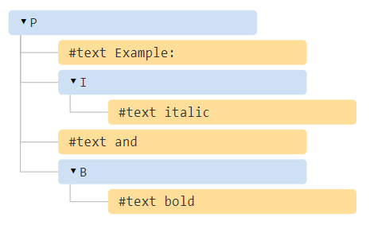
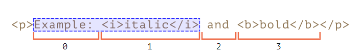
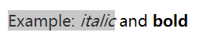
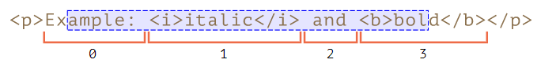
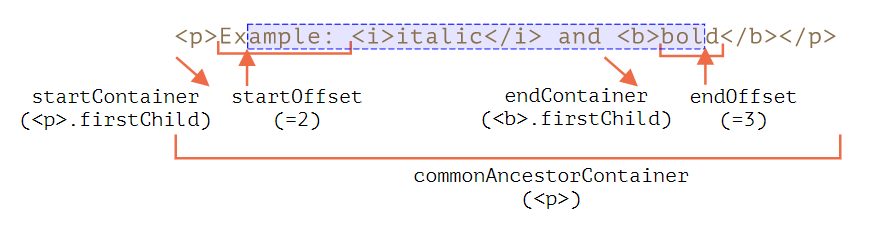
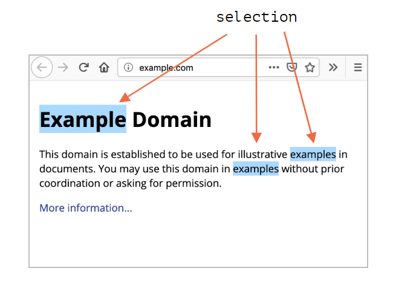
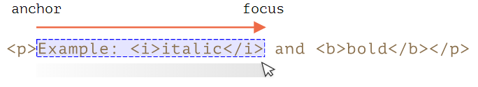
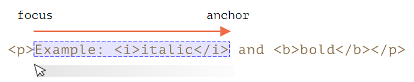

# 选择页面内容范围

## 范围
如果我们在进行页面内容选择时需要理解一个基本概念，即范围  Range。范围本质上是一对「边界点」，范围起点和范围终点。

可以使用构造器 `Range()` 创建的一个范围（构造器没有参数）

```html
let range = new Range();
```

范围对象有多种方法和属性，用以创建范围或对范围内的（被选中）内容进行操作，如使用方法 `range.setStart(node, offset)` 和 `range.setEnd(node, offset)` 来设置选择边界，其中 **`node` 既可以是文本节点，也可以是元素节点，对于文本节点，偏移量 `offset` 表示字符数，而对于元素节点则是子节点数**。

```html
<p id="p">Example: <i>italic</i> and <b>bold</b></p>

<script>
  let range = new Range();

  // 基于元素节点设定范围
  range.setStart(p, 0);
  range.setEnd(p, 2);

  // 范围的 toString 以文本形式返回其内容（不带标签）
  alert(range); // Example: italic

  // 将此范围应用于文档选择（视觉上）
  document.getSelection().addRange(range);
</script>
```







```html
<p id="p">Example: <i>italic</i> and <b>bold</b></p>

<script>
  let range = new Range();

  // 基于文本节点设定范围
  range.setStart(p.firstChild, 2);
  range.setEnd(p.querySelector('b').firstChild, 3);

  alert(range); // ample: italic and bol

  // 使用此范围进行选择（后文有解释）
  window.getSelection().addRange(range);
</script>
```



### 范围对象的属性


- `startContainer`，`startOffset` 起始节点和偏移量
- `endContainer`，`endOffset` 结束节点和偏移量
- `collapsed` 布尔值，如果范围在同一点上开始和结束（所以范围内没有内容）则为 `true`
- `commonAncestorContainer` 在范围内的所有节点中最近的共同祖先节点

### 范围对象的方法
有许多便利的方法可以操纵范围，使用这些方法基本上可以对选定的内容/节点执行任何操作。

**设置范围的起点**

- `setStart(node, offset)` 将起点设置在：`node` 中的位置 `offset`
- `setStartBefore(node)` 将起点设置在：`node` 前面
- `setStartAfter(node)` 将起点设置在：`node` 后面

**设置范围的终点**

- `setEnd(node, offset)` 将终点设置为：`node` 中的位置 `offset`
- `setEndBefore(node)` 将终点设置为：`node` 前面
- `setEndAfter(node)` 将终点设置为：`node` 后面

**操纵范围内的内容**

- `deleteContents()` 从文档中删除范围内容
- `extractContents()` 从文档中删除范围内容，并将删除的内容作为 [DocumentFragment](https://zh.javascript.info/modifying-document#document-fragment) 返回
- `cloneContents()` 复制范围内容，并将删除的内容作为 [DocumentFragment](https://zh.javascript.info/modifying-document#document-fragment) 返回
- `insertNode(node)`  在范围的起始处将 `node` 插入文档
- `surroundContents(node)` 使用 `node` 将所选范围内容包裹起来。要使此操作有效，则该范围必须包含其中所有元素的开始和结束标签：不能像 `<i>abc` 这样的部分范围。

**其他**

- `selectNode(node)` 设置范围以选择整个 `node`
- `selectNodeContents(node)` 设置范围以选择整个 `node` 的内容
- `collapse(toStart)` 如果 `toStart=true` 则设置 end=start，否则设置 start=end，从而折叠范围
- `cloneRange()` 创建一个具有相同起点/终点的新范围

:bulb: `node` 既可以是文本节点，也可以是元素节点：对于文本节点，`offset` 偏移的是字符数，而对于元素节点则是子节点数

## 选择
范围对象 `range` 用于管理选择的范围，但选中的内容在页面视觉上不会显示，需要由选择对象 `Selection` 依据范围进行设置，即范围是「更底层」的对象。

文档选择是由 `Selection` 对象表示的，可通过方法 `window.getSelection()` 或 `document.getSelection()` 来获取/设置。

:bulb: 根据 [Selection API 规范](https://www.w3.org/TR/selection-api/) 描述，一个页面的选择对象可以包括零个或多个范围，不过实际上，一般浏览器最多支持 1 个范围，只有 Firefox 允许使用 Ctrl+click (Mac 上用 Cmd+click) 在文档中选择多个范围。



:bulb: 需要厘清两个重要的概念，选择的起点称为 **锚点 anchor**，而选择的终点称为 **焦点 focus**，一般选择的锚点在焦点之前，但是有些操作方式，如鼠标，允许从两个方向创建相同的选择，即「从左到右」和「从右到左」，就会造成选择的终点可能在起点之前。而这始终指向前方（范围的起点不能在终点之后）的 `Range` 对象不同。

* 如果在文档中，选择的锚点（anchor）在焦点（focus）之前，则称此选择具有 forward 方向。
    
* 如果在文档中，选择的焦点（focus）在锚点（anchor）之前，则称此选择具有 backward 方向。
    

### 选择对象的方法

**添加/移除范围的选择方法**

- `getRangeAt(i)` 将选择范围设置为从 `0` 开始的第 i 个范围。在除 Firefox 之外的所有浏览器中，仅使用 `0`。
- `addRange(range)` 将 `range` 添加到选择范围中。:warning: 如果选择已有关联的范围，则除 Firefox 外的所有浏览器都将忽略该调用，因此如果选择已存在应该先使用 `removeAllRanges()` 将其清空，然后添加范围。否则，除 Firefox 外的所有浏览器都将忽略新范围。
- `removeRange(range)` 从选择范围中删除 `range`。
- `removeAllRanges()` 删除所有选择范围。
- `empty()` 方法 `removeAllRanges` 的别名。

**更方便的方法**（可以直接操作选择范围，而无需使用 `Range` 关键字）

- `collapse(node, offset)` 用一个新的范围替换选定的范围，该新范围从给定的 `node` 处开始，到偏移 `offset` 处结束。
- `setPosition(node, offset)` 方法 `collapse` 的别名。
- `collapseToStart()` 折叠（替换为空范围）到选择起点，即取消选中并移动光标至原来范围的起点
- `collapseToEnd()` 折叠到选择终点，即取消选中并移动光标至原来范围的终点
- `extend(node, offset)` 将选择的焦点（focus）移到给定的 `node`，位置偏移 `oofset`，
- `setBaseAndExtent(anchorNode, anchorOffset, focusNode, focusOffset)` 用给定的起点 `anchorNode/anchorOffset` 和终点 `focusNode/focusOffset` 来替换选择范围。选中它们之间的所有内容。
- `selectAllChildren(node)` 选择 `node` 的所有子节点。
- `deleteFromDocument()` 从文档中删除所选择的内容。
- `containsNode(node, allowPartialContainment = false)` 检查选择中是否包含 `node`（特别是如果第二个参数是 `true` 的话）

### 选择事件
当页面内容被选中时会触发相应的事件，监听这些事件可以进行相应的处理。

- **监听开始选择事件 `elem.onselectstart`** 当选择从 `elem` 上开始时触发该事件，如用户按下鼠标键并开始移动鼠标。处理程序可以阻止默认行为，让选择无法开始。
- **监听选择内容改变事件 `document.onselectionchange`** 当选择变动时触发该事件。:warning: 监听器只能设置在 `document` 上。

### 常用的方案

**获取选择**

```js
let selection = document.getSelection();

let cloned = /* 要将所选的节点克隆到的元素 */;

// 然后将 Range 方法应用于 selection.getRangeAt(0)
// 或者，像这样，用于所有范围，以支持多选
for (let i = 0; i < selection.rangeCount; i++) {
  cloned.append(selection.getRangeAt(i).cloneContents());
}
```

**设置选择**

```js
let selection = document.getSelection();

// 直接：
selection.setBaseAndExtent(...from...to...);

// 或者我们可以创建一个范围并：
selection.removeAllRanges();
selection.addRange(range);
```

## 表单控件中的选中
选择在表单控件中行为不一样，诸如 `input` 和 `textarea` 等表单元素使用的是 [专用的选择 API](https://html.spec.whatwg.org/#textFieldSelection)，没有 `Selection` 或 `Range` 对象，由于输入值是纯文本而不是 HTML，因此操作更简单。

### 表单控件的选择属性
- `input.selectionStart` 选择的起始位置（可写），
- `input.selectionEnd` 选择的结束位置（可写），
- `input.selectionDirection` 选择方向，`forward`、`backward` 或 `none`（例如使用鼠标双击进行的选择）其中之一

:bulb: 将 `selectionStart` 和 `selectionEnd` 设置为相同的值可以移动光标

### 表单控件的选择事件
`input.onselect` 监听当某段文本被选择时触发的事件。

### 表单控件的选择方法
- `input.select()` 选择文本控件中的所有内容（可以是 `textarea` 而不是 `input`），
- `input.setSelectionRange(start, end, [direction])` 在给定方向上（可选），从 `start` 一直选择到 `end`。
- `input.setRangeText(replacement, [start], [end], [selectionMode])` 用新文本替换范围中的文本。可选参数 `start` 和 `end`，如果提供的话，则设置范围的起点和终点，否则使用用户的选择。最后一个参数 `selectionMode` 决定替换文本后如何设置选择，可能的值为：
    - `"select"` 将选择新插入的文本。
    - `"start"` 选择范围将在插入的文本之前折叠（光标将在其之前）。
    - `"end"` 选择范围将在插入的文本之后折叠（光标将紧随其后）。
    - `"preserve"` 尝试保留选择。这是默认值。

