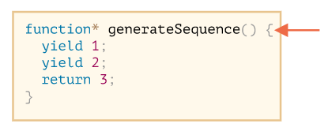
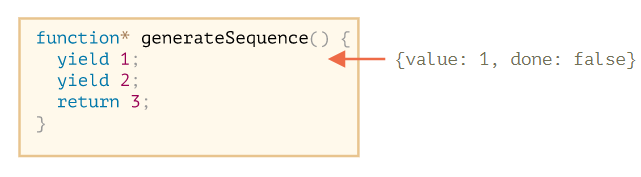
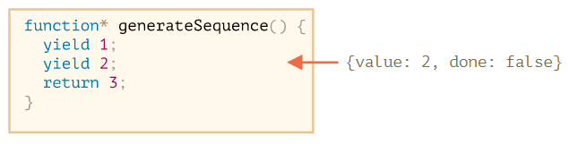
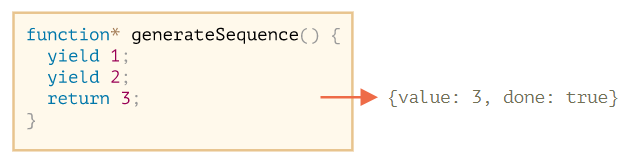
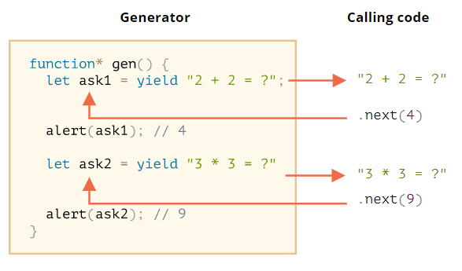

# Generator
常规函数只会返回一个单一值（或者不返回任何值），而使用特殊的语法结构 `function* funcName() {...}`，即所谓的 Generator 函数，可以**按需一个接一个地返回（使用关键字 `yield`）多个值**。

```js
// generator function 的声明
function* generateSequence() {
  yield 1;
  yield 2;
  return 3;
}
```

:bulb: `function* f(…)` 或 `function *f(…)` 这两种函数声明语法都是对的，但是通常更倾向于第一种语法，因为星号 `*` 表示它是一个 generator 函数，它描述的是函数种类而不是名称，因此 `*` 应该和 `function` 关键字紧贴一起。

Generator 函数与常规函数的行为不同，此类函数被调用时**不会运行其代码**，而是返回一个被称为 generator object **可迭代对象**来管理执行流程。

generator 对象的主要方法就是 `.next()`，当该方法被调用时它会恢复函数的运行，执行直到最近的 `yield <value>` 语句（`value` 可以被省略，默认为 `undefined`），然后函数再次暂停，并将产出的 yielded 值返回到外部代码，返回的结果始终是一个具有两个属性的对象
- `value` 产出的 yielded 的值。
- `done` 一个布尔值，如果 generator 函数已执行完成则为 `true`，否则为 `false`

```js
function* generateSequence() {
  yield 1;
  yield 2;
  return 3;
}

// "generator function" 创建了一个 "generator object"
let generator = generateSequence();

let one = generator.next()
alert(JSON.stringify(one)); // {"value": 1, "done": false}

let two = generator.next();
alert(JSON.stringify(two)); // {value: 2, done: false}

let three = generator.next();
alert(JSON.stringify(three)); // {value: 3, done: true}
```

上述实例代码的执行流程如下

1. 调用函数 `generateSequence()` 时函数体代码并未开始执行，只是创建了一个 generator 对象

    

2. 使用方法 `generator.next()` 执行函数体，并获取其第一个产出的 yielded 值后暂停

    

3. 再次使用方法 `generator.next()` 执行函数体，并获取其第二个产出的 yielded 值后暂停

    

4. 再次使用方法 `generator.next()` 执行函数体，代码将会执行到 `return` 语句，此时就完成这个函数的执行，因此返回的对象属性 `done` 为 `true`

    

:bulb: 可以再调用 `generator.next()` 但不再有任何意义，它将返回对象 `{value: undefined, done: true}`

## Generator 可迭代对象
generator 对象是[可迭代 iterable](可迭代对象.md)的，还可以使用循环结构 for-of 遍历它所有的值，这样比使用方法 `next().value` 依次（手动）读取值更优雅。

```js
function* generateSequence() {
  yield 1;
  yield 2;
  return 3;
}

let generator = generateSequence();

for(let value of generator) {
  alert(value); // 1，然后是 2
}
```

:warning: 上述实例会先显示 `1`，然后是 `2`，然后就没了（它不会显示 `3`），这是因为**当 `done: true` 时 `for..of` 循环会忽略最后一个 `value`**。如果我们想要通过 `for..of` 循环显示所有的结果必须使用 `yield` 返回它们（包括最后一个值）。

```js
function* generateSequence() {
  yield 1;
  yield 2;
  yield 3;
}

let generator = generateSequence();

for(let value of generator) {
  alert(value); // 1，然后是 2，然后是 3
}
```

:bulb: 对于可迭代对象可以使用 [spread 语法](函数.md#展开运算符) `...generator` 将所有产出的 yielded 值都展开为单个元素，作为参数输入到函数中或作为元素添加到数组中。

```js
let range = {
  from: 1,
  to: 5,

  *[Symbol.iterator]() { // [Symbol.iterator]: function*() 的简写形式
    for(let value = this.from; value <= this.to; value++) {
      yield value;
    }
  }
};

// 对象 range 具有方法 [Symbol.iterator]() 会返回一个 generator 可迭代对象
// 它具有 .next() 方法，以 {value: ..., done: true/false} 的形式返回值
alert( [...range] );   // 1,2,3,4,5
```

## Generator 组合
Generator 组合 composition 是 generator 的一个特殊功能，可以将外部的 generator 对象产生的值「嵌入」embed（组合）到另一个 generator 中，它是将一个 generator 流插入到另一个 generator 流的自然的方式，不需要使用额外的内存来存储中间结果。

`yield*` 指令将委托另一个 Generator 函数创建 generator 对象，并将其产出 yield 的值仿佛透明地 transparently 嵌入到当前 generator 对象中，就好像这些值就是由当前的 generator 对象产生的一样。

```js
// 一个生成数字序列的 Generator 函数
function* generateSequence(start, end) {
  for (let i = start; i <= end; i++) yield i;
}

// 基于 Generator 函数生成一系列更复杂的序列
function* generatePasswordCodes() {
  // 将 generateSequence(48, 57) 函数产生的对象的所有值复制进来
  yield* generateSequence(48, 57);

  // 将 generateSequence(65, 90) 函数产生的对象的所有值复制进来
  yield* generateSequence(65, 90);

  // 将 generateSequence(97, 122) 函数产生的对象的所有值复制进来
  yield* generateSequence(97, 122);
}

let str = '';

for(let code of generatePasswordCodes()) {
  str += String.fromCharCode(code);
}

alert(str);   // 0123456789ABCDEFGHIJKLMNOPQRSTUVWXYZabcdefghijklmnopqrstuvwxyz
```

## Generator 数据传递
关键字 `yield` 除了可以将函数内部产生的值「向外输出」，它还可以（通过 `nex()` 方法）接受外部的值「传递回」 generator 内，它是一条双向路 two-way street。

```js
function* gen() {
  let ask1 = yield "2 + 2 = ?";
  alert(ask1); // 4
  let ask2 = yield "3 * 3 = ?"
  alert(ask2); // 9
}

let generator = gen();

alert( generator.next().value );
// "2 + 2 = ?"
alert( generator.next(4).value );
// 4
// "3 * 3 = ?"
alert( generator.next(9).done );
// 9
// true
```



上述实例代码的执行流程如下

1. 第一个 `.next()` 启动了 generator 的执行，执行到达第一个 `yield` 后函数暂停
2. 结果被返回到外部代码中并 `alert("2 + 2 = ?")` 出来
3. 第二个 `.next(4)` 将 `4` 作为第一个 `yield` 的结果传递回 generator，因此内部变量 `ask1` 获得值 `4`，并恢复 generator 的执行因此 `alert(ask1)`
4. ……执行到达第二个 `yield` 后函数暂停，结果被返回到外部代码中并 `alert("3 * 3 = ?")` 出来。
5. 第三个 `next(9)` 将 `9` 作为第二个 `yield` 的结果传回 generator ，因此内部变量 `ask2` 获得值 `9`，并恢复 generator 的执行因此 `alert(ask2)` 执行现在到达了函数的最底部，所以访问对象的属性 `done` 返回 `true`

:bulb: 第一次调用 `generator.next()` 应该是不带参数的（如果带参数，那么该参数会被忽略）

除了在外部可以通过调用带参数的方法 `.next(arg)` 将一个值传递到 generator 内，作为 yield 的结果；还可以在外部调用方法 `.throw(error)` 传回一个 `error` 使得函数内 yield 出现了一个异常，并通过  `try...catch` 结构捕获。

```js
function* gen() {
  try {
    let result = yield "2 + 2 = ?";

    alert("The execution does not reach here, because the exception is thrown above");
  } catch(e) {
    alert(e); // 显示这个 error
  }
}

let generator = gen();

let question = generator.next().value;

generator.throw(new Error("The answer is not found in my database")); // 将 error 传回 generator 内
```

:bulb: 在现代 JavaScript 中 generator 很少被使用，但有时它们会派上用场，它们非常适合创建可迭代对象。此外在 Web 编程中经常使用数据流，Generator 函数在执行过程中与调用代码交换数据的能力是非常独特的，因此这是另一个非常重要的使用场景。

## Async iterator 和 generator
参考：[Async iterator 和 generator](https://zh.javascript.info/async-iterators-generators)

常规的 iterator 和 generator 可以很好地处理那些不需要花费时间来生成的的数据，但在 Web 开发中我们经常会遇到数据流，它们常常是分段流动 flows chunk-by-chunk 的，如下载或上传大文件，异步迭代器 Async iterator 允许我们对通过异步请求而得到的数据进行迭代，如通过网络分段 chunk-by-chunk 下载数据时，而异步生成器 Async generator 可以生成可迭代对象，会使这一步骤更加方便。

Async iterator 与常规 iterator 在语法上的区别：

|  | Iterable | Async Iterable |
| --- | --- | --- |
| 提供 iterator 的对象方法 | `Symbol.iterator` | `Symbol.asyncIterator` |
| `next()` 返回的值是 | `{value:…, done: true/false}` | resolve 成 `{value:…, done: true/false}` 的 `Promise` |

Async generator 与常规 generator 在语法上的区别：

|                               |                 Generator                  |                              Async generator                              |
| ----------------------------- | ----------------------------------------------- | ---------------------------------------------------------------------------------- |
| 声明方式                  | `function*`                              | `async function*`                                                       |
| `next()` 返回的值是 | `{value:…, done: true/false}` | resolve 成 `{value:…, done: true/false}` 的 `Promise` |

实例：有很多在线服务都是发送的分页数据（paginated data），如当我们需要一个用户列表时，一个请求只返回「一页」包含一个预定义数量的用户（例如 100 个用户），并提供了指向下一页的 URL。这种模式非常常见，不仅可用于获取用户列表，这种模式还可以用于任意东西，如 GitHub 允许使用相同的分页提交 paginated fashion 的方式找回 `commit`，

- 我们应该提交一个请求到这种格式的 URL：`https://api.github.com/repos/<repo>/commits`。
- 它返回一个包含 30 条 commit 的 JSON，并在返回的 `Link` header 中提供了指向下一页的链接。
- 然后我们可以将该链接用于下一个请求，以获取更多 commit，以此类推。

我们可以创建一个异步生成器输出具有所有 `commit` 的可迭代对象，然后我们就可以十分方便地遍历它们

```js
let repo = 'javascript-tutorial/en.javascript.info'; // 用于获取 commit 的 GitHub 仓库

async function* fetchCommits(repo) {
  let url = `https://api.github.com/repos/${repo}/commits`;

  while (url) {
    const response = await fetch(url, { // (1)
      headers: {'User-Agent': 'Our script'}, // github 要求 user-agent header
    });

    const body = await response.json(); // (2) 响应的是 JSON（array of commits）

    // (3) 前往下一页的 URL 在 header 中，提取它
    let nextPage = response.headers.get('Link').match(/<(.*?)>; rel="next"/);
    nextPage = nextPage && nextPage[1];

    url = nextPage;

    for(let commit of body) { // (4) 一个接一个地 yield commit，直到最后一页
      yield commit;
    }
  }
}

for await (let commit of fetchCommits(repo)) {
  // 处理 commit
}
```

上述实例代码的执行流程：

1. 使用浏览器的 [fetch](https://zh.javascript.info/fetch) 方法从远程 URL 下载数据。它允许我们提供授权和其他 header，如果需要 — 这里 GitHub 需要的是 `User-Agent`。
2. `fetch` 的结果被解析为 JSON，这是 `fetch` 特定的方法。
3. 从响应（response）的 `Link` header 中获取前往下一页的 URL。它有一个特殊的格式，所以我们对它使用正则表达式（regexp）。前往下一页的 URL 看起来就像这样 `https://api.github.com/repositories/93253246/commits?page=2` 这是由 GitHub 自己生成的。
4. 然后将接收到的所有 `commit` 都 yield 出来，当它 yield 完成时，将触发下一个 `while(url)` 迭代，并发出下一个请求。