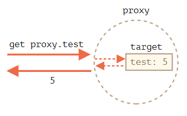

---
tags:
  - javascript
---

# Proxy
参考：[Proxy 和 Reflect](https://zh.javascript.info/proxy)

Proxy 是对象的包装器，使用构造器 `new Proxy` 创建一个 Proxy 对象以包装另一个对象，并设置陷阱 traps 拦截特定的操作，如读取/写入属性，以选择自行处理它们，或者透明地将插座转发到原始对象上。

:bulb: 代理 Proxy 相当于对象的「中介」，它会拦截预设的操作并执行另外自定义的行为，而其他操作就会转发到原来的对象上，也可以包装任何类型的对象，包括类和函数。

```js
let proxy = new Proxy(target,  handler);
```

参数说明
- `target` 要包装的对象，可以是任何对象东西，包括函数。
- `handler` 代理配置，即带有「陷阱」traps，拦截操作的方法的对象，如 `get` 陷阱、`set` 陷阱等。


```js
let target = {};
let proxy = new Proxy(target, {}); // 空的 handler 对象

proxy.test = 5; // 写入 proxy 对象
alert(target.test); // 5，test 属性出现在了 target 中！

alert(proxy.test); // 5，我们也可以从 proxy 对象读取它

for(let key in proxy) alert(key); // test，迭代也正常工作
```

上述实例中由于没有陷阱，所有对 `proxy` 的操作都直接透明地转发给了 `target`，即 `proxy` 是一个 `target` 的透明包装器 wrapper。



当我们设置了「陷阱」traps 就可以拦截对象的特定操作，其原理是对于对象的大多数操作 JavaScript 规范中有一个所谓的「内部方法」描述了最底层的工作方式，如 `[[Get]]` 用于读取属性的内部方法，`[[Set]]` 用于写入属性的内部方法等。这些方法仅在规范中使用，我们不能直接通过方法名调用它们，但对于每个内部方法 Proxy 都有一个对应的陷阱用于拦截这些方法的调用。它们在 [proxy 规范](https://tc39.es/ecma262/#sec-proxy-object-internal-methods-and-internal-slots) 被列出，常用的内部方法和陷阱（`handler` 方法）及其触发条件如下：

|             内部方法              |             Handler 方法             |                                                                                                                                                                                                                                                    何时触发                                                                                                                                                                                                                                                     |
| ------------------------------------- | ------------------------------------------ | ------------------------------------------------------------------------------------------------------------------------------------------------------------------------------------------------------------------------------------------------------------------------------------------------------------------------------------------------------------------------------------------------------------------------------------------------------------------------------------------------------------------- |
| `[[Get]]`                        | `get`                                   | 读取属性                                                                                                                                                                                                                                                                                                                                                                                                                                                                                                        |
| `[[Set]]`                        | `set`                                   | 写入属性                                                                                                                                                                                                                                                                                                                                                                                                                                                                                                        |
| `[[HasProperty]]`           | `has`                                   | `in` 操作符                                                                                                                                                                                                                                                                                                                                                                                                                                                                                                    |
| `[[Delete]]`                   | `deleteProperty`                 | `delete` 操作符                                                                                                                                                                                                                                                                                                                                                                                                                                                                                             |
| `[[Call]]`                      | `apply`                                | 函数调用                                                                                                                                                                                                                                                                                                                                                                                                                                                                                                        |
| `[[Construct]]`              | `construct`                         | `new` 操作符                                                                                                                                                                                                                                                                                                                                                                                                                                                                                                  |
| `[[GetPrototypeOf]]`      | `getPrototypeOf`                 | [Object.getPrototypeOf](https://developer.mozilla.org/en-US/docs/Web/JavaScript/Reference/Global_Objects/Object/getPrototypeOf)                                                                                                                                                                                                                                                                                                                    |
| `[[SetPrototypeOf]]`      | `setPrototypeOf`                 | [Object.setPrototypeOf](https://developer.mozilla.org/en-US/docs/Web/JavaScript/Reference/Global_Objects/Object/setPrototypeOf)                                                                                                                                                                                                                                                                                                                     |
| `[[IsExtensible]]`         | `isExtensible`                     | [Object.isExtensible](https://developer.mozilla.org/en-US/docs/Web/JavaScript/Reference/Global_Objects/Object/isExtensible)                                                                                                                                                                                                                                                                                                                                |
| `[[PreventExtensions]]` | `preventExtensions`            | [Object.preventExtensions](https://developer.mozilla.org/en-US/docs/Web/JavaScript/Reference/Global_Objects/Object/preventExtensions)                                                                                                                                                                                                                                                                                                            |
| `[[DefineOwnProperty]]` | `defineProperty`                 | [Object.defineProperty](https://developer.mozilla.org/en-US/docs/Web/JavaScript/Reference/Global_Objects/Object/defineProperty), [Object.defineProperties](https://developer.mozilla.org/en-US/docs/Web/JavaScript/Reference/Global_Objects/Object/defineProperties)                                                                                                                  |
| `[[GetOwnProperty]]`      | `getOwnPropertyDescriptor` | [Object.getOwnPropertyDescriptor](https://developer.mozilla.org/en-US/docs/Web/JavaScript/Reference/Global_Objects/Object/getOwnPropertyDescriptor), `for..in`, `Object.keys/values/entries`                                                                                                                                                                                                                    |
| `[[OwnPropertyKeys]]`    | `ownKeys`                             | [Object.getOwnPropertyNames](https://developer.mozilla.org/en-US/docs/Web/JavaScript/Reference/Global_Objects/Object/getOwnPropertyNames), [Object.getOwnPropertySymbols](https://developer.mozilla.org/en-US/docs/Web/JavaScript/Reference/Global_Objects/Object/getOwnPropertySymbols), `for..in`, `Object/keys/values/entries` |

:warning: 针对某些内部方法和陷阱，JavaScript 要求强制执行某些操作以满足必要的条件，称为不变量 Invariant（大多数要求有特定的返回值），应该遵顼这些规定以确保语言功能的正确和行为一致性，完整的不变量列表在 [规范](https://tc39.es/ecma262/#sec-proxy-object-internal-methods-and-internal-slots) 中。

- `[[Set]]` 如果值已成功写入，则必须返回 `true`，否则返回 `false`。如果忘记设置返回值或返回任何假（falsy）值，则该操作将触发 `TypeError`。
- `[[Delete]]` 如果已成功删除该值，则必须返回 `true`，否则返回 `false`。
- 应用于代理对象的 `[[GetPrototypeOf]]`，必须返回与被代理对象的 `[[GetPrototypeOf]]` 相同的值，即读取代理对象的原型必须始终返回被代理对象的原型。

使用代理并设置多个陷阱来防止对以 _ 开头的属性的任何访问
```js

let user = {
  name: "John",
  _password: "***"
};

user = new Proxy(user, {
  // get trap 拦截 _ 开头的属性读取
  get(target, prop) {
    if (prop.startsWith('_')) {
      throw new Error("Access denied");
    }
    let value = target[prop];
    return (typeof value === 'function') ? value.bind(target) : value; // (*)
  },

  // set trap 拦截 _ 开头的属性写入
  set(target, prop, val) {
    if (prop.startsWith('_')) {
      throw new Error("Access denied");
    } else {
      target[prop] = val;
      return true;
    }
  },

  // deleProperty trap 拦截 _ 开头的属性删除
  deleteProperty(target, prop) {
    if (prop.startsWith('_')) {
      throw new Error("Access denied");
    } else {
      delete target[prop];
      return true;
    }
  },

  // ownKeys trap 在使用 for..in 和像 Object.keys 这样的的方法时排除以 _ 开头的属性
  ownKeys(target) { // 拦截读取属性列表
    return Object.keys(target).filter(key => !key.startsWith('_'));
  }
});

// "get" 不允许读取 _password
try {
  alert(user._password); // Error: Access denied
} catch(e) { alert(e.message); }

// "set" 不允许写入 _password
try {
  user._password = "test"; // Error: Access denied
} catch(e) { alert(e.message); }

// "deleteProperty" 不允许删除 _password
try {
  delete user._password; // Error: Access denied
} catch(e) { alert(e.message); }

// "ownKeys" 将 _password 过滤出去
for(let key in user) alert(key); // name
```

使用 `has` 陷阱拦截 `in` 调用，并自定义其返回结果。

```js
let range = {
  start: 1,
  end: 10
};

range = new Proxy(range, {
  has(target, prop) {
    return prop >= target.start && prop <= target.end;
  }
});

alert(5 in range); // true
alert(50 in range); // false
```

代理 proxy 可以包装在函数周围，使用`apply(target, thisArg, args)` 陷阱能使代理以函数的方式被调用

参数说明
- `target` 是目标对象（在 JavaScript 中，函数就是一个对象），
- `thisArg` 是 `this` 的值。
- `args` 是参数列表。

```js
function delay(f, ms) {
  return new Proxy(f, {
    apply(target, thisArg, args) {
      setTimeout(() => target.apply(thisArg, args), ms);
    }
  });
}

function sayHi(user) {
  alert(`Hello, ${user}!`);
}

sayHi = delay(sayHi, 3000);

alert(sayHi.length); // 1 (*) proxy 将“获取 length”的操作转发给目标对象

sayHi("John"); // Hello, John!（3 秒后）
```

:bulb: [Reflect](https://developer.mozilla.org/en-US/docs/Web/JavaScript/Reference/Global_Objects/Reflect) API 旨在补充 [Proxy](https://developer.mozilla.org/en-US/docs/Web/JavaScript/Reference/Global_Objects/Proxy)，对于任意 `Proxy` 陷阱都有一个带有相同参数的 `Reflect` 调用，使用它们将调用转发给目标对象。

:warning: Proxy 有一些局限性：

- 内建对象具有“内部插槽”，对这些对象的访问无法被代理。请参阅上文中的解决方法。
- 私有类字段也是如此，因为它们也是在内部使用插槽实现的。因此，代理方法的调用必须具有目标对象作为 `this` 才能访问它们。
- 对象的严格相等性检查 `===` 无法被拦截。
- 性能：基准测试（benchmark）取决于引擎，但通常使用最简单的代理访问属性所需的时间也要长几倍。实际上，这仅对某些“瓶颈”对象来说才重要。