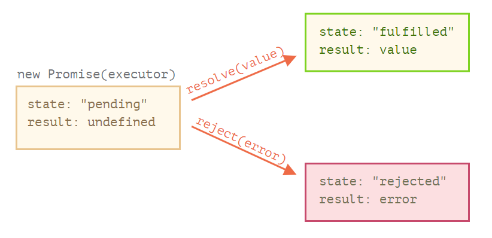
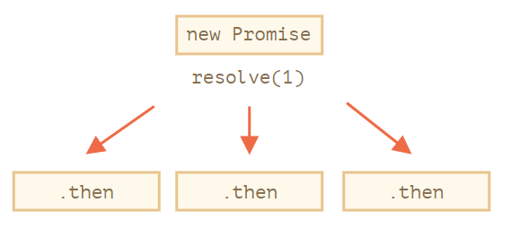
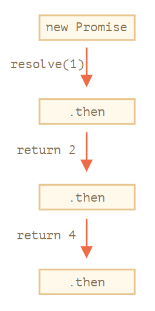
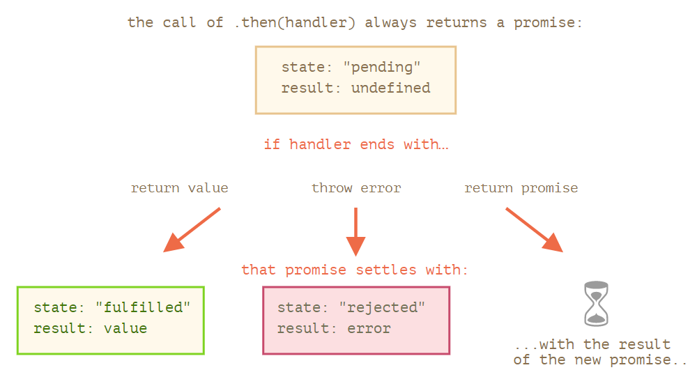
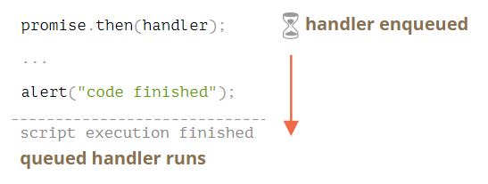

---
tags:
  - javascript
---

# promise

参考：

* [Promise](https://zh.javascript.info/promise-basics)
* [Promise - JavaScript | MDN](https://developer.mozilla.org/zh-CN/docs/Web/JavaScript/Reference/Global_Objects/Promise)
* [使用 Promise - JavaScript | MDN](https://developer.mozilla.org/zh-CN/docs/Web/JavaScript/Guide/Using_promises)
* [JavaScript Promise：简介  |  Web Fundamentals  |  Google Developers](https://developers.google.cn/web/fundamentals/primers/promises)

`promise` 对象代表异步执行结果，通常用于网络请求，通过构造函数 `new Promise` 创建，而且在执行时立即返回 `promise` 对象，:warning: 但该返回值并不是最终的执行结果，而是一个能代表未来出现的结果的对象，即  `promise` 对象是一个**代理对象**（代理一个创建时仍未知的值，需要等待异步行为执行完成后才可以确定）,**这可让主线程中的异步行为像同步行为那样立即拥有返回值，避免长时间等待而引起卡顿**。

## promise 原理
1. 通过构造函数创建 `promise` 对象，构造函数的参数是**处理器函数 executor function** ，它会在构造函数执行时被立即调用，异步操作（如包含 `setTimeout()` 的代码）就是在其中进行。

    ```js
    let promise = new Promise(function(resolve, reject) {
      // 当 promise 被构造完成时，自动执行此函数
      // executor
    });
    ```

    :bulb: `promise` 对象有不同状态，一开始创建的 `promise` 对象状态是 `pending`（表示初始状态），然后在 executor 中会基于异步行为的结果执行 `resolve` 或 `reject` 之一，这样就会改变 `promise` 对象的状态为 `settled`（表示状态确定，更准确的是 `resolved` 或 `rejected` 状态之一）
    * `pending` 表示初始状态，既异步行为不是成功，也不是失败的状态
    * `settled` 表示确定状态，意味着已经成功或失败
    * `fulfilled` 或 `resolved` 意味着操作成功完成
    * `rejected` 意味着操作失败

    :bulb: `promise` 对象有两个内部的的属性状态 `state`（默认为 `pending`）和结果 `result`（默认为 `undefined`），它们无法直接访问但可以在 executor function 中调用 `resolve` 或 `reject` 更改其状态和设置结果。

2. 基于异步行为形成的特定条件，执行回调函数 `resolve` 或 `reject` 之一，确定 `promise` 对象的状态，还可能修改对象的结果属性 `result`（结果的值就是回调函数 `resolve(value)` 或 `reject(error)` 的参数 `value` 或 `error`）

    executor 参数 `resolve` 和 `reject` 是由 JavaScript 自身提供的默认参数（它们是函数，接受的实参设置为 `promise` 对象的结果属性），应该遵循规则基于异步代码执行的结果调用它们其一，以修改 `promise` 对象的状态和结果

    * 调用 `resolve(value)` 表示任务成功完成，而且将 `promise` 对象的结果属性设置为 `value`
    * 调用 `reject(error)` 表示出现了 exector function 中出现 `error`，而且将 `promise` 对象的结果属性设置为为 `error` 对象（其实可以是任何类型的值作为参数，但是为了可以获取错误信息，推荐使用 `error` 对象或继承自 `error` 的对象）

    

    :warning: executor 只能调用一个 `resolve` 或一个 `reject`，任何状态的更改都是最终的，此后所有其他的再对 `resolve` 和 `reject` 的调用都会被忽略，并且，`resolve/reject` 只需要一个参数（或不包含任何参数），并且将忽略额外的参数。

    ```js
    let promise = new Promise(function(resolve, reject) {
      resolve("done");

      reject(new Error("…")); // 被忽略
      setTimeout(() => resolve("…")); // 被忽略
    });
    ```
3. `promise` 对象的原型有方法 `.then(handler)`、`.catch(handler)`、`.finally(handler)`，它们之一会在 `promise` 对象状态确定后被调用，以执行相应的行为。

    这些方法和回调结构中的回调函数作用类似，但存在区别，在回调结构中[回调函数需要在声明主体函数时就给出](回调.md)；Promise 则更加灵活，这些方法并不一定需要在创建对象时就设定，可以随时为对象设置方法以添加处理程序（handler），如果结果已经在（即 `promise` 对象状态已经 `settled`）这些后来添加的处理程序便会立即执行，而且可以添加多次。

    ```js
    // 在同一个 promise 对象上多次添加方法 then，创建出多个独立的处理程序
    let promise = new Promise(function(resolve, reject) {
      setTimeout(() => resolve(1), 1000);
    });

    promise.then(function(result) {
      alert(result); // 1
      return result * 2;
    });

    promise.then(function(result) {
      alert(result); // 1
      return result * 2;
    });

    promise.then(function(result) {
      alert(result); // 1
      return result * 2;
    });
    ```
    

    :bulb: 实际上完整方法 `then(resolveFunc, rejectFunc)` 可以接受两个参数（而且每次只能调用其一），当 `promise` 对象中的异步代码执行成功（即 `promise` 状态为`fulfilled` 或 `resolved` 时），方法 `then()` 会执行回调函数 `resolvFunc`，异步代码执行失败就会执行回调函数 `rejectFunc`。而方法 `catch()` 实际上是 `then(null, rejectFunc)` 的缩写，即它只适用于异常情况下才执行 handler 处理程序，推荐使用 `catch` 捕捉异步代码执行失败的情况因为它便于阅读。

    ```js
    let promise = new Promise(function(resolve, reject) {
      setTimeout(() => resolve("done!"), 1000);
    });

    // resolve 运行 .then 中的第一个函数
    promise.then(
      result => alert(result), // 1 秒后显示 "done!"
      error => alert(error) // 不运行
    );

    /*---------- 分割线 ----------*/

    let promise = new Promise(function(resolve, reject) {
      setTimeout(() => reject(new Error("Whoops!")), 1000);
    });

    // reject 运行 .then 中的第二个函数
    promise.then(
      result => alert(result), // 不运行
      error => alert(error) // 1 秒后显示 "Error: Whoops!"
    );
    ```

    `promise` 对象的方法 `finally`，类似于 `try {...} catch {...}` 中的 `finally` 子句一样，方法 `.finally(f)` 中的处理程度 `f` 在 `promise` 对象被 `settled` 时运行（即 `promise` 对象被 `resolve` 或 `reject`）该方法是设置清理 cleanup 的很好地方，它的处理程序无论异步操作结果如何都会被执行

    ```js
    new Promise((resolve, reject) => {
      /* 做一些需要时间的事儿，然后调用 resolve/reject */
    })
      // 在 promise 被 settled 时运行，无论成功与否
      .finally(() => stop loading indicator)
      .then(result => show result, err => show error)
    ```

    方法 `.finally(f)` 与方法 `then(f,f)` 类似，但是有主要的区别
    * 方法 `finally` 的处理程序 handler 没有参数，因为在 `finally` 中不需要知道 `promise` 是否成功，任务都会被执行，被称作定稿程序 finalizing procedures
    * 方法 `finally` 的处理程序将结果和 `error` 传递给下一个处理程序（一般在链式调用），这非常方便，因为 `finally` 并不是为了处理 `promise` 的结果，所以它将结果传递了下去。

    ```js
    new Promise((resolve, reject) => {
      setTimeout(() => resolve("result"), 2000)
    })
      .finally(() => alert("Promise ready"))
      .then(result => alert(result));   // <-- .then 对结果进行处理，结果 result 是从方法 finally 中获取的

    /*---------- 分割线 ----------*/
    new Promise((resolve, reject) => {
      throw new Error("error");
    })
      .finally(() => alert("Promise ready"))
      .catch(err => alert(err));   // <-- .catch 对 error 对象进行处理，错误对象 error 是从方法 finally 中获取的
    ```

    :bulb: 有一个浏览器技巧，[在方法 `finally` 处理程序中返回零延时 zero-timeout 的 `promise` 对象](https://zh.javascript.info/promise-error-handling#qi-ta)（如构建函数的 executor 中含有 `setTimeout(callback, 0)`），这是因为一些浏览器，如 Chrome，需要「一点时间」外的 `promise` 处理程序来绘制文档的更改，因此它确保在进入链下一步之前，指示（如 modal 弹出框出现或消失时页面背景色的变化）在视觉上是停止的。

:bulb: `promise` 是一个对象代表了一个 **[异步操作](D:/Front_end/JavaScript/异步操作.md)** 的结果（完成或失败），通过它可以将异步操作的（成功和失败）结果与相应的处理 handler（方法 `.then`、`.catch`、`.finally`，相当于[回调结构](回调.md)中的回调函数）绑定，这种分离结构可以避免嵌套回调而形成「回调地狱」结构（这些方法返回的是 `promise` 对象，因此可以构建[链式调用](#链式调用)）。

promise 相较于基于回调的模式的一些好处

|                           Promises                           |                          Callbacks                           |
| :----------------------------------------------------------: | :----------------------------------------------------------: |
| Promises 允许我们按照自然顺序进行编码，可以先运行 `executor` 然后再添加方法 `.then` 来处理结果 | 在声明主体函数时，必须有一个 `callback` 函数，即在调用之前必须知道如何处理结果 |
| 可以根据需要在 promise 上多次调用 `.then`。每次调用都是形成一个独立的处理程序（也可以通过链式调用来对统一结果进行处理） |                        只能有一个回调                        |

:warning: `Promise` 与 `event` 类似，也是异步操作的一种，但事件 `event` 可以多次触发，而 **`promise` 对象状态**只能确定一次（但是可以基于 `promise` 对象状态可以设置多次 `.then` 方法）。

:warning: `Promise` 并不是安全执行费时操作的通行证，它只是在异步任务状态确定时决定下一步操作的一种方式。如果 `Promise` 在主线程中执行，且在 `Promise` 中的操作需时过长也可能会造成阻塞并引起页面卡顿。

## 错误处理
Promise 链在错误处理中十分强大，当一个 `promise` 对象（由于 executor 抛出异常）状态变成 `rejected` 时，**控制权将移交至最近的 rejection 处理程序 handler（一般是方法 `.catch(handler)`**，这在实际开发中非常方便。

实际上在 `promise` 构造函数中的执行者 executor 和 `promise` 对象方法的处理程序 handler 周围有一个「隐式的」 `try...catch` 结构，如果代码发生异常就会被捕获，并视为 rejection 进行处理。

```js
new Promise((resolve, reject) => {
  throw new Error("Whoops!");
}).catch(alert); // Error: Whoops!

// 相当于以下情况
new Promise((resolve, reject) => {
  reject(new Error("Whoops!"));
}).catch(alert); // Error: Whoops!
```

:bulb: 除了异步任务失败之外，如果是在方法 `.then()` 中引发的错误（如 `throw` 「手动」抛出错误），也会隐式自动调用其后最近的方法 `catch()`

```js
new Promise((resolve, reject) => {
  resolve("ok");
}).then((result) => {
  throw new Error("Whoops!"); // reject 这个 promise
}).catch(alert); // Error: Whoops!
```

:bulb: 一般都在 promise 链尾端使用一个 `.catch` 处理其上的所有可能抛出的 `error`，以避免程序因异常卡住而导致脚本死掉。如果对于 promise 链可能会产生未处理的 rejection，可以使用 `unhandledrejection` 事件来捕获这类 `error`，这个事件是 [HTML 标准](https://html.spec.whatwg.org/multipage/webappapis.html#unhandled-promise-rejections) 的一部分。如果出现了一个 error，并且在其后没有 `.catch` 对它进行处理，那么 `unhandledrejection` 处理程序 handler 会被触发，并获取具有 `error` 相关信息的 `event` 对象，所以我们就能做一些后续处理了。通常此类 error 是无法恢复的，所以我们最好的解决方案是将问题告知用户，并且可以将事件报告给服务器。在 Node.js 等非浏览器环境中，有其他用于跟踪未处理的 error 的方法。

```js
window.addEventListener('unhandledrejection', function(event) {
  // 这个事件对象有两个特殊的属性：
  alert(event.promise); // [object Promise] - 生成该全局 error 的 promise
  alert(event.reason); // Error: Whoops! - 未处理的 error 对象
});

new Promise(function() {
  throw new Error("Whoops!");
}); // 没有用来处理 error 的 catch
```

## 链式调用
依次连续执行多个操作是一个常见的需求，即在上一个操作执行成功之后，才开始下一个操作（并一般带着上一步返回的结果）。使用 `promise` 对象的方法 `then` 可以实现这种功能，从而避免形成[「回调地狱」结构](回调.md#嵌套回调)。这是由于方法 `.then` 返回的是 [thenable 对象](https://zh.javascript.info/promise-chaining#shi-li-loadscript)，即一个具有方法 `.then` 的任意对象（可以作为 `promise` 来对待），**因此可以在方法后再添加方法 `.then`** ，不断添加方法 `.then` 可以构成一个长序列的链式调用。

:bulb: 确切地说处理程序 handler 返回的不完全是一个 promise，而是返回的被称为 thenable 对象（一个具有方法 `.then` 的任意对象），它会被当做一个 promise 来对待，这个想法是让第三方库可以实现自己的 promise 兼容（promise-compatible）对象，但依然可以与原生的 promise 兼容（因为它们实现了 `.then` 方法），即允许我们将自定义的对象与 `promise` 链集成在一起，而不必继承自 `Promise`类。

```js
// 自定义 thenable 类
class Thenable {
  constructor(num) {
    this.num = num;
  }
  then(resolve, reject) {
    alert(resolve); // function() { native code }
    // 1 秒后使用 this.num*2 进行 resolve
    setTimeout(() => resolve(this.num * 2), 1000); // (**)
  }
}

new Promise(resolve => resolve(1))
  .then(result => {
    return new Thenable(result); // (*)
  })
  .then(alert); // 1000ms 后显示 2
```

链式调用的理念是利用方法 `.then` 会返回类似于 `promise` 对象，在下一步中再次调用该返回对象的方法 `.then`，并对对象的结果属性 `result` 在传递链上进行依次处理。

```js
new Promise(function(resolve, reject) {
  setTimeout(() => resolve(1), 1000); // (*)
}).then(function(result) { // (**)
  alert(result); // 1
  return result * 2;
}).then(function(result) { // (***)
  alert(result); // 2
  return result * 2;
}).then(function(result) {
  alert(result); // 4
  return result * 2;
});
```

上述实例运行流程如下：

1. 初始 `promise` 在 1 秒后进行 `resolve`
2. 然后 `.then` 处理程序 handler 被调用
3. 它返回的值是一个 `promise` 对象，其结果（上一步的 `result`）就可以被传入下一个 `.then` 处理程序 handler
4. ……依此类推

随着 result 在处理程序（handler）链中传递，我们可以看到一系列的 `alert` 调用：`1` → `2` → `4`



:bulb: 如果方法 `.then(handler)` 的处理程序中包含异步代码，一般会使用 `new Promise` 构造函数创建一个 `promise` 对象将其包裹，并返回这个新建的 `promise` 对象，这样调用链的下一步的方法 `.then` 就会等待新建 `promise` 对象的状态确定后再执行，即可实现异步链式调用。

链式调用不同情况的示意图


```js
new Promise(function(resolve, reject) {
  setTimeout(() => resolve(1), 1000);
}).then(function(result) {
  alert(result); // 1
  return new Promise((resolve, reject) => { // (*)
    setTimeout(() => resolve(result * 2), 1000);
  });
}).then(function(result) { // (**)
  alert(result); // 2
  return new Promise((resolve, reject) => {
    setTimeout(() => resolve(result * 2), 1000);
  });
}).then(function(result) {
  alert(result); // 4
});
```

上述实例输出与前面的示例相同：`1` → `2` → `4`，但是现在在每次 `alert` 调用之间会有 1 秒钟的延迟。

:bulb: 返回 `promise`（且其中的 executor 包含异步代码）使我们能够构建异步行为链。

## async 函数
Async/await 是以更舒适的方式使用 promise 的一种特殊语法，同时它也非常易于理解和使用。

当函数以关键字 `async` 开始就表示这个函数返回一个 `promise` 对象，而且会将函数的返回值作为 `promise` 对象的结果 `result`

```js
async function f() {
  return 1;
}

f().then(alert); // 1，函数返回一个结果为 1 的 resolved promise
```

一般在 `async` 函数会使用关键字 `await` 获取确定暂停的对象的结果。

```js
// 只在 async 函数内工作
let value = await promise;
```

关键字 `await` 的作用就是让 JavaScript 引擎「暂停」并等待直到 `promise` 对象 settle，然后以 `promise` 对象的结果继续执行。这个行为不会耗费任何 CPU 资源，因为引擎可以同时处理其他任务：执行其他脚本，处理事件等。

```js
// async 函数
async function f() {
  let promise = new Promise((resolve, reject) => {
    setTimeout(() => resolve("done!"), 1000)
  });

  let result = await promise;   // 等待，直到 promise resolve
  alert(result);   // "done!"
}

f();
```

:warning: 关键字 `await` 只在 `async` 函数中使用，否则会得到一个语法错误

如果一个 `promise` 对象正常 resolve，`await promise` 返回的就是其结果；如果 `promise` 对象被 reject，它将 `throw` 这个 `error`，可以在外部添加 `try...catch` 结构来捕获上面提到的那个 `error`；或者在 `async` 函数后面添加方法 `.catch` 捕获异常；或者使用全局事件处理程序 `unhandledrejection` 来捕获。

```js
// 使用 try...catch 结构捕获异常
async function f() {

  try {
    let response = await fetch('http://no-such-url');
  } catch(err) {
    alert(err); // TypeError: failed to fetch
  }
}

f();

/*---------- 分割线 ----------*/
// 手捧玫瑰方法 .catch 捕获异常
async function f() {
  let response = await fetch('http://no-such-url');
}

// f() 变成了一个 rejected 的 promise
f().catch(alert); // TypeError: failed to fetch // (*)

```

实际上 `await` 是接受一个 thenable 对象（那些具有可调用的 `then` 方法的对象），就像方法 `.then` 返回一个 thenable 对象一样，这样规定是为了兼容非 `promise` 的第三方对象。

如果 `await` 接收了一个非 `promise`但是提供了 `.then` 方法的对象时，它就会调用这个 `.then` 方法并将内建的函数 `resolve` 和 `reject` 作为参数传入（就像 `Promise` 对象的 executor 执行步骤一样），然后 `await` 等待，直到这两个函数之一被调用，就可以获取相应的结果继续执行后续任务。

```js
// thenable 对象
class Thenable {
  constructor(num) {
    this.num = num;
  }
  // 具有方法 then
  then(resolve, reject) {
    alert(resolve);
    setTimeout(() => resolve(this.num * 2), 1000);
  }
};

async function f() {
  // 等待 1 秒，之后 result 变为 2
  let result = await new Thenable(1);   // 接受 thenable 对象，类似于 promise 对象
  alert(result);
}

f();
```

:bulb: 相比于 `promise.then`，函数 `async` 结合关键字 `await` 是获取 promise 的结果的一个更优雅的语法，当我们使用 `async/await` 时几乎就不会用到 `.then` 了，因为 `await` 为我们处理了等待，而且一般结合 `try..catch` 结构（而不是 `.catch` ）捕抓异常。:warning: 但是当我们在代码的顶层（即在 `async` 函数之外），就不能使用 `await` 了，通常的做法是在 `async` 函数后添加 `.then/catch` 来处理最终的结果 `result` 或抛出的 `error`

```js
// then 链式调用
function loadJson(url) {
  return fetch(url)
    .then(response => {
      if (response.status == 200) {
        return response.json();
      } else {
        throw new Error(response.status);
      }
    })
}

loadJson('no-such-user.json')
  .catch(alert);

/*---------- 分割线 ----------*/
// 使用 await 关键字
async function loadJson(url) {
  let response = await fetch(url);
  if (response.status == 200) {
    let json = await response.json();
    return json;
  }

  throw new Error(response.status);
}

loadJson('no-such-user.json').catch(alert);
```


## promise API
`Promise` 类有 5 种静态方法，用于「批量」处理 `promise` 对象

* `Promise.all(promises)` 等待所有 `promise` 对象状态都为 `resolved` 时返回以存放它们结果的数组为结果的 `promise` 对象。如果给定的任意一个 `promise` 对象为 `rejected`，那么它就会变成 `Promise.all` 的 `error`，所有其他 `promise` 对象的状态结果都会被忽略。

* `Promise.allSettled(promises)`（ES2020 新增方法）等待所有 `promise` 对象都 `settled` 时，并以包含**以下内容的对象**数组的形式返回它们的结果
    - `state`: `"fulfilled"` 或 `"rejected"`
    - `value`（如果 fulfilled）或 `reason`（如果 rejected）

* `Promise.race(promises)` 等待**第一个 `settled` 的 `promise` 对象**，并将其 `result/error` 作为结果

* `Promise.resolve(value)` 使用给定 `value` 作为结果 `result`，创建一个 `resolved` 的 `promise` 对象

* `Promise.reject(error)` 使用给定 `error` 作为原因 `reason`，创建一个 `rejected` 的 `promise` 对象

:bulb: 这五个方法中 `Promise.all` 可能是在实战中使用最多的

## Promisification
Promisification 这个长单词表示一种特定的函数结构转换行为，表示将回调结构转换为 promise 结构，即指 promise 化。

因为使用 promise 更加方便，许多函数和库都是基于回调的，因此在实际开发中经常会需要进行这种转换，可以设计一个通用的转换函数 `promisify(f)` 协助我们进行转换。

这个函数接受一个需要被 promisify 的函数 `f`，并返回一个包装 wrapper 函数（以便我们按照原来的方式调用转换后的函数）。而该包装函数的功能就是最后返回一个 `promise` 对象，并将调用（参数）传递给原始的函数 `f`，并在自定义的回调中跟踪结果

```js
function promisify(f) {
  return function (...args) { // 返回一个包装函数（wrapper-function）
    return new Promise((resolve, reject) => {
      function callback(err, result) { // 我们对 f 的自定义的回调
        if (err) {
          reject(err);
        } else {
          resolve(result);
        }
      }

      args.push(callback); // 将我们的自定义的回调附加到 f 参数（arguments）的末尾

      f.call(this, ...args); // 调用原始的函数
    });
  };
};

// 用法：
let loadScriptPromise = promisify(loadScript);
loadScriptPromise(...).then(...);   // 原来的回调函数变成方法 then 的处理程序
```

:bulb: 上述的代码假设**原始的函数期望一个带有两个参数 `(err, result)` 的回调**。这就是我们最常遇到的形式。那么我们的自定义回调的格式完全正确，并且 `promisify` 在这种情况下非常有用。

如果原始的 `f` 期望一个带有更多参数的回调函数，如 `callback(err, res1, res2, ...)` 则可以使用「更高级」的版本

```js
// promisify(f, true) 来获取结果数组
function promisify(f, manyArgs = false) {
  return function (...args) {
    return new Promise((resolve, reject) => {
      function callback(err, ...results) { // 我们自定义的 f 的回调，以剩余参数来接受不定数量的输入
        if (err) {
          reject(err);
        } else {
          // 如果 manyArgs 被指定，则使用所有回调的结果 resolve
          resolve(manyArgs ? results : results[0]);
        }
      }

      args.push(callback);

      f.call(this, ...args);
    });
  };
};

// 用法
// 调用 promisify(f, true) 表示 promise 的结果将是用户输入多个参数组成的数组 [res1, res2, ...]
f = promisify(f, true);
f(...).then(arrayOfResults => ..., err => ...)   // 使用用户所有输入进行进一步的处理
```

:bulb: 对于一些更奇特的回调格式，如根本没有 `err` 的格式 `callback(result)` 可以手动 promisify 这样的函数。也有一些具有更灵活一点的 promisification 函数的模块，例如 [es6-promisify](https://github.com/digitaldesignlabs/es6-promisify)。在 Node.js 中，有一个内建的 promisify 函数 `util.promisify`。

## 微任务
Promise 的处理程序（handlers）`.then`、`.catch` 和 `.finally` 都是异步的，即一个 `promise` 对象立即被 resolve，但它的方法 `.then`、`.catch` 和 `.finally` 也会等待其下面（链式调用以外） 的代码执行完成后再执行这些处理程序 handler。

```js
let promise = Promise.resolve();
promise.then(() => alert("promise done!"));
alert("code finished"); // 这个 alert 先显示
```

这是由于 ECMA 标准规定了一个内部队列 `PromiseJobs`，通常被称为微任务队列 microtask queue（ES8 术语）来管理异步任务。当一个 `promise` 对象准备就绪时，它的方法 `.then/catch/finally` 中的处理程序 handler 就会被放入队列中，但是它们不会立即被执行。根据[规范](https://tc39.github.io/ecma262/#sec-jobs-and-job-queues)中所述：

- 只有在 JavaScript 引擎中没有其它任务在运行时，才开始执行任务队列中的任务。
- 队列 queue 是先进先出的，即在 promise 链中首先进入队列的处理程序任务会首先运行。



如果执行顺序对我们很重要，可以将代码添加到链式调用的 `.then` 中，确保程序依次执行

```js
Promise.resolve()
  .then(() => alert("promise done!"))
  .then(() => alert("code finished"));
```

:bulb: 对于 promise 链未处理的 rjection 可以使用 `unhandledrejection` 事件来捕获，但它是在微任务队列中的任务都完成时才会生成的。