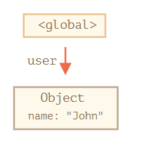
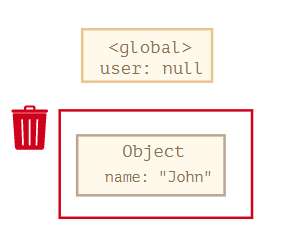
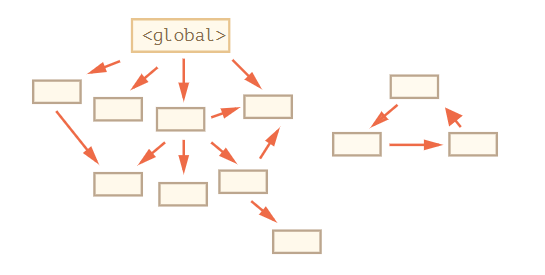
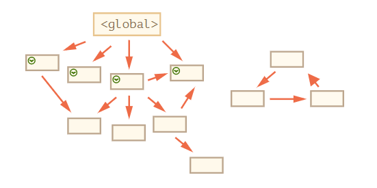
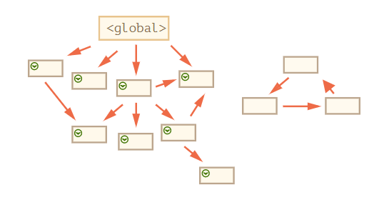
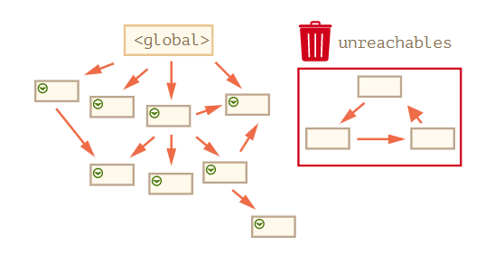

---
tags:
  - javascript
---

# 垃圾回收
 参考：[垃圾回收](https://zh.javascript.info/garbage-collection)

我们创建的原始值、对象、函数等一切都会占用内存，当我们不再需要某变量或数据时，JavaScript 引擎会自动地进行清除，该操作称为 **垃圾回收**。

## 可达性
可达性 Reachability 是指数据以某种方式可访问或可用，它们一定是存储在内存中的。这是 JavaScript 内存管理的主要概念。

当一个数据是可达的它就不会被[垃圾回收器](https://en.wikipedia.org/wiki/Garbage_collection_(computer_science))（一个在JavaScript 引擎后台执行的程序，它监控着所有对象的状态）删除。

可达值的基本集合（这些值明显不能被释放）：
* 前函数的局部变量和参数。
* 嵌套调用时，当前调用链上所有函数的变量与参数。
* 全局变量。
* 还有一些内部的

:bulb: 这些值被称作 **根 roots**

:bulb: 此外，如果是通过引用或引用链从根访问任何其他值，则认为该值是可达的。如局部变量中（引用）有一个对象，并且该对象有一个属性引用了另一个对象，则该对象被认为是可达的，而且它引用的内容（嵌套）也是可达的。

```js
// user 具有对这个对象的引用
let user = {
  name: "John"
};
```
箭头描述了一个对象引用。全局变量 `user` 引用了对象 `{name："John"}`，则此时对象是可达的。


如果 `user` 的值被重写了，这个引用就没了，即对象变成不可达的了，垃圾回收器会认为它是垃圾数据并进行回收，然后释放内存。



## 内部算法
垃圾回收的基本算法被称为 mark-and-sweep，其步骤如下：



1. 垃圾收集器找到所有的根，并标记它们。



2. 然后它遍历并标记来自它们的所有引用。


3. 然后它遍历标记的对象并标记他们的引用。所有被遍历到的对象都会被记住，以免将来再次遍历到同一个对象……如此操作，直到所有可达的（从根部）引用都被访问到。



4. 没有被标记的对象都会被删除。



:bulb: 可以将这个过程想象成从根溢出一个巨大的油漆桶，它流经所有引用并标记所有可到达的对象。然后移除未标记的。

## 延伸阅读
《The Garbage Collection Handbook: The Art of Automatic Memory Management》（R. Jones 等人著）这本书涵盖了其中一些内容。

如果你熟悉底层（low-level）编程，关于 V8 引擎垃圾回收器的更详细信息请参阅文章 [V8 之旅：垃圾回收](http://jayconrod.com/posts/55/a-tour-of-v8-garbage-collection)。

[V8 博客](http://v8project.blogspot.com/) 还不时发布关于内存管理变化的文章。当然，为了学习垃圾收集，你最好通过学习 V8 引擎内部知识来进行准备，并阅读一个名为 [Vyacheslav Egorov](http://mrale.ph/) 的 V8 引擎工程师的博客。我之所以说 “V8”，因为网上关于它的文章最丰富的。对于其他引擎，许多方法是相似的，但在垃圾收集上许多方面有所不同。

当你需要底层的优化时，对引擎有深入了解将很有帮助。在熟悉了这门编程语言之后，把熟悉引擎作为下一步计划是明智之选。