# 对象
对象是 JavaScript 支持的一种数据类型，与七种原生类型不同，对象可以用来存储键值对和更复杂的实体。

JavaScript 有内置对象，如 array 数组，此外 JavaScript 允许用户创建自定义对象，用于存储复杂的类型的数据值，其基本构成是 **属性** 和 **方法**，用以映射模拟现实中的对象。

当我们在代码中用对象表示实体时，就是所谓的 [面向对象编程](https://en.wikipedia.org/wiki/Object-oriented_programming)，简称为 "OOP"。

```js
// 创建一个空对象
let user = new Object(); // 「构造函数」的语法
let user = {};  // 「字面量」的语法
```

* 整个对象以花括号 `{}` 包括，并将其赋值给一个变量（最后以分号 `;` 结束）
* 使用**键值对 `key: value`** 形式创建属性或方法，该形式称为**对象字面值记法**。「键」key  是一个字符串（表示属性或方法名称），「值」 value 可以是任何值，它们之间用冒号 `:` 隔开
* 一个属性就是一个键值对，不同的方法或属性之间以逗号 `,` 分隔

:bulb: 为了代码更易阅读理解，每个键值对单独放置一行

## 引用
对象与其他原始数据类型的一个根本区别是对象类型是通过**引用**来读取的。

:bulb: 对于使用关键字 `const` 创建的常量变量引用的对象，即使对象进行修改也不会导致错误。因为 `const` 修饰的只是变量本身存储的值，即对同一个对象的引用。

```js
const user = {
  name: "John"
};

// 修改的是对象内部的内容，并没有改变 user 存储的对象的引用
user.age = 25;
alert(user.age); // 25

// 错误，不能再给 user 赋值
user = {
  name: "Pete"
};
```

### 复制
原始类型数据是整体被赋值或复制的，变量复制后会「独占」一份数据，因此修改变量存储的数据是相互不影响的。
```js
let message = "Hello!";
let phrase = message;
```


而当变量存储对象类型的数据时，并非存储对象本身而是相应的「内存中的地址」，所以复制这样的变量或者将其作为函数参数进行传递时，复制或传递的是「内存地址」而不是对象本身，即引用被复制了一份对象并没有被复制。可以将对象想象成是一个抽屉，变量就是一把钥匙，拷贝对象时相当于复制了钥匙，但是并没有复制抽屉本身。

```js
let user = {
  name: "John"
};

let admin = user; // 复制引用
```

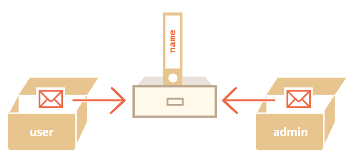

两个变量，但是都指向同一个对象，因此改变其中一个变量所指向的对象的属性值，另一个变量也随之改变。

```js
admin.name = 'Pete'; //  被通过名为 "admin" 的引用修改了

alert(user.name); // 'Pete'，通过名为 "user" 的引用查看修改
```

:bulb: 如果需要创建一份独立的对象拷贝而非复制其指向引用，需要创建一个新的对象，然后遍历现有对象的属性，手动将对象的所有属性都复制一份。

```js
let user = {
  name: "John",
  age: 30
};

let clone = {}; // 新的空对象

// 复制所有的属性值
for (let key in user) {
  clone[key] = user[key];
}

// 现在的复制是独立的了
clone.name = "Pete"; // 改变它的值

alert( user.name ); // John，原对象属性值不变
```

:bulb: 使用内置函数 `Object.assign(dest, [ src1, src2...])` 将（多个）对象 `src1`、`src2`……属性都拷贝（合并）到目标对象 `dest` 中。如果用于接收的对象（user）已经有了同样属性名的属性，已有的则会被覆盖。

```js
let user = { name: "John" };

let permissions1 = { canView: true };
let permissions2 = { canEdit: true };

// 把 permissions1 和 permissions2 的所有属性都拷贝给 user
Object.assign(user, permissions1, permissions2);

// 现在 user = { name: "John", canView: true, canEdit: true }
```

:warning: 当「源」对象的属性值也是对象，则对属性分别进行复制时，拷贝的就是其他对象的引用，即共享了一个对象，需要进行深拷贝 deep cloning 即对其中「内嵌」的对象的属性也进行一遍复制，可以使用一个标准的深拷贝算法 **[结构化克隆算法（Structured cloning algorithm）](https://html.spec.whatwg.org/multipage/structured-data.html#safe-passing-of-structured-data)** 解决更复杂的情况。一个 JavaScript 库 [lodash](https://lodash.com/) 中的一个方法 [_.cloneDeep(obj)](https://lodash.com/docs#cloneDeep) 实现。

```js
let user = {
  name: "John",
  sizes: {   // 该属性是对另一个对象的引用
    height: 182,
    width: 50
  }
};

let clone = Object.assign({}, user);

alert( user.sizes === clone.sizes ); // true，同一个对象

// user 和 clone 共享 sizes 对象
user.sizes.width++;       // 在这里改变一个属性的值
alert(clone.sizes.width); // 51，在这里查看属性的值
```

### 比较
等号 `==` 和严格相等 `===` 操作符对于对象来说没差别。

:warning: 两个对象只有在它们其实是**同一个对象**时才会相等。

```js
let a = {};
let b = a; // 复制引用

alert( a == b ); // true，两个变量指向同一个对象
alert( a === b ); // true

let a = {};
let b = {}; // 两个独立的对象

alert( a == b ); // false
```

:bulb: 对于像 `obj1 > obj2` 这样两个对象的比较，或对象与原始值的比较 `obj == 5` 对象会被转换成原始值，这种比较真的极少用到。
## 属性
**属性** 是关于对象的信息，以键值对的形式组成的一组数据，以描述对象的状态信息。

```javascript
let user = {   // 一个对象
  name: "John",   // 键 "name"，值 "John"
  age: 30,   // 键 "age"，值 30
};
```

* 属性名可以是任意字符串（允许使用 `$` 和 `_`）或 `Symbol` 唯一标识符，其它类型将被自动地转化为字符串，甚至连保留字段（但不推荐这么做）可以被用作属性名（:warning: 但不能作为变量名）
* 属性名称不需要引号包括（而 JSON 格式的键则必须用引号包括），但使用多字词语来作为属性名时必须给它们加上引号（虽然**不**推荐这么做）
* 属性名称为多词组成时，请勿使用空格或连字符分隔，推荐使用小驼峰式命名法

:warning: 只有一个特殊的 `__proto__` 因为历史原因要特别对待，不推荐作为属性名称
:bulb: 列表中的最后一个属性也应以逗号 `,` 结尾，这叫做尾随 trailing 或悬挂 hanging 逗号，便于我们添加、删除和移动属性，因为所有的行都是相似的。

### 计算型属性名
除了直接设置固定的属性名称，还可以使用变量或表达式作为属性名称，即属性名是通过计算得出的，该属性称为**计算属性**，使用中括号 `[]` 包括

```js
let fruit = prompt("Which fruit to buy?", "apple");

let bag = {
  [fruit + 'Computers']: 5, // 属性名是从 fruit 变量中得到的
};

alert( bag[fruit] ); // 5，相当于 bag.appleComputers = 5
```

### 访问属性
类似查找字典，通过键名称可以查找关于对象的相应信息，可以使用括号记法或点记法。

```js
// 两种等价的方法来使用 key 键 来返回它的 value 值
user["name"]; // 括号记法，需要使用引号包括属性名
user.age; // 点记法
```

:bulb: 推荐使用点符号访问属性值，这和调用对象方法语法一致，但对于有多词构成的属性名只能使用括号记法，因此推荐使用小驼峰命名法创建属性名

:bulb: 方括号其实更强大，它允许任意字符串（在引号中）或表达式作为属性名，让属性名创建有较大的灵活性，可以是通过运算或允许用户输入自定义得到的。一种常见的做法是将字符串绑定到变量中，再通过变量名作为属性名（:warning: 这种通过变量「中转」的方式不适用于点记法）。

```js
let key = "likes pigs";

// 跟 user["likes birds"] = true; 一样
user[key] = true;
```

### 修改属性
创建对象（实例）后，可以通过重新赋值 `=` 来修改对象的已有属性的值，或添加新的属性。

```js
// 更改属性值
user.name = "Ben";

// 添加属性
user.gender = "male";
```

使用操作符 `delete` 移除对象已有的属性

```js
delete user.age;
```

:bulb: 函数也是一个对象，也是一种特殊的值，可以通过函数表达式的方式将匿名函数绑定到对象的属性上，该操作称为 **封装函数**。因此除了在定义对象时设置其方法，还可以通过封装函数的形式为对象（实例）添加方法。

```js
// projects 是一个对象，将其属性 display 绑定到一个函数中
projects.display = function() {
    // code_block
}

// 调用方法
projects.display();
```

:bulb: 除了使用匿名函数创建函数表达式，还可以将**预先声明的函数**绑定到对象的属性 `obj.propertyName = functionName` :warning: 但在使用赋值号 `=` 绑定时**不需要添加括号 ~~`()`~~**。（如果使用了括号，就不是将函数代码体与对象的属性相绑定，而是将函数的运算结果与对象属性绑定，这涉及[函数/方法内的 `this`](./this关键字.md) 不同，具体参考[该文](https://dev.to/krism4n5z/passing-this-in-callbacks-in-one-example-3g0i)）

### 属性存在性测试
访问对象不存在的属性时也不会报错，只是会返回 `undefined`，可以通过比较 对象属性的值（返回）是否与 `undefined` （严格）相等而判定对象是否有该属性。

:warning: 检查属性是否存在时，使用严格比较 `=== undefined` 就够了，但如果属性存在而存储值为 `undefined`（这种情况很少发生，因为通常情况下是不会给对象赋值 `undefined` 而是使用 `null` 来表示未知的或者空的值），这时应该使用 JavaScript 内置的操作符 `in` 来实现相同的功能

```js
let user = { name: "John", age: 30 };

alert( "age" in user ); // true，user.age 存在
alert( "blabla" in user ); // false，user.blabla 不存在。
```

:bulb: 操作符 `in` 左边属性名是一个用引号包括的字符串，如果省略引号则意味着将测试包含实际名称的变量。

```js
let user = { age: 30 };

let key = "age";
alert( key in user ); // true，从 key 获取属性名并检查这个属性
```

### 属性标志
对象属性 properties 是用来存储对象状态的，一般一个属性对应一个值 `value`，实际上属性除了有值 `value` 以外，还有三个特殊的特性 attributes，也就是所谓的标志，可用于设置对象该属性的一些行为。

- **`writable`** 如果为 `true` 则值可以被修改，否则它是只可读的。
- **`enumerable`** 如果为 `true` 则会被在循环中列出，否则不会被列出。
- **`configurable`** 如果为 `true` 则此特性可以被删除，这些属性也可以被修改，否则不可以。

[方法 `Object.getOwnPropertyDescriptor`](https://developer.mozilla.org/zh/docs/Web/JavaScript/Reference/Global_Objects/Object/getOwnPropertyDescriptor) 允许查询有关属性的 **完整** 信息，即返回值是一个所谓的「属性描述符」对象，它包含值 `value` 和所有的标志。

```js
let descriptor = Object.getOwnPropertyDescriptor(obj, propertyName);
```

参数说明：
* `obj` 需要从中获取信息的对象。
* `propertyName` 属性的名称。

```js
let user = {
  name: "John"
};

let descriptor = Object.getOwnPropertyDescriptor(user, 'name');

alert( JSON.stringify(descriptor, null, 2 ) );

/* 返回属性描述符对象
{
  "value": "John",
  "writable": true,
  "enumerable": true,
  "configurable": true
}
*/
```

:bulb: 如果希望一次获取素有对象属性描述符，可以使用[方法 `Object.getOwnPropertyDescriptors(obj)`](https://developer.mozilla.org/zh/docs/Web/JavaScript/Reference/Global_Objects/Object/getOwnPropertyDescriptors)

方法 [`Object.defineProperty`](https://developer.mozilla.org/zh/docs/Web/JavaScript/Reference/Global_Objects/Object/defineProperty) 可以定义/修改标志，如果需要设置的对象属性存在，就会更新其标志；如果属性不存在，就会使用给定的值和标志创建属性，此时对于没有提供设置的标志，则默认为 `false`

```js
Object.defineProperty(obj, propertyName, descriptor)
```

参数说明：
* `obj`，`propertyName` 要应用描述符的对象及其属性。
* `descriptor` 要应用的属性描述符对象。

```js
let user = {};

// 设置属性标志，没有提供标志设置默认为 false
Object.defineProperty(user, "name", {
  value: "John"
});

let descriptor = Object.getOwnPropertyDescriptor(user, 'name');

alert( JSON.stringify(descriptor, null, 2 ) );
/*
{
  "value": "John",
  "writable": false,
  "enumerable": false,
  "configurable": false
}
 */
```

:bulb: 用「常用的方式」创建一个对象属性时，其标志都为 `true`。

:bulb: 如果希望一次设置多个属性的标志，可以使用[方法 `Object.defineProperties(obj, descriptors)`](https://developer.mozilla.org/zh/docs/Web/JavaScript/Reference/Global_Objects/Object/defineProperties)

```js
Object.defineProperties(user, {
  name: { value: "John", writable: false },
  surname: { value: "Smith", writable: false },
  // ...
});
```

通常结合方法 `Object.getOwnPropertyDescriptors(obj)` 和 `Object.defineProperties(obj, descriptors)` 克隆一个对象 `let clone = Object.defineProperties({}, Object.getOwnPropertyDescriptors(obj));` ，包括属性的标志和 symbol 类型的属性都会复制

而通常使用的循环读取对象属性，并以赋值的方式来复制就存在缺陷

```js
for (let key in user) {
  clone[key] = user[key]
}
```

这种方法并不能复制属性的标志，而且使用 `for..in` 循环会忽略 symbol 类型的属性。

:warning: 当一个属性设置为不可配置 `configurable: false` 那么该对象的属性标志 `configurable`、`enumerable`、`writable`  就不能被修改和删除，不能修改访问者属性的 `get/set`（但是如果没有可以分配它们）。而且不可配置是一条单行道无法使用 `defineProperty` 改回去。不可配置性对 `defineProperty` 施加了一些限制：

:bulb: Non-configurable 并不意味着 non-writable，不可配置只是不可修改标志，如果 `writable: true` 那么属性值是可以修改的

类似地，可以使用不同的方法将对象「密封」，即在对象而非其属性层面上限制访问整个对象

* [Object.preventExtensions(obj)](https://developer.mozilla.org/zh/docs/Web/JavaScript/Reference/Global_Objects/Object/preventExtensions) 禁止向对象添加新属性。
* [Object.seal(obj)](https://developer.mozilla.org/zh/docs/Web/JavaScript/Reference/Global_Objects/Object/seal) 禁止添加/删除/修改属性。为所有现有的属性设置 `configurable: false`。
* [Object.freeze(obj)](https://developer.mozilla.org/zh/docs/Web/JavaScript/Reference/Global_Objects/Object/freeze) 禁止添加/删除/更改属性。为所有现有的属性设置 `configurable: false, writable: false`。

还有针对它们的测试：

* [Object.isExtensible(obj)](https://developer.mozilla.org/zh/docs/Web/JavaScript/Reference/Global_Objects/Object/isExtensible) 如果添加属性被禁止，则返回 `false`，否则返回 `true`。
* [Object.isSealed(obj)](https://developer.mozilla.org/zh/docs/Web/JavaScript/Reference/Global_Objects/Object/isSealed) 如果添加/删除属性被禁止，并且所有现有的属性都具有 `configurable: false`则返回 `true`。
* [Object.isFrozen(obj)](https://developer.mozilla.org/zh/docs/Web/JavaScript/Reference/Global_Objects/Object/isFrozen) 如果添加/删除/更改属性被禁止，并且所有当前属性都是 `configurable: false, writable: false`，则返回 `true`。

###  访问器属性
一般使用的属性类型是 **数据类型**，即对象的属性具有 `value` 值；JavaScript 提供另一种类型的属性是**访问器属性 accessor properties**，它没有属性值 `value` 而是通过函数实现值的获取与设置的，但在「外部」访问该属性的值时和常规属性一致，也可以通过点记法或括号法进行读取。

访问器属性由 getter 和 sette 方法读取和设置值，在对象字面量中它们用 `get` 和 `set` 表示

```js
let user = {
  name: "John",
  surname: "Smith",

  get fullName() {
    return `${this.name} ${this.surname}`;
  },

  set fullName(value) {
    [this.name, this.surname] = value.split(" ");
  }
};

// 设置访问器属性的值时 setter 起作用
user.fullName = "Alice Cooper";

// 使用常规的方式 user.fullName 读取访问器属性的值，getter 在幕后起作用
alert(user.fullName);   // John Smith
```

访问器属性的描述符与数据属性的不同，它没有 `value` 和 `writable` 但是有 `get` 和 `set` 函数。

访问器属性的描述符：

- **`get`** 一个没有参数的函数，在读取属性时工作，
- **`set`** 带有一个参数的函数，当属性被设置时调用，
- **`enumerable`** 与数据属性的相同，
- **`configurable`** 与数据属性的相同。

:bulb: 一个属性要么是访问器（具有 `get`/`set` 方法），要么是数据属性（具有 `value`），但不能两者都是

访问器的一大用途是它们允许随时通过使用 `getter` 和 `setter` 替换数据属性，来控制和调整这些属性的行为，实例参考 [兼容性](https://zh.javascript.info/property-accessors#jian-rong-xing)。

```js
function User(name, birthday) {
  this.name = name;
  this.birthday = birthday;

  // 年龄是根据当前日期和生日计算得出的
  Object.defineProperty(this, "age", {
    get() {
      let todayYear = new Date().getFullYear();
      return todayYear - this.birthday.getFullYear();
    }
  });
}

let john = new User("John", new Date(1992, 6, 1));

alert( john.birthday );   // birthday 是可访问的
alert( john.age );   // age 也是可访问的
```

## 方法
**方法**是与对象属性相关联的函数，以表示对象可执行的操作和功能。创建对象方法与函数创建类似，但需要通过**键值对**，即冒号 `:` 分隔的形式来创建和命名该方法。

```js
let obj = {
    methodName: function(parameters) {
        // code_block
    }
};
```

:bulb: 方法/函数也是对象的一种属性

除了可在声明对象时创建其方法，还可以在声明之外，通过函数表达式创建函数，并将函数绑定到对象的属性以为对象新增方法。

```js
let user = {
  name: "John",
};

// 使用函数表达式创建对象方法
user.sayHi = function() {
  alert("Hello!");
};

user.sayHi(); // Hello!
```

也可以使用预先声明的函数作为方法

```js
let user = {
  name: "John",
};

// 首先，声明函数
function sayHi() {
  alert("Hello!");
};

// 然后将函数作为一个特殊的值，赋给对象的属性
user.sayHi = sayHi;

// 调用函数，即使用对象方法（需要使用小括号）
user.sayHi(); // Hello!
```

### 调用方法
通过点记法调用对象的方法

```js
obj.methodName(argument);
```

### 引用类型
「复杂」的方法调用可能会失去方法中 `this` 所绑定的对象

```js
let user = {
  name: "John",
  hi() { alert(this.name); }
}

// 将赋值与方法调用拆分为两行
let hi = user.hi;
hi();   // TypeError: Cannot read property 'name' of undefined（错误，因为 this 未定义）
```

使用点记法调用对象方法 `obj.method()` 可以看作语句中有两个操作符
* 点符号 '.' 取得这个 obj.method 属性
* 括号 () 调用它

`this` 从第一部分操作传递到第二部分操作是借助一种特殊的「中间」内部类型 **[引用类型](https://tc39.github.io/ecma262/#sec-reference-specification-type)** 实现的。引用类型是一种在编程语言的内部的类型，它值是三部分的结合 `(base, name, strict)`
* `base` 是对象。
* `name` 是属性名。
* 在严格模式 `use strict` 下，`strict` 为真。

因此使用点符号 `.` 和括号 `()` 连续操作时，第一部分操作 `user.hi` 返回的是引用类型（而不是单纯的函数代码），而是一个包含对象、属性名等信息的整体 `(user, "hi", true)`，因此在第二部分操作时 `this` 可以正确指代到调用方法的对象上。

而如果将这两个操作分步进行，如先将对象的方法（函数可以作为一个特殊值）赋值给一个变量 `hi = user.hi` ，则引用类型作为一个整体丢弃，只获取 `user.hi`（单纯的函数代码）的值进行传递；因此再调用该函数 `hi()` 时 `this` 就无法正确指定对象。:bulb: 可以通过其他办法，如 `func.bind()` 解决此问题。

:bulb: 只有使用点符号 `obj.method()` 或方括号语法 `obj[method]()` 调用对象方法时，`this` 的值才被正确传递。

## 对象字面量简写法
在实际开发中，通常用已存在的变量当做属性名，即属性名和存储着属性值的变量一样。

* 若属性值是通过变量来调用其存储的数据，且属性名称和该变量名称一样，就可以删除重复部分，以简写法形式来创建属性
* 在创建对象并设置方法时（方法也是一种属性），一般使用匿名函数即 `function` 关键字，在简写法中可以删掉该关键字

```js
let type = 'quartz';
let color = 'rose';
let carat = 21.29;

// 简写法创建对象并设置对象属性和方法
const gemstone = {
  type, // 相当于 type: type,
  color,
  carat,

  // 相当于 calculateWorth: function() {...}
  calculateWorth() {
    // code_block
  }
};
```

:bulb: 在同一对象声明中，可以把属性名简写方式和正常方式混用

:bulb: 方法简写法与一般的方法声明法在对象继承方面有一些细微的差别，但在几乎所有的情况下较短的语法是首选的。

## 全局对象
很多语言/环境默认情况下都内置全局对象，虽然它们的名字可能不一样，如对 Node.js 而言它的名字是 `global`，在浏览器中它的名字是 `window`，全局对象可提供在任何地方使用的变量和函数。

:bulb: 最近 `globalThis` 被作为全局对象的**标准名称**加入到了 JavaScript 中，所有环境都应该支持该名称，但在有些浏览器中即 non-Chromium Edge，尚不支持 `globalThis`，但可以很容易地对其进行 polyfilled 填充。假设环境是浏览器可以使用  `window`，如果脚本可能会用来在其他环境中运行则最好使用 `globalThis`。

全局对象的所有属性都可以被直接访问（即可以省略对象 `window` 作为点记法的前缀）

```js
alert("Hello");
// 等同于
window.alert("Hello");
```

:bulb: 在浏览器中，使用 `var`（而不是 `let`/`const`）声明的全局函数和变量会成为全局对象 `window` 的属性。但是现代 JavaScript 代码应该避免使用关键字 `var`，而使用 `let` 声明的变量就不会出现这种情况

```js
var gVar = 5;
alert(window.gVar); // 5（成为了全局对象的属性）

let gLet = 5;
alert(window.gLet); // undefined（不会成为全局对象的属性）
```

:warning: 如果一个值非常重要想使它在全局范围内可用，才将其作为属性写入全局对象。但一般全局变量应尽可能的少，与使用外部变量或全局变量相比，函数获取「输入」变量并产生特定「输出」的代码设计更加清晰，不易出错且更易于测试。

## 对象原始值转换
对象也可以被转换为原生类型，如字符串类型、数字类型等，以进行相关操作。

### 类型提示
对象一般会根据所需（这些依据也称为 `hints` 数据类型提示）转换为 `string` 或 `number` 这两种原生数据类型之一。有三种 `hints` 类型转换提示，分别是 `"string"`、`"number"` 和 `"default"`。

当对象参与相减相加 `+` 或 相减 `-` 运算或引用与数学函数（`Date` 对象可以相减以求得两个日期之间的差值）会发生数字类型转换，对应的 `hint` 为 `"number"`；当对象需要作为字符串使用，如作为 `alert(obj)` 参数时，会发生字符串类型转换，对应的 `hint` 为 `"string"`。

在少数情况下发生，当操作符**不能明确所需的数据类型**，此时的 `hint` 数据类型转换提示为 `"default"`。如二元加法操作符 `+` 可用于字符串连接，也可以用于数字相加，所以对象转换为这两种数据类型均可；如果对象被用于与字符串、数字或 `symbol` 进行 `==` 比较，这时到底应该进行哪种转换也不是很明确。

除了一种情况（`Date` 对象）之外，所有内建对象都以和 `"number"` 相同的方式实现 `"default"` 提示的转换。:bulb: 如果我们将 `"default"` 和 `"number"` 视为相同，就像大多数内建函数一样，那么就只有两种转换了。

```js
// obj == number 使用 default hint
if (user == 1) { ... };
```

:bulb: 像 `<` 和 `>` 小于/大于比较运算符，也可以同时用于字符串和数字，但它们使用 `"number" hint`（而不是  `"default"`）这是历史原因。

:bulb: 对象在布尔上下文中均为 `true` 因此不存在对象向布尔类型的转换一说，因此没有 `"boolean" hint`。

### 类型转换方法
为了将对象转换为所需的原始数据类型，JavaScript **自动尝试**查找三个对象方法并调用其中之一：

* 调用 `obj[Symbol.toPrimitive](hint)` 方法（如果这个方法存在的话）将对象依据 `hint` 转换为对应原始类型。这是一个以 Symbol 为属性名的方法，该 Symbol 键为 `Symbol.toPrimitive`（系统 symbol）。
* 否则，如果 `hint` 是 `"string"` 就尝试 `obj.toString()` 和 `obj.valueOf()` 方法将对象转换为原始类型。
* 否则，如果 `hint` 是 `"number"` 或 `"default"` 就尝试 `obj.valueOf()` 和 `obj.toString()` 方法将对象转换为原始类型。

名为 `Symbol.toPrimitive` 的系统内建 `symbol` 是被用作对象原始值转换方法的属性名

```js
let user = {
  name: "John",
  money: 1000,

  [Symbol.toPrimitive](hint) {
    alert(`hint: ${hint}`);
    return hint == "string" ? `{name: "${this.name}"}` : this.money;
  }
};

// 转换演示：
alert(user);   // {name: "John"}（此时 hint 为 string）
alert(+user);   // 1000（此时 hint 为 number）
alert(user + 500);   // 1500（此时 hint 为 default，但依据 number 情况进行转换）
```

:bulb: 单个方法 `obj[Symbol.toPrimitive]` 即可处理所有的转换情况。

方法 `toString()` 和 `valueOf()` 来自「上古时代」，是「常规的」字符串命名的方法（那时候还没有 symbol 这个概念），它们是对于不同 `hint` 情况下实现不同转换的方法。

如果没有 `Symbol.toPrimitive` 那么 JavaScript 按照下面的顺序进行尝试

- 对于 `hint` 为 `"string"` 时，先尝试 `toString()` 方法，不成功再尝试 `valueOf()`方法
- 其他情况下，先尝试 `valueOf()` 方法将对象进行原始值转换，不成功再尝试 `toString()` 方法

实际上普通对象默认具有 `toString()` 和 `valueOf()` 方法，且都有返回值

- `toString()` 方法返回一个字符串 `"[object Object]"`
- `valueOf()` 方法返回对象自身（因此这种默认转换可以忽略）

```js
let user = {name: "John"};

alert(user);   // [object Object]
alert(user.valueOf() === user);   // true
```

通过「定制」转换方法，使用 `toString()` 和 `valueOf()` 的组合可以返回合理值

```js
let user = {
  name: "John",
  money: 1000,

  // 对于 hint="string"
  toString() {
    return `{name: "${this.name}"}`;
  },

  // 对于 hint="number" 或 "default"
  valueOf() {
    return this.money;
  }

};

alert(user);   // {name: "John"}
alert(+user);   // 1000
alert(user + 500);   // 1500
```

:bulb: 所有对象的原始转换方法唯一强制性的是**必须返回一个原始值，而不是对象**。但它们不一定会返回 `"hint"` 所提示的原始数据类型，如没有限制 `toString()` 必须返回字符串，但如果返回的只要不是对象即可（`valueOf()` 方法返回对象自身因此这种默认转换可以忽略）。

:bulb: 对象作为参数传递时，其数据类型可能出现进一步的转换

```js
let obj = {
  // toString 在没有其他方法的情况下处理所有转换
  toString() {
    return "2";
  }
};

alert(obj * 2); // 4，对象被转换为原始值字符串 "2"，之后它被乘法转换为数字 2。
```

:bulb: 由于存在「二次」数据类型转换，因此在实践中为了便于进行日志记录或调试，当对象转换后能够返回「可读性好」的字符串，这些对象可以只将 `obj.toString()` 作为全能转换的方法就够了。

## 构造函数
当我们需要创建许多**类似的对象**，除了可以使用常规的对象字面量方法 `{...}` 创建对象，还可以利用函数封装重复操作代码的特性，只要函数最后返回的是一个对象，即可通过调用这一函数创建类似的对象，这种函数称为**构造函数**，简称**构造器**。

:bulb: 相似的对象称为 **类  Class** 的实例，:warning: 但 JavaScript 原生不支持 Class 类，可以通过[多种方式模拟类](./类.md)，**构造函数法**就是其中一种常用方法。JavaScript 为许多内置的对象提供了构造函数，如日期 `Date`、集合 `Set` 等。

构造函数在技术上是常规函数，不过有两个约定：

* 它们的命名以**大写字母开头**，以表示该函数模拟 Class 类
* 它们只能**由 `new` 操作符来调用**，（表明调用的是构造函数）以实现自动创建新的空对象，并自动返回该对象

```js
// 构造函数
function User(name) {
  this.name = name;
  this.isAdmin = false;
  this.sayHi = function() {
    alert( "My name is: " + this.name );
  };
}

// 使用操作符 new 调用构造函数，返回一个对象
let user = new User("Ben");   // 可以传递不同参数调用 new User("Ann")，new User("Alice") 等创建多个不同的对象，比每次都使用字面量创建要短得多。

alert(user.name); // Ben
alert(user.isAdmin); // false
user.sayHi();   // My name is: Ben
```

实际上当一个函数被 `new` 操作符调用时，它执行了以下一些额外步骤，以确保函数创建并返回一个对象：

* 一个新的空对象被创建并分配给 `this`（隐式创建对象）
* 函数体执行。通常它会修改 `this`（即为对象添加新的属性和方法）
* 返回 `this` 的值（隐式返回对象）

```js
function User(name) {
  // this = {};（隐式创建）

  // 添加属性到 this
  this.name = name;
  this.isAdmin = false;

  // return this;（隐式返回）
}
```

:bulb: 构造器的主要目是可重用的对象创建代码，实际上任何函数都可以用作构造器，即任何函数都可以通过 new 来运行，它会执行上面的算法。首字母大写是一个共同的约定，以明确表示一个函数将被使用 `new` 来运行。

:bulb: 如果调用时没有传递参数可以省略函数名后的括号，:warning: 但省略括号不并不是一种好的编程风格

```js
    let user = new User; // <-- 没有参数
    // 等同于
    let user = new User();
```

### 封装对象构造代码

```js
// 该构造器不能被再次调用，只是用于表示函数封装了创建一个特定对象的代码
let user = new function() {
  this.name = "John";
  this.isAdmin = false;
  // code_block
  // 用于创建该对象的其他代码
};
```

### 构造器测试模式
在一个函数内部，我们可以使用 `new.target` 属性来检查它是否被使用 `new` 进行调用了。

* 当函数是通过常规调用时，该属性值为为 `undefined`
* 当函数是通过操作符 `new` 调用时，则属性值等于该函数（代码）

该属性被用于库中以使语法更加灵活，这样人们在调用函数时，无论是否使用了 `new`，程序都能工作。

```js
function User(name) {
  if (!new.target) { // 如果你没有通过 new 运行我
    return new User(name); // ……我会给你添加 new
  }

  this.name = name;
}

let john = User("John"); // 将调用重定向到新用户
alert(john.name); // John
```

:warning: 但并不推荐示例的这种写法，因为代码封装后会让人感到疑惑，而应该显式使用 `new` 操作符来表示调用了构造函数以创建一个对象。

### 构造器的返回值
通常，构造器没有 `return` 语句，它们的任务是将所有必要的东西写入 `this`（指向自动创建的新对象），并自动返回 `this`。

如果构造函数中有 `return` 语句，按照以下规则执行：

* 如果 `return` 返回的是一个对象，则返回这个对象（覆盖 `this`）
* 如果 `return` 返回的是一个原始类型，则忽略

```js
function BigUser() {

  this.name = "John";

  return { name: "Godzilla" };  // 返回这个对象，覆盖 this
}

alert( new BigUser().name );  // Godzilla
```

## 原型继承
在编程中想基于原有的代码进行功能扩展，但不是复制代码而是基于已有代码（通过引用、继承等方法）构建一个新功能。在 JavaScript 中对象有一个特殊的**隐藏属性 `[[Prototype]]`**可以实现该功能。它要么为 `null` 要么就是对另一个对象的引用，该对象被称为**原型**，当我们想要从 `object` 中读取一个缺失的属性/方法时，JavaScript 会自动从原型中获取该属性/方法，这种行为被称为 **「原型继承」Prototypal inheritance**。

:warning: 隐藏属性 `[[Prototype]]` 的值可以是对象，也可以是 `null`，而其他的类型都会被忽略。

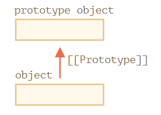

属性 `[[Prototype]]` 是内部的而且是隐藏的，但有很多设置它的方式，如使用特殊关键字 `__proto__` 它是因历史原因留下来的 getter/setter 函数，在现代 JavaScript 编程中已替换为函数 `Object.getPrototypeOf/Object.setPrototypeOf`

```js
// 原型
let animal = {
  eats: true,
  walk() {
    alert("Animal walk");
  }
};

let rabbit = {
  jumps: true
};

rabbit.__proto__ = animal;   // 将 animal 设置为 rabbit 的原型，可以说 animal 是 rabbit 的原型，或者说 rabbit 的原型是从 animal 继承而来的

alert( rabbit.eats );   // true，属性不存在于 rabbit 中，所以 JavaScript 会顺着 [[Prototype]] 引用，在 animal 中查找（自下而上）
rabbit.walk();   // Animal walk，方法也可以继承
alert( rabbit.jumps );   // true
```

:bulb: 根据规范 `__proto__` 必须仅在浏览器环境下才能得到支持，但实际上包括服务端在内的所有环境都支持它。

原型可以「无限」链接下去，构成很长的原型链；但是引用不能形成闭环，如果我们试图在一个闭环中分配 `__proto__`，JavaScript 会抛出错误。此外只能有一个 `[[Prototype]]`。一个对象不能从其他两个对象获得继承。

原型仅用于读取属性，对于写入/删除操作一般是直接在对象上进行（因此会在该对象上创建相应的属性，而不是覆盖原型的属性）。

```js
let animal = {
  eats: true,
  walk() {
    alert("Animal walk");
  }
};

let rabbit = {
  __proto__: animal   // 将 animal 设置为 rabbit 的原型
};

// 修改 walk 方法
rabbit.walk = function() {   // 直接在 rabbit 上创建方法 walk
  alert("Rabbit! Bounce-bounce!");
};

rabbit.walk();       // Rabbit! Bounce-bounce!，调用 walk 方法时在原型链从下往上寻找，由于在对象 rabbit 中找到该方法并执行，而无需使用原型
animal.walk();   // Animal walk，并不覆盖原型的方法
```

:bulb: 访问器 accessor 属性是一个例外，因为分配 assignment 操作是由 setter 函数处理的。因此写入此类属性实际上与调用函数相同，而不是在该对象上新建相应的属性。

```js
let user = {
  name: "John",
  surname: "Smith",

  set fullName(value) {
    [this.name, this.surname] = value.split(" ");
  },

  get fullName() {
    return `${this.name} ${this.surname}`;
  }
};

let admin = {
  __proto__: user,
  isAdmin: true
};

alert(admin.fullName);   // John Smith

// setter triggers!
admin.fullName = "Alice Cooper";   // 对属性 fullName 进行赋值设置，原型中有一个 setter 因此它会被调用
alert(admin.fullName);   // Alice Cooper，对属性 fullName 进行访问，调用原型 user 中的 getter 方法，但是绑定的对象是 admin
alert(user.fullName);   // John Smith，对属性 fullName 进行访问，调用原型 user 中的 getter 方法 绑定的对象是 user
```

如果使用原型的方法中存在 `this`，那么它始终是点符号 `.` 前面的对象（即指向调用的对象，而不一定是原型对象）。因此当继承的对象运行继承的方法时它们将仅修改自己的状态，而不会修改原型对象的状态。

```js
// animal 有一些方法
let animal = {
  walk() {
    if (!this.isSleeping) {
      alert(`I walk`);
    }
  },
  sleep() {
    this.isSleeping = true;   // 为调用的对象创建一个新的属性 isSleeping
  }
};

let rabbit = {
  name: "White Rabbit",
  __proto__: animal
};

// 调用原型方法，但是 this 指向的是调用的对象，即 rabbit，因此为 rabbit 创建属性 isSleeping
rabbit.sleep();

alert(rabbit.isSleeping);   // true
alert(animal.isSleeping);   // undefined（原型中没有此属性）
```

:bulb: 所以对于原型的方法，可以理解为代码是共享的，但对象状态不是。

:warning: 对于循环结构 for-in 也会迭代从原型中继承的属性；而几乎所有对象键/值获取的方法，如 `Object.keys()`、`Object.values()` 等都忽略继承的属性

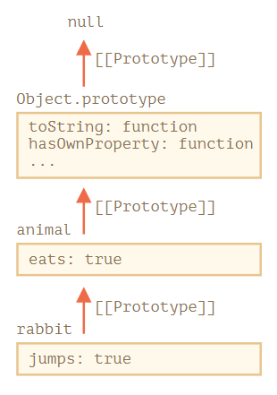

```js
let animal = {
  eats: true
};

let rabbit = {
  jumps: true,
  __proto__: animal
};

// Object.keys 只返回自己的 key
alert(Object.keys(rabbit)); // jumps

// for..in 会遍历自己以及继承的键
for(let prop in rabbit) alert(prop); // jumps，然后是 eats
```

如果想在循环结构 for-in 中排除继承的属性可以使用内建[方法 `obj.hasOwnProperty(key)`](https://developer.mozilla.org/zh/docs/Web/JavaScript/Reference/Global_Objects/Object/hasOwnProperty) 作为判断条件，如果该属性 `key` 是当前对象 `obj` 自己的（非继承的）则返回 `true`。此外由于循环结构 for-in 只会列出可枚举的属性，因此可以像全局对象原型 `Object.prototype` 那样将其属性的标志设置为 `enumerable:false`，避免在迭代时列出。

```js
let animal = {
  eats: true
};

let rabbit = {
  jumps: true,
  __proto__: animal
};

for(let prop in rabbit) {
  let isOwn = rabbit.hasOwnProperty(prop);

  // 通过条件语句过滤掉继承属性
  if (isOwn) {
    alert(`Our: ${prop}`); // Our: jumps
  } else {
    alert(`Inherited: ${prop}`); // Inherited: eats
  }
}
```

### 构造函数原型
对象可以使用构造函数 `new func()` 来创建，可以预先设置函数的属性 `func.prototype=obj` ，这样就可以在使用操作符 `new` 创建对象时，将该属性引用的对象 `obj` 设置为 `[[Prototype]]` 原型。

:bulb: 这里的 `func.prototype` 指的是 `func` 函数（函数也是对象，可以为其设置属性）具有一个名为 `"prototype"` 的常规属性，听起来与「原型」这个术语很类似，但这里我们实际上指的是具有该名字的常规属性。而起作用是在使用关键字 `new` 调用函数 `func` 创建新对象时，它才会成为新对象的原型 `[[Prototype]]`，而且 `func.prototype` 的值要么是一个对象，要么就是 `null`，其他值都不起作用。

```js
let animal = {
  eats: true
};

// 构造函数
function Rabbit(name) {
  this.name = name;
}

Rabbit.prototype = animal;   // 为函数设置 prototype 属性，其字面意思是：当创建了一个 new Rabbit 时，把它的 [[Prototype]] 赋值为 animal

let rabbit = new Rabbit("White Rabbit");   // rabbit.__proto__ == animal

alert( rabbit.eats );   // true
```

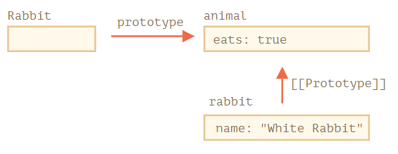

示意图 `"prototype"` 是一个水平箭头，表示一个常规属性；`[[Prototype]]` 是垂直的，表示 `rabbit` 继承自 `animal`。

:warning: 如果使用构造函数创建对象之后 `F.prototype` 属性有了变化 `F.prototype = <another object>`，那么之后通过 `new F` 创建的新对象也将随之拥有新的对象作为 `[[Prototype]]`，但已经存在的对象将保持旧有的值（因为已创建的对象是通过 `[[Prototype]]` 引用原型的，而改变 `F.prototype` 只是改变了引用指向另一个对象，因此只会影响后续通过构造函数创建的新对象的原型引用）。而如果修改方式通过构造函数的属性修改其引用对象的值，那么通过构造函数创建的对象，其原型也会变化，因为它们引用的都是同一个对象。

```js
// 构造函数
function Rabbit() {}
Rabbit.prototype = {
  eats: true
};

let rabbit = new Rabbit();   // 使用构造函数创建对象

Rabbit.prototype = {};   // 更改引用

alert( rabbit.eats );   // true，并不影响之前创建的对象

Rabbit.prototype.eats = false;   // 直接修改原型对象的内容

alert( rabbit.eats );   // false
```

实际上每个函数都有 `prototype` 属性（即使我们没有提供它），而且默认的 `prototype` 是一个只有属性 `constructor` 的对象，而属性 `constructor` 指向函数自身。

```js
function Rabbit() {}

/* default prototype
Rabbit.prototype = { constructor: Rabbit };
*/
```

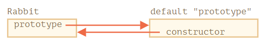

因此通过构造函数创建的对象（即使构造函数没有显性设置 `func.prototype` 属性）默认也是有原型 `[[Prototype]]`，而且可以通过原型的属性 `constructor` 可以引用构造函数本身。当我们有一个对象但不知道它使用了哪个构造器（如来自第三方库），并且我们需要创建另一个类似的对象时，可以用 `constructor` 指向构造函数的特点**基于现有的对象创建一个新对象**。

```js
function Rabbit(name) {
  this.name = name;
  alert(name);
}

let rabbit = new Rabbit("White Rabbit");

let rabbit2 = new rabbit.constructor("Black Rabbit");
```

:warning: 以上方法是在默认情况下所有函数都有 `F.prototype = {constructor：F}` 可以通过访问它的 `"constructor"` 属性来获取一个对象的构造器。但如果我们将整个默认 `prototype` 替换掉，那么其中就不会有 `"constructor"` 了，这种「曲线救国」创建类似对象的方法就无效了，因此不推荐将构造函数的整个 `func.prototpye` 属性覆盖掉，而是选择添加/删除属性到默认的 `prototype` 指向的对象；或者在覆盖 `func.prototype` 属性后，手动出现创建 `constructor` 属性，指向回构造函数。

```js
function Rabbit() {}

// 不要将 Rabbit.prototype 整个覆盖
// 可以向其中添加内容
Rabbit.prototype.jumps = true;
// 默认的 Rabbit.prototype.constructor 被保留了下来

// 重新设置构造函数的 prototype 属性，覆盖了原有的 constructor，手动添加它指回构造函数
Rabbit.prototype = {
  jumps: true,
  constructor: Rabbit
};
```

### 原生原型
属性 `prototype` 在 JavaScript 自身的核心部分中被广泛地应用，所有的内置构造函数，如对象构造函数 `new Object()` ，都设置了属性 `Object.prototype`，它指向一个拥有多种方法的巨大对象，如方法 `toString`。

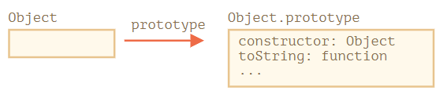

当 `new Object()` 被调用（或一个字面量对象 `{...}` 被创建），这个对象的 `[[Prototype]]` 属性被设置为 `Object.prototype` 指向的对象，即使创建的是空对象，也可以通过原型继承了对象特有的方法。

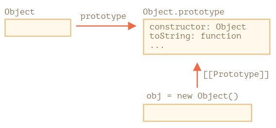

JavaScript 内建对象的构造函数，如 `Array()`、`Date()`、`Function()` 等，也通过设置各自的属性 `.prototype` 为特定的对象「挂载」许多特有的方法。而且这些对象再设置原型为 `Object.prototype`（内建原型顶端），因此还具有对象通用的方法，这就是为什么有人说「一切都从对象继承而来」。

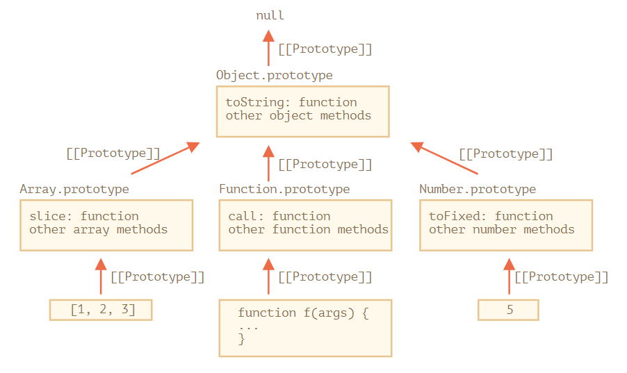

:bulb: 在 `Object.prototype` 上方的链中没有更多的 `[[Prototype]]`（其上是 `null`）

```js
// 原型链的顶端为 null。
alert(Object.prototype.__proto__); // null
```

可在原型链上设置同名的方法以实现覆盖，即优先执行下层的原型方法，如 `Array.prototype` 有自己的 `toString` 方法来列举出来数组的所有元素并用逗号分隔每一个元素。

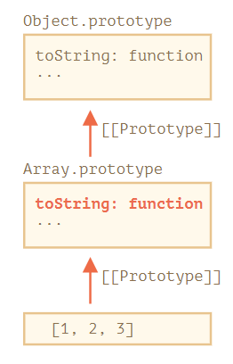

```js
let arr = [1, 2, 3]
alert(arr); // 1,2,3 <-- Array.prototype.toString 的结果
```

:bulb: 浏览器内的工具，像 Chrome 开发者控制台，会显示继承性（可能需要对内置对象使用 `console.dir`）

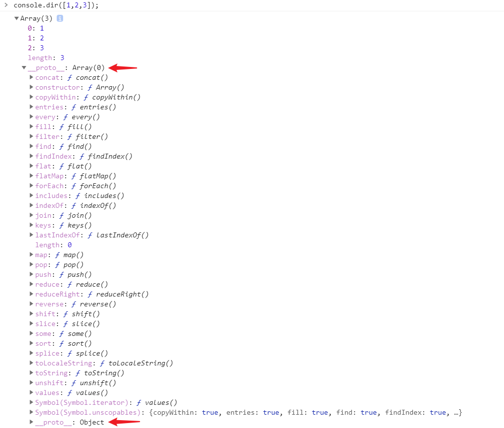

除了内置对象，**基本数据类型**也通过原型「挂载」多种方法/属性，但由于它们不是对象方式不一样略有不同。当试图访问它们的属性，那么**临时包装器对象**将会通过内建的构造器 `String`、`Number` 和 `Boolean` 被创建，它们提供给我们操作字符串、数字和布尔值的方法然后消失。这些临时对象的方法也驻留在它们的 prototype 中，可以通过 `String.prototype`、`Number.prototype` 和 `Boolean.prototype` 进行获取。

可以为原生原型添加方法/属性，且适用于该数据类型的所有个体。

```js
// 向 String.prototype 中添加一个方法，对所有的字符串都是可用的
String.prototype.show = function() {
  alert(this);
};

"BOOM!".show(); // BOOM!
```

:warning: 原生原型是全局的所以很容易造成冲突，如有两个库都添加了 `String.prototype.show` 方法，那么其中的一个方法将被另一个覆盖，所以通常来说修改原生原型被认为是一个很不好的想法。**在现代编程中，只有一种情况下允许修改原生原型，那就是 polyfilling**，即表示某个方法在 JavaScript 规范中已存在，但是特定的 JavaScript 引擎尚不支持该方法，那么我们可以通过手动实现它并用以填充内建原型。

:warning: 值 `null` 和 `undefined` 没有对象包装器，也没有相应的原型，所以它们没有方法和属性。

:bulb: 此外还可以从原型[**借用**方法](https://zh.javascript.info/call-apply-decorators#method-borrowing)，在不同类型的数据上也拥有类似的功能。

```js
let obj = {
  0: "Hello",
  1: "world!",
  length: 2,
};

obj.join = Array.prototype.join;

alert( obj.join(',') ); // Hello,world!
```

示例代码有效是因为数组的内建方法 `join` 的内部算法只关心正确的索引和 `length` 属性，它不会检查这个对象是否是真正的数组。

### 原型方法
对象的隐藏属性 `[[Prototype]]` 有很多设置它的方式，如使用特殊关键字 `__proto__` 但它在 JavaScript 规范中规定认为是过时 deprecated 且不推荐使用的，在现代 JavaScript 编程中已替换为以下方法，应该使用这些方法来代替 `__proto__`。

- [方法 `Object.create(proto, [descriptors])`](https://developer.mozilla.org/zh/docs/Web/JavaScript/Reference/Global_Objects/Object/create) 利用给定的 `proto` 作为原型 `[[Prototype]]` 和可选的**属性描述标志**来创建一个**空对象**（或带有属性标志 `descriptors` 的对象）
- [方法 `Object.getPrototypeOf(obj)`](https://developer.mozilla.org/zh/docs/Web/JavaScript/Reference/Global_Objects/Object/getPrototypeOf) 返回对象 `obj` 的原型 `[[Prototype]]`
- [方法 `Object.setPrototypeOf(obj, proto)`](https://developer.mozilla.org/zh/docs/Web/JavaScript/Reference/Global_Objects/Object/setPrototypeOf) 将对象 `obj` 的原型 `[[Prototype]]` 设置为 `proto`

```js
let animal = {
  eats: true
};

// 创建一个以 animal 为原型的新对象，且添加属性描述器为新对象提供额外的属性
let rabbit = Object.create(animal, {
  jumps: {
    value: true
  }
});

alert(rabbit.eats);   // true
alert(rabbit.jumps);   // true
alert(Object.getPrototypeOf(rabbit) === animal);   // true

Object.setPrototypeOf(rabbit, {});   // 将 rabbit 的原型修改为 {}
```

:bulb: 结合以上方法和对象属性描述符方法 `Object.create(Object.getPrototypeOf(obj), Object.getOwnPropertyDescriptors(obj))` **可以对 `obj` 进行真正准确地拷贝**，包括所有的属性（可枚举和不可枚举的），囊括了数据属性和通过 setters/getters 设置的访问器属性，并带有正确的 `[[Prototype]]`。

:warning: 虽然可以通过方法 `Object.setPrototypeOf(obj, newProto)` 或 `obj.__proto__=newProto` 可以更改对象的原型，但是这是一个非常缓慢的操作，因为它破坏了对象属性访问操作的内部优化。如果速度对于程序很重要就请不要修改已存在的对象的 `[[Prototype]]`

:warning: 如果要将一个用户生成的键放入一个对象，那么内建的 `__proto__` getter/setter 是不安全的，因为用户可能会输入 `"__proto__"` 作为键，这会造成不可预料的后果（如果键对应的值刚好也是一个对象那么键值对就可以成功绑定，该对象的原型就会被用户在不知不觉中覆盖了）。为了避免这种特殊的情况发生，我们可以使用 `Object.create(null)` 创建一个被称为  "very plain" 或 "pure dictionary" 对象（这个对象没有原型，由于 `[[Prototype]]` 是 `null`），那么这种对象使用 `"__proto__"` 作为键是没有问题的（缺点是这样的对象没有任何内建的对象的方法）；或者对此类场景坚持使用 `Map` 对象就可以了。

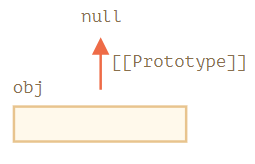

## 修饰器函数
除了在声明对象时创建对象的属性与方法，或以函数表达式的形式将对象的属性与函数绑定，还可以使用修饰器函。修饰器函数接受对象输入（对象作为参数），并装饰对象（即为对象增加某些属性或功能，并返回该对象）。

```js
// 修饰器函数 carlike 为传递进来的对象增加位置 loc 属性，并返回该对象
let carlike = function(obj, loc) {
    obj.loc = loc;
    return obj;
}

// 调用该修饰器函数 carlike，当传入对象为空 {} 时，还可以创建一个新对象 ben 增添新属性 loc
// 一般创建新对象使用 类构造函数，而修饰器函数则是用来增强对象，为对象增添新属性
var ben = carlike({}, 1);
```

:bulb: 构造函数与修饰器函数类似，都是为对象设置新的属性和方法。但**修饰器函数需要传递已有的对象**；而构造函数不需要传递对象，使用操作符 `new` 调用时会隐式创建新的空对象。

## 数组转换为对象
JavaScript 提供一个全局函数 `Object.fromEntries(arr)` 键一个由键值对组成的数组转换为对象。

对象缺少数组存在的许多方法，如 `arr.map()` ，如果我们想应用它们可以先使用方法 `Object.entries(obj)` 返回一个包含该对象所有 `[key, value]` 键值对的数组，处理后再使用 `Object.fromEntries(arr)` 将数组转换回对象

1. 使用 `Object.entries(obj)` 从 `obj` 获取由键/值对组成的数组。
2. 对该数组使用数组方法，如 `arr.map(callback)`
3. 对结果数组使用 `Object.fromEntries(array)` 方法，将结果转回成对象。

```
// 将商品价格加倍
let prices = {
  banana: 1,
  orange: 2,
  meat: 4,
};

let doublePrices = Object.fromEntries(
  // 转换为数组，之后使用 map 方法，然后通过 fromEntries 再转回到对象
  Object.entries(prices).map(([key, value]) => [key, value * 2])
);

alert(doublePrices.meat); // 8
```

:bulb: 相应地，如果需要将**可迭代或类数组对象**转换为数组，可以[使用方法 `Array.from(obj)`](./数组.md#对象转换为数组)

