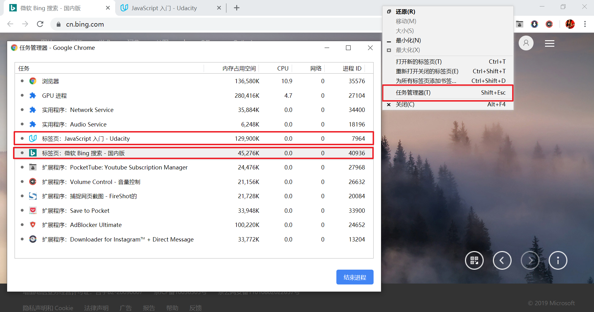

# 循环语句
循环有各种类型，但是它们本质上都实现相同的操作：重复一定次数地执行特定操作。

循环体的单次执行叫作**一次迭代**。

任何循环都具有以下三大部分：
* 何时开始：设置循环变量的起始值
* 何时停止：测试循环是否继续的逻辑条件，任何表达式或变量都可以是循环条件，它们会被隐式转换为布尔值。
* 如何转到下一项： 递增或递减步骤

:warning: 当进入无限循环中浏览器标签页会崩溃或卡住/不响应，可以采取以下方法
* 对于 Firefox 浏览器会弹出一个通知，提醒脚本不响应，并给出终止该脚本的选项（执行这一选项）
* 对于 Chrome 浏览器，可在任务栏鼠标右键打开 Chrome 任务管理器，终止运行该脚本的特定标签页进程



## for 循环
JavaScript 有多种 for 循环结构，具体区别与选择哪一种合适的循环结构可以参考优达学城前端样式指南的循环部分 [for, for-in and forEach](https://udacity.github.io/frontend-nanodegree-styleguide/javascript.html#for-in-loop)（[中译版](https://udacity.github.io/frontend-nanodegree-styleguide-zh/html/%E5%89%8D%E7%AB%AF%E5%B7%A5%E7%A8%8B%E5%B8%88%E7%BA%B3%E7%B1%B3%E5%AD%A6%E4%BD%8D%E6%A0%B7%E5%BC%8F%E6%8C%87%E5%8D%97%20-%20JavaScript.html#25-for-for-in-%E5%92%8C-foreach)）

### for 结构
for 循环结构是最常使用的循环形式，一般知道需要循环的次数，因此常常借助「计数」变量控制循环次数。

```js
for (begin; condition; step) {
  // 循环体
}
```

需要在关键字 `for` 后的小括号 `()` 里明确定义循环参数的初始化 `begin`、判断循环是否继续进行的条件 `condition` 和循环的「步长」`step`。

:bulb: for 循环的任何语句段都可以被省略，只要在另外的地方进行合适的定义。

```js
// 省略 begin 语句段
let i = 0; // 已经在循环结构外部声明了 i 并对它进行了赋值

for (; i < 3; i++) {   // 不再需要 begin 语句段
  alert( i );   // 0, 1, 2
}

// 省略 step 语句段
let i = 0;

for (; i < 3;) {
  alert( i++ );   // 在循环体内设置 step 自增计数变量
}

// 创建一个无限循环

for (;;) {
  // 无限循环
}
```

|       语句段        |                            作用                            |
| :-------------------: | :---------------------------------------------------------: |
|      `begin`       |                   进入循环时执行一次                   |
|    `condition`    | 在每次循环迭代之前检查，如果为 `false` 停止循环 |
| `body`（循环体） |                  条件为真时，重复运行                  |
|       `step`        |                在每次循环体迭代后执行                 |

:warning: for 结构中的两个 `;` 必须存在，否则会出现语法错误。

```js
// 输出了 0-5 的每个值
for (var i = 0; i < 6; i = i + 1) {
  console.log("Printing out i = " + i);
}
```

:cinema: [分步讲解 For 循环](https://www.jianguoyun.com/p/DdrSCXYQjNDGBxiT--AD)


往返重复的迭代流程：
* 首先在开始循环时先通过 `start` 初始化（然后执行首次 `stop` 条件判断，满足后即进入循环主体）
* 每次检查 `condition` 后结果为 `true` 才执行 `body` 和 `step`
* 执行完一次迭代后，先执行 `step` 对变量进行更新，再进行 `stop` 条件判断


:bulb: 循环可以通过嵌套构成更复杂的结构

:warning: 在循环结构中，「计数」变量是在循环中声明的，称为 **「内联」变量声明**，因此只能在循环中可见，这种变量应该**使用关键字 `let` 声明**。

### for-in 结构
使用 for-in 结构可以方便遍历对象属性中的每个**键**

```js
for(key in object) {
    code_block
}
```

:bulb: 迭代变量 `key` 获取的是 `object` 对象的**键**（而非元素本体或属性值 `value`），如需要获取对象的元素，可利用点记法 `object.key` 或括号记法 `object[key]` 进行访问

```js
// 依次输出对象所有的元素
myObj = {'country1':'Germany', 'country2':'Argentina'};
for (let key in myObj){   // 所有的 for 结构体都允许我们在循环中定义变量，像这里的 let key
    console.log(myObj[key]);
    }
}
```

:bulb: 循环遍历顺序按照属性创建的顺序，但存在 **整数属性** 则会被进行排序（整数属性是指一个可以在不作任何更改的情况下转换为整数的字符串，以这个字符串作为属性名，如 `"49"` 字符串作为属性名的属性就是整数属性，而 `"+49"` 字符串作为属性名的属性就不是整体属性）

:warning: 因为 for-in 结构循环遍历访问所有可枚举的属性，这意味着如果向对象/数组的[原型中添加任何其他属性，这些属性也会出现在循环中](http://stackoverflow.com/questions/500504/why-is-using-for-in-with-array-iteration-a-bad-idea)。由于 for-in 结构对于数组和对象存在不一致的行为， 因此 **[不建议使用 for-in 结构遍历数组](https://websanova.com/blog/javascript/why-javascript-for-in-loops-are-bad)**，应使用标准 `for` 循环或数组特有的[方法 `forEach()`](https://developer.mozilla.org/zh-CN/docs/Web/JavaScript/Reference/Global_Objects/Array/forEach) 遍历其元素。

```js
Array.prototype.decimalfy = function() {
  for (let i = 0; i < this.length; i++) {
    this[i] = this[i].toFixed(2);
  }
};

const digits = [0, 1, 2, 3, 4, 5, 6, 7, 8, 9];

for (const index in digits) {
  console.log(digits[index]);
}

// 输出结果除了数组元素，还会输出数组原型中添加的方法（具体代码）
```

:warning: 数组方法 `forEach()` 在循环中也无法停止或退出（如果希望在循环中使用 `break` 语句停止或退出循环，则需要使用基本的 for 循环结构）

:warning: 使用 for-in 循环对象时，会忽略使用 `Symbol(...)` 作为键的属性

### for-of 循环
for-of 循环方法是后来新增的 JavaScript 循环结构，结合了 for 循环和 for-in 循环结构的优势，**忽略索引可直接获取元素**。可以循环任何可迭代（即遵守[可迭代协议](https://developer.mozilla.org/zh-CN/docs/Web/JavaScript/Reference/Iteration_protocols)）类型的数据。

默认情况下可迭代的数据类型（:warning: 不包含 `Object` 数据类型，即 `{}`，默认情况下对象不可迭代）：
* `String`
* `Array`
* `Map`
* `Set` 集合是 ES6 中的全新内置对象

:bulb: 与 for-in 结构相比，for-of 循环结构的一个优点是不用担心当向对象中添加新的原型时造成的问题，因为它只循环访问对象中的值。

```js
const digits = [0, 1, 2, 3, 4, 5, 6, 7, 8, 9];
// for...of 循环的编写方式和 for...in 循环的类似，迭代参数是指元素本身，而不是索引
// 输出偶数
for (const digit of digits) {
  if (digit % 2 === 0) {
    continue;
  }
  console.log(digit);
}
```

:bulb: 在循环结构中变量一般的命名约定，使用复数对象名称来表示多个值的集合，而迭代参数使用单数来表示集合中的单个值。

### forEach() 方法
`forEach()` 是数组的内置方法，只能用于遍历数组每一个元素，一般接受一个回调函数，对每个元素执行一次回调函数的处理。

```js
mySimpleArray = ['a', 1, 'etc'];

// 回调函数在控制台依次输出数组的每一个元素
mySimpleArray.forEach(function(val) {
    console.log(val);
});
```

## while 循环
当事先未知循环次数时，可以使用 while 循环。一般判断条件使用的是外部变量（在循环体外部声明的变量，并已进行初始化）。

### while 结构

```js
while (condition) {
  // 循环体
}
```

循环是否继续进行的 `condition` 判断条件在 `while` 关键字后的小括号 `()`内，当条件为 `true` 时执行循环体，且在循环体内对变量进行修改（递增或递减）

```js
var start = 0;  // 初始化循环变量

// 在控制台打印数字 0-9
while (start < 10) {   // 继续执行循环体的判断条件
  console.log(start);
  start = start + 1;   // 递增变量
}
```

:bulb: 如果循环体只有一条语句，则可以省略大括号 `{}`

### do-while 结构
使用 do-while 结构可以将条件检查移至循环体下面，这样就可以开始时**首先执行循环体**，然后检查条件，当条件为真时，重复执行循环体。

```js
do {
    // 循环体
} while(condition)
```

:bulb: 这种形式的语法很少使用，除非你希望不管条件是否为真，**循环体 至少执行一次**。

## 跳出循环
使用 break 指令、continue 指令、break/continue 标签跳出循环。

### break 指令
通常条件为假时循环会终止，但可以使用 [`break` 指令](./中断语句.md)强制退出当前循环体。

:bulb: 无限循环和 `break` 组合，非常适用于不必在循环开始/结束时检查条件，但需要在中间甚至是主体的多个位置进行条件检查的情况。

```js
// 接受用户输入一系列数字，在输入的内容不是数字（或取消输入）时终止循环
let sum = 0;

while (true) {
  let value = +prompt("Enter a number", '');
  if (!value) {
      break;   // 跳出循环
  }
  sum += value;
}

alert( 'Sum: ' + sum );   // 输出所有键入数字之和
```

:warning: `break` 指令只能跳出一层循环

### continue 指令
`continue` 指令是 `break` 的「轻量版」，它不会停掉整个循环而是**停止当前这一次迭代**，并强制启动新一轮循环（如果条件允许的话）。

```js
// 依次在弹出的模态窗口展示奇数 1~9
for (let i = 0; i < 10; i++) {

  //如果为真，跳过循环体的剩余部分。
  if (i % 2 == 0) continue;

  alert(i); // 1, 3, 5, 7, 9
}
```

:warning: 禁止 `break` 或 `continue` 在三元运算符 `?` 的右边。因为会造成代码停止运行，并显示有语法错误。

## break/continue 标签
`break` 与 `continue` 都只能针对所在的一层循环，对于嵌套循环需要一步跳出，可以结合 `label` 标签使用。

```js
labelName: for(begin, condition, step) {
    // 循环体
    if(condition) break labelName;
}
```

标签是在**循环之前**带有冒号 `:` 的标识符，使用 `break labelName` 跳出标签后的循环，代码在标识的循环之后继续运行。

`continue labelName` 也是相似的用法。

```js
outer:
for (let i = 0; i < 3; i++) {
  for (let j = 0; j < 3; j++) {
    let input = prompt(`Value at coords (${i},${j})`, '');
    // 如果是空字符串或被取消，则中断并跳出这两个循环。
    if (!input) break outer; // (*)
    // 用得到的值做些事……
  }
}
alert('Done!');
```
当触发 `break outer` 时，程序会向上寻找名为 `outer` 的标签并其后指代的所有循环，控制权直接从 `(*)` 转至 `alert('Done!')`

:warning: 标签并不允许「跳到」所有位置，只有在循环内部才能调用 `break` 或 `continue`，并且标签必须位于**指令上方**的某个位置。