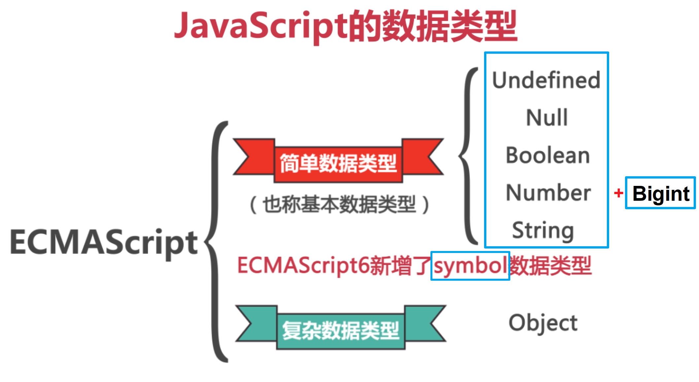

# 数据类型
## 基本数据类型
JavaScript 是动态类型 dynamically typed 的编程语言，（可修改的）变量可以保存任何数据，且数据类型也可以不同。

JavaScript 支持 8 种 primitive data type 基本数据类型：
* **`number` 数字类型**：代表整数和浮点数，还有特殊数值
* **`bigint` 类型**：用于表示任意长度的整数
* **`string` 字符串**：一个字符串可以包含一个或多个字符，必须被括在引号里
* **`boolean` 逻辑类型**：仅含两个布尔值，即 `true` 和 `false`
* **`null` 空值类型**：只包含 `null` 值，表示 value of nothing 空值/没有值
* **`undefined` 未被赋值类型**： 只包含 `undefined` 值，表示 absence of value 缺少值（连表示无的值也没有）
*  **`symbol` 标识符类型**：用于创建对象的唯一标识符
* **`object` 对象类型**：包括内置对象和自定义创建的对象



### number 类型
数字类型的数据包括任何正负整数以及小数（JavaScript 不区分浮点数和整数，数字都以 64 位浮点数形式存储）。

number 类型数据可进行算术运算，如乘法 `*`、除法 `/`、加法 `+`、减法 `-` 等等。

还包括 special numeric values 特殊数值（一般通过除以 0 产生）：
* 无穷大 `Infinity` 正数除以 `0` 产生
* 负无穷大 `-Infinity` 负数除以 `0` 产生
* 计算错误 `NaN` 表示非数值 Not a Number，虽然属于 number 类型的一种，但它是一个不正确的或者一个未定义的数学操作所得到的结果，通常作为数字运算存在错误的返回值。

:warning: `NaN` 是粘性的，即任何对 `NaN` 的进一步操作都会返回 `NaN`

:warning: **值 `NaN` 是独一无二的，它不等于任何东西，包括它本身**，因此不能使用类似于 `variable === NaN` 的结构来检测参数是否为 `NaN`（因为无论变量为何值结果都为 `false`），可以使用函数 `isNaN(value)` 来测试参数 `value` 是否为非数值，返回一个布尔值。:bulb: 但是函数 `isNaN()` 会对传递进来的实参先进行**类型转换**为数值，再进行检测判断，所以仅由数值构成的字符串，如 `"16"` 函数返回值为 `false`（即认为它是数值） 。

* 如果一个 `typeof(value)` 输出是 `number` 类型，而且 `isNaN(value)` 返回为 `true` 那么它就是 `NaN`
* 其他类型的值也会在 `isNaN(value)` 返回 `true` 但它们不是 `number` 类型，但也不是 `NaN`

### bigint 类型
bigint 类型是最近被添加到 JavaScript 语言中的，用于表示任意长度的整数。因为`number` 类型无法代表大于 2^53^（或小于 -2^53^）的整数（大约是 16 位的十进制数字），当需要表示很大的数字时，可以使用 `BigInt` 类型，**将 `n` 附加到整数字段的末尾**。

```js
// 尾部的 n 表示这是一个 BigInt 类型
const bigInt = 1234567890123456789012345678901234567890n;
```

### string 类型
有三种包含字符串的方式
* 双引号 `"string"`
* 单引号 `'string'`
* 反引号 &#96;string&#96; **功能扩展引号**。允许添加变量或表达式（包装在 `${expression}` 中），变量值或表达式的计算结果会成为字符串的一部分，以构建灵活多变的字符串。

```js
let name = "John";

// 嵌入一个变量
alert( `Hello, ${name}!` ); // Hello, John!
```

### boolean 类型
boolean 类型仅包含两个值 `true` 和 `false`

### null 值
null 值构成了一个独立的类型，只包含 `null` 值。
相比较于其他编程语言，JavaScript 中的 `null` 仅仅是一个代表「无」、「空」或「值未知」的特殊值。

一般预期变量未来可能用于存储对象，可以将变量初始化的值设置为 `null`（也可以是 `{}`）

:bulb: 如果变量未来用于存储字符串，可以初始化时设置为 `""`（空字符串）

### undefined 值
undefined 值自成一个类型，只包含 `undefined` 值。
表示 absence of value 缺少值（连表示无的值也没有）即表示未被赋值，当变量定义没有初始值时 `console.log(x)` 返回 `undefined`

:bulb: `undefined` 是派生自 `null` 的，它只与 `null` 相等，不会与其他值相等。因此在相等性检测 `==` 或 `!=` 中两者相等（完全相等 `===` 或 `!==` 比较就不同了），而且两者在相等性检测时**不会**进行任何的类型转换。

### object 类型
object 类型用于储存数据集合和更复杂的实体，通过该类型可以定制化各种数据类型结构。

除了 object 类型的其他基本数据类型称为**原生类型**，它们的值只包含一个单独的内容，如字符串、数字或者其他之一；而对象类型是复杂数据类型，可以包括多种值，而且数据类型也可以不同，还可以包括方法（函数）

:bulb:  函数属于对象类型，在 JavaScript 中函数也是一种对象

### symbol 类型
对象属性名不仅可以是字符串，还可以是 symbol 类型的值，它表示唯一标识符，是一种不可变的数据类型。

使用 `Symbol(["description"])` 创建这类数据的值，其中描述是可选的。

因为是唯一标识符，所以**即使描述是相同的但该值却是不同的**。

:warning: symbol 值的描述只是一个标签，不是标识符本身，因此不可以通过描述访问/表示该值。

```js
// 创建唯一标识符
const sym1 = Symbol('banana');
const sym2 = Symbol('banana');
// 无论描述是什么，每次都创建新的标识符，因此以上创建的 sym1 和 sym2 是两个不同的标识符
console.log(sym1 === sym2); // false
```

## 查询类型
使用运算符 `typeof` 查询数据类型，返回值属于字符串类型，支持两种语法形式：
* 运算符 `typeof x`
* 函数形式 `typeof(x)`

```js
typeof 10   // "number"

typeof('this is string')   // "string"
```

:warning: 当查询 `typeof null` 返回 `"object"`，这是 JavaScript 编程语言的一个错误，实际上它并不是一个 `object`。

:bulb: 函数会被作为特殊类型对待，实际是属于 Object 对象数据类型

```js
typeof function(){} == "function" // 函数被特殊对待
```

## 隐式类型转换
JavaScript 是一种松散类型的语言，即在声明变量时不需要指定数据类型，引擎解析代码时会自动将数据转换为正确的类型（即隐式类型转换），如 `alert()` 函数会自动将任何传递进入的值转换为字符串，而算术运算符会将数据转换为数字类型。

:bulb: 对数据类型要求不同的两种编程语言：
* 强类型语言：一种当数据与预期类型不完全相符时很有可能会产生错误的语言，如 Java
* 松散类型语言：不需要指定数据类型（如创建变量时不需要指定数据类型），根据所需自动转换数据类型的语言，如 JavaScript，但可能会产生因为隐式类型转换而导致的错误，并且难以诊断。

:warning: 由于 JavaScript 存在数据类型的隐式转换，因此在比较数据是否相等时最好使用**绝对比较**的方法，在 `==` 和 `!=` 运算符的末尾再添加一个 `=`，即用 `===` 和 `!==` 符号进行比较。这样就可以将数据类型和数据值都纳入考虑范围，避免隐式类型转换引起的错误。

```javascript
// 使用 `==` 运算符时 JavaScript 首先将字符串 `"1"` 会被转换为 `true`，再进行比较
"1" == true    // true

"1" === true    // false
```

## 类型转换
使用相应的类型转换函数将数据显式地转换为期望的类型。

* `value.toString()` 将其他数据类型的值转换为字符串类型，如果不知道需要转换的值是不是 `null` 或 `undefined` 可以使用函数 `String(value)` 将任何数据类型的值转换为字符串类型
    :bulb: 一般基础数据类型都有相应的 `.toString` 方法，当数据类型是对象时，可以为对象设置 `toString` 方法，以指定转换为字符串时应该返回的值
* `Number()` 转换为数字类型。当我们**从 string 类型源（如文本表单）中读取一个值**，但期望输入一个数字时，通常需要进行显式转换，转换字符串时会忽略首尾处的空格字符

    `Number(value)` 转换规则

    | 原始值类型          | 转换为                                                                                                                                                               |
    | :--------------------- | :-------------------------------------------------------------------------------------------------------------------------------------------------------------------- |
    | `undefined`        | `NaN`                                                                                                                                                               |
    | `null`               | `0`                                                                                                                                                                  |
    | `true` 和 `false` | `1` 和 `0`                                                                                                                                                          |
    | `string`            | 纯数字字符串中含有的数字；如果字符串为空，包括 `\t`、`\n` 以及空格，转换为 `0`；如果不是纯数字字符串，转换出现 error 返回 `NaN`。 |

:bulb: 对于以数值开头的字符串，可以使用[方法 `parseInt(str)` 或 `parseFloat(str)`](./number类型.md#从字符串「读取」数字) 提取其中的数值部分。

* `Boolean(value)` 转换为布尔值。在逻辑运算中会隐式发生。
    `Boolean()` 转换规则
    * 「空」的值，如 `0`、空字符串、`null`、`undefined`、`NaN` 将变为 `false`
    * 「非空」其他值变成 `true`。:warning: 字符串 `"0"` 和只有空格组成的字符串 `" "` 都转换为 `true`，因为这是「非空」字符串。

## 原始类型
在 8 种基本数据类型中，对象 object 类型比较特殊，因为它能够通过键值对的形式存储多个值作为属性；而其他 7 种数据类型每次都只能有一个值，称为原始 primitive 类型。

对象数据类型优势之一是可以把一个函数作为对象的属性存储起来，方便进行调用；但这造成**对象比原始类型「更重」**，需要额外的资源来支持对象的运作。

其实原始类型的值也可以作为对象使用，有多种内置方法方便调用以对数据进行处理，如 `str.toUpperCase()` 将字符串转换为全大写。

当需要访问原始类型数据的方法或属性时，JavaScript 会为使用「对象包装器」（对于每一种原始类型都不同，分别称为 `String`、`Number`、`Boolean` 和 `Symbol`）创建一个包含该原始类型值的特殊对象，**执行完属性或方法调用返回结果即被销毁**，该值最终依然只是一个原始数据值（而非对象），所以原始类型可以提供方法，JavaScript 引擎高度优化了这个过程，因此它们依然是「轻量级」的。

```js
let str = "Hello";

alert( str.toUpperCase() ); // HELLO
```

以下是 `str.toUpperCase()` 中实际发生的情况：

1. 字符串 `str` 是一个原始值，在访问其属性时会创建一个包含字符串字面值的特殊对象，并且具有有用的方法，如 `toUpperCase()`
2. 该方法运行并返回一个新的字符串（由 `alert` 显示）
3. 特殊对象被销毁，只留下原始值 `str`

:warning: 构造器 `String`、`Number`、`Boolean` 仅供内部使用，虽然允许我们使用 `new Number(1)` 或 `new Boolean(false)` 等语法明确地为原始类型创建「对象包装器」，但**极其不推荐**，因为在条件判断时对象始终为 `true`，而原始数据类型可以进行隐式类型转换。

:bulb: 特殊的原始类型 `null` 和 `undefined` 是例外，它们没有对应的「对象包装器」，也没有提供任何方法，它们是「最原始的」。