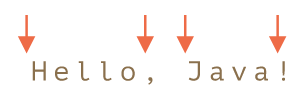
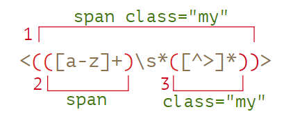

# 正则表达式
参考：
* [正则表达式 | javascript.info](https://zh.javascript.info/regular-expressions)
* [正则表达式 - JavaScript | MDN](https://developer.mozilla.org/zh-CN/docs/Web/JavaScript/Guide/Regular_Expressions)
* [RegExp - JavaScript | MDN](https://developer.mozilla.org/zh-CN/docs/Web/JavaScript/Reference/Global_Objects/RegExp#character-classes)
* [JS正则表达式完整教程（略长）](https://juejin.im/post/5965943ff265da6c30653879) | [pdf](./attachments/JavaScript正则表达式迷你书（1.1版）.pdf)

正则表达式 regexp, reg 使用普通字符或普通字符与特殊字符组成的文字模式，它包含 **模式** 和可选的 **修饰符**，该模式用于查找匹配字符串中字符组合，它是一个**查找和替换字符串的强有力的工具**。

:bulb: 在 JavaScript中，正则表达式也是对象。

## 创建正则表达式
创建一个正则表达式对象有两种语法。

* 方法一：正则表达式字面量

使用一个正则表达式字面量创建正则表达式，其由包含在斜杠 `//` 之间的模式组成，斜杠 `/` 会告诉 JavaScript 我们正在创建一个正则表达式，它的作用类似于字符串的引号。

:bulb: 通常我们使用的都是简短语法 `/reg/`但是它**不接受任何变量插入**，所以我们必须在写代码的时候就知道确切的 regexp，因此当正则表达式保持不变时，使用此方法可获得更好的性能。

```javascript
var reg = /ab+c/;
```

* 方法二：构造函数 `RegExp()`

调用 RegExp 对象的构造函数 `RegExp()` 创建正则表达式。以字符串形式（使用双引号 `""` 输入）。

:bulb: 该方法可以动态地构造模式，当正则表达式的模式将会改变，或者不知道模式需要从其他来源获取它，如用户输入，可使用该方法。


```javascript
let search = prompt("What you want to search:");
let regexp = new RegExp(search);
```

## 用法
正则表达式有多种[方法](https://zh.javascript.info/regexp-methods)。

### search()
如果要获取匹配项的**索引**，可以使用 [`str.search(regexp)` 方法](https://developer.mozilla.org/zh/docs/Web/JavaScript/Reference/Global_Objects/String/search) ，返回匹配项在字符串中的索引（第一个匹配项）；如果没有匹配项就返回 `-1`。

```js
let str = "I love JavaScript!";   // 将在这里搜索

let regexp = /love/;
alert( str.search(regexp) );   // 2
```

### match()
如果要获取匹配的**字符串**，可以使用 [`str.match(regexp)` 方法](https://developer.mozilla.org/zh-CN/docs/Web/JavaScript/Reference/Global_Objects/String/match)，返回返回一个数组；如果没有匹配项，我们得到的不是一个空数组，而是 `null`。

* 如果正则表达式尾部有 `g` 标志会返回与完整正则表达式匹配的所有结果，但不会返回**捕获组**
* 如果正则表达式尾部没有使用 `g` 标志就会返回第一个完整匹配（作为数组的第 `0` 项）及其相关的捕获组（作为数组的第 `1` 及第 `1+` 项）

:bulb: 这些方法都需要传入正则表达式对象作为参数，如果传入一个非正则表达式对象，则会隐式地使用 `new RegExp()` 将其转换为一个 RegExp。

### test()
如果希望基于字符串中是否有匹配项返回一个**布尔值**，可以使用 [`regexp.test(str)` 方法](https://developer.mozilla.org/zh-CN/docs/Web/JavaScript/Reference/Global_Objects/RegExp/test)，如果正则表达式与指定的字符串匹配 ，返回 `true`；否则`false`。

:warning: 相同的全局正则表达式在不同的源字符串上测试可能会失败，因为 `regexp.test` 的调用会增加 `regexp.lastIndex` 属性值，因此在另一个字符串中的搜索可能是从非 0 位置开始的。如要解决这个问题，我们可以在每次搜索之前设置 `regexp.lastIndex = 0`。或者，不调用正则表达式的方法，而是使用字符串方法 `str.match/search/...`，这些方法不用 `lastIndex`。

```js
let regexp = /javascript/g;  // （新建 regexp：regexp.lastIndex=0)

// 在同一文本上调用 regexp.test 两次
alert( regexp.test("javascript") ); // true（现在 regexp.lastIndex=10）
// 在第二个测试中 regexp.lastIndex 不为零
alert( regexp.test("javascript") ); // false`
```


### replace()
字符串方法 `str.replace(regexp, replacement)` 用第二个参数 `replacement` 替换 `str` 中匹配 `regexp` 的捕获组，其中参数 `replacement` 可以使用 `$n` 来反向引用相应的捕获组，其中 `n` 是组号（索引）。

```js
let str = "John Bull";
let regexp = /(\w+) (\w+)/;

alert( str.replace(regexp, '$2, $1') ); // Bull, John
```

: 有一个陷阱：当 `replace` 的第一个参数是字符串时，它仅替换第一个匹配项。

```js
// 用冒号替换连字符
alert('12-34-56'.replace("-", ":")) // 12:34-56
```

如要找到**所有**的连字符，不应该用字符串 `"-"`，而应使用**带 `g` 修饰符**的正则表达式 `/-/g`

```js
// 将连字符替换为冒号
alert( '12-34-56'.replace( /-/g, ":" ) )  // 12:34:56
```

:warning: 另一个陷阱：当 `replace` 的第二个参数是字符串，仅替换第一个匹配项，应该使用回调函数（一个用来创建新子字符串的函数）可以对每次匹配都调用。

:warning: 原字符串不变，而是返回修改了的匹配字符。

## 模式修饰符
正则表达式的修饰符可能会影响搜索结果。如果不使用修饰符和特殊标志，正则表达式的搜索就等同于单纯的子字符串查找；而使用了修饰符后可以「扩展」正则表达式的匹配范围。

在 JavaScript 中有 5 个修饰符：

* `i` ignoreCase 搜索时不区分大小写（搜索默认是区分大小写的）。

```js
let str = "I love JavaScript!";

alert( str.search(/LOVE/) ); // -1（没找到）
alert( str.search(/LOVE/i) ); // 2
```

* `g` global 搜索时会查找所有的匹配项，而不只是第一个。

* `m` multiline 多行模式，这仅仅会影响 `^` 和 `$` 锚符的行为。在多行文本中，默认情况下锚符 `^` 仅仅匹配文本的开头，而在多行模式下，锚符 `^` 就**可以匹配每一行的开头**；锚符 `$` 行为也相似。

```js
let str = `
  1st place: Winnie
  2nd place: Piglet
  33rd place: Eeyore`;

alert( str.match(/^\d+/g) );   // 1
alert( str.match(/^\d+/gm) );   // 1, 2, 33
alert( str.match(/\w+$/gim) );   // Winnie,Piglet,Eeyore
```

* `u` 开启完整的 unicode 支持。该修饰符能够修正对于**代理对**的处理。更详细的内容见 [Unicode：修饰符 尾部 `"u"` 和 `class \\p{...}`](https://zh.javascript.info/regexp-unicode)。

* `y` 粘滞模式

## 特殊的符号
一个正则表达式模式 Regexp 一般是由简单的字符和可选的特殊含义的符号（**一般与符号 `\` 构成**）组合而成的，这些特殊的符号用以添加额外的匹配规则。

### 字符类
字符类 Character classes 是一个特殊的符号，匹配特定类型的符号

最常用的字符类：

* `\d`（取自 digit）匹配数字：从 `0` 到 `9` 的字符。

* `\s`（取自 space）匹配空格符号：包括空格，制表符 `\t`、换行符 `\n` 和其他少数稀有字符（如 `\v`，`\f` 和 `\r`）。

* `\w`（取自 word ）匹配单个字符：拉丁字母或数字或下划线 `_`。
    :warning: 非拉丁字母（如西里尔字母或印地文）不属于 `\w`。

* `.` 匹配**除换行符之外**的任何字符。:warning: 点 `.` 表示任何字符，但不是「缺少字符」，即必须有一个与之匹配的字符。
    :bulb: 可以在正则表达式后使用 **`s` 修饰符**让字符 `.` 匹配字符包括换行符，即可以匹配所有字符，:warning: 但是这个标志浏览器兼容性较差。
    :bulb: 可以使用模式 `[\s\S]` 匹配空格字符或非空格字符，即匹配任何字符。

```js
alert( "CS4".match(/CS.4/) ); // null, no match because there's no character for the dot

alert( "A\nB".match(/A.B/) ); // null (no match)
alert( "A\nB".match(/A.B/s) ); // A\nB (match!)
alert( "A\nB".match(/A[\s\S]B/) ); // A\nB (match!)
```

通过组合这些字符类可以匹配一类特定的字符串

```js
alert( "I love HTML5!".match(/\s\w\w\w\w\d/) ); // ' HTML5'
```


:bulb: 对于每个字符类，都有一个**反向类**，用相同的字母表示但要以**大写**书写形式。「反向」表示它与相应的**余下字符**匹配

* `\D` 匹配非数字字符：除 `\d` 以外的任何字符，如字母。

* `\S` 匹配非空格符号：除 `\s` 以外的任何字符，如字母。

* `\W` 匹配非单字字符：除 `\w` 以外的任何字符，如非拉丁字母或空格。

### 锚点
符号 `^` 和 `$` 称为锚点，在正则表达式中插入符号 `^` 匹配文本开头，符号 `$` 则匹配文本末尾，而不匹配字符串中间的部分。

:bulb: 这两个锚点 `^regexp$` 放在一起常常被用于测试一个字符串是否**完全匹配**一个模式，如测试用户的输入是否符合正确的格式。

```js
// 测试字符串是否属于 12:34 格式的时间
let goodInput = "12:34";
let badInput = "12:345";

let regexp = /^\d\d:\d\d$/;
alert( regexp.test(goodInput) );   // true
alert( regexp.test(badInput) );   // false
```

:warning: 锚点 `^` 和 `$` 属于测试，它们的**宽度为零**，即它们并不匹配一个具体的字符，而是让正则引擎测试所表示的条件（在文本开头/文本末尾开始匹配）。
:bulb: 可以分别用 `startsWith/endsWith` 来代替符号 `^` 和 `$`

### 边界词
词边界 `\b` 是一种检查，就像 `^` 和 `$` 一样，它可以限定正则表达式引擎仅检查字符串的**词边界**，即检查位置的一侧是否匹配 `\w`，而另一侧则不匹配 `\w`。

有三种不同的位置可作为词边界：

- 在字符串开头，如果**第一个字符是单词字符 `\w`**
- 在字符串中的两个字符之间，**其中一个是单词字符 `\w`，另一个不是**
- 在字符串末尾，如果**最后一个字符是单词字符 `\w`**

字符串 `Hello, Java!` 词边界位置如下标注



```js
alert( "Hello, Java!".match(/\bHello\b/) ); // Hello
alert( "Hello, Java!".match(/\bJava\b/) );  // Java

// 因为 l 之后没有词边界，因此 \bHell\b 没有匹配项
alert( "Hello, Java!".match(/\bHell\b/) );  // null (no match)
// 因为感叹号不是单词 \w，所以其后没有词边界，因此 Java!\b 没有匹配项
alert( "Hello, Java!".match(/\bJava!\b/) ); // null (no match)
```

:bulb:  `\b` 既可以用于检查单词（但不适用于其他字符，如西里尔字母 cyrillic letters 或象形文字 hieroglyphs），也可以用于数字。

```js
// 查找时间的格式为 hours:minutes 的匹配项
// 其中小时和分钟都是两位数，如 09:00
console.log( "Breakfast at 09:00 in the room 123:456.".match( /\b\d\d:\d\d\b/ ) ); // 09:00
```

### 集合和范围
在方括号 `[…]` 中的几个字符或者字符类意味着「搜索给定的字符中的**任意一个**」。

:bulb: 字符类是某些字符集的简写

- **\\d** 和 `[0-9]` 相同，
- **\\w** 和 `[a-zA-Z0-9_]` 相同，
- **\\s** 和 `[\t\n\v\f\r ]` 外加少量罕见的 unicode 空格字符相同。

:bulb: 如果我们需要匹配特殊字符本身，一般需要在正则表达式中对这些特殊字符进行转义。在方括号表示中绝大多数特殊字符**可以在不转义的情况下使用**，如查询模式 `[.,]` 将会寻找一个为点或者逗号的字符；但是如果你为了「以防万一」转义了它们，这也不会有任何问题：

- 表示一个点符号 `'.'`
- 表示一个加号 `'+'`
- 表示一个括号 `'( )'`
- 在开头或者结尾表示一个破折号（在这些位置该符号表示的就不是一个范围，当它位于其它字符之间有特殊含义，表示范围）`[-pattern]` 或 `[pattern-]`
- 在不是开头的位置表示一个插入符号（在开头位置该符号表示的是排除）`'^'`
- 表示一个开口的方括号符号 `'['`

```js
// 并不需要转义
let reg = /[-().^+]/g;
alert( "1 + 2 - 3".match(reg) ); // 匹配 +，-

//转义其中的所有字符
let reg = /[\-\(\)\.\^\+]/g;
alert( "1 + 2 - 3".match(reg) ); // 仍能正常工作：+，-
```

#### 集合
方括号 `[…]` 罗列多个需要匹配的字符集合，但它们在匹配中只会对应其中的一个。

```js
// 查找 [t 或者 m]（不区分大小写），然后再匹配 "op"
alert( "Mop top".match(/[tm]op/gi) ); // "Mop", "top"

// 查找 "V"，然后匹配 [o 或者 i]，之后再匹配 "la"
// 由于只匹配集合中的一个字符就跳出集合，o 匹配上了，然后正则表达式的 l 和字符串之后的 i 就不匹配了
alert( "Voila".match(/V[oi]la/) ); // null，并没有匹配上
```

:bulb: 可以在 `[…]` 里面使用字符类，如想要查找单词字符 `\w` 或连字符 `-`，则该集合为 `[\w-]`

#### 范围
方括号 `[…]` 中可以是字符的（多个）范围，如 `[a-z]` 会匹配从 `a` 到 `z` 范围内的字母；`[0-5]` 表示从 `0` 到 `5` 的数字。

```js
// 首先匹配 "x" 字符
// 再匹配两个数字或者位于 A 到 F 范围内的字符
alert( "Exception 0xAF".match(/x[0-9A-F][0-9A-F]/g) ); // xAF
```
:bulb: `[0-9A-F]` 表示两个范围，但它搜索（匹配）一个字符，满足数字 `0` 到 `9` 或字母 `A` 到 `F`；如果还想查找小写字母，则可以添加范围 `a-f`（即 `[0-9A-Fa-f]`）或添加修饰符 `i`。

由于字符类 `\w` 是简写的 `[a-zA-Z0-9_]`，因此无法找到中文象形文字，西里尔字母等。可以使用集合编写一个更通用的模式，该模式可以查找任何语言中的文字字符，使用 [Unicode 属性](https://zh.javascript.info/regexp-character-sets-and-ranges#shi-li-duo-yu-yan-w)：`[\p{Alpha}\p{M}\p{Nd}\p{Pc}\p{Join_C}]`

:bulb: 除了普通的范围匹配，还可以在匹配查询集合或范围的**开头添加符号 `^` 来表示排除给定字符**之外的任意字符的匹配。

```js
// 匹配除了数字、空格、字母 A 到 Z 或 a 到 z之外的字符
alert( "alice15@gmail.com".match(/[^\d\sA-Z]/gi) ); // @ 和 .
```

### 量词
在正则表达式中量词是用来形容所需要匹配的数量的词，在一个字符（或一个字符类等）后跟着一个量词以指出我们具体需要的数量，最常见的量词是 `{n}`；也可以将限制范围的数字放入括号中（可以省略上限），表示匹配在一定数量范围的中的词。

```js
// \d{5} 表示 5 位的数字，如同 \d\d\d\d\d
alert( "I'm 12345 years old".match(/\d{5}/) ); //  "12345"
// 查找位数为 3 至 5 位的数字
alert( "I'm not 12, but 1234 years old".match(/\d{3,5}/) ); // "1234"
// 查找位数大于或等于 3 的数字
alert( "I'm not 12, but 345678 years old".match(/\d{3,}/) ); // "345678"
```

:bulb: 大多数常用的量词都可以有缩写

* 符号 `+` 是 `{1,}` 的缩写，代表匹配数量为**一个或多个**的词。

```js
// \d+ 用来查找所有数字
let str = "+7(903)-123-45-67";
alert( str.match(/\d+/g) ); // 7,903,123,45,67
```

* 符号 `?` 是 `{0,1}` 的缩写，代表匹配数量为**零个或一个**的词，即它使得符号变得可选。

```js
let str = "Should I write color or colour?";
alert( str.match(/colou?r/g) ); // color, colour
```

* 符号 `*` 是 `{0,}` 的缩写，代表匹配数量为**零个或多个**的词，即这个字符可以多次出现或不出现。

```js
alert( "100 10 1".match(/\d0*/g) ); // 100, 10, 1
 // 与 '+'（一个或多个）作比较
alert( "100 10 1".match(/\d0+/g) ); // 100, 10
```

:bulb: 量词有**贪婪模式**和**懒惰模式**[两种工作模式](https://zh.javascript.info/regexp-greedy-and-lazy)，特别在使用符号 `*` 和 `+` 进行匹配多个（无限）数量的字符时，这两种不同匹配行为的模式会得到的结果：

* 贪婪模式：默认情况下，正则表达式引擎会尝试尽可能多地重复量词。如 `\d+` 检测所有可能的字符。当不可能检测更多（没有更多的字符或到达字符串末尾）时，然后它再匹配模式的剩余部分。如果没有匹配，则减少重复的次数（**[回溯](https://zh.javascript.info/regexp-greedy-and-lazy#tan-lan-sou-suo)**），并再次尝试。

* 懒惰模式：在每次重复量词之前，引擎[会先去尝试匹配模式的剩余部分](https://zh.javascript.info/regexp-greedy-and-lazy#lan-duo-mo-shi)，通过在量词后添加问号 `?` 来启用该模式。。

### 选择 |
选择 OR 是正则表达式中的一个术语，实际上是一个简单的「或」操作，在正则表达式中用竖线 `|` 表示。

```js
// 找出编程语言：HTML、PHP、Java 或 JavaScript
let reg = /html|php|css|java(script)?/gi;
let str = "First HTML appeared, then CSS, then JavaScript";

alert( str.match(reg) ); // 'HTML', 'CSS', 'JavaScript'`
```

:bulb: 集合具有相似的功能，如 `gr[ae]y` 匹配 `gray` 或 `grey`；但不同的是选择符号 `|` 并非在字符级别生效，而是在表达式级别，如 `gr(a|e)y` 严格等同 `gr[ae]y`，而 `gra|ey` 则匹配 `gra` 或 `ey`。因此通常**用圆括号把模式中的选择部分括起来** `before(XXX|YYY)after`。

## 特殊字符转义
正则表达式中字符 `[ \ ^ $ . | ? * + ( )` 表示特殊含义，以使正则表达式可以实现更强大的搜索功能（匹配更多模式的字符串）

但是如果我们需要在字符串中匹配这些特殊符号，即在 RegExp 中将这些字符作为**常规字符**使用时，需要在它前面加个反斜杠 `\`，以实现转义一个字符。

```js
// 正则表达式中点号意味着「除了换行符以外的任意字符」，但如果我们只需要将点号作为模板匹配其本身来使用时
// 即真正表示对「一个点号」查询的时候，可以在点号前加一个反斜杠，将其转义作为普通字符
console.log( "Chapter 5.1".match(/\d\.\d/) );   // 5.1
```

:bulb: 斜杠符号 `'/'` 虽然并不是一个特殊符号，但是它被用于在 Javascript 中作为开启和关闭正则表达式`/...pattern.../` 的标志，所以我们也应该转义它。但如果使用另一种创建正则表达式的方式 `new RegExp()` 则不需要转义斜杠

```js
alert( "/".match(/\//) );   // '/'
alert( "/".match(new RegExp("/")) );   // '/'
```

:warning: **如果我们使用 `new RegExp()` 创建一个正则表达式实例，而其中使用了符号 `\` 时，需要对其做一些额外的转义，需要双斜杠 `\\`**。原因就在于字符串转义规则，反斜杠表示转义或者类似 `\n` 这种只能在字符串中使用的特殊字符，当调用 `new RegExp()` 创建一个正则表达式实例，在解析时会造成 **「消费」反斜杠** 获得一个没有反斜杠的字符串：

- `\n` 变成一个换行字符
- `\u1234` 变成包含该码位的 Unicode 字符
- 其它有些并没有特殊的含义，就像 `\d` 或者 `\z`，碰到这种情况的话会把反斜杠移除

```js
// 不成功
let reg = new RegExp("\d\.\d");
alert("\d\.\d");   // d.d，解析时会造成「消费」反斜杠
alert( "Chapter 5.1".match(reg) );   // null

// 通过使用双斜杠进行再一次额外转义，即可成功
let regStr = "\\d\\.\\d";
alert(regStr);   // \d\.\d (correct now)
let regexp = new RegExp(regStr);
alert( "Chapter 5.1".match(regexp) );   // 5.1
```

## 捕获组
正则表达式中的一部分可以用括号括起来 `(...)` 称为**捕获组 capturing group**，会有两个影响：

* 如果我们将量词放在括号后，则它将括号视为一个整体

    ```js
    // 不带括号，模式 go+ 匹配 g 字符后 o 重复一次或多次，如 goooo
    // 带括号将字符组合，模式 (go)+ 匹配 go，gogo，gogogo 等
    alert( 'Gogogo now!'.match(/(go)+/i) ); // "Gogogo"
    ```
* **如果正则表达式没有添加修饰符 `g`**，则使用 `str.match(regexp)` 返回的是一个数组，其中第一个元素是包括完全匹配的内容，余下的元素是括号（捕获组）在字符串所匹配的内容（如果有多个捕获组，括号从左到右编号，依次对应于数组的元素），这样便于我们反向引用匹配的一部分。

    ```js
    var regex = /(\d{4})-(\d{2})-(\d{2})/;
    var string = "2017-06-12";

    // 方法 replace 实现对字符串的替换，其 $1、$2、$3 指代相应的分组
    var result = string.replace(regex, "$2/$3/$1");
    console.log(result); // "06/12/2017"
    ```

    :warning: 如果正则表达式添加了修饰符 `g`，则 `str.match(regexp)` 返回的也是一个数组，但元素不再是捕获组的内容，而元素都是完全匹配的内容。如果希望使用修饰符 `g` 也返回所有组，可以使用 `matchAll` :bulb: 但 `matchAll` 是一个新方法，可能需要使用 [polyfill](https://github.com/ljharb/String.prototype.matchAll)，它返回包含匹配项的可迭代对象（而不是数组），可以用 `Array.from` 从中得到一个常规数组。

正则表达式中如果有多个捕获组（可以嵌套），则依据括号从左到右编号，正则引擎会记住它们各自匹配的内容，并允许在结果中（反向引用）获得它。

方法 `str.match(regexp)`（如果 `regexp` 没有 `g` 标志），将查找第一个匹配，但是也返回一个数组：

1. 在索引 `0` 处：完全匹配的内容。
2. 在索引 `1` 处：第一个括号（捕获组）的内容。
3. 在索引 `2` 处：第二个括号（捕获组）的内容。
4. …

```js
let str = '<h1>Hello, world!</h1>';

let tag = str.match(/<(.*?)>/);   // 由于有一个括号，所以返回的数组元素有两个

alert( tag[0] ); // <h1>，完全匹配
alert( tag[1] ); // h1，捕获组
```

:bulb: 如果捕获组是可选的并且在匹配项中不存在（如具有数量词 `(...)?`），则返回的数组依然保留相应的元素，并且等于 `undefined`。

```js
let match = 'ac'.match(/a(z)?(c)?/)

alert( match.length ); // 3
alert( match[0] ); // ac，零索引始终保持完全匹配
alert( match[1] ); // undefined，因为 (z)? 没匹配项
alert( match[2] ); // c
```

:bulb: 括号可以嵌套，编号也从左到右，如在使用正则表达式 `<(([a-z]+)\s*([^>]*))>` 匹配 `<span class="my">` 时可以提取标签不同部分：

* 整个标签内容：`span class="my"`
* 标签名称：`span`
* 标签属性：`class="my"`

```js
let str = '<span class="my">';
let regexp = /<(([a-z]+)\s*([^>]*))>/;
let result = str.match(regexp);

alert(result[0]); // <span class="my">，零索引始终保持完全匹配
alert(result[1]); // span class="my"
alert(result[2]); // span
alert(result[3]); // class="my"
```



:bulb: 用数字索引记录和访问命名组很麻烦，可以使用 `?<name>` 给组命名，然后匹配的组就在 `.groups` 属性中。

```js
let dateRegexp = /(?<year>[0-9]{4})-(?<month>[0-9]{2})-(?<day>[0-9]{2})/;
let str = "2019-04-30";

let groups = str.match(dateRegexp).groups;

alert(groups.year); // 2019
alert(groups.month); // 04
alert(groups.day); // 30
```

: 有时需要括号结合量词来匹配特定的重复模式，但不希望它们的内容出现在结果中。可以通过在开头添加 `?:` 来排除组。

```js
let str = "Gogogo John!";

// ?: 从捕获组中排除 'go'
let regexp = /(?:go)+ (\w+)/i;

let result = str.match(regexp);

alert( result[0] ); // Gogogo John（完全匹配）
alert( result[1] ); // John
alert( result.length ); // 2（数组中没有更多项）
```

## 反向引用
捕获组实际是匹配结果中的一部分，便于我们反向引用。可以在返回的结果数组中以索引方式访问，或使用[方法 `str.replace()`](#replace()) 替换组时以 `$n` 方式访问，还可以在模式本身中使用它们，使用 `\N` 或 `\k<name>`（按名反向引用）。

其中一个应用场景是需要找到带引号的字符串，包括单引号 `'...'` 或双引号 `"..."` 两种情况。

```js
// 可以将两种引号放在集合中 ['"](.*?)['"]
// 但它会找到带有混合引号的字符串，如 "...' 和 '..."
let str = `He said: "She's the one!".`;
let regexp = /['"](.*?)['"]/g;

// 不是我们想要的结果
alert( str.match(regexp) ); // "She'
```

```js
// 为了确保引号完全相同，可以将其包装到捕获组中，并对其进行反向引用
let str = `He said: "She's the one!".`;
let regexp = /(['"])(.*?)\1/g;
alert( str.match(regexp) ); // "She's the one!"``
```

正则表达式引擎会找到第一个引号 `(['"])` 并记住其内容（第一个捕获组），`\1` 在模式中进一步的含义是「查找与第一（捕获）分组相同的文本」，在我们的示例中为完全相同的引号。

与此类似，`\2` 表示第二（捕获）分组的内容，`\3` 第三分组，依此类推。

:bulb: 在替换字符串中我们使用美元符号 `$1`，而在模式中使用反斜杠 `\1`。

要引用命名组，我们可以使用：`\k<name>`

```js
let str = `He said: "She's the one!".`;
let regexp = /(?<quote>['"])(.*?)\k<quote>/g;
alert( str.match(regexp) ); // "She's the one!"
```

## 断言
当我们想**根据前面/后面的上下文筛选**出一些东西的时候，结合前瞻断言  look-ahead assertions 和后瞻断言 look-behind  assertions（通常被称为「环视断言」）可以快速构建简单的正则表达式

|     模式      |       类型       |                匹配                |
| --------------- | ------------------ | ------------------------------------ |
| `x(?=y)`   | 前瞻肯定断言 | `x` ，仅当后面跟着 `y`     |
| `x(?!y)`   | 前瞻否定断言 | `x` ，仅当后面不跟 `y`     |
| `(?<=y)x` | 后瞻肯定断言 | `x` ，仅当跟在 `y` 后面    |
| `(?<!y)x` | 后瞻否定断言 | `x` ，仅当不跟在 `y` 后面 |

:bulb: 一般来说，环视断言括号中（前瞻和后瞻）的内容不会成为捕获组的一部分。